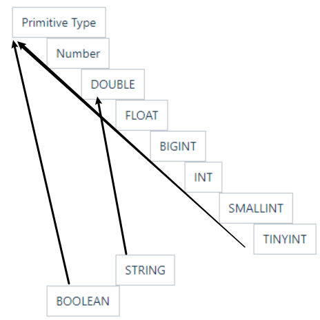

## 一、Hive与RDBMS的主要区别

| <br />         | Hive         | RDBMS                |
| -------- | ------------ | -------------------- |
| 数据存储 | HDFS         | local FS             |
| 数据规模 | 大           | 小                   |
| 数据操作 | 追加         | 行级别的增删改       |
| 执行延迟 | 高           | 低                   |
| 应用场景 | 海量数据OLAP | 常常是少量数据的OLTP |

## 二、Hive Schema

Hive 中包含以下数据模型：DB、Table，External Table，Partition，Bucket。

* db：在hdfs中表现为`${hive.metastore.warehouse.dir}`目录下一个文件夹
* table：**内部表** ，在hdfs中表现为所属的db目录下的一个子目录，删除该表会将元数据和hdfs上的文件**一并删除**
* external table：**外部表** ，其数据存放位置可以任意指定。删除外部表只删除元数据，**不会删除** hdfs上的文件
* partition：**分区表** ，在hdfs中表现为table目录下的**子文件夹**
* bucket：**分桶表** ，在hdfs中表现为table目录下根据hash生成的多个**文件**

## 三、数据类型

### 3.1 基本数据类型

Hive 表中的列支持以下基本数据类型：

| 大类       | 类型                                                                                                                                                                                            |
| ---------- | ----------------------------------------------------------------------------------------------------------------------------------------------------------------------------------------------- |
| 整型       | 有符号整数 TINYINT: 1byte，SMALLINT: 2byte，INT: 4byte，BIGINT: 8byte<br />                                                                                                                           |
| 布尔型     | BOOLEAN—TRUE/FALSE                                                                                                                                                                             |
| 浮点型     | FLOAT: 单精度浮点型，DOUBLE: 双精度浮点型<br />                                                                                                                                                       |
| 定点型     | DECIMAL(7,2)                                                                                                                                                                                    |
| 字符串     | STRING：指定字符集的字符序列<br />VARCHAR：具有最大长度限制的字符序列<br />CHAR—固定长度的字符序列<br />                                                                                                         |
| 日期和时间 | TIMESTAMP：时间戳。提交和查询时不会根据当地时间进行转换。<br />TIMESTAMP WITH LOCAL TIME ZONE：时间戳。提交给数据库时会根据数据库所在时区进行转换，查询时则转换为客户端所在时区的时间。<br />DATE—日期类型 |
| 二进制     | BINARY—字节序列                                                                                                                                                                                |

### 3.2复杂数据类型

Hive有三种复杂数据类型ARRAY、MAP 和STRUCT。

* ARRAY和MAP与Java中的Array和Map类似
* STRUCT与C语言中的Struct类似

**复杂数据类型允许任意层次的嵌套。**

| 类型   | 描述                                                                                | 示例                                   |
| ------ | ----------------------------------------------------------------------------------- | -------------------------------------- |
| STRUCT | 类似于结构体，是字段的集合，字段的类型可以不同，可以使用 `名称.字段名` 方式进行访问 | STRUCT ('xiaoming', 12 , '2018-12-12') |
| MAP    | 键值对的集合，可以使用 `名称[key]` 的方式访问对应的值                               | map('a', 1, 'b', 2)                    |
| ARRAY  | 数组是一组具有相同类型和名称的变量的集合，可以使用 `名称[index]` 访问对应的值       | ARRAY('a', 'b', 'c', 'd')              |

### 3.3数据类型转换

#### 隐式转换



隐式转换方向如箭头所示，特别注意：

* string可以隐式转换为double
* bigint可以隐式转换为float。
* BOOLEAN类型不可以转换为任何其它的类型。

#### 显示转换

显示转换即使用`cast`进行强制类型转换。

例如`CAST('1' AS INT)`将string转换成int；强制类型转换失败时，如执行`CAST('X' AS INT)`，表达式返回`NULL`。

```
hive> select '1'+2, cast('1' as int) + 2;
+------+------+--+
| _c0  | _c1  |
+------+------+--+
| 3.0  | 3    |
+------+------+--+
```

> mysql会直接解析该字符串的值：
>
> ```sql
> mysql> select "1" + 2, "1.0" + 2, "1.2" + 2;
> +---------+-----------+-----------+
> | "1" + 2 | "1.0" + 2 | "1.2" + 2 |
> +---------+-----------+-----------+
> |       3 |         3 |       3.2 |
> +---------+-----------+-----------+
> ```
>

### 3.4 示例

（1）假设某表有如下一行，我们用JSON格式来表示其数据结构。在Hive下访问的格式为

```
{
    "name": "songsong",
    "friends": ["bingbing" , "lili"] ,       //列表Array, 
    "children": {                      //键值Map,
        "xiao song": 18 ,
        "xiaoxiao song": 19
    }
    "address": {                      //结构Struct,
        "street": "hui long guan" ,
        "city": "beijing" 
    }
}
```

（2）基于上述数据结构，我们在Hive里创建对应的表，并导入数据。

创建本地测试文件test.txt

```
songsong,bingbing_lili,xiao song:18_xiaoxiao song:19,hui long guan_beijing
yangyang,caicai_susu,xiao yang:18_xiaoxiao yang:19,chao yang_beijing
```

注意：MAP，STRUCT和ARRAY里的元素间关系都可以用同一个字符表示，这里用“_”。

（3）Hive上创建测试表test

```sql
create table test(
name string,
friends array<string>,
children map<string, int>,
address struct<street:string, city:string>
)
row format delimited fields terminated by ','
collection items terminated by '_'
map keys terminated by ':'
lines terminated by '\n';
```

（4）导入文本数据到测试表

```
load data local inpath '/opt/module/datas/test.txt' into table test;
```

（5）访问三种集合列里的数据，以下分别是ARRAY，MAP，STRUCT的访问方式

```
hive (default)> select friends[1],children['xiao song'],address.city from test where name="songsong";
OK
_c0     _c1     city
lili    18      beijing
Time taken: 0.076 seconds, Fetched: 1 row(s)
```

## 四、分隔符

当数据存储在文本文件中，必须按照一定格式区别行和列，如CSV 文件或者使用制表符作为分隔值的 TSV 文件 (Tab-Separated Values)。但此时也存在一个缺点，就是正常的文件内容中也可能出现逗号或者制表符。

所以 Hive 默认使用了几个平时很少出现的字符，这些字符一般不会作为内容出现在文件中。Hive 默认的行和列分隔符如下表所示。

| 分隔符      | 描述                                                                                                                         |
| ----------- | ---------------------------------------------------------------------------------------------------------------------------- |
| \n          | 对于文本文件来说，每行是一条记录，所以可以使用换行符来分割记录                                                               |
| -           | -                                                                                                                            |
| ^A (Ctrl+A) | 分割字段 (列)，在 CREATE TABLE 语句中也可以使用八进制编码 `\001` 来表示                                                      |
| ^B          | 用于分割 ARRAY 或者 STRUCT 中的元素，或者用于 MAP 中键值对之间的分割，在 CREATE TABLE 语句中也可以使用八进制编码 `\002` 表示 |
| ^C          | 用于 MAP 中键和值之间的分割，在 CREATE TABLE 语句中也可以使用八进制编码 `\003` 表示                                          |

使用示例如下：

```sql
CREATE TABLE page_view(viewTime INT, userid BIGINT)
 ROW FORMAT DELIMITED
   FIELDS TERMINATED BY '\001'
   COLLECTION ITEMS TERMINATED BY '\002'
   MAP KEYS TERMINATED BY '\003'
 STORED AS SEQUENCEFILE;
```