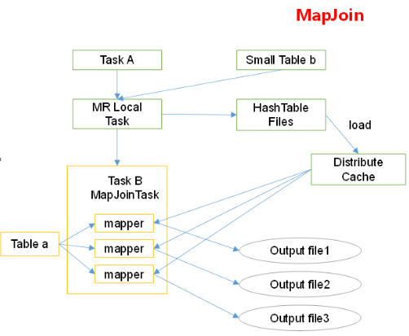
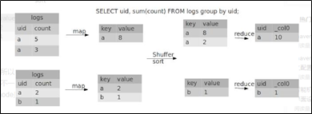

## 1. 查看执行计划（Explain）

**1** **）** **基本语法**

EXPLAIN [EXTENDED | DEPENDENCY | AUTHORIZATION] query

* extended显示详细执行计划
* dependency查看依赖的输入表、分区等信息

**2** **）** **案例实操**

（1）查看下面这条语句的执行计划

```
hive (default)> explain select * from emp;
--没有生成MR，使用了Fetch Operator

hive (default)> explain select deptno, avg(sal) avg_sal from emp group by deptno;
--生成了MR，使用了Map Operator Tree, Reduce Operator Tree, Select Operator, File Output Operator和Fetch Operator
```

（2）查看详细执行计划

```
hive (default)> explain extended select * from emp;
hive (default)> explain extended select deptno, avg(sal) avg_sal from emp group by deptno;
```

## 2. Fetch抓取

在Hive中的某些查询，**不用经过MapReduce，直接可以从存储的数据中获取** ，这类查询称为fetch。例如：`<span>SELECT * FROM employees;</span>`

在hive-default.xml.template文件中，参数hive.fetch.task.conversion默认是more，老版本hive默认是minimal，该属性修改为more以后，在全局查找、字段查找、limit查找等都不走mapreduce。

```
<property>
    <name>hive.fetch.task.conversion</name>
    <value>more</value>
    <description>
      Expects one of [none, minimal, more].
      Some select queries can be converted to single FETCH task minimizing latency.
      Currently the query should be single sourced not having any subquery and should 
      not have any aggregations or distincts (which incurs RS), lateral views and joins.
      0. none : disable hive.fetch.task.conversion
      1. minimal : SELECT STAR, FILTER on partition columns, LIMIT only
      2. more  : SELECT, FILTER, LIMIT only (support TABLESAMPLE and virtual columns)
    </description>
</property>
```

**1** **）案例实操：**

（1）把hive.fetch.task.conversion设置成none，然后执行查询语句，都会执行mapreduce程序。

```
hive (default)> set hive.fetch.task.conversion=none;
hive (default)> select * from emp;
hive (default)> select ename from emp;
hive (default)> select ename from emp limit 3;
```

（2）把hive.fetch.task.conversion设置成more，然后执行查询语句，如下查询方式都不会执行mapreduce程序。

```
hive (default)> set hive.fetch.task.conversion=more;
hive (default)> select * from emp;
hive (default)> select ename from emp;
hive (default)> select ename from emp limit 3;
```

## 3. 本地模式

hive在集群中执行任务需要导致额外开销，当处理小数据量时，在集群中执行的效率可能还不如直接在本地执行，因此可以开启本地模式，有时可以显著提升查询速度。

```
--本地模式默认关闭，需要手动开启此功能
SET hive.exec.mode.local.auto=true;
```

启用后，Hive 将分析查询中每个 map-reduce 作业的大小，如果满足以下条件，则在本地运行它：

* 作业的总输入大小低于：hive.exec.mode.local.auto.inputbytes.max（默认为 128MB）；
* map-tasks 的总数小于：hive.exec.mode.local.auto.tasks.max（默认为 4）；
* 所需的 reduce 任务总数为 1 或 0；

## 4. 表的优化(解决数据倾斜，实现负载均衡)

### 4.1 尽早过滤

尽早进行过滤可以减少后续处理的数据量

* 列过滤：由于列式存储，在读数据时可以只读需要的列
* 行过滤：对于分区表，读取数据时使用分区进行过滤。可使用explain dependency select ... 来查看依赖的input table 和input partition
* 先过滤再join：a join b on condition where ... ，会先join再过滤where，可以用where过滤后再进行join，优化join的执行效率。

案例实操：

1）bigtable的创建及数据导入

```
create table bigtable(id bigint, t bigint, uid string, keyword string,
url_rank int, click_num int, click_url string) row format delimited
fields terminated by '\t';
load data local inpath '/opt/module/data/bigtable' into table bigtable;
```

**2）测试先关联两张表，再用where** **条件过滤**

```
hive (default)> select o.id from bigtable b
join bigtable o on o.id = b.id where o.id <= 10;

Time taken: 30.255 seconds, Fetched: 1081 row(s)
```

**3）通过子查询后，再关联表**

```
hive (default)> select b.id from bigtable b
join (select id from bigtable where id <= 10 ) o on b.id = o.id;

Time taken: 28.582 seconds, Fetched: 1081 row(s)
```

### 4.2 小表join大表：使用Map Join

普通的join是在reduce端进行的，而在小表join大表时，可以启用Map Join把**小表全部加载到内存** ，在map端进行join，避免reducer处理。

**map join 原理** ：



①：Task A: Client本地启动一个**local task** ，扫描小表b的数据，将其转换为一个**HashTable** 的数据结构，后续会分发到各个map的**DistributeCache** 中

②：Task B: 在map中扫描大表a，每一条记录去和DistributeCache中的HashTable仅需给你关联，并直接输出结果。由于map join 没有reduce，则输出文件的个数为map task的个数

开启map join

```
set hive.auto.convert.join = true; //默认为true

--小表的阈值设置（默认25M）
set hive.mapjoin.smalltable.filesize=25000000;
```

早期版本中，需要将小表放在左边，大表放在右边，才会启用map join优化，新版hive中小表JOIN大表和大表JOIN小表已经没有区别了。

案例实操：测试大表JOIN小表和小表JOIN大表的效率

**1）建大表、小表和JOIN** **后表的语句**

```
// 创建大表
create table bigtable(id bigint, t bigint, uid string, keyword string, url_rank int, click_num int, click_url string) row format delimited fields terminated by '\t';
// 创建小表
create table smalltable(id bigint, t bigint, uid string, keyword string, url_rank int, click_num int, click_url string) row format delimited fields terminated by '\t';
// 创建join后表的语句
create table jointable(id bigint, t bigint, uid string, keyword string, url_rank int, click_num int, click_url string) row format delimited fields terminated by '\t';
```

**2）分别向大表和小表中导入数据**

```
hive (default)> load data local inpath '/opt/module/datas/bigtable' into table bigtable;
hive (default)>load data local inpath '/opt/module/datas/smalltable' into table smalltable;
```

**3）关闭mapjoin** **功能（默认是打开的）**

```
set hive.auto.convert.join = false;
```

**4）执行小表JOIN** **大表语句**

```
insert overwrite table jointable
select b.id, b.t, b.uid, b.keyword, b.url_rank, b.click_num, b.click_url
from smalltable s
join bigtable  b
on b.id = s.id;
 
Time taken: 35.921 seconds
No rows affected (44.456 seconds)
```

**5）** **执行大表** **JOIN** **小表语句**

```
insert overwrite table jointable
select b.id, b.t, b.uid, b.keyword, b.url_rank, b.click_num, b.click_url
from bigtable  b
join smalltable  s
on s.id = b.id;
 
Time taken: 34.196 seconds
No rows affected (26.287 seconds)
```

显式使用map join：

```
insert overwrite table jointable
select /*+mapjoin(s)*/ b.id, b.t, b.uid, b.keyword, b.url_rank, b.click_num, b.click_url
from bigtable  b
join smalltable  s
on s.id = b.id;
```

### **4.3 大表join大表：使用sort merge bucket join**

> https://blog.csdn.net/Samaritan_H/article/details/79090103
>
> iteye.com/blog/superlxw1234-1545150
>

案例实操：

```
#1. 创建两个大表和join后插入的jointable1
create table bigtable1(id bigint, t bigint, uid string, keyword string,
url_rank int, click_num int, click_url string) row format delimited
fields terminated by '\t';
create table bigtable2(id bigint, t bigint, uid string, keyword string,
url_rank int, click_num int, click_url string) row format delimited
fields terminated by '\t';
create table jointable1(id bigint, t bigint, uid string, keyword string,
url_rank int, click_num int, click_url string) row format delimited
fields terminated by '\t';

#2. 分别导入数据
load data local inpath '/opt/module/data/bigtable' into table bigtable1;
load data local inpath '/opt/module/data/bigtable' into table bigtable2;

#3. 直接大表join大表
insert overwrite table jointable1
select b.id, b.t, b.uid, b.keyword, b.url_rank, b.click_num, b.click_url
from bigtable1 s join bigtable2 b on b.id = s.id;

Time taken: 62.808 seconds
```

创建两个分桶表(桶的个数不要超过可用 CPU 的核数 )，再进行join：

```
#1.创建两个分桶表和join后插入的jointable2
create table bigtable_buck1(id bigint,t bigint,uid string,keyword string,url_rank int,
click_num int,click_url string) clustered by(id) sorted by(id) into 6 buckets
row format delimited fields terminated by '\t';
create table bigtable_buck2(id bigint,t bigint,uid string,keyword string,url_rank int,
click_num int,click_url string) clustered by(id) sorted by(id) into 6 buckets
row format delimited fields terminated by '\t';
create table jointable2(id bigint, t bigint, uid string, keyword string,
url_rank int, click_num int, click_url string) row format delimited
fields terminated by '\t';

#2. 加载数据
insert into bigtable_buck1 select * from bigtable1;
insert into bigtable_buck2 select * from bigtable2;

#3. 设置参数
set hive.optimize.bucketmapjoin = true;
set hive.optimize.bucketmapjoin.sortedmerge = true;
set hive.input.format=org.apache.hadoop.hive.ql.io.BucketizedHiveInputFormat;

#4. sort merge bucket join
insert overwrite table jointable2
select b.id, b.t, b.uid, b.keyword, b.url_rank, b.click_num, b.click_url
from bigtable_buck1 s join bigtable_buck2 b on b.id = s.id;

Time taken: 49.692 seconds
```

### **4.4 ****空值过滤与转换**

进行join时，hash值相同的记录会发往同一个reduce，某一个reduce处理的数据明显多于其他reduce便导致了数据倾斜，而数据倾斜的原因很多时候是一些异常值，其中NULL最为常见。

对于空值等异常值的处理，一般有两种方法：过滤和转换

* 过滤：大多数情况下，这些异常值都是不需要的，我们要做的就是对其尽早过滤
* 转换：异常值所在的记录需要保留时，我们可以为该字段赋值为字符串加随机数，使得数据随机均匀地分配到各个reduce上。但要注意不要影响到join结果

### 4.5 group by开启map端聚合和负载均衡

**开启Map** **端聚合参数设置：**

默认情况下，map输出数据按key Hash分配到reduce中进行聚合，当某个key对应的数据过多时，会导致其所在reduce数据倾斜。



并不是所有的聚合操作都需要在Reduce端完成，很多聚合操作都可以先在Map端进行部分聚合，最后在Reduce端得出最终结果，map端聚合还能一定程度上缓解数据倾斜问题。

```
--开启Map端聚合，默认为True
set hive.map.aggr = true

--在Map端进行聚合操作的条目数目
set hive.groupby.mapaggr.checkinterval = 100000
```

**开启负载均衡（默认是** **false** **）缓解数据倾斜：**

```
set hive.groupby.skewindata = true
```

当设定为 true时，生成的查询计划会生成两个串行的MR Job。第一个MR Job中，Map的输出结果会随机分布到Reduce中，每个Reduce做部分聚合操作，并输出结果，这样处理的结果是相同的Group By Key有可能被分发到不同的Reduce中，从而达到负载均衡的目的；第二个MR Job再根据预处理的数据结果按照Group By Key分布到Reduce中（这个过程可以保证相同的Group By Key被分布到同一个Reduce中），最后完成最终的聚合操作。

### **4.6 **避免使用count(distinct)

count(distinct)会将所有结果放在**一个reducer**里进行去重，这一个Reduce需要处理的数据量过大时，会导致整个Job很难完成，一般可以通过先GROUP BY再COUNT的方式替换count(distinct)，但是需要注意 group by 造成的数据倾斜问题。

```
select count(distinct key) from a;
select count(*) from (select distinct key from a);
--单独的distinct与group by查询计划一样
--count(distinct)会将所有记录放在一个reducer里进行去重，group by则是将key按hash值分配到多个reducer中。
--这个语句在spark中已经优化了，测试发现查询计划完全一致。在hive中不清楚。
```

### **4.7 避免****笛卡尔积**

join的时候不加on条件，或者无效的on条件，或显式使用cross join，都会导致笛卡尔积，Hive中对笛卡尔积的计算只在**一个reducer**中完成。

### **4.8 分区分桶**

## 5. 合理设置Map及Reduce数（MR引擎）

（1）通常情况下，作业会通过input的目录产生一个或者多个map任务。

主要的决定因素有：input的文件总个数，input的文件大小，集群设置的文件块大小。

（2）是不是map数越多越好？

答案是否定的。如果一个任务有很多小文件（远远小于块大小128m），则每个小文件也会被当做一个块，用一个map任务来完成，而一个map任务启动和初始化的时间远远大于逻辑处理的时间，就会造成很大的资源浪费。而且，同时可执行的map数是受限的。

（3）是不是保证每个map处理接近128m的文件块，就高枕无忧了？

答案也是不一定。比如有一个127m的文件，正常会用一个map去完成，但**这个文件只有一个或者两个小字段，却有几千万的记录** ，如果map处理的逻辑比较复杂，用一个map任务去做，肯定也比较耗时。

针对上面的问题2和3，我们需要采取两种方式来解决：即减少map数和增加map数；

### **5.1 ****复杂文件增加****Map****数**

当input的文件都很大，任务逻辑复杂，map执行非常慢的时候，可以考虑增加Map数，来使得每个map处理的数据量减少，从而提高任务的执行效率。

增加map的方法为：根据computeSpliteSize(Math.max(minSize,Math.min(maxSize,blocksize)))，**调小** **maxSize** ，使其小于blocksize，减小了分片大小，则增加了map的个数。

案例实操：

**1** **）执行查询**

```
hive (default)> select count(*) from emp;
Hadoop job information for Stage-1: number of mappers: 1; number of reducers: 1
```

**2** **）设置最大切片值为100** **个字节**

```
hive (default)> set mapreduce.input.fileinputformat.split.maxsize=100;
hive (default)> select count(*) from emp;
Hadoop job information for Stage-1: number of mappers: 6; number of reducers: 1
```

> 直接设置mapreduce.job.maps(旧版本为mapred.map.tasks)这个参数是没用的
>

### **5.2 ****小文件进行合并**

（1）在map执行前合并小文件，减少map数：CombineHiveInputFormat（系统默认格式）具有对小文件进行合并的功能。HiveInputFormat没有对小文件合并功能。

```
set hive.input.format= org.apache.hadoop.hive.ql.io.CombineHiveInputFormat;
```

（2）在Map-Reduce的任务结束时合并小文件的设置：

```
--在map-only任务结束时合并小文件，默认true
SET hive.merge.mapfiles = true;
--在map-reduce任务结束时合并小文件，默认false
SET hive.merge.mapredfiles = true;
--合并文件的大小，默认256M
SET hive.merge.size.per.task = 268435456;
--当输出文件的平均大小小于该值时，启动一个独立的map-reduce任务进行文件merge
SET hive.merge.smallfiles.avgsize = 16777216;
```

### **5.3 ****合理设置****Reduce****数**

**1** **）** **调整** **reduce** **个数方法一**

```
--（1）每个Reduce处理的数据量默认是256MB
hive.exec.reducers.bytes.per.reducer=256000000
--（2）每个任务最大的reduce数，默认为1009
hive.exec.reducers.max=1009
--（3）计算reducer数的公式
N=min(参数2，总输入数据量/参数1)
```

**2** **）调整reduce** **个数方法二**

在hadoop的mapred-default.xml文件中修改

设置每个job的Reduce个数

```
set mapreduce.job.reduces = 15;
```

**3** **）reduce** **个数并不是越多越好**

（1）过多的启动和初始化reduce也会消耗时间和资源；

（2）另外，**有多少个** **reduce** **，就会有多少个输出文件** ，如果生成了很多个小文件，那么如果这些小文件作为下一个任务的输入，则也会出现小文件过多的问题；

在设置reduce个数的时候也需要考虑这两个原则：处理大数据量利用合适的reduce数；使单个reduce任务处理数据量大小要合适；

## **6. ****并行执行**

Hive会将一个查询转化成一个或者多个阶段。这样的阶段可以是MapReduce阶段、抽样阶段、合并阶段、limit阶段。或者Hive执行过程中可能需要的其他阶段。默认情况下，Hive一次只会执行一个阶段。不过，某个特定的job可能包含众多的阶段，而这些阶段可能并非完全互相依赖的，也就是说有些阶段是可以并行执行的，这样可能使得整个job的执行时间缩短。如果有更多的阶段可以并行执行，那么job可能就越快完成。

通过设置参数hive.exec.parallel值为true，就可以开启并行执行，那么集群利用率就会增加。

```
set hive.exec.parallel=true;              //打开任务并行执行
set hive.exec.parallel.thread.number=16;  //同一个sql允许最大并行度，默认为8。
```

当然，得是在系统资源比较空闲的时候才有优势，否则，没资源，也并行不起来。

## **7. ****严格模式**

Hive可以通过设置防止一些危险操作：

（1）将`<span>hive.strict.checks.no.partition.filter</span>`设置为true时，对于分区表，where语句中必须含有分区字段过滤条件来限制范围，否则不允许执行。换句话说，就是用户不允许扫描所有分区。进行这个限制的原因是，通常分区表都拥有非常大的数据集，而且数据增加迅速。没有进行分区限制的查询可能会消耗令人不可接受的巨大资源来处理这个表。

（2）将`<span>hive.strict.checks.orderby.no.limit</span>`设置为true时，对于使用了order by语句的查询，要求必须使用limit语句。因为order by为了执行排序过程会将所有的结果数据分发到同一个Reducer中进行处理，强制要求用户增加这个LIMIT语句可以防止Reducer额外执行很长一段时间。

（3）将`hive.strict.checks.cartesian.product`设置为true时，会限制笛卡尔积的查询。对关系型数据库非常了解的用户可能期望在执行JOIN查询的时候不使用ON语句而是使用where语句，这样关系数据库的执行优化器就可以高效地将WHERE语句转化成那个ON语句。不幸的是，Hive并不会执行这种优化，因此，如果表足够大，那么这个查询就会出现不可控的情况。

## **8. JVM****重用**

JVM重用是Hadoop调优参数的内容，其对Hive的性能具有非常大的影响，特别是对于大量小文件的场景或task特别多的场景，这类场景大多数执行时间都很短。

Hadoop的默认配置通常是使用派生JVM来执行map和Reduce任务的。这时JVM的启动过程可能会造成相当大的开销，尤其是执行的job包含有成百上千task任务的情况。JVM重用可以使得JVM实例在同一个job中重新使用N次。N的值可以在Hadoop的mapred-site.xml文件中进行配置。通常在10-20之间，具体多少需要根据具体业务场景测试得出。

```
<property>
  <name>mapreduce.job.jvm.numtasks</name>
  <value>10</value>
  <description>How many tasks to run per jvm. If set to -1, there is
  no limit.
  </description>
</property>
```

这个功能的缺点是，开启JVM重用将一直占用使用到的task插槽，以便进行重用，直到任务完成后才能释放。如果某个“不平衡的”job中有某几个reduce task执行的时间要比其他Reduce task消耗的时间多的多的话，那么保留的插槽就会一直空闲着却无法被其他的job使用，直到所有的task都结束了才会释放。

## 9. 压缩

详见前文。

## 附录：常见错误及解决方案

### 1. JVM堆内存溢出

描述：java.lang.OutOfMemoryError: Java heap space...

解决：在yarn-site.xml中加入如下代码

```
<property>
    <name>yarn.scheduler.maximum-allocation-mb</name>
    <value>2048</value>
</property>
<property>
    <name>yarn.scheduler.minimum-allocation-mb</name>
    <value>2048</value>
</property>
<property>
    <name>yarn.nodemanager.vmem-pmem-ratio</name>
    <value>2.1</value>
</property>
<property>
    <name>mapred.child.java.opts</name>
    <value>-Xmx1024m</value>
</property>
```

### 2. 虚拟内存限制：

在 yarn-site.xml 中添加如下配置:

```
<property>
  <name>yarn.nodemanager.vmem-check-enabled</name>
  <value>false</value>
</property>
```