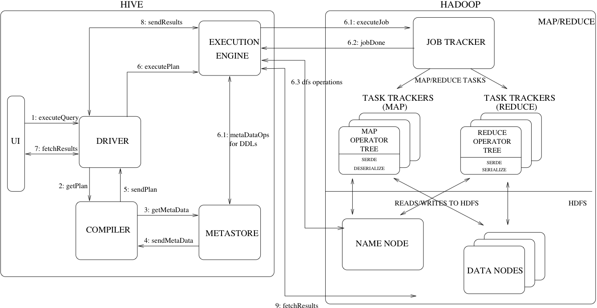

### 1、Hive表关联查询，如何解决数据倾斜的问题？（☆☆☆☆☆）

《企业级调优》

### 2、Hive QL转换为MapReduce的过程？（☆☆☆☆☆）

《Hive简介及核心概念》

### 3、Hive底层与数据库交互原理？（☆☆☆☆☆）

由于Hive的元数据可能要面临不断地更新、修改和读取操作，所以它显然不适合使用Hadoop文件系统进行存储。目前Hive将元数据存储在RDBMS中，比如存储在MySQL、Derby中。元数据信息包括：存在的表、表的列、权限和更多的其他信息。



### 4、Hive的两张表关联，使用MapReduce怎么实现？（☆☆☆☆☆）

如果其中有一张表为小表，直接使用map join的方式进行聚合。

如果两张都是大表，普通的join是将关联字段hash相同的行发往相同的reduce，再进行join；还可以将两张大表维护成两张桶表，使用sort merge bucket join

### 5、请谈一下Hive的特点，Hive和RDBMS有什么异同？

《Hive简介及核心概念》

### 6、Order By, Sort By, Cluster By, Distrbute By, partition by的区别

order by：会对结果做全局排序，因此只有一个reduce，当数据规模较大时，需要较长的计算时间。

sort by：分区内排序。

distribute by：类似于mr中的partition，按照指定的字段对数据进行分区，输出到不同的reduce中，可以结合sort by使用。

cluster by：当Distribute by和Sorts by字段相同且为升序排序时，可以使用Cluster by替换。

partition by: 用于窗口函数中

### 7、Hive内部表和外部表的区别

### 8、Hive 中的存储格式TextFile、SequenceFile、ORCfile、parquet各有什么区别

### 9、所有的Hive任务都会有MapReduce的执行吗？

不是，fetch operation不需要起MapReduce任务，直接通过Fetch拉取数据。

### 10、Hive的函数：UDF、UDAF、UDTF的区别？

UDF：单行进入，单行输出

UDAF：多行进入，单行输出

UDTF：单行输入，多行输出

**在项目中是否自定义过UDF、UDTF函数，以及用他们处理了什么问题，及自定义步骤？**

（1）用UDF函数解析公共字段；用UDTF函数解析事件字段。

（2）自定义UDF：继承GenericUDF，重写evaluate方法

（3）自定义UDTF：继承自GenericUDTF，重写3个方法：initialize(自定义输出的列名和类型)，process(将结果返回forward(result))，close()

**为什么要自定义UDF/UDTF？**

因为自定义函数，可以自己埋点Log打印日志，出错或者数据异常，方便调试。

自己写的udf：输入日期`<span>yyyy-MM-dd</span>`，返回`<span>yyyy-MM-dd 星期N</span>`

```
根据要求要实现一个查询日期及星期几的方法。
SQL实现：
select case dayofweek(date) 
when 1 then concat(date,' ', "星期日")
when 2 then concat(date,' ', "星期一")
when 3 then concat(date,' ', "星期二")
when 4 then concat(date,' ', "星期三")
when 5 then concat(date,' ', "星期四")
when 6 then concat(date,' ', "星期五")
when 7 then concat(date,' ', "星期六") end;

样例如下：

package com.**.**.**

import org.apache.hadoop.hive.ql.exec.UDF;
import java.text.ParseException;
import java.text.SimpleDateFormat;
import java.util.Calendar;
import java.util.Date;

/**
 * 输入"yyyy-mm-dd"
 * 返回"yyyy-mm-dd 星期X"
 */
public class DateTransToWeek extends UDF {
    public String evaluate(String inputStr) {
        if (inputStr == null || inputStr.trim().equals("")) {
            return "";
        }
        SimpleDateFormat f = new SimpleDateFormat("yyyy-MM-dd");
        String[] weekDays = { "星期日", "星期一", "星期二", "星期三", "星期四", "星期五", "星期六" };
        Calendar cal = Calendar.getInstance(); // 获得一个日历
        Date datet = null;
        try {
            datet = f.parse(inputStr);
            cal.setTime(datet);
        } catch (ParseException e) {
            e.printStackTrace();
        }
        int w = cal.get(Calendar.DAY_OF_WEEK) - 1; // 指示一个星期中的某天。
        if (w < 0) {
            w = 0;
        }
        return inputStr + " " +weekDays[w];
    }
}
```

### 11、说说对Hive桶表的理解

桶表是对数据进行哈希取值，然后放到不同文件中存储。

数据加载到桶表时，会对字段取hash值，然后与桶的数量取模。把数据放到对应的文件中。物理上，每个桶就是表(或分区）目录里的一个文件。

### 12、Hive优化

《企业级调优》

### 13、Hive里边字段的分隔符用的什么？有遇到过字段里边有\t的情况吗，怎么处理的？

hive 默认的字段分隔符为ascii码的控制符\001（^A）,建表的时候用fields terminated by '\001'。注意：如果采用\t为分隔符，需要要求前端埋点和javaEE后台传递过来的数据中不能出现该分隔符，通过代码规范约束。一旦传输过来的数据含有分隔符，需要在前一级数据中转义或者替换（ETL）。

### 14、Mr/tez/spark区别：

* Mr引擎：每一个map和reduce输出都要落盘。虽然慢，**但一定能跑出结果** 。一般用于处理周、月、年等非实时指标。
* Spark引擎：基本基于内存，只在Shuffle过程中落盘。 兼顾了可靠性和效率。
* Tez引擎：完全基于内存。 注意：如果数据量特别大，慎重使用。容易OOM。

### 15、海量数据分布在100台电脑中，高效统计出这批数据的TOP10

1. 在每台电脑上求出TOP10，可以采用包含10个元素的堆完成(TOP10小，用最大堆，TOP10大，用最小堆)。
2. 比如求TOP10大，我们首先取前10个元素调整成最小堆，然后扫描后面的数据，并与堆顶元素比较，如果比堆顶元素大，那么用该元素替换堆顶，然后再调整为最小堆。
3. 最后堆中的元素就是TOP10大。
4. 求出每台电脑上的TOP10后，然后把这100台电脑上的TOP10组合起来，共1000个数据
5. 再利用上面类似的方法求出TOP10就可以了。

### 16、Hive中导入数据的方式

* load data [local] inpath
* insert overwrite table t1 select ...
* create table t1 as select ...

### 17、Hive导出数据的几种方式

* insert overwrite local directory 'path' select ...
* dfs -get /path...
* hive -e  "select ..." > out.txt 或hive -f test.sql > out.txt
* export table t1 to 'path';