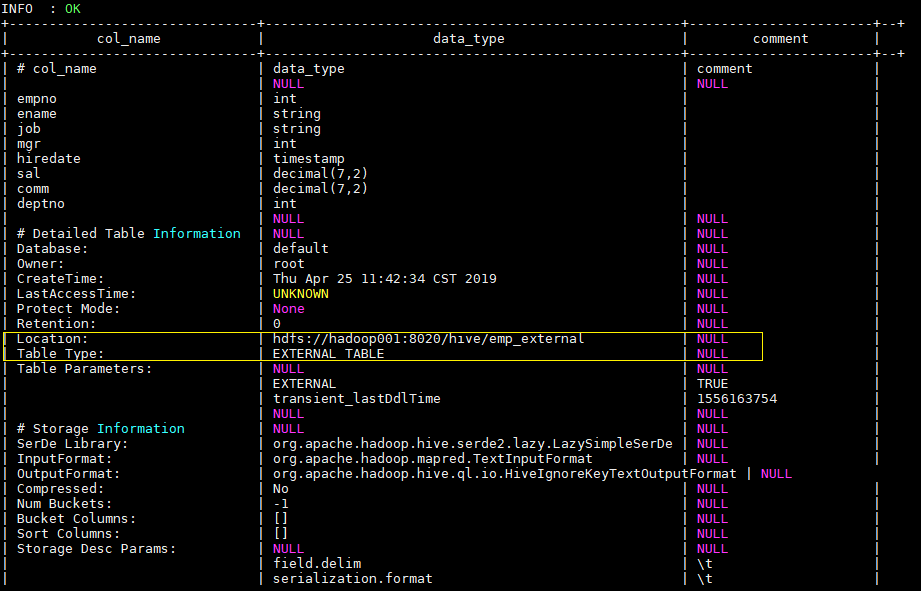
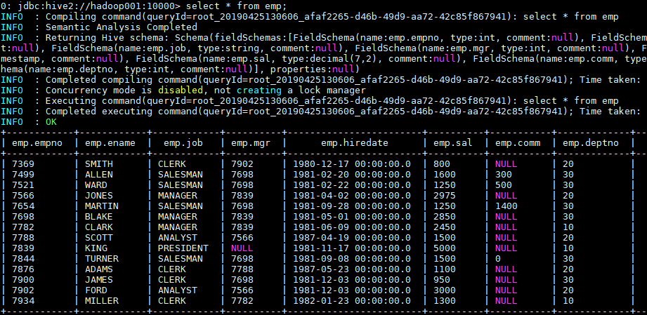

## 一、Database

### 1.1 查看数据列表

```
hive> show databases;

hive> show databases like 'db_hive*';
OK
db_hive
db_hive_1
```

### 1.2 使用数据库

```
USE database_name;
```

### 1.3 新建数据库

```
CREATE (DATABASE|SCHEMA) [IF NOT EXISTS] database_name   --DATABASE|SCHEMA 是等价的
  [COMMENT database_comment] --数据库注释
  [LOCATION hdfs_path] --存储在 HDFS 上的位置
  [WITH DBPROPERTIES (property_name=property_value, ...)]; --指定额外属性
```

示例：

```
CREATE DATABASE IF NOT EXISTS hive_test
COMMENT 'hive database for test'
location '/db/hive2.db'
WITH DBPROPERTIES ('create'='heibaiying');
```

### 1.4 查看数据库信息

```
DESC DATABASE [EXTENDED] db_name; --EXTENDED 表示是否显示额外属性
```

示例：

```
DESC DATABASE  EXTENDED hive_test;
```

### 1.5 修改数据库信息

用户可以使用ALTER DATABASE命令为某个数据库的`DBPROPERTIES`设置键-值对属性值，来描述这个数据库的属性信息。数据库的其他元数据信息都是不可更改的，包括数据库名和数据库所在的目录位置。

```
hive (default)> alter database db_hive set dbproperties('createtime'='20170830');
```

在hive中查看修改结果：

```
hive> desc database extended db_hive;
db_name comment location        owner_name      owner_type      parameters
db_hive         hdfs://hadoop102:8020/user/hive/warehouse/db_hive.db    atguigu USER    {createtime=20170830}
```

### 1.6 删除数据库

语法：

```
DROP (DATABASE|SCHEMA) [IF EXISTS] database_name [RESTRICT|CASCADE];
```

* 默认行为是 RESTRICT，如果数据库中存在表则删除失败。要想删除库及其中的表，可以使用 CASCADE 级联删除。

示例：

```
  DROP DATABASE IF EXISTS hive_test CASCADE;
```

## 二、创建表

### 2.1 建表语法

```
CREATE [TEMPORARY] [EXTERNAL] TABLE [IF NOT EXISTS] [db_name.]table_name     --表名
  [(col_name data_type [COMMENT col_comment],
    ... [constraint_specification])]  --列名 列数据类型
  [COMMENT table_comment]   --表描述
  [PARTITIONED BY (col_name data_type [COMMENT col_comment], ...)]  --分区表分区规则
  [
    CLUSTERED BY (col_name, col_name, ...) 
   [SORTED BY (col_name [ASC|DESC], ...)] INTO num_buckets BUCKETS
  ]  --分桶表分桶规则
  [SKEWED BY (col_name, col_name, ...) ON ((col_value, col_value, ...), (col_value, col_value, ...), ...)  
   [STORED AS DIRECTORIES] 
  ]  --指定倾斜列和值
  [
   [ROW FORMAT DELIMITED row_format]  
   [STORED AS file_format]
     | STORED BY 'storage.handler.class.name' [WITH SERDEPROPERTIES (...)]  
  ]  -- 指定行分隔符、存储文件格式或采用自定义存储格式
  [LOCATION hdfs_path]  -- 指定表的存储位置
  [TBLPROPERTIES (key=value, ...)]  --指定表的属性
  [AS select_statement];   --从查询结果创建表
```

**字段解释说明**

（1）**CREATE TABLE** 创建一个指定名字的表。如果相同名字的表已经存在，则抛出异常；用户可以用 **IF NOT EXISTS** 选项来忽略这个异常。

（2）**EXTERNAL**关键字可以让用户创建一个外部表，在建表的同时可以指定一个指向实际数据的路径（LOCATION）。

（3）COMMENT：为表和列添加注释。

（4）**PARTITIONED BY**创建分区表

（5）**CLUSTERED BY**创建分桶表

（6）SORTED BY不常用，对桶中的一个或多个列另外排序

（7）**ROW FORMAT DELIMITED** **[FIELDS TERMINATED BY '\t']** [COLLECTION ITEMS TERMINATED BY char] [MAP KEYS TERMINATED BY char] [LINES TERMINATED BY char]

| SERDE serde_name [WITH SERDEPROPERTIES (property_name=property_value, property_name=property_value, ...)]

SerDe是Serialize/Deserilize的简称， hive使用Serde进行行对象的序列与反序列化。

用户在建表的时候可以自定义SerDe或者使用自带的SerDe。如果没有指定ROW FORMAT 或者ROW FORMAT DELIMITED，将会使用默认的SerDe。在建表的时候，用户还需要为表指定列，用户在指定表的列的同时也会指定自定义的SerDe，Hive通过该SerDe确定表的具体的列的数据。

（8）**STORED AS指定存储文件类型**

常用的存储文件类型：SEQUENCEFILE（二进制序列文件）、TEXTFILE（文本）、RCFILE（列式存储格式文件）、ORCFILE、PARQUET。

（9）**LOCATION** ：指定表在HDFS上的存储位置。

（10）AS：后跟查询语句，根据查询结果创建表。

（11）LIKE：允许用户复制现有的表结构，但是不复制数据。

### 2.2 内部表

Hive默认情况下会将这些表的数据存储在由配置项`hive.metastore.warehouse.dir`(例如，/user/hive/warehouse)所定义的目录的子目录下。

当我们删除一个管理表时，Hive也会删除这个表中数据。内部表不适合和其他工具共享数据。

```
CREATE TABLE emp(
    empno INT,
    ename STRING,
    job STRING,
    mgr INT,
    hiredate TIMESTAMP,
    sal DECIMAL(7,2),
    comm DECIMAL(7,2),
    deptno INT)
    ROW FORMAT DELIMITED FIELDS TERMINATED BY "\t"
    LOCATION '/hive/emp';
```

### 2.3 外部表

```
  CREATE EXTERNAL TABLE emp_external(
    empno INT,
    ename STRING,
    job STRING,
    mgr INT,
    hiredate TIMESTAMP,
    sal DECIMAL(7,2),
    comm DECIMAL(7,2),
    deptno INT)
    ROW FORMAT DELIMITED FIELDS TERMINATED BY "\t"
    LOCATION '/hive/emp_external';
```

使用 `desc format emp_external` 命令可以查看表的详细信息如下：



内部表和外部表的转换：

```
--（1）查询表的类型
hive (default)> desc formatted student2;
Table Type:             MANAGED_TABLE
--（2）修改内部表student2为外部表
alter table student2 set tblproperties('EXTERNAL'='TRUE');
--（3）查询表的类型
hive (default)> desc formatted student2;
Table Type:             EXTERNAL_TABLE
--（4）修改外部表student2为内部表
alter table student2 set tblproperties('EXTERNAL'='FALSE');
--（5）查询表的类型
hive (default)> desc formatted student2;
Table Type:             MANAGED_TABLE
```

注意：('EXTERNAL'='TRUE')和('EXTERNAL'='FALSE')为固定写法，区分大小写！

内部表和外部表的区别：

|              | 内部表                                                                                                                           | 外部表                                               |
| ------------ | -------------------------------------------------------------------------------------------------------------------------------- | ---------------------------------------------------- |
| 建表语句     | 外部表需要通过external关键字声明                                                                                                 |                                                      |
| 数据存储位置 | 内部表数据存储位置由 `hive.metastore.warehouse.dir`参数指定，默认存储在 HDFS 的 `/user/hive/warehouse/数据库名.db/表名/`  目录下 | 外部表数据的存储位置创建表时由 `Location` 参数指定； |
| 删除表       | 删除元数据（metadata）和文件                                                                                                     | 只删除元数据（metadata）                             |

### 2.4 分区表

```
  CREATE EXTERNAL TABLE emp_partition(
    empno INT,
    ename STRING,
    job STRING,
    mgr INT,
    hiredate TIMESTAMP,
    sal DECIMAL(7,2),
    comm DECIMAL(7,2)
    )
    PARTITIONED BY (deptno INT)   -- 按照部门编号进行分区
    ROW FORMAT DELIMITED FIELDS TERMINATED BY "\t"
    LOCATION '/hive/emp_partition';
```

### 2.5 分桶表

```
  CREATE EXTERNAL TABLE emp_bucket(
    empno INT,
    ename STRING,
    job STRING,
    mgr INT,
    hiredate TIMESTAMP,
    sal DECIMAL(7,2),
    comm DECIMAL(7,2),
    deptno INT)
    CLUSTERED BY(empno) SORTED BY(empno ASC) INTO 4 BUCKETS  --按照员工编号散列到四个 bucket 中
    ROW FORMAT DELIMITED FIELDS TERMINATED BY "\t"
    LOCATION '/hive/emp_bucket';
```

### 2.6 倾斜表

指定一个或多个倾斜列，以及经常出现的倾斜值，Hive 会自动将涉及到这些值的数据拆分为单独的文件。在查询时，如果涉及到倾斜值，它就直接从独立文件中获取数据，而不是扫描所有文件，**一定程度上提升了查询效率**。

语法：`create table t1(...) skewed by (col1,...) on (v1,...,vn)`

### 2.7 临时表

临时表仅对当前session可见，数据暂存在用户目录中，并在会话结束后删除。注意临时表不支持分区；

语法：`create temporary table t1 ...`

### 2.8 CTAS创建表

支持从查询语句的结果创建表：

```
CREATE TABLE emp_copy AS SELECT * FROM emp WHERE deptno='20';
```

### 2.9 复制表结构

语法：

```
CREATE [TEMPORARY] [EXTERNAL] TABLE [IF NOT EXISTS] [db_name.]table_name  --创建表表名
   LIKE existing_table_or_view_name  --被复制表的表名
   [LOCATION hdfs_path]; --存储位置
```

示例：

```
CREATE TEMPORARY EXTERNAL TABLE  IF NOT EXISTS  emp_co  LIKE emp
```

### 2.10 加载数据到表

加载数据到表中属于 DML 操作，这里为了方便大家测试，先简单介绍一下加载本地数据到表中：

```
-- 加载数据到 emp 表中
load data local inpath "/usr/file/emp.txt" into table emp;
```

其中 emp.txt 的内容如下：

```
7369    SMITH   CLERK   7902    1980-12-17 00:00:00 800.00      20
7499    ALLEN   SALESMAN    7698    1981-02-20 00:00:00 1600.00 300.00  30
7521    WARD    SALESMAN    7698    1981-02-22 00:00:00 1250.00 500.00  30
7566    JONES   MANAGER 7839    1981-04-02 00:00:00 2975.00     20
7654    MARTIN  SALESMAN    7698    1981-09-28 00:00:00 1250.00 1400.00 30
7698    BLAKE   MANAGER 7839    1981-05-01 00:00:00 2850.00     30
7782    CLARK   MANAGER 7839    1981-06-09 00:00:00 2450.00     10
7788    SCOTT   ANALYST 7566    1987-04-19 00:00:00 1500.00     20
7839    KING    PRESIDENT       1981-11-17 00:00:00 5000.00     10
7844    TURNER  SALESMAN    7698    1981-09-08 00:00:00 1500.00 0.00    30
7876    ADAMS   CLERK   7788    1987-05-23 00:00:00 1100.00     20
7900    JAMES   CLERK   7698    1981-12-03 00:00:00 950.00      30
7902    FORD    ANALYST 7566    1981-12-03 00:00:00 3000.00     20
7934    MILLER  CLERK   7782    1982-01-23 00:00:00 1300.00     10
```

加载后可查询表中数据：



## 三、修改表

### 3.1 重命名表

```
ALTER TABLE table_name RENAME TO new_table_name;
```

示例：

```
ALTER TABLE emp_temp RENAME TO new_emp; --把 emp_temp 表重命名为 new_emp
```

### 3.2 修改列

```
ALTER TABLE table_name [PARTITION partition_spec] CHANGE [COLUMN] col_old_name col_new_name column_type
  [COMMENT col_comment] [FIRST|AFTER column_name] [CASCADE|RESTRICT];
```

一次只能修改一列。

示例：

```
-- 修改字段名和类型
ALTER TABLE emp_temp CHANGE empno empno_new INT;
 
-- 修改字段 sal 的名称 并将其放置到 empno 字段后
ALTER TABLE emp_temp CHANGE sal sal_new decimal(7,2)  AFTER ename;

-- 为字段增加注释
ALTER TABLE emp_temp CHANGE mgr mgr_new INT COMMENT 'this is column mgr';
```

### 3.3 新增列

```
ALTER TABLE table_name ADD COLUMNS (col_name data_type [COMMENT col_comment]);
```

注：ADD是代表新增一字段，字段位置在所有列后面(partition列前)，REPLACE则是表示替换表中所有字段。

示例：

```
ALTER TABLE emp_temp ADD COLUMNS (address STRING COMMENT 'home address');
```

## 四、清空表/删除表

### 4.1 清空表

```
-- 清空整个表或该表某个分区中的数据
TRUNCATE TABLE table_name [PARTITION (partition_column = partition_col_value,  ...)];
```

目前**只有内部表才能执行 TRUNCATE 操作**，外部表执行时会抛出异常 `Cannot truncate non-managed table XXXX`。

示例：

```
TRUNCATE TABLE emp_mgt_ptn PARTITION (deptno=20);
```

### 4.2 删除表

语法：

```
DROP TABLE [IF EXISTS] table_name [PURGE];
```

* 内部表：不仅会删除表的元数据，同时会删除 HDFS 上的数据；
* 外部表：只会删除表的元数据，不会删除 HDFS 上的数据；
* 删除视图引用的表时，不会给出警告（但视图已经无效了，必须由用户删除或重新创建）。

## 五、其他命令

### 5.1 Describe

查看数据库：

```
DESCRIBE|Desc DATABASE [EXTENDED] db_name;  --EXTENDED 是否显示额外属性
```

查看表：

```
DESCRIBE|Desc [EXTENDED|FORMATTED] table_name --FORMATTED 以友好的展现方式查看表详情
```

### 5.2 Show

**1. 查看数据库列表**

```
-- 语法
SHOW (DATABASES|SCHEMAS) [LIKE 'identifier_with_wildcards'];

-- 示例：
SHOW DATABASES like 'hive*';
```

LIKE 子句允许使用正则表达式进行过滤，但是 SHOW 语句当中的 LIKE 子句只支持 `*`（通配符）和 `|`（条件或）两个符号。例如 `employees`，`emp *`，`emp * | * ees`，所有这些都能匹配到名为 `employees` 的数据库。

**2. 查看表的列表**

```
-- 语法
SHOW TABLES [IN database_name] ['identifier_with_wildcards'];

-- 示例
SHOW TABLES IN default;
```

**3. 查看视图列表**

```
SHOW VIEWS [IN/FROM database_name] [LIKE 'pattern_with_wildcards'];   --仅支持 Hive 2.2.0 +
```

**4. 查看表的分区列表**

```
SHOW PARTITIONS table_name;
```

**5. 查看表/视图的创建语句**

```
SHOW CREATE TABLE ([db_name.]table_name|view_name);
```