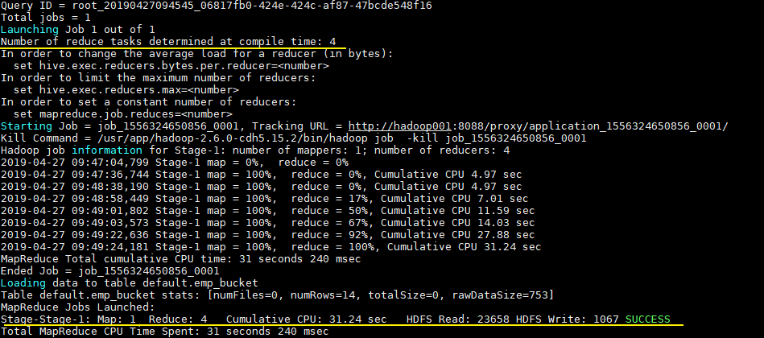
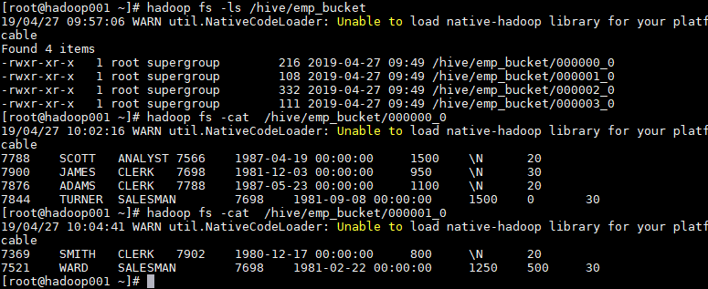

## 一、分区表

### 1.1 概念

Hive 中的表数据对应为 HDFS 上的指定目录，在查询数据时候，默认会对**全表进行扫描**，这样时间和性能的消耗都非常大。

**分区为 HDFS 上表目录的子目录**，数据按照分区存储在子目录中。如果查询的 `where` 子句中包含分区条件，则直接从该分区查找，而不用扫描整个表目录，合理的分区设计可以极大提高查询速度和性能。

> 表进行分区后，逻辑上表仍然是一张完整的表，只是将表中的数据存放到多个表空间（文件目录）。
>

### 1.2  使用场景

通常，在管理**大规模数据集**的时候都需要进行分区，比如将日志文件按天进行分区，从而保证数据细粒度的划分，使得查询性能得到提升。

### 1.3 分区表基本操作

#### 创建分区表

在 Hive 中可以使用 `PARTITIONED BY` 子句创建分区表。表可以包含一个或多个分区列，程序会为分区列中的每个不同值组合创建单独的数据目录。下面的我们创建一张雇员表作为测试：

```
 CREATE EXTERNAL TABLE emp_partition(
    empno INT,
    ename STRING,
    job STRING,
    mgr INT,
    hiredate TIMESTAMP,
    sal DECIMAL(7,2),
    comm DECIMAL(7,2)
    )
    PARTITIONED BY (deptno INT)   -- 按照部门编号进行分区
    ROW FORMAT DELIMITED FIELDS TERMINATED BY "\t"
    LOCATION '/hive/emp_partition';
```

注：分区字段不能是表中已经存在的字段。

#### 加载数据到分区表

**加载数据到分区表时必须指定分区。加载数据到分区表并建立关联关系，有以下三种方式：**

（1）方式一：上传数据后修复

```
--上传数据
hive (default)> dfs -mkdir -p /hive/emp_partition/deptno=20;
hive (default)> dfs -put /opt/module/data/dept.txt /hive/emp_partition/deptno=20;
--查询数据（查询不到刚上传的数据）
hive (default)> select * from emp_partition where deptno=20;
--执行修复命令
hive> msck repair table emp_partition;
--再次查询数据
hive (default)> select * from emp_partition where deptno=20;
```

（2）方式二：上传数据后添加分区

```
--上传数据
hive (default)> dfs -mkdir -p /hive/emp_partition/deptno=20;
hive (default)> dfs -put /opt/module/data/dept.txt /hive/emp_partition/deptno=20;
--执行添加分区
hive (default)> alter table emp_partition add partition(deptno=20);
--查询数据
hive (default)> select * from emp_partition where deptno=20;
```

（3）方式三：load数据到分区

```
--创建目录(测试是否不需要手动创建)
hive (default)> dfs -mkdir -p /hive/emp_partition/deptno=20;
--上传数据
hive (default)> load data local inpath '/opt/module/data/dept.txt' into table
 emp_partition partition(deptno=20);
--查询数据
hive (default)> select * from emp_partition where deptno=20;
```

可以通过hdfs命令查看分区文件

```
# hadoop fs -ls  hdfs://hadoop001:8020/hive/emp_partition/deptno=20/
```

#### 查询分区表中的数据

单分区查询

```
hive (default)> select * from emp_partition where deptno = 20;
```

多分区联合查询

```
hive (default)> select * from emp_partition where deptno = 20
              union
              select * from emp_partition where deptno = 30
              union
              select * from emp_partition where deptno = 40;
```

#### 增加分区

```
-- 创建单个分区
hive (default)> alter table dept_partition add partition(month='201706') ;
-- 同时创建多个分区
hive (default)> alter table dept_partition add partition(month='201705'), partition(month='201704');
```

#### 删除分区

```
-- 删除单个分区
hive (default)> alter table dept_partition drop partition (month='201704');
-- 同时删除多个分区
hive (default)> alter table dept_partition drop partition (month='201705'), partition (month='201706');
```

#### 查看分区数

```
hive> show partitions dept_partition;
```

#### 查看分区表结构

```
hive> desc formatted dept_partition;

# Partition Information        
# col_name              data_type               comment           
month                   string  
```

#### 创建二级分区表

```
hive (default)> create table dept_partition2(
               deptno int, dname string, loc string
               )
               partitioned by (month string, day string)
               row format delimited fields terminated by '\t';
#（1）加载数据到二级分区表中
hive (default)> load data local inpath '/opt/module/datas/dept.txt' into table 
dept_partition2 partition(month='201709', day='13');
#（2）查询分区数据
hive (default)> select * from dept_partition2 where month='201709' and day='13';
```

### 1.4 动态分区调整

关系型数据库中，对分区表Insert数据时候，数据库自动会根据分区字段的值，将数据插入到相应的分区中，Hive中也提供了类似的机制，即动态分区(Dynamic Partition)，只不过，使用Hive的动态分区，需要进行相应的配置。

**1****）开启动态分区参数设置**

```
--（1）开启动态分区功能（默认true，开启）
hive.exec.dynamic.partition=true
--（2）设置为非严格模式（动态分区的模式，默认strict，表示必须指定至少一个分区为静态分区，nonstrict模式表示允许所有的分区字段都可以使用动态分区。）
hive.exec.dynamic.partition.mode=nonstrict
--（3）在所有执行MR的节点上，最大一共可以创建多少个动态分区。默认1000
hive.exec.max.dynamic.partitions=1000
--（4）在每个执行MR的节点上，最大可以创建多少个动态分区。该参数需要根据实际的数据来设定。比如：源数据中包含了一年的数据，即day字段有365个值，那么该参数就需要设置成大于365，如果使用默认值100，则会报错。
hive.exec.max.dynamic.partitions.pernode=100
--（5）整个MR Job中，最大可以创建多少个HDFS文件。默认100000
hive.exec.max.created.files=100000
--（6）当有空分区生成时，是否抛出异常。一般不需要设置。默认false
hive.error.on.empty.partition=false
```

**2****）案例实操**

需求：将dept表中的数据按照地区（loc字段），插入到目标表dept_partition的相应分区中。

```
--（1）创建目标分区表
hive (default)> create table dept_partition(id int, name string) partitioned
by (location int) row format delimited fields terminated by '\t';
--（2）设置动态分区
set hive.exec.dynamic.partition.mode = nonstrict;
hive (default)> insert into table dept_partition partition(location) select deptno, dname, loc from dept;
--（3）查看目标分区表的分区情况
hive (default)> show partitions dept_partition;
```

思考：目标分区表是如何匹配到分区字段的？

## 二、分桶表

### 1.1 简介

分桶表 (bucket Table)是比分区表**更加细粒度**的数据拆分方案，分桶表会将指定列的值进行**哈希散列**，并对 bucket（桶数量）取余，然后存储到对应的 bucket（桶）中。

分桶表的作用：

* 提高join效率。JOIN操作两个表根据关联列进行了相同的分桶，可以将保存相同列值的桶直接进行JOIN，可以大大减少JOIN的数据量，详见sort merge bucket join。
* 便于取样（sampling）。在处理大规模数据集时，在开发和修改查询的阶段，如果能在数据集的一小部分数据上试运行查询，会带来很多方便。

### 1.2 创建分桶表

在 Hive 中，我们可以通过 `CLUSTERED BY` 指定分桶列，并通过 `SORTED BY` 指定桶中数据的排序参考列。下面为分桶表建表语句示例：

```
  CREATE EXTERNAL TABLE emp_bucket(
    empno INT,
    ename STRING,
    job STRING,
    mgr INT,
    hiredate TIMESTAMP,
    sal DECIMAL(7,2),
    comm DECIMAL(7,2),
    deptno INT)
    CLUSTERED BY(empno) SORTED BY(empno ASC) INTO 4 BUCKETS  --按照员工编号散列到四个 bucket 中
    ROW FORMAT DELIMITED FIELDS TERMINATED BY "\t"
    LOCATION '/hive/emp_bucket';
```

### 1.3 加载数据到分桶表

直接使用 `Load` 语句向分桶表加载数据，可以执行成功，但加载后表中数据为空。

这是由于分桶的实质是对指定字段做了 hash 散列然后存放到对应文件中，这意味着**向分桶表中插入数据是必然要通过 MapReduce，且 Reducer 的数量必须等于分桶的数量**。由于以上原因，**分桶表的数据通常只能使用 CTAS(CREATE TABLE AS SELECT) 或ITAS方式插入，因为 CTAS 操作会触发 MapReduce**。加载数据步骤如下：

#### 1. 设置强制分桶

在 Hive 0.x and 1.x 版本，必须使用设置 `hive.enforce.bucketing = true`，表示强制分桶，允许程序根据表结构自动选择正确数量的 Reducer 和 clustered by column 来进行分桶。

```
set hive.enforce.bucketing = true; --Hive 2.x 不需要这一步
```

#### 2. ITAS导入数据

```
INSERT INTO TABLE emp_bucket SELECT *  FROM emp;  --这里的 emp 表就是一张普通的雇员表
```

可以从执行日志看到 CTAS 触发 MapReduce 操作，且 Reducer 数量和建表时候指定 bucket 数量一致：



### 1.4 查看分桶文件

bucket(桶) 本质上就是表目录下的具体文件：



## 三、分区表和分桶表结合使用

分区表和分桶表的本质都是将数据按照**不同粒度**进行拆分，从而使得在查询时候不必扫描全表，只需要扫描对应的分区或分桶，从而提升查询效率。两者可以结合起来使用，从而保证表数据在不同粒度上都能得到合理的拆分。下面是 Hive 官方给出的示例：

```
CREATE TABLE page_view_bucketed(
    viewTime INT, 
    userid BIGINT,
    page_url STRING, 
    referrer_url STRING,
    ip STRING )
 PARTITIONED BY(dt STRING)
 CLUSTERED BY(userid) SORTED BY(viewTime) INTO 32 BUCKETS
 ROW FORMAT DELIMITED
   FIELDS TERMINATED BY '\001'
   COLLECTION ITEMS TERMINATED BY '\002'
   MAP KEYS TERMINATED BY '\003'
 STORED AS SEQUENCEFILE;
```

此时导入数据时需要指定分区：

```
INSERT OVERWRITE page_view_bucketed
PARTITION (dt='2009-02-25')
SELECT * FROM page_view WHERE dt='2009-02-25';
```