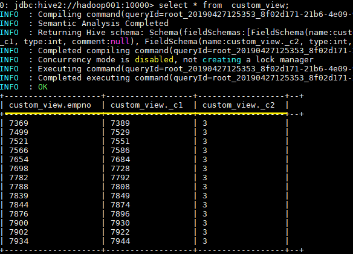
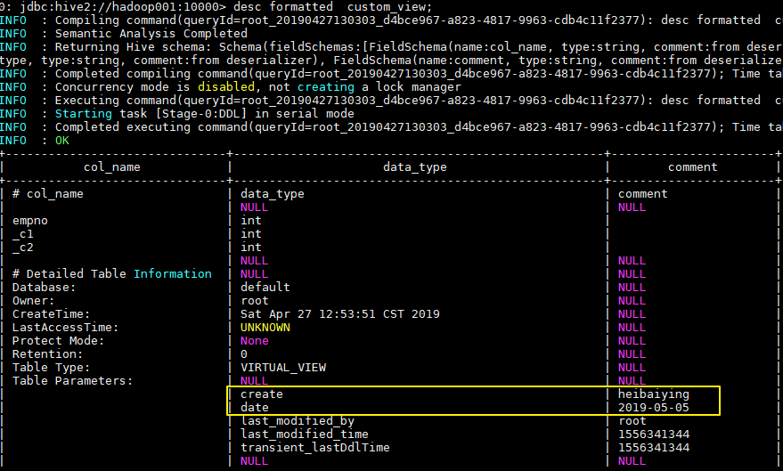

## 一、视图

### 1.1 简介

Hive 中的视图和 RDBMS 中视图的概念一致，都是一组数据的逻辑表示，本质上就是一条 SELECT 语句的结果集。视图是纯粹的逻辑对象，没有关联的存储 (Hive 3.0.0 引入的物化视图除外)，当查询引用视图时，Hive 可以将视图的定义与查询结合起来，例如将查询中的过滤器推送到视图中。

### 1.2 创建视图

```sql
CREATE VIEW [IF NOT EXISTS] [db_name.]view_name   -- 视图名称
  [(column_name [COMMENT column_comment], ...) ]    --列名
  [COMMENT view_comment]  --视图注释
  [TBLPROPERTIES (property_name = property_value, ...)]  --额外信息
  AS SELECT ...;
```

在 Hive 中可以使用 `CREATE VIEW` 创建视图，如果已存在具有相同名称的表或视图，则会抛出异常，建议使用 `IF NOT EXISTS` 预做判断。在使用视图时候需要注意以下事项：

* 视图是只读的，不能被load/insert/alter。
* 视图被创建后就固定了，视图参与查询时，会先被执行得到结果，再执行后续操作。
* 删除基表不会同时删除视图，视图被创建后，基表或列不存在，执行视图时会报错。

```
CREATE VIEW  IF NOT EXISTS custom_view AS SELECT empno, empno+deptno , 1+2 FROM emp;
```



### 1.3 查看视图

```
-- 查看所有视图： 没有单独查看视图列表的语句，只能使用 show tables
show tables;
-- 查看某个视图
desc view_name;
-- 查看某个视图详细信息
desc formatted view_name;
```

### 1.4 删除视图

```
DROP VIEW [IF EXISTS] [db_name.]view_name;
```

删除视图时，如果被删除的视图被其他视图所引用，这时候程序不会发出警告，但是引用该视图其他视图已经失效，需要进行重建或者删除。

### 1.5 修改视图

```
ALTER VIEW [db_name.]view_name AS select_statement;
```

被更改的视图必须存在，且视图不能具有分区，如果视图具有分区，则修改失败。

### 1.6 修改视图属性

语法：

```
ALTER VIEW [db_name.]view_name SET TBLPROPERTIES table_properties;
 
table_properties:
  : (property_name = property_value, property_name = property_value, ...)
```

示例：

```
ALTER VIEW custom_view SET TBLPROPERTIES ('create'='heibaiying','date'='2019-05-05');
```

