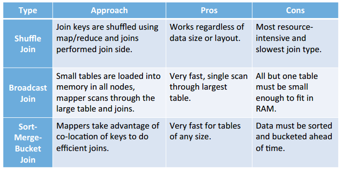

查询语句语法：

```sql
SELECT [ALL | DISTINCT] select_expr, select_expr, ...
FROM t1
[WHERE where_condition]
[GROUP BY col_list]
[ORDER BY col_list]
[CLUSTER BY col_list | [DISTRIBUTE BY col_list] [SORT BY col_list]
]
[LIMIT number]
```

## 1. 基本查询（Select…From）

### 1.1 全表和特定列查询

**0** **）** **数据准备**

（1）创建部门表

```
create table if not exists dept(
deptno int,
dname string,
loc int
)
row format delimited fields terminated by '\t';
```

（2）创建员工表

```
create table if not exists emp(
empno int,
ename string,
job string,
mgr int,
hiredate string,
sal double,
comm double,
deptno int)
row format delimited fields terminated by '\t';
```

（3）导入数据

```
load data local inpath '/opt/module/datas/dept.txt' into table dept;
load data local inpath '/opt/module/datas/emp.txt' into table emp;
```

**1** **）** **全表查询**

```
hive (default)> select * from emp;
```

**2** **）** **选择特定列查询**

```
hive (default)> select empno, ename from emp;
```

### 1.2 列别名

作用：

1）重命名一个列  2）便于计算

别名紧跟列名，或在列名和别名之间加入关键字‘AS’

案例实操：查询名称和部门

```
hive (default)> select ename AS name, deptno dn from emp;
```

### 1.3 算术运算符

| 运算符 | 描述           |
| ------ | -------------- |
| A+B    | A和B 相加      |
| A-B    | A减去B         |
| A*B    | A和B 相乘      |
| A/B    | A除以B         |
| A%B    | A对B取余       |
| A&B    | A和B按位取与   |
| A      | B              |
| A^B    | A和B按位取异或 |
| ~A     | A按位取反      |

案例实操：查询出所有员工的薪水后加1显示。

```
hive (default)> select sal + 1 from emp;
```

### 1.4 常用聚合函数

```
# 1）求总行数（count）
hive (default)> select count(*) cnt from emp;
# 2）求工资的最大值（max）
hive (default)> select max(sal) max_sal from emp;
# 3）求工资的最小值（min）
hive (default)> select min(sal) min_sal from emp;
# 4）求工资的总和（sum）
hive (default)> select sum(sal) sum_sal from emp;
# 5）求工资的平均值（avg）
hive (default)> select avg(sal) avg_sal from emp;
```

### 1.5 Limit语句

LIMIT子句用于限制返回的行数。可以看作分页查询。

hive支持limit n的语法，但不支持limit n offset m或者limit m,n【在sql中表示从m开始的n条数据，m初始值为0】.

```
hive (default)> select * from emp limit 5;
```

### 1.6 Where语句

案例实操

查询出薪水大于1000的所有员工

```
hive (default)> select * from emp where sal >1000;
```

注意：where子句中不能使用字段别名。

与MySQL不同：hive中不能使用where 1，只能用where 1=1。

### 1.7 比较运算符（Between/In/ Is Null）

**1** **）** **下面表中描述了谓词操作符** **，** **这些操作符同样可以用于** **JOIN…ON** **和** **HAVING** **语句中。**

| 操作符                  | 支持的数据类型 | 描述                                                                                                                                                                                                                                                                                 |
| ----------------------- | -------------- | ------------------------------------------------------------------------------------------------------------------------------------------------------------------------------------------------------------------------------------------------------------------------------------ |
| A=B                     | 基本数据类型   | 如果A等于B则返回TRUE，反之返回FALSE                                                                                                                                                                                                                                                  |
| A<=>B                   | 基本数据类型   | 如果A和B都为NULL，则返回TRUE，如果一边为NULL，返回False                                                                                                                                                                                                                              |
| A<>B, A!=B              | 基本数据类型   | A或者B为NULL则返回NULL；如果A不等于B，则返回TRUE，反之返回FALSE                                                                                                                                                                                                                      |
| A<B                     | 基本数据类型   | A或者B为NULL，则返回NULL；如果A小于B，则返回TRUE，反之返回FALSE                                                                                                                                                                                                                      |
| A<=B                    | 基本数据类型   | A或者B为NULL，则返回NULL；如果A小于等于B，则返回TRUE，反之返回FALSE                                                                                                                                                                                                                  |
| A>B                     | 基本数据类型   | A或者B为NULL，则返回NULL；如果A大于B，则返回TRUE，反之返回FALSE                                                                                                                                                                                                                      |
| A>=B                    | 基本数据类型   | A或者B为NULL，则返回NULL；如果A大于等于B，则返回TRUE，反之返回FALSE                                                                                                                                                                                                                  |
| A [NOT] BETWEEN B AND C | 基本数据类型   | 如果A，B或者C任一为NULL，则结果为NULL。如果A的值大于等于B而且小于或等于C，则结果为TRUE，反之为FALSE。如果使用NOT关键字则可达到相反的效果。                                                                                                                                           |
| A IS NULL               | 所有数据类型   | 如果A等于NULL，则返回TRUE，反之返回FALSE                                                                                                                                                                                                                                             |
| A IS NOT NULL           | 所有数据类型   | 如果A不等于NULL，则返回TRUE，反之返回FALSE                                                                                                                                                                                                                                           |
| IN(数值1, 数值2)        | 所有数据类型   | 使用 IN运算显示列表中的值                                                                                                                                                                                                                                                            |
| A [NOT] LIKE B          | STRING 类型    | B是一个SQL下的简单正则表达式，也叫通配符模式，如果A与其匹配的话，则返回TRUE；反之返回FALSE。B的表达式说明如下：‘x%’表示A必须以字母‘x’开头，‘%x’表示A必须以字母’x’结尾，而‘%x%’表示A包含有字母’x’,可以位于开头，结尾或者字符串中间。如果使用NOT关键字则可达到相反的效果。 |
| A RLIKE B, A REGEXP B   | STRING 类型    | B是基于java的正则表达式，如果A与其匹配，则返回TRUE；反之返回FALSE。匹配使用的是JDK中的正则表达式接口实现的，因为正则也依据其中的规则。例如，正则表达式必须和整个字符串A相匹配，而不是只需与其字符串匹配。                                                                            |

**2** **）案例实操**

```
#（1）查询出薪水等于5000的所有员工
hive (default)> select * from emp where sal =5000;
#（2）查询工资在500到1000的员工信息
hive (default)> select * from emp where sal between 500 and 1000;
#（3）查询comm为空的所有员工信息
hive (default)> select * from emp where comm is null;
#（4）查询工资是1500或5000的员工信息
hive (default)> select * from emp where sal IN (1500, 5000);
```

### 1.8 Like和RLike

**1** **）使用** **LIKE** **运算选择类似的值**

**2** **）选择条件可以包含字符或数字** **:**

% 代表零个或多个字符(任意个字符)。

_ 代表一个字符。

**3** **）** **RLIKE** **子句**

RLIKE子句是Hive中这个功能的一个扩展，其可以通过Java的正则表达式这个更强大的语言来指定匹配条件。

**4** **）案例实操**

```
#（1）查找以2开头薪水的员工信息
hive (default)> select * from emp where sal LIKE '2%';
#（2）查找第二个数值为2的薪水的员工信息
hive (default)> select * from emp where sal LIKE '_2%';
#（3）查找薪水中含有2的员工信息
hive (default)> select * from emp where sal RLIKE '[2]';
```

hive中的show ... like ...语句，like后用正则表达式语法，如用`*`替换`%`，用`.`替换`_`，示例：

```
hive (default)> show functions like '*day*';
OK
tab_name
day
dayofmonth
dayofweek
floor_day
last_day
next_day
Time taken: 0.015 seconds, Fetched: 6 row(s)

hive (default)> show functions like '%day%';
OK
tab_name
Time taken: 0.015 seconds
```

### 1.9 逻辑运算符（And/Or/Not）

| 操作符 | 含义   |
| ------ | ------ |
| AND    | 逻辑并 |
| OR     | 逻辑或 |
| NOT    | 逻辑否 |

**1** **）案例实操**

```
（1）查询薪水大于1000，部门是30
hive (default)> select * from emp where sal>1000 and deptno=30;
（2）查询薪水大于1000，或者部门是30
hive (default)> select * from emp where sal>1000 or deptno=30;
（3）查询除了20部门和30部门以外的员工信息
hive (default)> select * from emp where deptno not IN(30, 20);
```

### 1.10 distinct

以其后的所有列为key进行去重。下面测试下distinct的部分功能，先创建一张测试表

```
create table trip_tmp(
id int,
user_id int,
salesman_id int,
house_id int
);
```

插入模拟数据：(这样插入很慢，可以自己建个txt然后load)

```
insert into trip_tmp values(1, 2, 3, 3);
insert into trip_tmp values(1, 2, 3, 3);
insert into trip_tmp values(2, 2, 3, 3);
insert into trip_tmp values(3, 2, 3, 3);
insert into trip_tmp values(4, 2, 5, 3);
insert into trip_tmp values(6, 3, 3, 3);
insert into trip_tmp values(5, 4, 2, 3);
insert into trip_tmp values(5, 2, 3, 3);
insert into trip_tmp values(6, 2, 5, 3);
insert into trip_tmp values(5, 2, 3, 3);
insert into trip_tmp values(5, 2, 5, 3);
```

查看所有数据：

```
select * from trip_tmp;
OK
1   2   3   3
1   2   3   3
5   2   5   3
2   2   3   3
3   2   3   3
4   2   5   3
6   3   3   3
5   4   2   3
5   2   3   3
6   2   5   3
5   2   3   3
Time taken: 0.277 seconds, Fetched: 11 row(s)
```

对表中**所有列** 进行去重：

```
select distinct id, user_id, salesman_id, house_id from trip_tmp;

OK
1   2   3   3
2   2   3   3
3   2   3   3
4   2   5   3
5   2   3   3
5   2   5   3
5   4   2   3
6   2   5   3
6   3   3   3
Time taken: 13.142 seconds, Fetched: 9 row(s)
```

注意点一：hive中distinct必须在select的最前面，不能出现在中间。

```
select house_id, distinct id, user_id, salesman_id from test.trip_tmp;
NoViableAltException(96@[80:1: selectItem : ......
```

注意点二：distinct不能和聚合函数并列使用，也不能和group by一起使用，否则报错。

```
select distinct id, user_id, salesman_id, count(house_id) from trip_tmp;
FAILED: SemanticException [Error 10128]: Line 1:42 Not yet supported place for UDAF 'count'
```

但可以在聚合函数中使用distinct

```
select count(distinct id) from trip_tmp;
OK
6
Time taken: 4.775 seconds, Fetched: 1 row(s)
```

distinct可以和带有开窗函数的聚合函数一起使用，是对id和temp进行去重：

```
select distinct id, count(*) over(partition by user_id)  as temp from trip_tmp;
id      temp
5       9
2       9
1       9
3       9
5       1
4       9
6       1
6       9
```

注意点三：如果多个聚合函数中都使用了distinct，那么多个distinct后的字段必须相同。

```
select pv_users.gender,count(distinct pv_users.userid),count(distinct pv_users.ip)
from pv_users
group by pv_users.gender;
```

注意点四：distinct可以用括号将多个列括起来作为一个json列(**但仍然以所有列为key** )

```
select distinct (id, user_id, house_id), salesman_id from trip_tmp;
OK
_c0     salesman_id
{"col1":1,"col2":2,"col3":3}    3
{"col1":2,"col2":2,"col3":3}    3
{"col1":3,"col2":2,"col3":3}    3
{"col1":4,"col2":2,"col3":3}    5
{"col1":5,"col2":2,"col3":3}    3
{"col1":5,"col2":2,"col3":3}    5
{"col1":5,"col2":4,"col3":3}    2
{"col1":6,"col2":2,"col3":3}    5
{"col1":6,"col2":3,"col3":3}    3
```

注意点五：**distinct不会过滤NULL**。聚合函数中的distinct如**count(distinct id)会过滤NULL** **。**

注意点六：group by可以替代distinct，两者底层实现一致，一般推荐使用group by。

## 2. 分组

### 2.1 Group By语句

对检索结果进行分组，一般和聚合函数一起使用，如AVG()/COUNT()/MAX()/MIN()。

```
select col1,col2,count(1),sel_expr(聚合操作)
from tableName
where condition
group by col1,col2
having ...
```

注意：select后面的字段，若非聚合操作，必须出现在group by中(如上面的col1和col2)，否则报错：`Expression not in GROUP BY key`；【mysql的group by不做要求】

* hive、oracle的where、group by、having都**不能用别名** 【mysql中可以用别名】，如：

```
select id, user_id+1 as user_plus from trip_tmp group by id, user_puls;//报错
select id, user_id+1 as user_plus from trip_tmp group by id, user_id+1;//可以
```

**group by必然执行reduce，其速度与reducer数量有关** ，输出文件数为reducer个数，可通过参数`mapreduce.job.reduces`调整reducer个数。

**案例实操**：

```
（1）计算emp表每个部门的平均工资
hive (default)> select t.deptno, avg(t.sal) as avg_sal from emp t group by t.deptno;
（2）计算emp每个部门中每个岗位的最高薪水
hive (default)> select t.deptno, t.job, max(t.sal) as max_sal from emp t group by
 t.deptno, t.job;
```

### 2.2 Having语句

**1** **）** **having** **与** **where** **不同点**

（1）where后面不能写分组函数，而having后面可以使用分组函数。

（2）having只用于group by之后。

**2** **）案例实操**

```
（1）求每个部门的平均工资
hive (default)> select deptno, avg(sal) from emp group by deptno;
（2）求每个部门的平均薪水大于2000的部门
hive (default)> select deptno, avg(sal) avg_sal from emp group by deptno 
having avg_sal > 2000;
```

`hive.map.aggr` 控制程序如何进行聚合。默认值为 false。如果设置为 true，Hive 会在 map 阶段就执行一次聚合。这可以提高聚合效率，但需要消耗更多内存。

```
set hive.map.aggr=true;
```

## 3. Join策略和类型

### hive的三种join策略



> https://blog.csdn.net/Samaritan_H/article/details/79090103
>

### hive支持的七种join类型

见Spark/Spark/Hive支持的七种Join

### 多表连接

连接 n个表，至少需要n-1个连接条件。例如：连接三个表，至少需要两个连接条件。

大多数情况下，Hive会对每对JOIN连接对象启动一个MapReduce任务。如a join b on 条件1 join c on 条件2，由于hive ql是从左往右执行，hive会首先启动一个MapReduce job对表a和表b进行连接操作，然后会再启动一个MapReduce job将第一个MapReduce job的输出和表c进行连接操作。当对3个或者更多表进行join连接时，如果每个on子句都使用相同的连接键的话，那么只会产生一个MapReduce job。

### 笛卡尔积的产生

笛卡尔集会在下面条件下产生：

* 没有连接条件on：即使有where，也是先笛卡尔积再用where过滤
* 连接条件无效
* 显式使用cross join

```sql
select empno, dname from emp, dept;
SELECT * FROM emp JOIN dept;
select * from emp cross join dept;
```

hive中只使用一个reducer来处理笛卡尔积，而笛卡尔积本身就导致数据爆炸，因此尽量避免产生笛卡尔积。使用`set hive.mapred.mode=strict;`禁止笛卡尔积运行。

## 4. 排序

ASC（ascend）: 升序（默认）

DESC（descend）: 降序

### 4.1 全局排序（Order By）

**ORDER BY 子句位于SELECT语句的末尾，执行顺序也是最后**，用于对查询结果进行**全局排序，只有一个reducer**，在严格模式下 (`hive.mapred.mode = strict`)，则其后面必须再跟一个 `limit` 子句。

> 注 ：hive.mapred.mode 默认值是 nonstrict ，也就是非严格模式。
>

**案例实操**

```
#（1）查询员工信息按工资升序排列
hive (default)> select * from emp order by sal;
#（2）查询员工信息按工资降序排列
hive (default)> select * from emp order by sal desc;
#（3）按照别名排序：按照员工薪水的2倍排序
hive (default)> select ename, sal*2 twosal from emp order by twosal;
#（4）多列排序：按照部门和工资升序排序
hive (default)> select ename, deptno, sal from emp order by deptno, sal ;
```

### 4.2 Distribute By

**distribute by** 类似MR中partition，将指定列的**hash值** 相同的行发往同一个 Reducer 进行处理，总共分成**reducer个** 分区。可以结合 `SORT BY` 在**分区内排序。**

> distribute by与group by 的区别
>
> 都是按key的hash值将数据行发往不同的reducer。唯一不同的是，distribute by只是单纯地将数据按key分区，而group by必须对分区的数据进行聚合操作。
>

**1** **）案例实操：**

（1）先按照部门编号分区，再按照员工编号降序排序。

```sql
hive (default)> set mapreduce.job.reduces=3;
hive (default)> insert overwrite local directory 
'/opt/module/datas/distribute-result' 
select * from emp distribute by deptno sort by empno desc;
```

> 注意：DISTRIBUTE BY语句要写在SORT BY语句之前。
>

### 4.3 分区内排序（Sort By）

ORDER BY 和 SORT BY 的区别如下：

* order by 保证全局有序，因此只能使用一个reducer进行排序。
* sort by只保证分区内有序，不保证全局有序，分区数等同于reducer数。

```sql
# 1）设置reduce个数
hive (default)> set mapreduce.job.reduces=3;
# 2）查看设置reduce个数
hive (default)> set mapreduce.job.reduces;
# 3）根据部门编号降序查看员工信息
hive (default)> select * from emp sort by deptno desc;
# 4）将查询结果导入到文件中（按照部门编号降序排序）
hive (default)> insert overwrite local directory '/opt/module/datas/sortby-result'
select * from emp sort by deptno desc;
```

### 4.4 Cluster By

当distribute by和sort by字段相同，且sort by排序规则是ASC时，可以使用cluster by代替。

cluster by只能用于升序。

以下两种写法等价：

```
hive (default)> select * from emp cluster by deptno;
hive (default)> select * from emp distribute by deptno sort by deptno;
```

## 5. 抽样查询

hive支持分桶进行抽样查询：

```
select * from stu_buck tablesample(bucket 1 out of 4 on id);
```

语法：`TABLESAMPLE(BUCKET x OUT OF y [on col])` 。

x out of y 表示每y个桶抽x个，桶表可以不指定分桶列，非桶表必须指定分桶列。

注意：需满足`x<=y`，否则报错：

```
FAILED: SemanticException [Error 10061]: Numerator should not be bigger than denominator in sample clause for table stu_buck
```