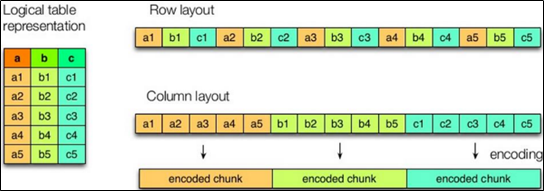
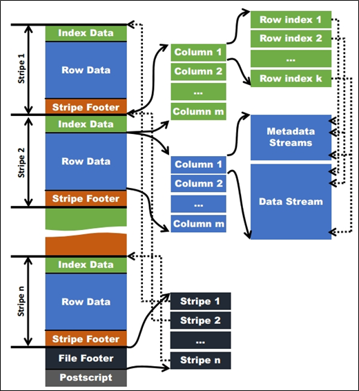
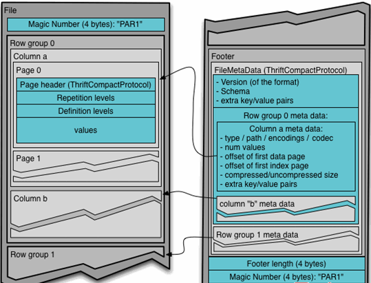

## 1. Hadoop压缩配置

### 1.1 MR支持的压缩编码

| 压缩格式 | 工具  | 算法    | 文件扩展名 | 是否可切分 |
| -------- | ----- | ------- | ---------- | ---------- |
| DEFLATE  | 无    | DEFLATE | .deflate   | 否         |
| Gzip     | gzip  | DEFLATE | .gz        | 否         |
| bzip2    | bzip2 | bzip2   | .bz2       | 是         |
| LZO      | lzop  | LZO     | .lzo       | 是         |
| Snappy   | 无    | Snappy  | .snappy    | 否         |

为了支持多种压缩/解压缩算法，Hadoop引入了编码/解码器，如下表所示：

| 压缩格式 | 对应的编码/解码器                          |
| -------- | ------------------------------------------ |
| DEFLATE  | org.apache.hadoop.io.compress.DefaultCodec |
| gzip     | org.apache.hadoop.io.compress.GzipCodec    |
| bzip2    | org.apache.hadoop.io.compress.BZip2Codec   |
| LZO      | com.hadoop.compression.lzo.LzopCodec       |
| Snappy   | org.apache.hadoop.io.compress.SnappyCodec  |

压缩性能的比较：

| 压缩算法 | 原始文件大小 | 压缩文件大小 | 压缩速度 | 解压速度 |
| -------- | ------------ | ------------ | -------- | -------- |
| gzip     | 8.3GB        | 1.8GB        | 17.5MB/s | 58MB/s   |
| bzip2    | 8.3GB        | 1.1GB        | 2.4MB/s  | 9.5MB/s  |
| LZO      | 8.3GB        | 2.9GB        | 49.3MB/s | 74.6MB/s |

> http://google.github.io/snappy/
>
> On a single core of a Core i7 processor in 64-bit mode, Snappy compresses at about 250 MB/sec or more and decompresses at about 500 MB/sec or more.
>

### 1.2 压缩参数配置

要在Hadoop中启用压缩，可以配置如下参数（mapred-site.xml文件中）：

| **参数**                                              | **默认值**                                                                                                                                                                   | **阶段**        | **建议**                                         |
| ----------------------------------------------------- | ---------------------------------------------------------------------------------------------------------------------------------------------------------------------------- | --------------- | ------------------------------------------------ |
| **io.compression.codecs   （在core-site.xml中配置）** | **org.apache.hadoop.io.compress.DefaultCodec, org.apache.hadoop.io.compress.GzipCodec, org.apache.hadoop.io.compress.BZip2Codec,****org.apache.hadoop.io.compress.Lz4Codec** | **输入压缩**    | **Hadoop使用文件扩展名判断是否支持某种编解码器** |
| **mapreduce.map.output.compress**                     | **false**                                                                                                                                                                    | **mapper输出**  | **这个参数设为true启用压缩**                     |
| **mapreduce.map.output.compress.codec**               | **org.apache.hadoop.io.compress.DefaultCodec**                                                                                                                               | **mapper输出**  | **使用LZO、LZ4或snappy编解码器在此阶段压缩数据** |
| **mapreduce.output.fileoutputformat.compress**        | **false**                                                                                                                                                                    | **reducer输出** | **这个参数设为true启用压缩**                     |
| **mapreduce.output.fileoutputformat.compress.codec**  | **org.apache.hadoop.io.compress. DefaultCodec**                                                                                                                              | **reducer输出** | **使用标准工具或者编解码器，如gzip和bzip2**      |
| **mapreduce.output.fileoutputformat.compress.type**   | **RECORD**                                                                                                                                                                   | **reducer输出** | **SequenceFile输出使用的压缩类型：NONE和BLOCK**  |

## 2. 开启Map输出阶段压缩（MR引擎）

开启map输出阶段压缩可以减少job中map和Reduce task间数据传输量。具体配置如下：

**1** **）案例实操：**

```
--（1）开启hive中间传输数据压缩功能
hive (default)>set hive.exec.compress.intermediate=true;
--（2）开启mapreduce中map输出压缩功能
hive (default)>set mapreduce.map.output.compress=true;
--（3）设置mapreduce中map输出数据的压缩方式
hive (default)>set mapreduce.map.output.compress.codec=
 org.apache.hadoop.io.compress.SnappyCodec;
--（4）执行查询语句
hive (default)> select count(ename) name from emp;
```

## 3. 开启Reduce输出阶段压缩

当Hive将输出写入到表中时，输出内容同样可以进行压缩。属性hive.exec.compress.output控制着这个功能。用户可能需要保持默认设置文件中的默认值false，这样默认的输出就是非压缩的纯文本文件了。用户可以通过在查询语句或执行脚本中设置这个值为true，来开启输出结果压缩功能。

**1** **）案例实操：**

```
--（1）开启hive最终输出数据压缩功能
hive (default)>set hive.exec.compress.output=true;
--（2）开启mapreduce最终输出数据压缩
hive (default)>set mapreduce.output.fileoutputformat.compress=true;
--（3）设置mapreduce最终数据输出压缩方式
hive (default)> set mapreduce.output.fileoutputformat.compress.codec =
 org.apache.hadoop.io.compress.SnappyCodec;
--（4）设置mapreduce最终数据输出压缩为块压缩
hive (default)> set mapreduce.output.fileoutputformat.compress.type=BLOCK;
--（5）测试一下输出结果是否是压缩文件
hive (default)> insert overwrite local directory
 '/opt/module/datas/distribute-result' select * from emp distribute by deptno sort by empno desc;
```

## 4. 文件存储格式

Hive支持的存储数据的格式主要有：TEXTFILE 、SEQUENCEFILE、ORC、PARQUET。

| 格式          | 说明                                                                                                                                                                                                                                                                                                                                                                  |
| ------------- | --------------------------------------------------------------------------------------------------------------------------------------------------------------------------------------------------------------------------------------------------------------------------------------------------------------------------------------------------------------------- |
| TextFile      | **纯文本** 。 默认格式。数据不压缩，磁盘开销大。                                                                                                                                                                                                                                                                                                                      |
| SequenceFile  | SequenceFile是Hadoop API 提供的一种二进制**序列化文件** ，它将数据以<key,value>的形式序列化到文件中。这种二进制文件内部使用 Hadoop 的标准的 Writable 接口实现序列化和反序列化。它与 Hadoop API 中的 MapFile 是互相兼容的。Hive 中的 SequenceFile 继承自 Hadoop API 的 SequenceFile，不过它的 key 为空，使用 value 存放实际的值，以避免 MR 在map阶段进行不必要的排序。 |
| RCFile        | FaceBook开源的一种 Hive 的文件存储格式，首先将表分为几个行组，对每个行组内的数据按列存储。                                                                                                                                                                                                                                                                            |
| **ORC Files** | ORC 是在一定程度上扩展了 RCFile，是对 RCFile 的优化。                                                                                                                                                                                                                                                                                                                 |
| Avro Files    | Avro 是一个数据序列化系统，设计用于支持大批量数据交换的应用。它的主要特点有：支持二进制序列化方式，可以便捷，快速地处理大量数据；动态语言友好。                                                                                                                                                                                                                       |
| **Parquet**   | Parquet 是基于 Dremel 的数据模型和算法实现的，面向分析型业务的列式存储格式。它通过按列进行高效压缩和特殊的编码技术，从而在降低存储空间的同时提高了IO效率。                                                                                                                                                                                                            |

### 4.1 列式存储和行式存储



如图所示左边为逻辑表，右边第一个为行式存储，第二个为列式存储。

**1** **）行存储的特点**

**查询满足条件的一整行数据的时候，** **行存储查询的速度更快。** 行存储只需要找到其中一个值，其余的值都在相邻地方。列存储则需要去每个聚集的字段找到对应的每个列的值。

**2** **）列存储的特点**

因为每个字段的数据聚集存储，在**查询只需要少数几个字段的时候，能大大减少读取的数据量** ；每个字段的数据类型一定是相同的，列式存储可以针对性的设计更好的设计压缩算法。

TEXTFILE和SEQUENCEFILE的存储格式基于行存储；ORC和PARQUET是基于列式存储的。

### 4.2 TextFile格式

**默认格式，数据不做压缩，磁盘开销大，数据解析开销大** 。可结合Gzip、Bzip2使用，但使用Gzip这种方式，hive不会对数据进行切分，从而无法对数据进行并行操作。并且在反序列化过程中，必须逐个字符判断是不是分隔符和行结束符，因此反序列化开销会比SequenceFile高几十倍。

### 4.3 SequenceFile

SequenceFile是Hadoop API提供的一种二进制文件支持，**存储方式为行存储，其具有使用方便、可分割、可压缩的特点** 。

SequenceFile支持三种压缩选择：NONE，RECORD，BLOCK。Record压缩率低，一般建议使用BLOCK压缩。

优势是文件和hadoop api中的MapFile是相互兼容的

### 4.4 Orc格式

Orc (Optimized Row Columnar)是对RCFile的改进版，压缩快，快速列存取。

存储方式：数据按行分块，每块列式存储。

结合了行存储和列存储的优点：

* 首先，RCFile 保证同一行的数据位于同一节点，因此元组重构的开销很低；
* 其次，像列存储一样，RCFile 能够利用列维度的数据压缩，并且能跳过不必要的列读取

如下图所示可以看到每个Orc文件由1个或多个stripe组成，每个stripe一般为HDFS的块大小，每一个stripe包含多条记录，这些记录按照列进行独立存储，对应到Parquet中的row group的概念。每个Stripe里有三部分组成，分别是Index Data，Row Data，Stripe Footer：



1）Index Data：一个轻量级的index，默认是每隔1W行做一个索引。这里做的索引应该只是记录某行的各字段在Row Data中的offset。

2）Row Data：存的是具体的数据，先取部分行，然后对这些行按列进行存储。对每个列进行了编码，分成多个Stream来存储。

3）Stripe Footer：存的是各个Stream的类型，长度等信息。

每个文件有一个File Footer，这里面存的是每个Stripe的行数，每个Column的数据类型信息等；每个文件的尾部是一个PostScript，这里面记录了整个文件的压缩类型以及FileFooter的长度信息等。在读取文件时，会seek到文件尾部读PostScript，从里面解析到File Footer长度，再读FileFooter，从里面解析到各个Stripe信息，再读各个Stripe，即从后往前读。

### 4.5 Parquet格式

Parquet文件是**以二进制方式存储** 的，所以是不可以直接读取的，文件中包括该文件的数据和元数据，因此Parquet格式文件是自解析的。

（1）行组(Row Group)：每一个行组包含一定的行数，在一个HDFS文件中至少存储一个行组，类似于orc的stripe的概念。

（2）列块(Column Chunk)：在一个行组中每一列保存在一个列块中，行组中的所有列连续的存储在这个行组文件中。一个列块中的值都是相同类型的，不同的列块可能使用不同的算法进行压缩。

（3）页(Page)：每一个列块划分为多个页，一个页是最小的编码的单位，在同一个列块的不同页可能使用不同的编码方式。

通常情况下，在存储Parquet数据的时候会按照Block大小设置行组的大小，由于一般情况下每一个Mapper任务处理数据的最小单位是一个Block，这样可以把每一个行组由一个Mapper任务处理，增大任务执行并行度。

Parquet文件的格式：



上图展示了一个Parquet文件的内容，一个文件中可以存储多个行组，文件的首位都是该文件的Magic Code，用于校验它是否是一个Parquet文件，Footer length记录了文件元数据的大小，通过该值和文件长度可以计算出元数据的偏移量，文件的元数据中包括每一个行组的元数据信息和该文件存储数据的Schema信息。除了文件中每一个行组的元数据，每一页的开始都会存储该页的元数据，在Parquet中，有三种类型的页：数据页、字典页和索引页。数据页用于存储当前行组中该列的值，字典页存储该列值的编码字典，每一个列块中最多包含一个字典页，索引页用来存储当前行组下该列的索引，目前Parquet中还不支持索引页。

### 4.5 主流文件存储格式对比实验

从存储文件的压缩比和查询速度两个角度对比。

存储文件的压缩比测试：

**1** **）测试数据**

[log.rar](assets/log-20210527002819-0vr5e3n.rar)

**2** **）TextFile**

（1）创建表，存储数据格式为TEXTFILE

```
create table log_text (
track_time string,
url string,
session_id string,
referer string,
ip string,
end_user_id string,
city_id string
)
row format delimited fields terminated by '\t'
stored as textfile;
```

（2）向表中加载数据

```
hive (default)> load data local inpath '/opt/module/datas/log.txt' into table log_text;
```

（3）查看表中数据大小

```
hive (default)> dfs -du -h /user/hive/warehouse/log_text;
18.1 M  /user/hive/warehouse/log_text/log.data
```

**3** **）ORC**

（1）创建表，存储数据格式为ORC

```
create table log_orc(
track_time string,
url string,
session_id string,
referer string,
ip string,
end_user_id string,
city_id string
)
row format delimited fields terminated by '\t'
stored as orc
tblproperties("orc.compress"="ZLIB");
```

（2）向表中加载数据

```
hive (default)> insert into table log_orc select * from log_text ;
```

（3）查看表中数据大小

```
hive (default)> dfs -du -h /user/hive/warehouse/log_orc/ ;
2.8 M  /user/hive/warehouse/log_orc/000000_0
```

**4** **）** **Parquet**

（1）创建表，存储数据格式为parquet

```
create table log_parquet(
track_time string,
url string,
session_id string,
referer string,
ip string,
end_user_id string,
city_id string
)
row format delimited fields terminated by '\t'
stored as parquet ;
```

（2）向表中加载数据

```
hive (default)> insert into table log_parquet select * from log_text ;
```

（3）查看表中数据大小

```
hive (default)> dfs -du -h /user/hive/warehouse/log_parquet/ ;
13.1 M  /user/hive/warehouse/log_parquet/000000_0
```

存储文件的压缩比总结：

ORC >  Parquet >  textFile

存储文件的查询速度测试：

（1）TextFile

```
hive (default)> select count(*) from log_text;
_c0
100000
Time taken: 21.54 seconds, Fetched: 1 row(s)
Time taken: 21.08 seconds, Fetched: 1 row(s)
Time taken: 19.298 seconds, Fetched: 1 row(s)
```

（2）ORC

```
hive (default)> select count(*) from log_orc;
_c0
100000
Time taken: 20.867 seconds, Fetched: 1 row(s)
Time taken: 22.667 seconds, Fetched: 1 row(s)
Time taken: 18.36 seconds, Fetched: 1 row(s)
```

（3）Parquet

```
hive (default)> select count(*) from log_parquet;
_c0
100000
Time taken: 22.922 seconds, Fetched: 1 row(s)
Time taken: 21.074 seconds, Fetched: 1 row(s)
Time taken: 18.384 seconds, Fetched: 1 row(s)
```

存储文件的查询速度总结：查询速度相近。

## 5. 存储和压缩结合

### 5.1 测试存储和压缩

官网：https://cwiki.apache.org/confluence/display/Hive/LanguageManual+ORC

ORC存储方式的压缩：

| Key                      | Default     | Notes                                                                         |
| ------------------------ | ----------- | ----------------------------------------------------------------------------- |
| orc.compress             | ZLIB        | high level compression (one of NONE, ZLIB, SNAPPY)                            |
| orc.compress.size        | 262,144     | number of bytes in each compression chunk                                     |
| orc.stripe.size          | 268,435,456 | number of bytes in each stripe                                                |
| orc.row.index.stride     | 10,000      | number of rows between index entries (must be >= 1000)                        |
| orc.create.index         | true        | whether to create row indexes                                                 |
| orc.bloom.filter.columns | ""          | comma separated list of column names for which bloom filter should be created |
| orc.bloom.filter.fpp     | 0.05        | false positive probability for bloom filter (must >0.0 and <1.0)              |

注意：所有关于ORCFile的参数都是在HQL语句的TBLPROPERTIES字段里面出现

**1** **）创建一个非压缩的的ORC** **存储方式**

（1）建表语句

```
create table log_orc_zlib(
track_time string,
url string,
session_id string,
referer string,
ip string,
end_user_id string,
city_id string
)
row format delimited fields terminated by '\t'
stored as orc
tblproperties("orc.compress"="NONE");
```

（2）插入数据

```
insert into log_orc_zlib select * from log_text;
```

（3）查看插入后数据

```
hive (default)> dfs -du -h /user/hive/warehouse/log_orc_none/ ;
7.7 M  /user/hive/warehouse/log_orc_none/000000_0
```

**2** **）创建一个SNAPPY** **压缩的ORC** **存储方式**

（1）建表语句

```
create table log_orc_snappy(
track_time string,
url string,
session_id string,
referer string,
ip string,
end_user_id string,
city_id string
)
row format delimited fields terminated by '\t'
stored as orc
tblproperties("orc.compress"="SNAPPY");
```

（2）插入数据

```
insert into log_orc_snappy select * from log_text;
```

（3）查看插入后数据

```
hive (default)> dfs -du -h /user/hive/warehouse/log_orc_snappy/ ;
3.8 M  /user/hive/warehouse/log_orc_snappy/000000_0
```

**3** **）上一节中默认创建的ORC** **存储方式，导入数据后的大小为**

2.8 M  /user/hive/warehouse/log_orc/000000_0

比Snappy压缩的还小。原因是orc存储文件默认采用ZLIB压缩，ZLIB采用的是deflate压缩算法。比snappy压缩的小。

**4** **）存储方式和压缩总结**

**在实际的项目开发当中，** **hive** **表的数据存储格式一般选择：** **orc** **或** **parquet** **。压缩方式一般选择** **snappy** **，** **lzo** **。**