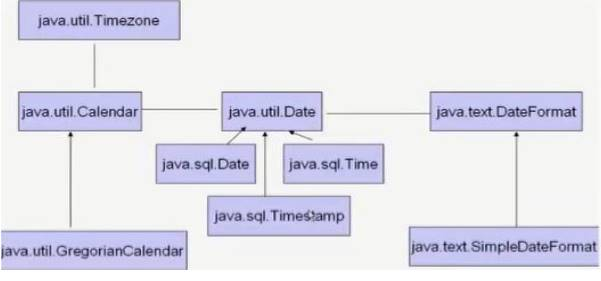
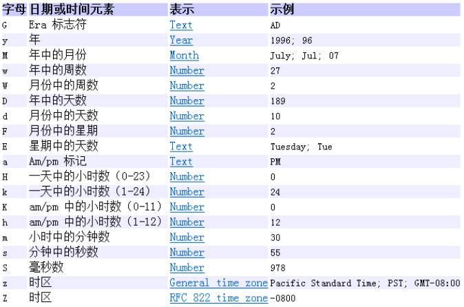
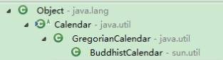
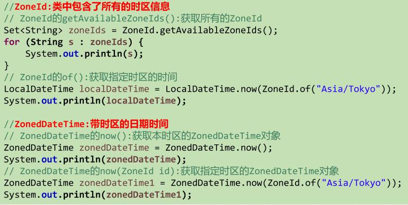
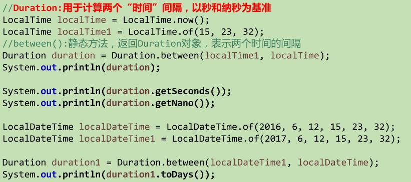
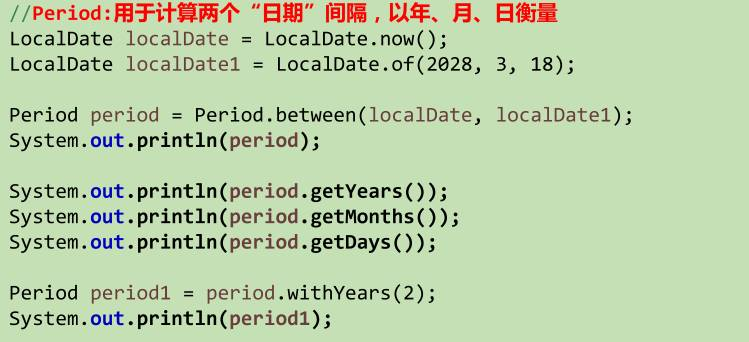
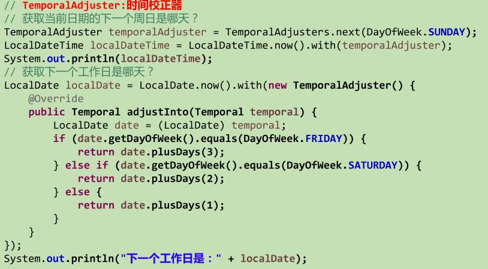
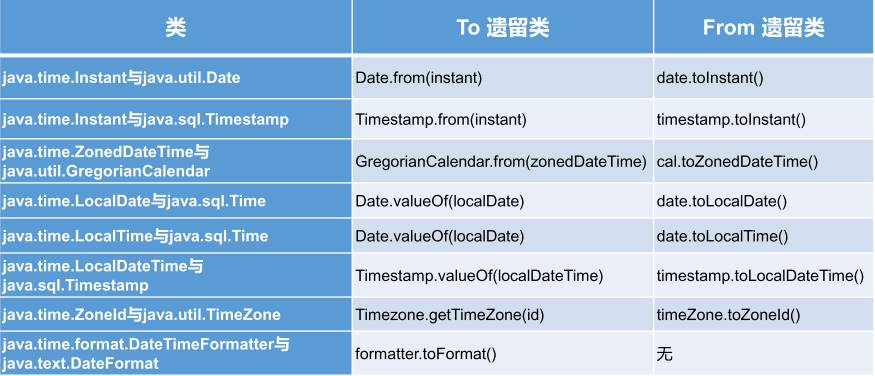

## JDK8 之前



### java.lang.System类

System类提供的public static long currentTimeMillis()用来返回当前时 间与1970年1月1日0时0分0秒之间以毫秒为单位的时间差。此方法常用于计算时间差。

计算世界时间的主要标准有：

* UTC(Coordinated Universal Time)
* GMT(Greenwich Mean Time)
* CST(Central Standard Time)

### java.util.Date

构造器：

* Date()：无参构造器创建当前本地时间的对象，精确到毫秒
* Date(long millisec): 创建指定毫秒时间的对象:`new Date(System.currentTimeMillis());`

常用方法：

* getTime()：返回自 1970 年1月1日00:00:00 GMT 以来此 Date 对象表示的毫秒数
* toString(): 按时间格式输出字符串，如：`Wed Feb 05 18:35:01 CST 2020`

### java.sql.Date：sql专用的Date类

创建：java.sql.Date sqlDate = new java.sql.Date(long millisec);

也有getTime()和toString()方法。

java.sql.Date转换为java.util.Date：通过getTime()作为桥梁。

### java.text.SimpleDateFormat

Date类的API不易于国际化，大部分被废弃了，java.text.SimpleDateFormat类对象可以用于根据具体语言环境来**格式化和解析Date类对象** 。

构造器：

* SimpleDateFormat()：默认的模式和语言环境创建对象
* SimpleDateFormat(String pattern)：用参数pattern指定的格式创建一个对象

> 最常用：`"yyyy-MM-dd hh:mm:ss"`
>



常用方法：

* 格式化：日期→字符串
    public String format(Date date)：根据本地语言环境格式化时间对象date，返回格式化后的字符串
* 解析： 字符串→日期
    public Date parse(String source)：解析给定字符串，返回一个Date对象。

> 会抛出异常，以免传入的字符串不符合pattern格式。
>

### java.util.Calendar日历类：抽象类



实例化：创建**当前日期** 的日历对象

* 方式一：创建子类GregorianCalendar的对象：Calendar ca = new GregorianCalendar();
* 方式二：调用其静态方法getInstance()：Calendar ca = Calendar.getInstance();

> 实际上返回的也是一个GregorianCalendar对象
>

常用方法：

| public  int get(Calendar.xxx)          | 获取一些时间信息，如YEAR/MONTH/ DAY_OF_WEEK/  HOUR_OF_DAY/ MINUTE/ SECOND等，这些都是Calendar类的静态常量。 |
| -------------------------------------- | ----------------------------------------------------------------------------------------------------------- |
| public void set(int  field,int value)  | 修改Calendar对象的属性，改动作用到本身，如ca.set(Calendar.MONTH, 11)                                        |
| -                                      | -                                                                                                           |
| public void add(int  field,int amount) | 对Calendar对象的属性进行增减，改动作用到本身                                                                |
| public final Date getTime()            | 返回当前Calendar对象对应的Date对象                                                                          |
| public final void  setTime(Date date)  | 用Date对象改动Calendar对象                                                                                  |

注意：

* 获取月份时：一月是0，二月是1，以此类推，12月是11
* 获取星期时：周日是1，周二是2 ，。。。。周六是7

## JDK8新日期时间API

Calendar和Date面临一些问题：

* 可变性：像日期和时间这样的类应该是不可变的。
* 偏移性：Date中的年份是从1900开始偏移的，而月份都从0开始偏移。

> 我们想`Date d = new Date(2020,5,21);`表示2020年5月21日，实际却是3920年6月21日。
>

* 格式化：格式化只对Date有用，Calendar则不行。
* 都不是线程安全的；
* 不能处理闰秒。

Java8引入了新的API弥补了之前的日期时间API存在的缺陷。

* **java.time – 包含值对象的基础包**
* java.time.chrono     – 提供对不同的日历系统的访问
* **java.time.format – 格式化和解析时间和日期**
* java.time.temporal     – 包括底层框架和扩展特性
* java.time.zone     – 包含时区支持的类

> 注：大多数开发者只会用到基础包和format包，也可能会用到temporal包，其他一般不常用。
>
> Date类新增了toInstant()方法，将Date对象转换为新的表现形式。
>

### LocalDate、LocalTime、LocalDateTime

LocalDate、LocalTime、LocalDateTime 类是其中较重要的几个类，**它们的实例是不可变的对象** ，分别表示使用 **ISO-8601日历系统【公历】** 的日期、时间、日期和时间。 它们提供了简单的本地日期或时间，并不包含当前的时间信息，也不包含与时区相关的信息。

* LocalDate代表ISO格式（yyyy-MM-dd）的日期,可以存储生日、纪念日等日期。
* LocalTime表示一个时间，而不是日期。
* **LocalDateTime是用来表示日期和时间的，这是一个最常用的类之一。**

三个类的常用方法：

| **now()/now(ZoneID zone)**                                      | 静态方法，根据当前时间创建对象/指定时区的对象                 |
| --------------------------------------------------------------- | ------------------------------------------------------------- |
| **of()**                                                        | 静态方法，根据指定日期/时间创建对象                           |
| -                                                               | -                                                             |
| getDayOfMonth()  getDayOfYear()                                 | 获取月份天数(1-31)/获取年份天数(1-366)                        |
| getDayOfWeek()                                                  | 返回星期几【DayOfWeek枚举类：英文整个单词大写】               |
| getMonth()  getMonthValue()                                     | 返回月份【Month枚举类：英文整个单词大写】  返回月份数字(1-12) |
| getYear()                                                       | 返回年份                                                      |
| getHour()  getMinute()  getSecond()                             |                                                               |
| withDayOfMonth()  withDayOfYear()  withMonth()  withYear()      | 修改相应属性，并返回新的对象【体现不可变性】                  |
| plusDays()  plusWeeks()  plusMonths()  plusYears()  plusHours() | 将对象相应属性进行增加，返回新的对象                          |
| minus…()                                                       | 将对象相应属性进行减少，返回新的对象                          |

### java.time.Instant类：

瞬时：表示自1970年1月1日0时0分0秒（UTC）开始的秒数。Instant类的精确度达到**纳秒级** 。

常用方法：

```
//now():静态方法，返回默认UTC时区的Instant类的对象[默认为伦敦时间]
Instant instant1 = Instant.now();  //伦敦时间[本初子午线]
//ofEpochMilli(long epochMilli):静态方法，返回在1970-01-01 00:00:00基础上加上指定毫秒数之后的Instant类的对象
Instant instant2 = Instant.ofEpochMilli(System.currentTimeMillis());
//atOffset(ZoneOffset offset):结合时区的偏移来创建一个OffsetDateTime
Instant instant3 = Instant.atOffset(ZoneOffset.offset(8)) //北京时间[东八区]
//toEpochMilli():返回1970-01-01  00:00:00到当前时间的毫秒数，即为时间戳 等价于System.currentTimeMillis()
```

### java.time.format.DateTimeFormatter

类似于SimpleDateFormat用于格式化和解析日期时间

实例化：

* 方式一：预定义的标准格式：

ISO_LOCAL_DATE_TIME/ ISO_LOCAL_DATE/ ISO_LOCAL_TIME，如：

DateTimeFormatter formatter = DateTimeFormatter.ISO_LOCAL_DATE_TIME;

* 方式二：本地化相关的格式：

DateTimeFormatter f1 = DateTimeFormatter.ofLocalizedDateTime(FormatStyle.xxx)

DateTimeFormatter f1 = DateTimeFormatter.ofLocalizedDate(FormatStyle.xxx)

DateTimeFormatter f1 = DateTimeFormatter.ofLocalizedTime(FormatStyle.xxx)

【FormatStyle.LONG/MEDIAN/SHORT适用于LocalTime】

【FormatStyle.FULL/LONG/MEDIAN/SHORT适用于LocalDate和LocalDateTime】

* **方式三：自定义格式：ofPattern("yyyy-MM-dd hh:mm:ss")**

DateTimeFormatter f2 = DateTimeFormatter.ofPattern("yyyy-MM-dd hh:mm:ss")

常用方法：

* public static void ofPattern(String pattern)静态方法，返回DateTimeFormatter实例化对象。
* format(TemporalAccessor t)格式化：日期 --> 字符串

LocalDateTime localDT = LocalDateTime.now();

String str1 = formatter.format(localDT);

* parse(CharSequence     text)解析：字符串 --> 日期

TemporalAccessor parseDT = formatter.parse("2019-02-18T15:42:18.797");

【TemporalAccessor是LocalTime/LocalDate/LocalDateTime的父类的父类】

### 其他API

* ZoneId：该类中包含了所有的时区信息，一个时区的ID，如     Europe/Paris
* ZonedDateTime：一个在ISO-8601日历系统时区的日期时间，如     2007-1203T10:15:30+01:00 Europe/Paris。
* ​
* 其中每个时区都对应着ID，地区ID都为“{区域}/{城市}”的格式，例如：Asia/Shanghai等
* Clock：使用时区提供对当前即时、日期和时间的访问的时钟。
* 持续时间：Duration，用于计算两个“时间”间隔
* 日期间隔：Period，用于计算两个“日期”间隔
* TemporalAdjuster : 时间校正器。有时我们可能需要获取例如：将日期调整 到“下一个工作日”等操作。
* TemporalAdjusters : 该类通过静态方法 (firstDayOfXxx()/lastDayOfXxx()/nextXxx())提供了大量的常用     TemporalAdjuster 的实现。









### JDK8新日期时间API与传统日期时间API的转换

