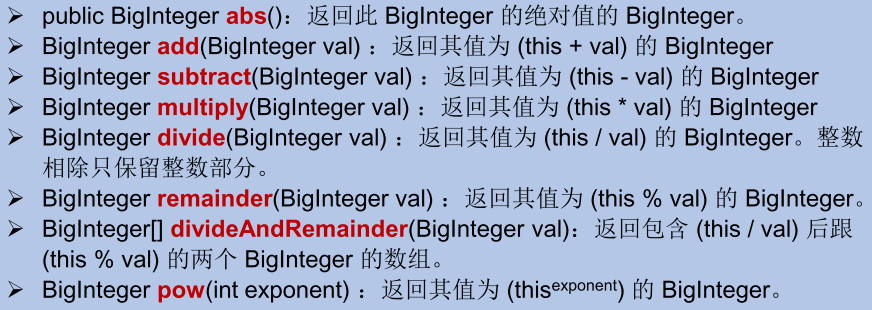

## Java.lang.Math

java.lang.Math提供了一系列静态方法用于科学计算。其方法的参数和返回值类型一般为`double`。

| 静态方法                               | 说明                     |
| -------------------------------------- | ------------------------ |
| abs()                                  | 绝对值                   |
| acos()/asin()/atan()/cos()/sin()/tan() | 三角函数                 |
| sqrt()                                 | 平方根                   |
| pow(double a, double b)                | a的b次方                 |
| log()                                  | 自然对数                 |
| exp()                                  | e为底的指数              |
| max(double a, double b)/min(xx, xx)    | 比较大小                 |
| random()                               | 返回0.0~1.0的随机数      |
| long round(double a)                   | 四舍五入，注意转换为long |
| toDegrees(double radian)               | 弧度→角度               |
| toRadians(double degree)               | 角度→弧度               |

## java.math.BigInteger

Integer类最大存储的整型值为2^31 - 1，Long类最大存储的整型值为2^61 - 1。如果要表示更大的数，就需要借助java.math.BigInteger了。

> java.math.BigInteger可以表示不可变的任意精度的整数。并提供了整数的所有基本操作和等同于java.lang.Math的所有方法。
>
> 此外，BigInteger还提供以下运算：模运算、GCD计算、质数测试、素数生成、位操作等。
>

### 构造器

BigInteger(String val)：根据字符串构建BigInteger对象

### 常用方法



## java.math.BigDecimal

Float类和Double类已经能够胜任一般的科学计算或工程计算，但在商业计算等要求数字精度比较高的情况下，可能需要用到java.math.BigDecimal类。

> java.math.BigDecimal类支持`不可变`的、`任意精度`的`有符号`十进制定点数。
>

### 构造器

public BigDecimal(double val)

public BigDecimal(String val)

### 常用方法

public BigDecimal add(BigDecimal augend)

public BigDecimal subtract(BigDecimal subtrahend)

public BigDecimal multiply(BigDecimal multiplicand)

public BigDecimal divide(BigDecimal divisor, int scale, int roundingMode)

**示例**

```java
@Test
    public void testBigInteger() {
        BigInteger bi = new BigInteger("12433241123");
        BigDecimal bd = new BigDecimal("12435.351");
        BigDecimal bd2 = new BigDecimal("11");
        System.out.println(bi); // System.out.println(bd.divide(bd2)); 
        System.out.println(bd.divide(bd2, BigDecimal.ROUND_HALF_UP));
        System.out.println(bd.divide(bd2, 15, BigDecimal.ROUND_HALF_UP));
    }
```