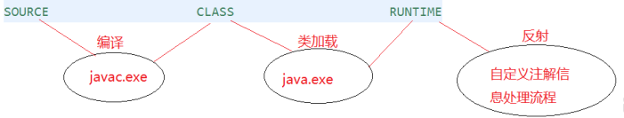
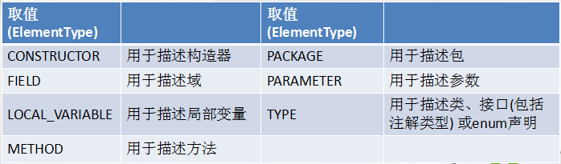
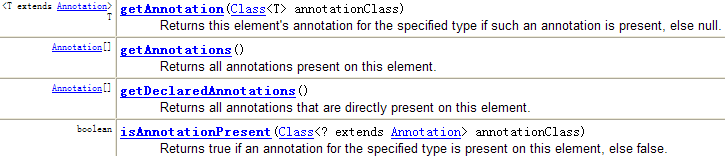
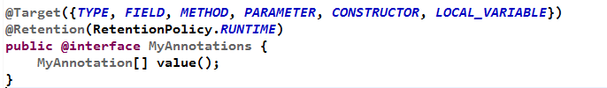
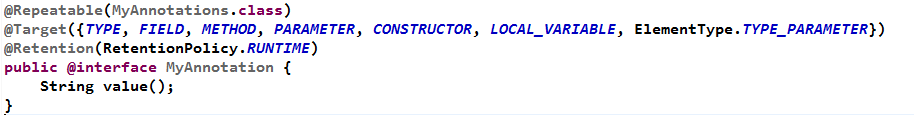
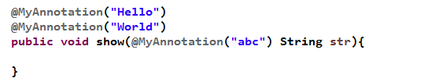

### 对注解的理解

JDK5.0添加了对元数据(MetaData)的支持，即Annotation(注解)

注解其实就是代码中的`特殊标记`，这些标记可以在编译、类加载、运行时被读取，并执行相应的处理。**通过注解，程序员可以在不改变原有逻辑的情况下，在源文件中嵌入一些补充信息。代码分析工具、开发工具和部署工具可以通过这些补充信息进行验证或部署。**

注解可以像修饰符一样被使用，可用于修饰包、类、构造器、方法、属性、参数、局部变量的声明等。这些信息被保存在Annotation的"name = value"对中。

JavaSE中，注解一般只是用来标记过时功能和忽略警告等。但在JavaEE/Android开发中，注解扮演了更重要的角色：配置应用程序的任何切面，代替JavaEE旧版中所遗留的繁冗代码和XML配置等。

未来的开发模式都是基于注解的，JPA、Spring、Struts2(部分)都是基于注解的。注解是一种趋势，一定程度上，可以认为：`框架 = 注解 + 反射 + 设计模式`。

### 注解的使用

在注解名前添加@即表示一个注解：`@Annotation`。注解可以视作一个修饰符，用于修饰它支持的程序元素。

#### 示例一：生成文档相关的注解

| 注解       | 说明                                                     |
| ---------- | -------------------------------------------------------- |
| @author    | 标明开发该类模块的作者，多个作者之间使用,分割            |
| @version   | 标明该类模块的版本                                       |
| @since     | 从哪个版本开始增加的                                     |
| @see       | 参考转向，也就是相关主题                                 |
| @param     | 对方法中参数的说明，无参数则不用写出                     |
| @return    | 对返回值的说明，无返回值则不用写出                       |
| @exception | 对方法中可能抛出的异常进行说明，没有throws语句则不用写出 |

> @param @return 和 @exception 这三个标记都是只用于方法的。
> @param的格式要求：`@param 形参名 形参类型 形参说明`
> @return 的格式要求：`@return 返回值类型 返回值说明`
> @exception的格式要求：`@exception 异常类型 异常说明`
> @param和@exception可以并列多个
>

示例：

```java
package com.annotation.javadoc;
/**
 * @author shkstart
 * @version 1.0
 * @see Math.java
 */
public class JavadocTest {
    /**
     * 程序的主方法，程序的入口
     * @param args String[] 用于接收命令行参数
     */
    public static void main(String[] args) {
    }
    /**
     * 求圆面积的方法
     * @param radius double 半径值
     * @return double 圆的面积
     */
    public static double getArea(double radius){
        return Math.PI * radius * radius;
    }
}
```

#### 示例二：在编译时进行格式检查

| 注解              | 表格                                                     |
| ----------------- | -------------------------------------------------------- |
| @Override         | 限定所修饰的方法是对父类的重写                           |
| @Deprecated       | 表示所修饰的元素(类、方法)已过时【不安全或有更好的选择】 |
| @SuppressWarnings | 抑制编译器警告                                           |

示例：

```java
package com.annotation.javadoc;
public class AnnotationTest{
    public static void main(String[] args) {
        @SuppressWarnings("unused")
        int a = 10;
    }
    @Deprecated
    public void print(){
        System.out.println("过时的方法");
    }
    @Override
    public String toString() {
        return "重写的toString方法()";
    }
}
```

#### 示例三：跟踪代码依赖性，实现替代配置文件功能

如：Servlet3.0提供了注解，使得不再需要在web.xml文件中进行Servlet的部署。

```java
@WebServlet("/login")
public class LoginServlet extends HttpServlet {
    private static final long serialVersionUID = 1L;
    protected void doGet(HttpServletRequest request, HttpServletResponse response) throws ServletException, IOException {
    }
    protected void doPost(HttpServletRequest request, HttpServletResponse response) throws ServletException, IOException {
        doGet(request, response);
    }
}
```

`@WebServlet("/login")`代替了

```html
<servlet>
    <servlet-name>LoginServlet</servlet-name>
    <servlet-class>com.servlet.LoginServlet</servlet-class>
</servlet>
<servlet-mapping>
    <servlet-name>LoginServlet</servlet-name>
    <url-pattern>/login</url-pattern>
</servlet-mapping>
```

### 自定义注解

注解使用@interface关键字定义，自定义的注解会自动继承java.lang.annotation.Annotation接口。

在注解中定义成员变量：`成员数据类型 成员名();`如

```java
@interface MyAnnotation{
	String value() default "hello";
}
```

> 成员名一般用value。
> 类型只能是基本数据类型、String、Class、enum、Annotation或以上类型的数组。
> 可以为成员指定默认值，使用default定义：String value() default "hello";
> 如果注解体中没有成员，一般称为`标记`，标记只起一个标识作用。
> 如果注解有成员，一般称为`元数据注解`，在使用有成员的注解时，必须为其赋值(有默认值除外)
> 自定义注解必须配上注解的信息处理流程(反射)才有意义。
>

示例：

```java
@MyAnnotation(value="bye")
public class MyAnnotationTest {
    public static void main(String[] args) {
        Class clazz = MyAnnotationTest.class;
        Annotation a = clazz.getAnnotation(MyAnnotation.class);
        MyAnnotation m = (MyAnnotation) a;
        String info = m.value();
        System.out.println(info);
    }

}
@Retention(RetentionPolicy.RUNTIME)
@Target(ElementType.TYPE)
@interface MyAnnotation{
    String value() default "hello";
}
```

### 元注解(meta-annotation)

用于修饰其他注解的注解称为元注解。

JDK5.0提供了4个标准的元注解：
@Retention
@Target
@Documented
@Inherited

#### @Retention

@Retention只能用于修饰一个注解定义，用于指定该注解的生命周期(RetentionPolicy)。

@Retention包含一个RetentionPolicy类型的成员变量，使用@Retention时必须为其value成员变量指定值。

- RetentionPolicy.SOURCE: 在源文件中有效(即源文件保留)，这种策略的注解在编译器会被丢弃
- RetentionPolicy.CLASS: 在class文件中有效(即class保留)，默认策略，这种策略的注解在Java程序运行时会被丢弃
- RetentionPolicy.RUNTIME: 在运行时有效(运行时保留)，这种策略的注解在Java程序运行时仍会保留

> 只有声明为RUNTIME生命周期的注解，才能通过反射获取。
>



#### @Target

用于修饰注解定义，用于指定被修饰的注解能用于修饰哪些程序元素，@Target也包含一个名为value的成员变量。



#### @Documented

修饰的注解类将被javadoc工具提取成文档。【默认情况下，javadoc中不包括注解。】

> 定义为Documented的注解必须设置Retention值为RUNTIME。
>

#### @Inherited

被它修饰的注解将具有继承性。如果某个类使用了被@Inherited修饰的注解, 则其子类将自动具有该注解。

> 实际应用中，使用较少
>

### 利用反射获取注解信息

JDK 5.0 在 java.lang.reflect 包下新增了 AnnotatedElement 接口, 该接口代表程序中可以接受注解的程序元素

当一个 Annotation 类型被定义为运行时注解后, 该注解才是运行时可见, 当 class 文件被载入时保存在 class 文件中的注解才会被虚拟机读取

程序可以调用 AnnotatedElement对象的如下方法来访问 Annotation 信息



### JDK8中的注解新特性

Java 8对注解处理提供了两点改进：可重复的注解及可用于类型的注解。此外，反射也得到了加强，在Java8中能够得到方法参数的名称。这会简化标注在方法参数上的注解。

#### 可重复注解

示例：







#### 类型注解

JDK1.8之后，关于元注解@Target的参数类型ElementType枚举值多了两个：TYPE_PARAMETER, TYPE_USE。

在Java 8之前，注解只能是在声明的地方所使用，Java8开始，注解可以应用在任何地方。

ElementType.TYPE_PARAMETER 表示该注解能写在类型变量的声明语句中（如：泛型声明）。

ElementType.TYPE_USE 表示该注解能写在使用类型的任何语句中。

```JAVA
public class TestTypeDefine<@TypeDefine() U> {
    private U u;
    public <@TypeDefine() T> void test(T t){
    }
}
@Target({ElementType.TYPE_PARAMETER})
@interface TypeDefine{
}
```

```java
import java.lang.annotation.ElementType;
import java.lang.annotation.Target;

@MyAnnotation
public class AnnotationTest<U> {
    @MyAnnotation
    private String name;
    public static void main(String[] args) {
        AnnotationTest<@MyAnnotation String> t = null;
        int a = (@MyAnnotation int) 2L;
        @MyAnnotation
        int b = 10;
    }
    public static <@MyAnnotation T> void method(T t) {
    }
    public static void test(@MyAnnotation String arg) throws @MyAnnotation Exception {
    }
}

@Target(ElementType.TYPE_USE)
@interface MyAnnotation {
}
```