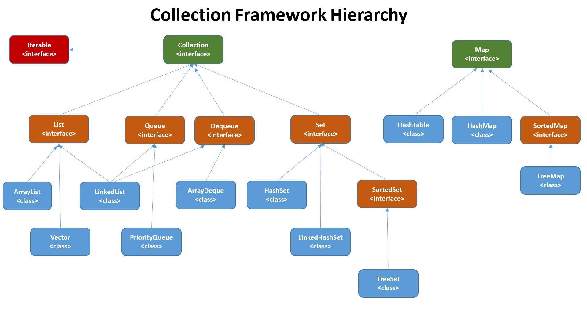
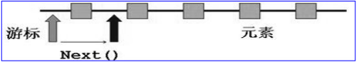
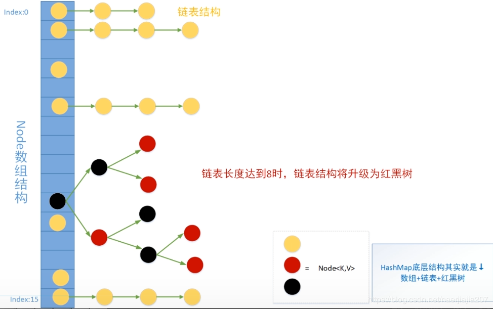
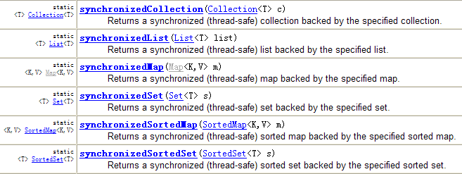

## Collection接口

Collection接口是List、Set和Queue接口的父接口，其中定义的方法对三个子类都适用。

在JDK5之前，集合会丢失容器中所有对象的数据类型，把所有对象都当成 Object 类型处理；从 JDK 5.0 增加了泛型以后，集合可以记住容器中对象的数据类型。

### Collection接口中的常用方法

| 方法                              | 说明                                                  |
| --------------------------------- | ----------------------------------------------------- |
| add(Object obj)                   | 向集合中添加元素                                      |
| addAll(Collection c)              | 将集合c中所有元素加入本集合                           |
| int size()                        | 返回集合中实际元素个数                                |
| void clear()                      | 清空集合                                              |
| boolean isEmpty()                 | 判断集合是否为空                                      |
| boolean contains(Object obj)      | 判断本集合是否包含某元素                              |
| boolean containsAll(Collection c) | 判断本集合是否包含所有集合c中的元素                   |
| boolean remove(Object obj)        | 该元素存在则删之，并返回true，否则返回false           |
| boolean removeAll(Collection c)   | 删除交集元素，交集为空返回false，否则返回true         |
| boolean retainAll(Collection c)   | 只保留交集元素，两集合元素相同返回false，否则返回true |
| boolean equals(Object obj)        | 判断两集合是否相等                                    |
| Object[] toArray()                | 返回包含所有元素的数组                                |
| hashCode()                        | 返回集合对象的哈希值                                  |
| iterator()                        | 返回迭代器对象，用于遍历集合                          |

> contains()、containsAll()、remove()、removeAll()等方法都是通过元素所属类的equal()实现的，**被加入集合中的任何元素，其所属类都必须重写equals()和hashCode()方法，用于判断值相等**
>

### Iterator接口

Iterator对象称为迭代器【设计模式的一种】，继承或实现了该接口的类，其对象组成的容器可以被迭代。

Collection接口继承了`java.lang.Iterable`接口，Iterable接口含有一个iterator()方法，一个集合每次调用iterator()方法都会返回一个用于遍历该集合的Iterator对象。

Iterator主要是用来遍历集合用的，它的特点是更加安全，因为它可以确保，在当前遍历的集合元素被更改的时候，就会抛出`ConcurrentModificationException` 异常。

#### Iterator接口的方法

| 方法              | 说明                             |
| ----------------- | -------------------------------- |
| boolean hasNext() | 若游标后还有元素，则返回true     |
| E next()          | 返回下一个元素                   |
| void remove()     | 将上一个被遍历的元素从原集合删除 |

> 若所有元素已遍历完，再调用it.next()会抛出NoSuchElementException异常，因此在调用it.next()方法之前必须要调用it.hasNext()进行检测。
>

> 若调用remove()方法之前从未调用过next()方法，或调用了next()之后，连续调用了两次 remove()， 会报错：IllegalStateException。
>

迭代器常用语句：

```java
Iterator iter = coll.iterator();
while(iter.hasNext()){
    System.out.println(iter.next());
}
```



### foreach

JDK5.0提供了foreach，用于循环访问Collection和数组而无须知晓其长度和索引。

> 底层仍是通过Iterator接口实现。
>

示例：

```java
for(Person p : persons){//persons是一个Collection
    System.out.println(p.getName());
}
```

## List接口

List弥补了数组长度不可变的局限性。其元素有序、可重复。

常见实现类有：ArrayList、LinkedList和Vector.

- ArrayList：底层使用`Object[]数组`存储，线程不安全，适合频繁查询场景
- LinkedList：底层使用`双向链表`存储，线程不安全，适合需要频繁插入、删除元素的场景
- Vector：古老实现类，底层使用`数组`存储，线程安全，效率低

List接口除了从Collection接口继承的方法外，还有以下常用方法：

| 方法                                     | 说明                              |
| ---------------------------------------- | --------------------------------- |
| void add(int index, Object elem)         | 在index处插入元素elem             |
| boolean addAll(int index, Collection c)  | 在index处插入集合c中的所有元素    |
| Object get(int index)                    | 获取index处的元素                 |
| int indexOf(Object obj)                  | 返回obj在列表中首次出现的索引     |
| int lastIndexOf(Object obj)              | 返回obj在列表中最后一次出现的索引 |
| Object remove(int index)                 | 根据index移除元素，并返回该元素   |
| Object set(int index, Object elem)       | 设置index处的元素为elem           |
| List subList(int fromIndex, int toIndex) | 返回[fromIndex,toIndex)的子列表   |

> 总结：List常用的方法：增删改查插、长度(size)、遍历(Iterator、foreach、for i)
>

**坑**：List有两个remove()，remove(int index)和remove(Object o)，当参数是int型时，一定是调用的remove(int index)。如：

```java
List list = new ArrayList(); 
list.add(1); 
list.add(2); 
list.add(3);
list.remove(2);
System.out.println(list);//[1,2]
```

> 要想删除值为2的元素，使用`list.remove(new Integer(2));`
>

### ArrayList

创建：

- JDK1.7：ArrayList类似于饿汉式，实例化时直接创建一个初始容量为10的数组。
- JDK1.8：ArrayList类似于懒汉式，实例化时创建一个长度为0的数组，当添加第一个元素时，才创建一个初始容量为10的数组。

扩容：添加元素时如果没有剩余空间，则扩容为原容量的1.5倍，将原数组中的数据复制到新数组中。

> 实际开发中建议使用带参构造器：`ArrayList arr = new ArrayList(50);`来减少扩容导致的开销。
>

其他：Arrays.asList()方法返回一个固定长度的List对象，这个集合一个是ArrayList对象。

```java
public static <T> List<T> asList(T... a) {
        return new ArrayList<>(a);
    }
```

### LinkedList

底层由**双向链表**实现。内部类Node。

```java
private static class Node<E> {
    E item;
    Node<E> next;
    Node<E> prev;

    Node(Node<E> prev, E element, Node<E> next) {
        this.item = element;
        this.next = next;
        this.prev = prev;
    }
}
```

新增方法：

```
void addFirst(Object obj)
void addLast(Object obj)
Object getFirst()
Object getLast()
Object removeFirst()
Object removeLast()
```

### Vector

Vector始于JDK1.0，内部也是Object[]数组，可以看作线程安全的ArrayList，通过synchronized保证线程安全。

> 除了现在已经有了线程安全的ArrayList: Collections.synchronizedList与CopyOnWriteArrayList。
>

新增方法：

```
void addElement(Object obj)
void insertElementAt(Object obj, int index)
void setElementAt(Object obj, int index)
void removeElement(Object obj)
void removeAllElements()
```

#### 面试题

请问ArrayList/LinkedList/Vector的异同？ArrayList底层是什么？扩容机制？Vector和ArrayList的最大区别?
ArrayList和LinkedList的异同：

- 二者都线程不安全，相对线程安全的Vector，执行效率高。
- ArrayList是实现了基于动态数组的数据结构，LinkedList基于链表的数据结构。对于随机访问get和set，ArrayList绝对优于LinkedList，因为LinkedList要移动指针。对于插入和删除操作，LinkedList比较占优势，因为ArrayList要移动数据。

ArrayList和Vector的区别：

- Vector和ArrayList的最大区别在于Vector是线程安全的，因此开销比ArrayList要大，效率较低。正常情况下,大多数的Java程序员使用 ArrayList而不是Vector，因为同步完全可以由程序员自己来控制。Vector每次扩容请求其大小的2倍空间，而ArrayList是1.5倍。Vector还有一个子类Stack。

## Set接口

Set集合中的元素无序不重复。无序性：元素的遍历顺序与添加顺序无关。

Set接口有三个主要实现类：

- HashSet
- LinkedHashSet
- TreeSet

线程安全的Set：CopyOnWriteArraySet

### HashSet

HashSet底层是HashMap。

HashSet的主要特点：

- 元素排列顺序与加入顺序不同
- 线程不安全
- 集合元素可以是null

HashSet集合中的两个元素是否相等的判断标准：首先判断hashCode()值是否相同，然后判断equals()返回值是否为true。当且仅当hashCode()相同，且equals()方法返回true时，两元素相等。

### LinkedHashSet

LinkedHashSet是HashSet的子类，底层仍然是HashMap，但**同时使用双向链表维护了元素的添加顺序**，使得元素的遍历顺序与添加顺序一致。

### TreeSet【供了解】

TreeSet是SortedSet接口的实现类，底层使用**红黑树**存储数据，可以确保集合元素处于排序状态。

新增的方法：

```
Comparator comparator()
Object first() 
Object last()
Object lower(Object e)
Object higher(Object e)
SortedSet subSet(fromElement, toElement) 
SortedSet headSet(toElement)
SortedSet tailSet(fromElement)
```

TreeSet允许两种排序方式：自然排序【默认】和定制排序。

## Map接口

Map用于保存键值对。key和value可以是**任何引用类型**【'x': 1会自动装箱为Character和Integer】。

Map接口的常用实现类有：

- HashMap: 主要实现类，线程不安全；**允许存储null的key和value**
  -   - LinkedHashMap: HashMap的子类，在原HashMap底层结构的基础上为每个元素添加了两个指针，实现了按添加顺序遍历，常用于需要**频繁遍历**的场景，可用于实现LRU
- TreeMap: 底层使用**红黑树**，元素按key值有序排列
- HashTable：Map的古老实现类，线程安全，但效率低；**不允许存储null的key和value**
  -   - Properties：常用来处理配置文件，要求key和value都是String类型。

### Map接口的常用方法

增删改：

| 方法                                 | 说明                           |
| ------------------------------------ | ------------------------------ |
| Object put(Object key, Object value) | 添加键值对                     |
| void putAll(Map m)                   | 批量添加键值对                 |
| Object remove(Object key)            | 根据key移除键值对，并返回value |
| void clear()                         | 清空map【但不是null】          |

查询：

| 方法                                | 说明                   |
| ----------------------------------- | ---------------------- |
| Object get(Object key)              | 返回指定key对应的value |
| boolean containsKey(Object key)     | 判断是否包含key        |
| boolean containsValue(Object value) | 判断是否包含value      |
| int size()                          | 返回当前键值对的个数   |
| boolean isEmpty()                   | 判空                   |
| boolean equals(Object obj)          | 判断两个对象是否相等   |

元视图操作：

| 方法                | 说明                              |
| ------------------- | --------------------------------- |
| Set keySet()        | 返回所有key构成的Set集合          |
| Collection values() | 返回所有value构成的Collection集合 |
| Set entrySet()      | 返回所有key-value构成的Set集合    |

### HashMap

key：不重复，使用Set存储：**key所在的类若是自定义类要重写equals()和hashCode()**

value：可重复，使用Collection存储：**value所在类若是自定义类要重写equals()**

一个键值对构成了一个Entry对象：无序不重复，使用Set存储

> Entry是HashMap的内部类，有getKey()和getValue()等方法。
>

几个核心成员变量：

```java
static final int DEFAULT_INITIAL_CAPACITY = 1 << 4; //初始容量16
static final float DEFAULT_LOAD_FACTOR = 0.75f;  //加载因子0.75
//扩容为之前2倍
static final int TREEIFY_THRESHOLD = 8;  //树化阈值：8
//树化：链表长度超过8且桶长超过64  树转链：树长度小于6
transient Node<K,V>[] table;  //哈希表
```

#### JDK8中HashMap相对于JDK7的优化：

- 创建数组的时机不同。jdk7是饿汉式，在实例化HashMap时立即创建一个长度为16的数组(桶表)，jdk8是懒汉式，在实例化HashMap时不会立即创建数组，而是在第一次添加键值对时才创建一个长度为16的数组。
- 在桶中添加元素的方式不同。JDK7使用**头插法**，JDK8使用**尾插法**。
- 底层数据结构不同。jdk7为：数组+链表；jdk8为：数组+链表+红黑树。

这三点区别是JDK8对于JDK7的优化：懒汉式只有在真正用到时才创建数组，节省了空间，红黑树的加入避免了哈希冲突严重时形成的超长链，加快了查询效率。

JDK8 HashMap底层结构图：



几个重要操作：

```markdown
**put(添加)**:
1. 首先计算key的hash值，然后调用putVal方法
2. 是否首次添加元素，首次则创建一个长度为16的Node数组。
3. 不是首次，则根据hash值和数组长度找到得到应该插入的位置：(n-1)&hash
    若该位置上为空，则直接插入；
    若不为空，先判断头结点的key与插入key相同，是则直接覆盖，否则判断节点类型是链表还是红黑树：
	若为红黑树则通过putTreeVal()将新节点放入树中；
	若为链表，则与链表上的每个结点依次比较，先比较hash值，hash值相同再调用equals方法，若为true，说明key相等，则用新value替换旧value，比较到链尾也没有发现重复key，则在链表尾部添加该键值对。添加完成还需要判断是否需要树化。
4. 添加完成后判断是否需要扩容。

**树化(treeify)**：若Node链的长度达到了8，但数组长度小于64，会先resize()扩容，当数组长度大于等于64时，会将该链表转化为红黑树。下次resize时，若某个红黑树的结点个数低于6个，又会把树再转为链表。

**扩容(resize)**：当非空桶数达到数组大小的四分之三时，扩容为原来的两倍，并重新计算每个元素在数组中的存储位置。
```

### 其他Map实现类

#### TreeMap

TreeMap底层使用**红黑树**存储，所有key必须属于同一个类，key的排序方式：

- 自然排序： key 所属类实现了 Comparable 接口，否则会抛出 `ClassCastException`
- 定制排序：创建 TreeMap 时，在构造器中传入一个 Comparator 对象，用于对TreeMap 中的所有 key 进行排序。

TreeMap判断两个key相等的标准：两个key通过compareTo()或compare()方法返回0。

#### Hashtable

- Hashtable是个古老的 Map 实现类， JDK1.0就提供了。不同于HashMap，Hashtable是线程安全的。

|                | HashMap              | Hashtable              |
| -------------- | -------------------- | ---------------------- |
| 底层数据结构   | 数组+链表+红黑树     | 数组+链表              |
| 初始容量及扩容 | 16，2倍              | 11，2n+1               |
| 线程安全       | 否                   | 是，基于synchronized   |
| 效率           | 较高                 | 较低                   |
| 支持null       | key和value都可为null | 不允许key和value为null |

#### Properties

- Properties 类是 Hashtable 的子类，该对象用于处理属性文件
- 由于属性文件里的 key、 value 都是字符串类型，所以 Properties 里的 key和 value 都是字符串类型
- 存取数据时，建议使用setProperty(String key,String value)方法和
    getProperty(String key)方法

```java
Properties pros = new Properties();
pros.load(new FileInputStream("jdbc.properties"));
String user = pros.getProperty("user");
System.out.println(user);
```

### Collections工具类

类似于操作数组的工具类Arrays，Collections用于操作Set/List/Map等集合的工具类。

Collections提供了一系列静态方法：

排序：

| 方法                   | 说明                                   |
| ---------------------- | -------------------------------------- |
| reverse(List)          | 反转List中的元素                       |
| shuffle(List)          | 打乱List中的元素                       |
| sort(List)             | 根据自然排序对List中的元素进行升序排列 |
| sort(List, Comparator) | 根据指定Comparator的规则对List元素排序 |
| swap(List, int, int )  | 将List中索引为i和j的元素交换           |

查找与替换：

| 方法                                                         | 说明                                                                                   |
| ------------------------------------------------------------ | -------------------------------------------------------------------------------------- |
| Object max(Collection)                                       | 根据自然排序返回给定集合中的最大元素，类似有Object min(Collection)                     |
| Object max(Collection, Comparator)                           | 根据Comparator的规则返回给定集合中的最大元素，类似有Object min(Collection, Comparator) |
| int frequency(Collection， Object)                           | 返回集合中指定元素出现的次数                                                           |
| void copy(List dest,List src)                                | 将src中的内容复制到dest中                                                              |
| boolean replaceAll(List list, Object oldVal， Object newVal) | 使用新值替换List对象中所有旧值                                                         |

同步控制：多个synchronizedXxx()使指定集合包装成线程安全的集合。

