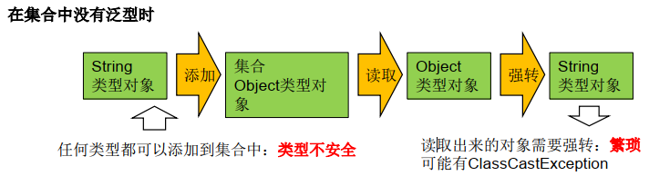
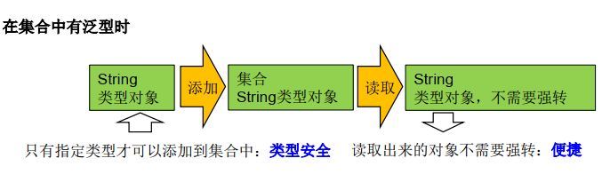

泛型是JDK5新增的特性。

所谓泛型， 就是允许在定义类、 接口时通过一个标识表示类中某个属性的类型或者是某个方法的返回值及参数类型。 这个类型参数将在使用时（例如，继承或实现这个接口， 用这个类型声明变量、 创建对象时） 确定（即传入实际的类型参数， 也称为类型实参） 。

## 在集合中使用泛型

1. 集合接口或集合类在JDK5时都修改为带泛型的结构。
2. 在实例化集合类时，可以指明具体的泛型类型。以限制可以存储的类型。没有指明时，默认类型为java.lang.Object类型。
3. **泛型的数据类型必须是引用类型，基本数据类型在泛型中应使用对应的包装类**。

泛型有效解决了集合类元素存储的安全问题。同时，使得代码更加简洁、健壮。





使用举例：

```java
Map<String, Integer> map = new HashMap<String, Integer>();
map.put("Tom1", 34);
map.put("Tom2", 44);
map.put("Tom3", 33);
map.put("Tom4", 32);
//添加失败
//map.put(33, "Tom");
Set<Entry<String, Integer>> entrySet = map.entrySet();
Iterator<Entry<String, Integer>> iterator = entrySet.iterator();
while (iterator.hasNext()) {
    Entry<String, Integer> entry = iterator.next();
    System.out.println(entry.getKey() + "--->" + entry.getValue());
}
```

## 自定义泛型类/接口

**声明**：`interface List<T> 或 class GenTest<K, V>`

其中T, K, V代表类型，常用大写字母表示。

> 构造器函数后不需要跟<>。如`public void GenTest(){...};`
>

**实例化**：为泛型指定具体的类型。如：

`List<String> strList = new ArrayList<String>();`

`Iterator<Customer> iter = new customers.iterator();`

> 右侧<>内数据类型可以省略。
>

若自定义类泛型，实例化时没有指明其具体类型，则默认为Object类型

建议：自定义的带泛型类，在实例化时应该指明泛型的具体类型。

同一个类，在实例化时传入了泛型不同时，对象之间不能相互赋值。如`ArrayList<String>`对象不能赋值给`ArrayList<Integer>`对象。

**一个类的静态方法中不能有泛型存在。**原因：泛型要再实例化时才指定具体类型，静态方法不用实例化就能使用。

异常类不能是泛型的。如：不能在try-catch中使用泛型：

```java
public void test() {
            try {...} 
    	    catch (MyException<T> ex) {...}
        }
```

### 泛型数组

声明泛型数组：E[] elems;

**实例化泛型数组：不能用`E[] elems = new E[]`，应使用`E[] elems = (E[])new Object[n];`**

### 泛型在继承中的注意事项

A是B的父类或父接口，`G<A>`和`G<B>`不具备继承关系，`A<G>`和`B<G>`有继承关系。如：

```java
public void testGenericAndSubClass() {
        Person[] persons = null;
        Man[] mans = null;
        // 而 Person[] 是 Man[] 的父类.
        persons = mans;
        Person p = mans[0];
        // 在泛型的集合上
        List<Person> personList = null;
        List<Man> manList = null;
        // personList = manList;(报错)
    }
```

泛型的继承：若父类有泛型，子类在继承父类时，可以选择是否保留父类的泛型。

示例：

```java
class Father<T1, T2> {
}
// 子类不保留父类的泛型
// 1)没有类型 擦除
class Son1 extends Father {// 等价于class Son extends Father<Object,Object>{...}
}
// 2)具体类型
class Son2 extends Father<Integer, String> {
}
// 子类保留父类的泛型
// 1)全部保留
class Son3<T1, T2> extends Father<T1, T2> {
}
// 2)部分保留
class Son4<T2> extends Father<Integer, T2> {
}
```

> 子类除了保留父类的泛型，还可以增加自己的泛型。
>

### 泛型方法

泛型方法的泛型，与其所在类是否有泛型无关。

定义格式：`[访问权限] <泛型> 返回类型 方法名([泛型 参数名称]) 抛出的异常`

```java
public class DAO {
    public <E> E get(int id, E e) {
        E result = null;
        return result;
    }
}
```

泛型方法可以声明为静态的，因为在调用该方法时，泛型的具体类型可以确定。

```java
public static <T> void fromArrayToCollection(T[] a, Collection<T> c) {
        for (T o : a) {
            c.add(o);
        }
    }

public static void main(String[] args) {
    Object[] ao = new Object[100];
    Collection<Object> co = new ArrayList<Object>();
    fromArrayToCollection(ao, co);
    String[] sa = new String[20];
    Collection<String> cs = new ArrayList<>();
    fromArrayToCollection(sa, cs);
    Collection<Double> cd = new ArrayList<>();
    // 下面代码中T是Double类，但sa是String类型，编译错误。
    // fromArrayToCollection(sa, cd);
    // 下面代码中T是Object类型， sa是String类型，可以赋值成功。
    fromArrayToCollection(sa, co);
}
```

### 类型通配符

`List<?>`是`List<String>`、`List<Ojbect>`等各种泛型的父类。

读取：对`List<?>`的对象list中的元素进行读取时，永远是安全的，因为它包含了Object类。

写入：List<?>不能向其内部添加数据(null除外)。如：

```java
Collection<?> c = new ArrayList<String>();
c.add(new Object()); // 编译时错误
```

示例：

```java
public static void main(String[] args) {
        List<?> list = null;
        list = new ArrayList<String>();
        list = new ArrayList<Double>();
        // list.add(3);//编译不通过
        list.add(null);
        List<String> l1 = new ArrayList<String>();
        List<Integer> l2 = new ArrayList<Integer>();
        l1.add("尚硅谷");
        l2.add(15);
        read(l1);
        read(l2);
    }

    public static void read(List<?> list) {
        for (Object o : list) {
            System.out.println(o);
        }
    }
```

通配符的常见错误：

```java
//注意点1：编译错误：通配符不能用在泛型方法声明上
public static <?> void test(ArrayList<?> list){
    }
//注意点2：编译错误：通配符不能用在泛型类的声明上
class GenericTypeClass<?>{
    }
//注意点3：编译错误：通配符不能用在创建对象上，右边属于创建集合对象
ArrayList<?> list2 = new ArrayList<?>();
```

有限通配符：

有上限：`<? extends A>` --> ? 可以指代A及其子类

有下限：`<? super A>` --> ? 可以指代A及其父类

示例：

```java
public static void printCollection3(Collection<? extends Person> coll) {
	//Iterator只能用Iterator<?>或Iterator<? extends Person>.why?
    Iterator<?> iterator = coll.iterator();
    while (iterator.hasNext()) {
        System.out.println(iterator.next());
    }
}
public static void printCollection4(Collection<? super Person> coll) {
    //Iterator只能用Iterator<?>或Iterator<? super Person>.why?
    Iterator<?> iterator = coll.iterator();
    while (iterator.hasNext()) {
        System.out.println(iterator.next());
    }
}
```

### 泛型嵌套

```java
public static void main(String[] args) {
    HashMap<String, ArrayList<Citizen>> map = new HashMap<String,ArrayList<Citizen>>();
    ArrayList<Citizen> list = new ArrayList<Citizen>();
    list.add(new Citizen("刘恺威"));
    list.add(new Citizen("杨幂"));
    list.add(new Citizen("小糯米"));
    map.put("刘恺威", list);
    Set<Entry<String, ArrayList<Citizen>>> entrySet = map.entrySet();
    Iterator<Entry<String, ArrayList<Citizen>>> iterator = entrySet.iterator();
    while (iterator.hasNext()) {
        Entry<String, ArrayList<Citizen>> entry = iterator.next();
        String key = entry.getKey();
        ArrayList<Citizen> value = entry.getValue();
        System.out.println("户主： " + key);
        System.out.println("家庭成员： " + value);
    }
}
```

### 泛型声明不变性

带泛型的变量的声明，等号左右的泛型要完全一致，即使是父子类关系也不允许。如：

```java
public class Test1 {
    public static void main(String[] args) {
        List<Person> list1 = new ArrayList<Person>();  //正常
        List<Person> list2 = new ArrayList<Student>();  //报错
        list1.add(new Student());  //声明时泛型要一致，元素可以是该类型的子类。
    }
}
class Person {}
class Student extends Person {}
```

### 泛型的作用域

泛型的作用域只对声明该泛型后的逻辑操作进行类型约束，对之前已存在的内容不能约束。如：

```java
public class Test1 {
    public static void main(String[] args) {
        List list = new ArrayList();
        list.add(new Cat());
        List<Dog> list1 = list;  //Dog和Cat没有继承关系，但使用赋值操作成功
        System.out.println(list1);  //[Cat@14ae5a5]  此语句不会判断类型，输出成功
        for (Dog dog : list1) {System.out.println(dog);} //报错ClassCastException: Cat cannot be cast to Dog
    }
}
class Dog {}
class Cat {}
```

## 常见面试题

1. Java中的泛型是什么 ? 使用泛型的好处是什么?

　　这是在各种Java泛型面试中，一开场你就会被问到的问题中的一个，主要集中在初级和中级面试中。那些拥有Java1.4或更早版本的开发背景的人都知道，在集合中存储对象并在使用前进行类型转换是多么的不方便。泛型防止了那种情况的发生。它提供了编译期的类型安全，确保你只能把正确类型的对象放入集合中，避免了在运行时出现ClassCastException。

　　2. Java的泛型是如何工作的 ? 什么是类型擦除 ?

　　这是一道更好的泛型面试题。泛型是通过类型擦除来实现的，编译器在编译时擦除了所有类型相关的信息，所以在运行时不存在任何类型相关的信息。例如List<String>在运行时仅用一个List来表示。这样做的目的，是确保能和Java 5之前的版本开发二进制类库进行兼容。你无法在运行时访问到类型参数，因为编译器已经把泛型类型转换成了原始类型。根据你对这个泛型问题的回答情况，你会得到一些后续提问，比如为什么泛型是由类型擦除来实现的或者给你展示一些会导致编译器出错的错误泛型代码。请阅读我的Java中泛型是如何工作的来了解更多信息。

　　3. 什么是泛型中的限定通配符和非限定通配符 ?

　　这是另一个非常流行的Java泛型面试题。限定通配符对类型进行了限制。有两种限定通配符，一种是<? extends T>它通过确保类型必须是T的子类来设定类型的上界，另一种是<? super T>它通过确保类型必须是T的父类来设定类型的下界。泛型类型必须用限定内的类型来进行初始化，否则会导致编译错误。另一方面<?>? extends T它通过确保类型必须是T的子类来设定类型的上界，另一种是它通过确保类型必须是T的父类来设定类型的下界。泛型类型必须用限定内的类型来进行初始化，否则会导致编译错误。另一方面? extends T它通过确保类型必须是T的子类来设定类型的上界，另一种是它通过确保类型必须是T的父类来设定类型的下界。泛型类型必须用限定内的类型来进行初始化，否则会导致编译错误。另一方面表示了非限定通配符，因为<?>可以用任意类型来替代。更多信息请参阅我的文章泛型中限定通配符和非限定通配符之间的区别。

　　4. List<? extends T>和List <? super T>之间有什么区别 ?

　　这和上一个面试题有联系，有时面试官会用这个问题来评估你对泛型的理解，而不是直接问你什么是限定通配符和非限定通配符。这两个List的声明都是限定通配符的例子，List<? extends T>可以接受任何继承自T的类型的List，而List<? super T>可以接受任何T的父类构成的List。例如List<? extends Number>可以接受List<Integer>或List<Float>。在本段出现的连接中可以找到更多信息。

　　5. 如何编写一个泛型方法，让它能接受泛型参数并返回泛型类型?

　　编写泛型方法并不困难，你需要用泛型类型来替代原始类型，比如使用T, E or K,V等被广泛认可的类型占位符。泛型方法的例子请参阅Java集合类框架。最简单的情况下，一个泛型方法可能会像这样:

```
public V put(K key, V value) {
	return cache.put(key, value);
}
```

　  6. Java中如何使用泛型编写带有参数的类?

　　这是上一道面试题的延伸。面试官可能会要求你用泛型编写一个类型安全的类，而不是编写一个泛型方法。关键仍然是使用泛型类型来代替原始类型，而且要使用JDK中采用的标准占位符。

　　7. 编写一段泛型程序来实现LRU缓存?

　　对于喜欢Java编程的人来说这相当于是一次练习。给你个提示，LinkedHashMap可以用来实现固定大小的LRU缓存，当LRU缓存已经满了的时候，它会把最老的键值对移出缓存。LinkedHashMap提供了一个称为removeEldestEntry()的方法，该方法会被put()和putAll()调用来删除最老的键值对。当然，如果你已经编写了一个可运行的JUnit测试，你也可以随意编写你自己的实现代码。

　　8. 你可以把List<String>传递给一个接受List<Object>参数的方法吗？　　对任何一个不太熟悉泛型的人来说，这个Java泛型题目看起来令人疑惑，因为乍看起来String是一种Object，所以List<String>应当可以用在需要List<Object>的地方，但是事实并非如此。真这样做的话会导致编译错误。如果你再深一步考虑，你会发现Java这样做是有意义的，因为List<Object>可以存储任何类型的对象包括String, Integer等等，而List<String>却只能用来存储Strings。　``​javaList<Object> objectList; List<String> stringList; objectList = stringList;  //compilation error incompatible types ``　9. Array中可以用泛型吗?　　这可能是Java泛型面试题中最简单的一个了，当然前提是你要知道Array事实上并不支持泛型，这也是为什么Joshua Bloch在Effective Java一书中建议使用List来代替Array，因为List可以提供编译期的类型安全保证，而Array却不能。　　10. 如何阻止Java中的类型未检查的警告?　　如果你把泛型和原始类型混合起来使用，例如下列代码，Java 5的javac编译器会产生类型未检查的警告，例如 `List<String> rawList = new ArrayList()​​`​