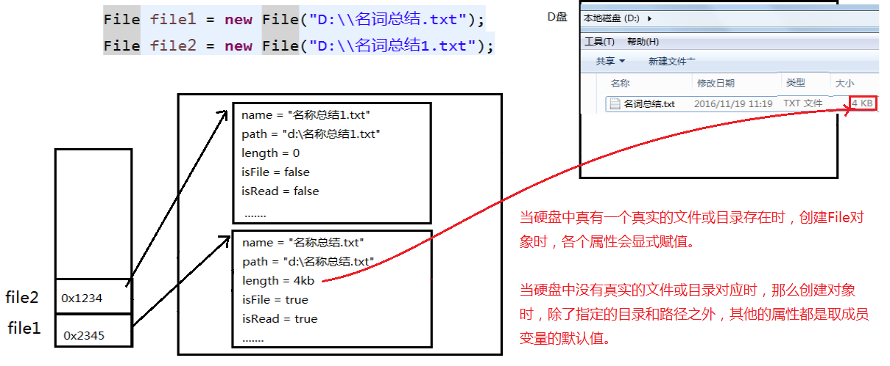
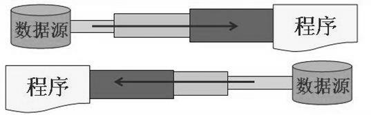
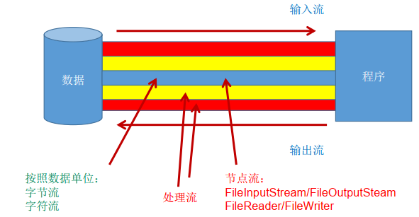
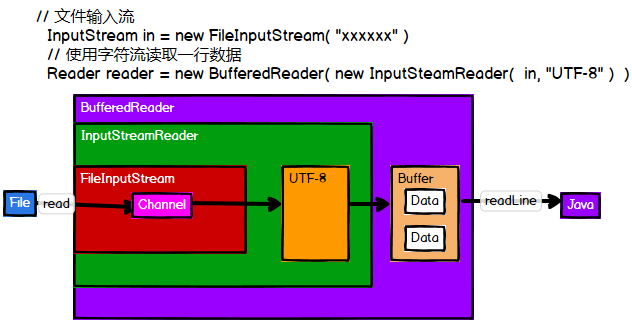
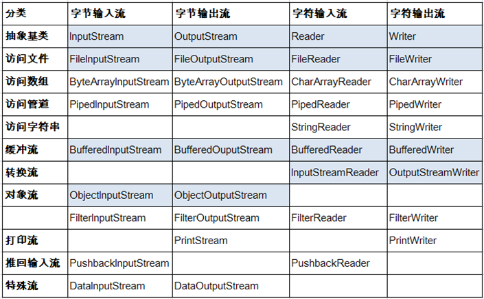
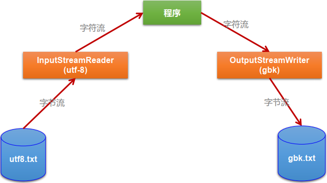

## File类的使用

java.io.File类：文件和文件夹的路径的抽象表示，与平台无关。

File能新建、删除、重命名文件和目录，但File不能访问文件内容本身。要访问文件内容，需要使用IO流。

> 想要在Java程序中表示一个真实存在的文件或目录，必须有一个File对象，但是一个File对象并不一定有真实存在的文件或目录与之对应。
>

File对象可以作为参数传递给流的构造器。

文件路径中每级目录之间用一个路径分隔符隔开，各操作系统下的路径分隔符：

- Windows和DOS：\
- UNIX和URL：/

> 为了解决用错路径分隔符，File类中提供了一个常量：`public static final String separator`，用于根据操作系统动态地提供分隔符。
>

### 常用构造器

public File(String pathname)：根据路径创建File对象，可以是绝对路径或相对路径。若使用相对路径，默认当前路径可用user.dir查询。

public File(String parent, String child)：以parent为父路径，child为子路径，创建File对象。

public File(File parent, String child)：用一个父File对象和子文件路径创建File对象。

### 常用方法

```java
public String getAbsolutePath()    : 获取绝对路径
public String getPath()            : 获取路径
public String getName()            : 获取名称
public String getParent()          : 获取上层文件目录路径。 若无， 返回null
public long length()               : 获取文件长度（即：字节数）
public long lastModified()         : 获取最后一次的修改时间， 毫秒值
public boolean renameTo(File dest) : 把文件重命名为指定的文件路径，f1.renameTo(f2)，当且仅当f1存在，f2不存在时返回true
//用于文件夹
public String[] list()    : 获取指定目录下的所有文件或者文件目录的名称数组
public File[] listFiles() : 获取指定目录下的所有文件或者文件目录的File数组
//判断
public boolean isDirectory() : 判断是否是文件目录
public boolean isFile()      : 判断是否是文件
public boolean exists()      : 判断是否存在
public boolean canRead()     : 判断是否可读
public boolean canWrite()    : 判断是否可写
public boolean isHidden()    : 判断是否隐藏
//文件创建与删除
public boolean createNewFile()：创建文件。若文件存在，则不创建， 返回false
public boolean mkdir()        ：创建文件夹。若此文件目录存在，或此文件目录的上层目录不存在，则创建失败。
public boolean mkdirs()       ：创建文件夹。如果上层文件目录不存在，一并创建 
【创建文件或文件夹时若未写盘符路径，默认为项目路径下】
public boolean delete()       ：删除文件或者文件夹，删除不存在的文件或非空文件夹会失败

```



## IO流原理及流的分类

Java程序中，数据的输入/输出操作以流(stream)的形式进行。

java.io包下提供了各种“流”类和接口，用以获取不同种类的数据，并通过**标准的方法**输入或输出数据。

输入：读取外部数据(磁盘、光盘等存储设备)到程序(内存)中

输出：将程序(内存)中的数据输出到磁盘、光盘等存储设备中。

### 流的分类

- 按操作数据单位的不同，分为：字节流，字符流
  -   - 文本文件(.txt, .java, .c, .cpp等)：使用字符流Reader和Writer处理
  -   - 非文本文件(.jpg, .doc, .avi等)：使用字节流InputStream和OutputStream处理【其实文本文件用字节流也可以传输】
- 按数据流向的不同，分为：输入流，输出流
- 按流的角色不同，分为：节点流(文件流)，处理流
  -   - 节点流：直接从数据源或目的地读写数据
        
  -   - 处理流：不直接连接到数据源或目的地，而是**“套接”在已存在的流(节点流或处理流)之上**，为内层流扩充更为强大的读写功能。
        

Java中IO流共涉及40多个类，实际上非常的规则，都是从以下4个抽象基类派生的：

| 抽象基类 | 字节流       | 字符类 |
| -------- | ------------ | ------ |
| 输入流   | InputStream  | Reader |
| 输出流   | OutputStream | Writer |





派生类的类名都是以这四个父类名为后缀的。【重要的流以深色标出】



程序中打开的文件 **IO 资源不属于内存里的资源，垃圾回收机制无法回收该资源**，所以应该显式关闭文件 IO 资源: close()。

### InputStream

方法：

- int read()：从输入流中**读取一个字节**，返回0到255范围内的int值，到达末尾时返回-1
- int read(byte[] b)：从输入流中读取最多b.length()个字节的数据存入bytes数组中，返回值为该次读取的字节数，到达流末尾时返回-1
- int read(byte[] b, int off, int len)：将输入流中的最多len个字节读入byte数组，返回值为实际读取的字节数，到达流末尾返回-1

### Reader

方法：

- int read()：读取单个字符，作为整数读取的字符，范围在0到65535之间，到达末尾返回-1
- int read(char [] cbuf)：将字符读入数组，返回读取的字符数，若已到达流的末尾，则返回-1
- int read(char [] cbuf, int off, int len)：将字符读入数组的一部分，最多存len个字符，返回读取的字符数，到达末尾则返回-1

### OutputStream

方法：

- void write(int b)：将指定的字节写入此输出流。 write 的常规协定是：向输出流写入一个字节。 要写入的字节是参数 b 的八个低位。 b 的 24 个高位将被忽略。 即写入0~255范围的。
- void write(byte[] b)：将 b.length 个字节从指定的 byte 数组写入此输出流。 write(b) 的常规协定是：应该与调用 write(b, 0, b.length) 的效果完全相同。
- void write(byte[] b,int off,int len)：将指定 byte 数组中从偏移量 off 开始的 len 个字节写入此输出流。
- public void flush()throws IOException：刷新此输出流并**强制写出所有缓冲的数据**， 调用此方法指示应将这些字节立即写入它们预期的目标。
- public void close() throws IOException：关闭此输出流并释放与其关联的所有系统资源。

### Writer

方法：

- void write(int c)：写入单个字符。 要写入的字符包含在给定整数值的 16 个低位中， 16 高位被忽略。 即写入0 到 65535 之间的Unicode码。
- void write(char[] cbuf)：写入字符数组。
- void write(char[] cbuf,int off,int len)：写入字符数组的某一部分。 从off开始， 写入len个字符
- void write(String str)：写入字符串。
- void write(String str,int off,int len)：写入字符串的某一部分。
- void flush()：刷新该流的缓冲， 则立即将它们写入预期目标。
- public void close() throws IOException：关闭此输出流并释放与该流关联的所有系统资源。

## 节点流(文件流)

字节文件流：FileInputStream/FileOutputStream

字符文件流：FileReader/FileWriter

int i = fr.read(); 返回读入的一个字符，光标下移。如果到达文件末尾，返回-1

异常的处理：**为了保证流资源一定可以执行关闭操作，应该使用try-catch-finally处理异常，而不是throws.**

**FileReader读取文件**步骤：

```java
//1.建立一个流对象，将已存在的一个File对象加载进流。
FileReader fr = new FileReader("Test.txt");
//2.创建一个临时存放数据的数组。
char[] ch = new char[1024];
//3.调用流对象的读取方法将流中的数据读入到数组中。
fr.read(ch);
//4. 关闭资源。
fr.close();
```

<details><summary>示例：</summary>

```java
FileReader fr = null;
try {
    fr = new FileReader(new File("c:\\test.txt"));
    char[] buf = new char[1024];
    int len;
    while ((len = fr.read(buf)) != -1) {
        System.out.print(new String(buf, 0, len));
    }
} catch (IOException e) {
    System.out.println("read-Exception :" + e.getMessage());
} finally {
    if (fr != null) {
        try {
            fr.close();
        } catch (IOException e) {
            System.out.println("close-Exception :" + e.getMessage());
        }
    }
}
```

</details>

使用try-with-resources可以简化代码

```java
try (FileReader fr = new FileReader(new File("c:\\test.txt"))) {
    char[] buf = new char[1024];
    int len;
    while ((len = fr.read(buf)) != -1) {
        System.out.print(new String(buf, 0, len));
    }
} catch (IOException e) {
    e.printStackTrace();
}
```

注意点：`int len = fr.read(ch);`形式，最后一次读取的数据，很可能装不满整个ch数组，则ch数组尾部的元素是上一次残留的，如果要输出每次读取的内容，应保证残留的部分不会被读取，对每次读取使用`for(int i = 0; i < len; i++)`代替`for(int i = 0; i < ch.length(); i++)`，或者`String str = new String(ch, 0, len)`都是很好的解决方案。

**FileWriter写入文件**步骤：

```java
//1.创建流对象，建立数据存放文件
FileWriter fw = new FileWriter(new File(“Test.txt”));
//2.调用流对象的写入方法，将数据写入流
fw.write(“atguigu-songhongkang”);
//3.关闭流资源，并将流中的数据清空到文件中。
fw.close();
```

<details><summary>示例：</summary>

```java
FileWriter fw = null;
try {
    fw = new FileWriter(new File("Test.txt"));
    fw.write("atguigu-songhongkang");
} catch (IOException e) {
    e.printStackTrace();
} finally {
    if (fw != null)
        try {
            fw.close();
        } catch (IOException e) {
            e.printStackTrace();
        }
}
```

</details>

注：写入操作，File对象对应的文件若不存在，会自动创建该文件。

构造器为FileWriter(file, false)或FileWriter(file)：对源文件进行覆盖

构造器为FileWriter(file, true)：对源文件增写

> 对于FileOutputStream的构造器，结论类似。
>

字节流的读写，中转数组应定义为byte[] buffer = new byte[n];

## 缓冲流

字节缓冲流：BufferedInputStream/BufferedOutputStream

字符缓冲流：BufferedReader/BufferedWriter

缓冲流内部提供了一个默认大小为`8192byte`的缓冲区，能**显著提高数据的读写速度**。

当使用BufferedInputStream读取字节文件时，BufferedInputStream会一次性从文件中读取8192个(8Kb)， 存在缓冲区中， 直到缓冲区装满了， 才重新从文件中读取下一个8192个字节数组。

向流中写入字节时， 不会直接写到文件， 先写到缓冲区中直到缓冲区写满，BufferedOutputStream才会把缓冲区中的数据一次性写到文件里。使用`flush()`方法可以强制将缓冲区的内容全部写入输出流。

缓冲流的close()方法，不但会关闭流，还会在关闭流之前flush()缓冲区。

操作步骤：

2. 造流：字节流和缓冲流
3. 读写
4. 关闭流

<details><summary>示例：文件复制</summary>

```java
    public void copyFile(String src, String dest) {
        FileInputStream fis = null;
        FileOutputStream fos = null;
        BufferedInputStream bis = null;
        BufferedOutputStream bos = null;
        try {
            //造字节流
            fis = new FileInputStream(src);//也可以直接填路径字符串
            fos = new FileOutputStream(dest);//也可以直接填路径字符串
            //造缓冲流
            bis = new BufferedInputStream(fis);
            bos = new BufferedOutputStream(fos);
            //读写操作
            byte[] buffer= new byte[1024];
            int len;
            while((len = bis.read(buffer))!= -1){
                bos.write(buffer,0,len);
            }
        } catch (IOException e) {
            e.printStackTrace();
        } finally {
            //关闭流
            try {
                if(bis!=null)
                bis.close();
            } catch (IOException e) {
                e.printStackTrace();
            }
            try {
                if(bos!=null)
                    bos.close();
            } catch (IOException e) {
                e.printStackTrace();
            }
        }
    }
```

</details>

多层流嵌套时，先关闭外层流，再关闭内层流。

> 关闭外层流的同时，系统会自动关闭内层流，因此可以省略内存流的关闭代码。
>

**多层流的嵌套体现了装饰者设计模式，外层包装对内层进行了功能的扩展，实际进行操作的还是内层。**

**对于文本文件的字符缓冲流：**

1. BufferedInputStream和BufferedOutputStream同样可以用于操作文本文件。
2. 使用BufferedReader和BufferedWriter时，有两种中转方式：
   -    - 方法一：char[] buffer
     ```java
          char[] buffer = new char[1024];
          int len;
          while((len = br.read(buffer))!= -1){
              bw.write(buffer,0,len);
          }
     ```
   -    - 方法二：String str
          BufferedReader支持读取一行的操作：br.readLine()，返回一个字符串。
     ```java
          String str;
          while((str = br.readLine())!=null){
              bw.write(str);//不会自动换行
              bw.newLine();//换行，或使用str + '\n'
          }
     ```

## 转换流

转换流提供了字节流和字符流之间的转换。

InputStreamReader：将字节输入流转换为字符输入流，用于解码

OutputStreamWriter：将字节输出流转化为字符输出流，用于编码

字节流中的数据都是字符时，转换成字符流更高效。

**转换流常用来处理文件乱码、转码问题，实现解码和编码的功能。**

- 解码：字节数组 --> 字符数组、字符串
- 编码：字符数组、字符串 --> 字节数组

### InputStreamReader

将**字节**输入流**按指定字符集**转换为**字符**输入流，需要套接InputStream

构造器：

- public InputStreamReader(InputStream in)
- public InputSreamReader(InputStream in,String charsetName)
    如：`Reader isr = new InputStreamReader(System.in,”gbk”);`

### OutputStreamWriter

将**字符**输出流**按指定字符集**转换为**字节**输出流，需要套接OutputStream

构造器：

- public OutputStreamWriter(OutputStream out)
- public OutputSreamWriter(OutputStream out,String charsetName)



示例：

```java
public void testMyInput() throws IOException {
    FileInputStream fis = new FileInputStream("dbcp.txt");
    FileOutputStream fos = new FileOutputStream("dbcp5.txt");
    InputStreamReader isr = new InputStreamReader(fis, "GBK");
    OutputStreamWriter osw = new OutputStreamWriter(fos, "GBK");
    BufferedReader br = new BufferedReader(isr);
    BufferedWriter bw = new BufferedWriter(osw);
    String str = null;
    while ((str = br.readLine()) != null) {
        bw.write(str);
        bw.newLine();
        bw.flush();
    }
    bw.close();
    br.close();
}
```

## 标准输入输出流【了解】

System.in：标准输入流，默认为键盘，类型是InputStream

System.out：标准输出流，默认为显示器，类型是PrintStream，为OutputStream的子类

可以通过System类的setIn()和setOut()对默认设备进行更改。

public static void setIn(InputStream in)

public static void setOut(OutputStream out)

示例：

```java
//从键盘输入字符串，要求将读取到的整行字符串转成大写输出。
//然后继续进行输入操作，直至当输入“e”或者“exit”时，退出程序。
System.out.println("请输入信息(退出输入e或exit):");
// 把"标准"输入流(键盘输入)这个字节流包装成字符流,再包装成缓冲流
BufferedReader br = new BufferedReader(new InputStreamReader(System.in));
String s = null;
try {
    while ((s = br.readLine()) != null) { // 读取用户输入的一行数据 --> 阻塞程序
        if ("e".equalsIgnoreCase(s) || "exit".equalsIgnoreCase(s)) {
            System.out.println("安全退出!!");
            break;
        }
        // 将读取到的整行字符串转成大写输出
        System.out.println("-->:" + s.toUpperCase());
        System.out.println("继续输入信息");
    }
} catch (IOException e) {
    e.printStackTrace();
} finally {
    try {
        if (br != null) {
            br.close(); // 关闭过滤流时,会自动关闭它包装的底层节点流
        }
    } catch (IOException e) {
        e.printStackTrace();
    }
}
```

## 打印流【了解】

用于实现将**基本数据类型**的数据格式转化为**字符串**输出

PrintStream、PrintWriter

- 提供了一系列重载的print()和println()方法，用于多种数据类型的输出
- PrintStream和PrintWriter的输出不会抛出IOException异常
- PrintStream和PrintWriter有自动flush功能
- PrintStream 打印的所有字符都使用平台的默认字符编码转换为字节。在需要写入字符而不是写入字节的情况下，应该使用 PrintWriter 类。
- System.out返回的是PrintStream的实例

示例：

```java
PrintStream ps = null;
try {
    FileOutputStream fos = new FileOutputStream(new File("D:\\IO\\text.txt"));
    // 创建打印输出流,设置为自动刷新模式(写入换行符或字节 '\n' 时都会刷新输出缓冲区)
    ps = new PrintStream(fos, true);
    if (ps != null) {// 把标准输出流(控制台输出)改成文件
        System.setOut(ps);
    }
    for (int i = 0; i <= 255; i++) { // 输出ASCII字符
        System.out.print((char) i);
        if (i % 50 == 0) { // 每50个数据一行
            System.out.println(); // 换行
        }
    }
} catch (FileNotFoundException e) {
    e.printStackTrace();
} finally {
    if (ps != null) {
        ps.close();
    }
}
```

## 数据流【了解】

作用：用于读取或写出基本数据类型的变量或字符串

DataInputStream,DataOutputStream分别套接在InputStream和OutputStream子类的流上

DataInputStream常用方法：

```
boolean readBoolean()   byte readByte()    char readChar()   float readFloat()
double readDouble()     short readShort()  long readLong()   int readInt()
String readUTF()        void readFully(byte[] b)
```

DataOutputStream常用方法：将上述方法的read改为write。

注意：读取数据的顺序要与当初写入文件的顺序一致。

处理异常仍然使用try-catch-finally。

示例：

```java
DataOutputStream dos = null;
try { // 创建连接到指定文件的数据输出流对象
    dos = new DataOutputStream(new FileOutputStream("destData.dat"));
    dos.writeUTF("我爱北京天安门"); // 写UTF字符串
    dos.writeBoolean(false); // 写入布尔值
    dos.writeLong(1234567890L); // 写入长整数
    System.out.println("写文件成功!");
} catch (IOException e) {
    e.printStackTrace();
} finally { // 关闭流对象
    try {
        if (dos != null) {
            // 关闭过滤流时,会自动关闭它包装的底层节点流
            dos.close();
        }
    } catch (IOException e) {
        e.printStackTrace();
    }
}
```

```java
DataInputStream dis = null;
try {
    dis = new DataInputStream(new FileInputStream("destData.dat"));
    String info = dis.readUTF();
    boolean flag = dis.readBoolean();
    long time = dis.readLong();
    System.out.println(info);
    System.out.println(flag);
    System.out.println(time);
} catch (Exception e) {
    e.printStackTrace();
} finally {
    if (dis != null) {
        try {
            dis.close();
        } catch (IOException e) {
            e.printStackTrace();
        }
    }
}
```

## 对象流

用于读写基本数据类型数据或对象的处理流。**其强大之处是可以将Java中的任意对象写入数据源中，又能将该对象从数据源中还原出来。**

ObjectInputStream、ObjectOutputStream

序列化：用ObjectOutputStream类将**基本数据类型或对象**保存在磁盘中或通过网络传输出去

反序列化：用ObjectInputStream类将序列化文件还原为**基本数据类型或对象**

> ObjectOutputStream和ObjectInputStream不能序列化static和transient修饰的成员变量
>

### 对象序列化

对象序列化机制允许把内存中的可序列化对象转换成平台无关的二进制流，使其在保存和传输后能被还原。

序列化是 RMI（Remote Method Invoke，远程方法调用）过程的参数和返回值都必须实现的机制，而 RMI 是 JavaEE 的基础。因此**序列化机制是JavaEE 平台的基础。**

可序列化对象需要满足的条件：

1. **所属类及该类所有属性必须实现Serializable或Externalizable接口**（基本数据类型和String默认是可序列化的）
2. 当前类提供一个表示序列化版本的静态变量：`private static final long serialVersionUID`;
   >    > serialVersionUID主要用于验证版本一致性。在反序列化时会验证文件中的UID和本地的实体类中的UID是否一致，以判断是否可反序列化，不行会报错：InvalidCastException。
   >
   >    > 若该类中没有显式地定义这个静态常量，它的值是Java运行时环境根据类的内部细节自动生成的。若类的实例变量做了修改，serialVersionUID可能发生变化。因此，推荐显式声明该变量。
   >

序列化对象：

1. 创建一个ObjectOutputStream
2. 调用ObjectOutputStream对象的writeObject(对象)方法输出可序列化对象
3. 每写出一次，需要flush()一次。

```java
ObjectOutputStream oos = new ObjectOutputStream(new FileOutputStream(“data.txt"));
Person p = new Person("韩梅梅", 18, "中华大街", new Pet());
oos.writeObject(p);
oos.flush();
oos.close();  
```

反序列化：

1. 创建一个ObjectInputStream
2. 调用readObject()方法读取流中的对象

```java
ObjectInputStream ois = new ObjectInputStream(new FileInputStream(“data.txt"));
Person p1 = (Person)ois.readObject();
System.out.println(p1.toString());
ois.close();
```

## 随机存取文件流RandomAccessFile

java.io.RandomAccessFile直接继承于java.lang.Object，实现了DataInput和DataOutput两个接口，意味着这个类**既可以读，又可以写**。

RandomAccessFile对象有一个记录指针，用以标识当前读写的位置。操作指针的方法：

- long getFilePointer()：获取文件记录指针的当前位置
- void seek(long pos)：将文件记录指针定位到pos处

构造器：

- public RandomAccessFile(File file, String mode)
- public RandomAccessFile(String name, String mode)

mode参数指定了访问模式：

- r：只读
- rw：读写
- rwd：读写，并同步文件内容的更新
- rws：读写，并同步内容和元数据的更新

> ”r“模式时：读取的文件不存在会出现异常，”rw“模式时，文件不存在则会自动创建。
>

> rw不会清空本文件，默认从头开始覆盖原内容。
>

读取示例：

```java
RandomAccessFile raf = new RandomAccessFile("test.txt", "rw"） ;
raf.seek(5);
byte [] b = new byte[1024];
int off = 0;
int len = 5;
raf.read(b, off, len);
String str = new String(b, 0, len);
System.out.println(str);
raf.close();
```

写入示例：

```java
RandomAccessFile raf = new RandomAccessFile("test.txt", "rw");
raf.seek(5);
//先读出来
String temp = raf.readLine();
raf.seek(5);
raf.write("xyz".getBytes());
raf.write(temp.getBytes());
raf.close()
```

### 多线程断点续传

**RandomAccessFile类可以实现多线程断点续传功能**：下载时会建立两个临时文件，一个是与被下载文件大小相同的空文件，另一个是记录文件指针的位置文件，每次暂停的时候，都会保存上一次的指针，继续下载时会从指针处继续下载和上传。

## NIO.2中Path、Paths、Files类的使用

### Java NIO

Java NIO (New IO， Non-Blocking IO)是从Java 1.4版本开始引入的一套新的IO API，可以替代标准的Java IO API。 NIO与原来的IO有同样的作用和目的，但是使用的方式完全不同， **NIO支持面向缓冲区的(IO是面向流的)、基于通道的IO操作。 NIO将以更加高效的方式进行文件的读写操作**。

Java API中提供了两套NIO， 一套是针对标准输入输出NIO， 另一套就是网络编程NIO。

- java.nio.channels.Channel
- FileChannel:处理本地文件
- SocketChannel： TCP网络编程的客户端的Channel
- ServerSocketChannel:TCP网络编程的服务器端的Channel
- DatagramChannel： UDP网络编程中发送端和接收端的Channel

### NIO.2

随着 JDK 7 的发布， Java对NIO进行了极大的扩展，增强了对文件处理和文件系统特性的支持，以至于我们称他们为 NIO.2。因为 NIO 提供的一些功能， NIO已经成为文件处理中越来越重要的部分。

### Path、 Paths和Files核心API

早期的Java只提供了一个File类来访问文件系统，但File类的功能比较有限，所提供的方法性能也不高。而且， 大多数方法在出错时仅返回失败，并不会提供异常信息。

NIO. 2为了弥补这种不足，引入了Path接口，代表一个平台无关的平台路径，描述了目录结构中文件的位置。 **Path可以看成是File类的升级版本，实际引用的资源也可以不存在。**

在以前IO操作都是这样写的:

```java
import java.io.File;
File file = new File("index.html");
```

但在Java7 中，我们可以这样写：

```java
import java.nio.file.Path;
import java.nio.file.Paths;
Path path = Paths.get("index.html");  
```

同时， NIO.2在java.nio.file包下还提供了Files、 Paths工具类， Files包含了大量静态的工具方法来操作文件； Paths则包含了两个返回Path的静态工厂方法。

**Paths 类**提供的静态 get() 方法用来获取 Path 对象：

- static Path get(String first, String … more) : 用于将多个字符串串连成路径
- static Path get(URI uri): 返回指定uri对应的Path路径

### Path接口

常用方法：

```java
String toString() ： 返回调用 Path 对象的字符串表示形式
boolean startsWith(String path) : 判断是否以 path 路径开始
boolean endsWith(String path) : 判断是否以 path 路径结束
boolean isAbsolute() : 判断是否是绝对路径
Path getParent() ：返回Path对象包含整个路径，不包含 Path 对象指定的文件路径
Path getRoot() ：返回调用 Path 对象的根路径
Path getFileName() : 返回与调用 Path 对象关联的文件名
int getNameCount() : 返回Path 根目录后面元素的数量
Path getName(int idx) : 返回指定索引位置 idx 的路径名称
Path toAbsolutePath() : 作为绝对路径返回调用 Path 对象
Path resolve(Path p) :合并两个路径，返回合并后的路径对应的Path对象
File toFile(): 将Path转化为File类的对象
```

### Files类

java.nio.file.Files 用于操作文件或目录的工具类。

Files常用方法：

```java
Path copy(Path src, Path dest, CopyOption … how) : 文件的复制
Path createDirectory(Path path, FileAttribute<?> … attr) : 创建一个目录
Path createFile(Path path, FileAttribute<?> … arr) : 创建一个文件
void delete(Path path) : 删除一个文件/目录，如果不存在，执行报错
void deleteIfExists(Path path) : Path对应的文件/目录如果存在，执行删除
Path move(Path src, Path dest, CopyOption…how) : 将 src 移动到 dest 位置
long size(Path path) : 返回 path 指定文件的大小  
```

```java
//Files常用方法：用于判断
boolean exists(Path path, LinkOption … opts) : 判断文件是否存在
boolean isDirectory(Path path, LinkOption … opts) : 判断是否是目录
boolean isRegularFile(Path path, LinkOption … opts) : 判断是否是文件
boolean isHidden(Path path) : 判断是否是隐藏文件
boolean isReadable(Path path) : 判断文件是否可读
boolean isWritable(Path path) : 判断文件是否可写
boolean notExists(Path path, LinkOption … opts) : 判断文件是否不存在
//Files常用方法：用于操作内容
SeekableByteChannel newByteChannel(Path path, OpenOption…how) : 获取与指定文件的连
接， how 指定打开方式。
DirectoryStream<Path> newDirectoryStream(Path path) : 打开 path 指定的目录
InputStream newInputStream(Path path, OpenOption…how):获取 InputStream 对象
OutputStream newOutputStream(Path path, OpenOption…how) : 获取 OutputStream 对象
```