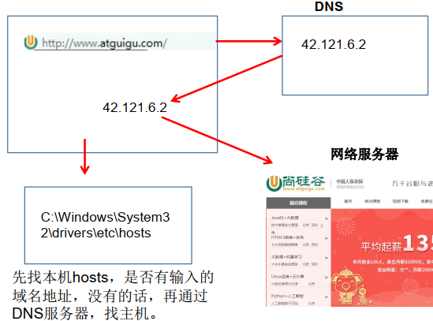
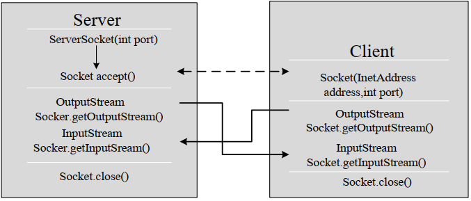
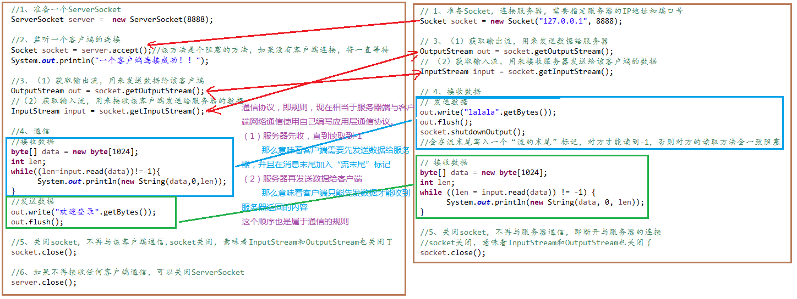

## Socket概述

Java的网络编程主要涉及到的内容是**Socket编程**。Socket是两台主机之间逻辑连接的端点。Socket是网络通信过程中端点的抽象表示，包含进行网络通信必须的五种信息：连接使用的协议、本地主机的IP地址、本地进程的协议端口、远程主机的IP地址、远程进程的协议端口。

应用层通过传输层进行数据通信时，TCP会遇到同时为多个应用程序进程提供并发服务的问题。多个TCP连接或多个应用程序进程可能需要通过同一个TCP协议端口传输数据。为了区别不同的应用程序进程和连接，许多计算机操作系统为**应用程序与TCP/IP协议**交互提供了套接字（Socket）接口。**应用层可以和传输层通过Socket接口**，区分来自不同应用程序进程或网络连接的通信，实现数据传输的并发服务。

**Socket，实际上是对TCP/IP协议的封装**，Socket本身并不是协议，而是一个调用接口（API），通过Socket，我们才能使用TCP/IP协议。实际上，Socket跟TCP/IP协议没有必然的关系，Socket编程接口在设计的时候，就希望也能适应其他的网络协议。所以说，Socket的出现，只是使得程序员更方便地使用TCP/IP协议栈而已，是对TCP/IP协议的抽象，从而形成了我们知道的一些最基本的函数接口，比如create、listen、accept、send、read和write等等。网络有一段关于socket和TCP/IP协议关系的说法比较容易理解：

“TCP/IP只是一个协议栈，就像操作系统的运行机制一样，必须要具体实现，同时还要提供对外的操作接口。这个就像操作系统会提供标准的编程接口，比如win32编程接口一样，TCP/IP也要提供可供程序员做网络开发所用的接口，这就是Socket编程接口。”

利用套接字(Socket)开发网络应用程序早已被广泛的采用，以至于成为事实上的标准。

网络通信其实是Socket对象之间的通信。通信的两端都要有Socket对象，是两台机器间通信的端点。

- Socket允许程序把网络连接当成一个流， 数据在两个Socket间通过IO传输
- 一般主动发起通信的应用程序属客户端，等待通信请求的为服务端

Socket分类：

- 流套接字（stream socket）：使用TCP提供可依赖的字节流服务
- 数据报套接字（datagram socket）：使用UDP提供“尽力而为”的数据报服务

**socket可以看作是IP地址和端口号的组合。**

### IP地址

IP地址标识了计算机在网络中的位置，Java中使用InetAddress类表示IP地址。

IP地址分类：

- IPv4：4个字节组成，以点分十进制表示：`0.0.0.0~255.255.255.255`
- IPv6：16个字节组成，用8个无符号十六进制整数表示，数之间用冒号隔开，如`3ffe:3201:1401:1280:c8ff:fe4d:db39:1984`

公网地址和私有地址(局域网)：192.168开头的是局域网地址，范围为192.168.0.0~192.168.255.255

本地回路地址：127.0.0.1，对应本地主机域名：localhost

#### 域名解析

域名：给IP地址取的别名，方便记忆，如`www.baidu.com`

**域名解析**：在连接网络时输入一个主机的域名后，域名服务器(DNS)负责将域名转化成IP地址，这样才能和主机建立连接



### 端口号

端口号标识了正在计算机上运行的进程，一个进程对应一个端口号

端口号范围：0~65535

端口分类：

- 公认端口：0~1023。被预先定义的服务通信占用【如：HTTP占用端口80，FTP占用端口21，Telnet占用端口23】
- 注册端口：1024~49151。分配给用户进程或应用程序。【如：Tomcat占用端口8080，MySQL占用端口3306，Oracle占用端口1521】
- 动态端口/私有端口：49152~65535

### InetAddress类

java.net.InetAddress对象同时包含域名和IP地址。

```java
InetAddress i1 = InetAddress.getByName("www.baidu.com");
System.out.println(i1); //www.baidu.com/14.215.177.39
InetAddress i2 = InetAddress.getByName("14.215.177.39");
System.out.println(i2); ///14.215.177.39
```

InetAddress类没有提供公共的构造器，而是提供了静态方法来获取InetAddress实例：

- public static InetAddress getByName(String host)
  ```java
    InetAddress i1 = InetAddress.getByName("www.baidu.com");
    InetAddress i2 = InetAddress.getByName("14.215.177.39");
  ```
- public static InetAddress getByAddress(byte[] addr)
  ```java
    InetAddress i3 = InetAddress.getByAddress(new byte[]{14, (byte) 215, (byte) 177, 39});
    System.out.println(i3); ///14.215.177.39
  ```
- public static InetAddress getLocalHost()：获取本机地址
  ```java
    System.out.println(InetAddress.getLocalHost()); //yeluoqianqiu/10.181.243.38
  ```

常用的方法：

- public String getHostAddress()： 返回 IP 地址字符串
- public String getHostName()： 获取此 IP 地址的主机名
- public boolean isReachable(int timeout)： 测试是否可以达到该地址

#### InetAddress的两个子类

- Inet4Address
- Inet6Address

## Socket整体流程

　　Socket编程主要涉及到客户端和服务端两个方面，首先是在服务器端创建一个服务器套接字（ServerSocket），并把它附加到一个端口上，服务器从这个端口监听连接。

　　客户端请求与服务器进行连接的时候，根据服务器的域名或者IP地址，加上端口号，打开一个套接字。当服务器接受连接后，服务器和客户端之间的通信就像输入输出流一样进行操作。

　　

## TCP网络编程

Java使用Socket类和ServerSocket实现基于TCP协议的网络通信

### Socket类

#### 常用构造器

- public Socket(InetAddress address,int port)：通过InetAddress对象所指定的IP和给定的端口号向服务端发起TCP连接，**若成功则创建Socket对象，否则抛出异常**
- public Socket(String host,int port)：通过给定IP和端口号向服务器发起TCP连接，**若成功则创建Socket对象，否则抛出异常**。

#### 常用方法

```
public InputStream getInputStream(): 返回此套接字的输入流。 可以用于接收网络消息
public OutputStream getOutputStream(): 返回此套接字的输出流。 可以用于发送网络消息
public InetAddress getInetAddress(): 此套接字连接到的远程 IP 地址；如果套接字是未连接的， 则返回 null。
public InetAddress getLocalAddress(): 获取套接字绑定的本地地址。 即本端的IP地址
public int getPort(): 此套接字连接到的远程端口号；如果尚未连接套接字， 则返回 0。
public int getLocalPort(): 返回此套接字绑定到的本地端口。 如果尚未绑定套接字， 则返回 -1。 即本端的端口号。
public void close(): 关闭此套接字。 套接字被关闭后， 便不可在以后的网络连接中使用（即无法重新连接或重新绑定） 。 需要创建新的套接字对象。 关闭此套接字也将会关闭该套接字的InputStream 和OutputStream。
public void shutdownInput(): 如果在套接字上调用 shutdownInput() 后从套接字输入流读取内容， 则流将返回 EOF（文件结束符） 。 即不能在从此套接字的输入流中接收任何数据。
public void shutdownOutput(): 禁用此套接字的输出流。 对于 TCP 套接字， 任何以前写入的数据都将被发送， 并且后跟 TCP 的正常连接终止序列。 如果在套接字上调用 shutdownOutput() 后写入套接字输出流，则该流将抛出 IOException。 即不能通过此套接字的输出流发送任何数据。 
```

### 基于Socket的TCP编程



客户端Socket的工作流程：

1. 创建Socket：根据服务端的IP和端口号创建Socket对象，若服务端响应，则建立客户端到服务端的通信线路；若连接失败，则报异常
2. 创建连接到Socket的输入/输出流：
   -    - 使用getInputStream()获取输入流，用于从服务端接收数据
   -    - 使用getOutputStream()获取输出流，用于向服务端传送数据
3. 对Socket进行读写等操作：通过输入流进行读取或通过输出流进行写入
4. 关闭Socket(会同时关闭inputStream和outputStream)

```java
Socket s = new Socket(“192.168.40.165” ,9999);
OutputStream out = s.getOutputStream();
out.write(" hello".getBytes());
s.close();
```

服务端ServerSocket的工作流程：

1. 创建ServerSocket(int port): 绑定到本机的指定端口上，用于监听客户端的请求。
2. 调用accept()：监听连接请求，如果客户端请求连接，则接受连接，并返回一个Socket对象。
   >    > 要一直接收来自客户端的消息，应将accept()和后续操作流程写入循环。否则只能接收一次数据
   >
3. 创建连接到ServerSocket的输入/输出流：
   -    - getInputStream()：获取输入流，用于接接收户端的数据
   -    - getOutputStream()：获取输出流，用于向客户端发送数据
4. 关闭ServerSocket和Socket对象(会同时关闭inputStream和outputStream)

```java
ServerSocket ss = new ServerSocket(9999);
Socket s = ss.accept ();
InputStream in = s.getInputStream();
byte[] buf = new byte[1024];
int num = in.read(buf);
String str = new String(buf,0,num);
System.out.println(s.getInetAddress().toString()+” :” +str);
s.close();
ss.close();
```



示例1：Client向Server发送长度，Server计算以该长度为边的长方形的面积并返回给Client.

Server:

```java
import java.io.*;
import java.net.ServerSocket;
import java.net.Socket;

public class TCPServer {
    public static void main(String[] args) {
        try (ServerSocket ss = new ServerSocket(7000);
             Socket socket = ss.accept();//放这里只能监听一次，放循环才会持续监听
             DataInputStream dis = new DataInputStream(socket.getInputStream());
             DataOutputStream dos = new DataOutputStream(socket.getOutputStream())
        ) {
            double length;
            while (true) {
                length = dis.readDouble();
                if (length == -1) break;
                dos.writeDouble(length * length);
            }
        } catch (IOException e) {
            e.printStackTrace();
        }
    }
}
```

Client:

```java
import java.io.DataInputStream;
import java.io.DataOutputStream;
import java.io.IOException;
import java.net.Socket;
import java.util.Scanner;

public class TCPClient {
    public static void main(String[] args) {
        try (Socket socket = new Socket("127.0.0.1", 7000);
             DataOutputStream dos = new DataOutputStream(socket.getOutputStream());
             DataInputStream dis = new DataInputStream(socket.getInputStream());
             Scanner scanner = new Scanner(System.in)
        ) {
            double length;
            while(true){
                System.out.print("请输入边长（输入-1退出）：");
                length = scanner.nextDouble();
                dos.writeDouble(length);
                if(length==-1)break;

                System.out.println("面积为："+ dis.readDouble());
            }
        } catch (IOException e) {
            e.printStackTrace();
        }
    }
}
```

> 放入循环的accpet()可以持续监听，但一次只能有一个Client与之连接，若有多个Client尝试建立连接，会等待，直到当前Client关闭连接。
>

示例2：利用线程池实现Server同时与多个Server建立连接。

Client代码同上

Server:

```java
import java.io.DataInputStream;
import java.io.DataOutputStream;
import java.io.IOException;
import java.net.ServerSocket;
import java.net.Socket;
import java.util.concurrent.ExecutorService;
import java.util.concurrent.Executors;

public class TCPServerM {
    public static void main(String[] args) {
        int clientNo = 1;
        ExecutorService exec = Executors.newCachedThreadPool();
        try (ServerSocket ss = new ServerSocket(7000)) {
            while (true) {
                Socket socket = ss.accept();
                exec.execute(new SingleServer(socket, clientNo));
                clientNo++;
            }
        } catch (IOException e) {
            e.printStackTrace();
        } finally {
            exec.shutdown();
        }
    }
}

class SingleServer implements Runnable {
    Socket socket;
    int clientNo;

    public SingleServer(Socket socket, int clientNo) {
        this.clientNo = clientNo;
        this.socket = socket;
    }

    @Override
    public void run() {
        try (
                DataInputStream dis = new DataInputStream(socket.getInputStream());
                DataOutputStream dos=new DataOutputStream(socket.getOutputStream())
        ) {
            System.out.println("Client" + clientNo + "已连接");
            double length;
            while (true) {
                length = dis.readDouble();
                if (length == -1) break;
                System.out.println("Client" + clientNo + "输入：" + length);
                dos.writeDouble(length * length);
            }
        } catch (IOException e) {
            e.printStackTrace();
        } finally {
            System.out.println("Client" + clientNo + "已断开连接。");
        }
    }
}
```

示例3：客户端发送文件给服务端，服务端将文件保存在本地。

server:

```java
import java.io.*;
import java.net.ServerSocket;
import java.net.Socket;

public class TCPServer {
    public static void main(String[] args) {
        try (ServerSocket ss = new ServerSocket(9999);
             Socket socket = ss.accept();
             FileOutputStream fos = new FileOutputStream("D://Java开发手册（华山版）.pdf");
             InputStream is = socket.getInputStream();
             OutputStream os = socket.getOutputStream()) {

            byte[] buffer = new byte[1024];
            int len;
            while ((len = is.read(buffer)) != -1) {
                fos.write(buffer, 0, len);
            }

            os.write("接收完毕！".getBytes());
        } catch (IOException e) {
            e.printStackTrace();
        }
    }
}
```

client:

```java
import java.io.*;
import java.net.Socket;

public class TCPClient {
    public static void main(String[] args) {
        try (Socket socket = new Socket("10.181.243.38", 9999);
             FileInputStream fis = new FileInputStream("D://Java开发手册（华山版）.pdf");
             OutputStream os = socket.getOutputStream();
             ByteArrayOutputStream baos = new ByteArrayOutputStream();
             InputStream is = socket.getInputStream()) {

            byte[] buffer = new byte[1024];
            int len;
            while ((len = fis.read(buffer)) != -1) {
                os.write(buffer, 0, len);
            }
            socket.shutdownOutput(); //文件发送完成要关闭输出流，向接收端发送EOF消息

            while((len = is.read(buffer)) != -1){
                baos.write(buffer,0,len);
            }
            System.out.println(baos.toString());
        } catch (IOException e) {
            e.printStackTrace();
        }
    }
}
```

> ①：输入流的read()是阻塞进程，会一直等待接受输入端的消息，当输入端发送完成后应使用shutdownOutput()关闭输出流，同时告知接收端EOF，使其不再等待。
>
> ②：传输String消息可以使用的方法：
>
> - 发送端write("string seq".getBytes()); 接收端使用ByteArrayOutputStream接收，接收完成再toString().
> - new BufferedReader(new InputStreamReader(socket.getInputStream(),"UTF-8"))
> - 发送端封装为DataOutputStream, 使用writeUTF("string seq.")发送字符串; 接收端封装为DataInputStream，使用readUTF()获取字符串。 DataOutputStream dos发送消息时，两个dos.writeXxx()之间要使用dos.flush()刷新。
>
> ③：try-catch-finally关闭资源可以用try-with-resource{}代替，可减少大量冗余代码，且更易理解。
>

## UDP网络编程

Java使用DatagramSocket和DatagramPacket实现基于UDP协议的网络通信

DatagramSocket：发送和接收数据数据报

DatagramPacket：封装UDP数据报，数据包中除了数据，还包含发送端的IP和端口号、接收端的IP和端口号，类似邮件

### DatagramSocket类常用方法：

```java
public DatagramSocket(int port)创建数据报套接字并将其绑定到本地主机上的指定端口。 套接字将被绑定到通配符地址， IP 地址由内核来选择。
public DatagramSocket(int port,InetAddress laddr)创建数据报套接字， 将其绑定到指定的本地地址。本地端口必须在 0 到 65535 之间（包括两者） 。 如果 IP 地址为 0.0.0.0， 套接字将被绑定到通配符地址， IP 地址由内核选择。
public void close()关闭此数据报套接字。
public void send(DatagramPacket p)从此套接字发送数据报包。 DatagramPacket 包含的信息指示：将要发送的数据、 其长度、 远程主机的 IP 地址和远程主机的端口号。
public void receive(DatagramPacket p)从此套接字接收数据报包。 当此方法返回时， DatagramPacket的缓冲区填充了接收的数据。 数据报包也包含发送方的 IP 地址和发送方机器上的端口号。 此方法在接收到数据报前一直阻塞。 数据报包对象的 length 字段包含所接收信息的长度。 如果信息比包的长度长， 该信息将被截短。
public InetAddress getLocalAddress()获取套接字绑定的本地地址。
public InetAddress getInetAddress()返回此套接字连接的地址。 如果套接字未连接， 则返回null。
public int getLocalPort()返回此套接字绑定的本地主机上的端口号。
public int getPort()返回此套接字连接的端口。 如果套接字未连接， 则返回 -1。
```

### DatagramPacket类常用方法

```java
public DatagramPacket(byte[] buf,int length)构造 DatagramPacket， 用来接收长
度为 length 的数据包。 length 参数必须小于等于 buf.length。
public DatagramPacket(byte[] buf,int length,InetAddress address,int port)构造数
据报包， 用来将长度为 length 的包发送到指定主机上的指定端口号。 length参数必须小于等于 buf.length。
public InetAddress getAddress()返回某台机器的 IP 地址， 此数据报将要发往该机器或者是从该机器接收到的。
public int getPort()返回某台远程主机的端口号， 此数据报将要发往该主机或者是从该主机接收到的。
public byte[] getData()返回数据缓冲区。 接收到的或将要发送的数据从缓冲区中的偏移量 offset 处开始， 持续 length 长度。
public int getLength()返回将要发送或接收到的数据的长度。
```

### UDP通信流程

2. 建立发送端，接收端DatagramSocket
3. 发送端和接收端封装dp对象
4. 调用Socket的send(dp)、 receive(dp)
5. 关闭Socket

接收端：

```java
public class UDPServer {
    public static void main(String[] args) {
        try (DatagramSocket ds = new DatagramSocket(10000)) {
            byte[] by = new byte[1024];
            DatagramPacket dp = new DatagramPacket(by, by.length);
            ds.receive(dp);
            String str = new String(dp.getData(), 0, dp.getLength());
            System.out.println(str + "--" + dp.getAddress());
        } catch (Exception e) {
            e.printStackTrace();
        }
    }
}
```

发送端：

```java
public class UDPClient {
    public static void main(String[] args) {
        try (DatagramSocket ds = new DatagramSocket()) {
            byte[] by = "hello,atguigu.com".getBytes();
            DatagramPacket dp = new DatagramPacket(by, 0, by.length,
                    InetAddress.getByName("10.181.243.38"), 10000);
            ds.send(dp);
        } catch (Exception e) {
            e.printStackTrace();
        }
    }
}
```

> 由于UDP传输不可靠，即使server未打开，单启动client并发送消息也可执行，只是没人接收消息。
>

## URL编程

URL: Uniform Resource Locator，统一资源定位符，对应于互联网上的某一资源地址

格式：`<传输协议>://<主机名>:<端口号>/<文件名>#片段名?参数列表`，如：

`http://localhost:8080/examples/cat.jpg`

Java中实现了java.net.URL类用于表示URL。

构造器：

- public URL (String spec)：`URL url = new URL("http://www.atguigu.com/");`
- public URL(URL context, String spec)：通过基 URL 和相对 URL 构造一个 URL 对象。例如： `URL downloadUrl = new URL(url, “download.html")`
- public URL(String protocol, String host, String file); 例如： `new URL("http","www.atguigu.com", “download. html");`
- public URL(String protocol, String host, int port, String file); 例如: `URL gamelan = new URL("http", "www.atguigu.com", 80, “download.html");`

> URL类的构造器的声明抛出非运行时异常，通常是用 try-catch 语句进行捕获。
>

URL对象生成后，属性是不能变的，可以通过以下方法获取属性：

```java
public String getProtocol( ) 获取该URL的协议名
public String getHost( ) 获取该URL的主机名
public String getPort( ) 获取该URL的端口号
public String getPath( ) 获取该URL的文件路径
public String getFile( ) 获取该URL的文件名
public String getQuery( ) 获取该URL的查询名
```

实例：使用URL编程下载网络文件

```java
public class URLDownLoadTomcat {
    public static void main(String[] args) {
        HttpURLConnection urlConnection = null;
        InputStream is = null;
        FileOutputStream fos = null;

        try {
            URL url = new URL("http://localhost:8080/examples/hello.txt");
            urlConnection = (HttpURLConnection) url.openConnection();
            urlConnection.connect();

            is = urlConnection.getInputStream();
            fos = new FileOutputStream("D://hello.txt");
            byte[] buffer = new byte[1024];

            int len;
            while((len = is.read(buffer)) != -1){
                fos.write(buffer,0,len);
            }
            System.out.println("下载成功！");
        } catch (IOException e) {
            e.printStackTrace();
        } finally {
            if(urlConnection != null){
                urlConnection.disconnect();
            }
            if(is !=null){
                try {
                    is.close();
                } catch (IOException e) {
                    e.printStackTrace();
                }
            }
            if(fos != null){
                try {
                    fos.close();
                } catch (IOException e) {
                    e.printStackTrace();
                }
            }
        }
    }
}
```