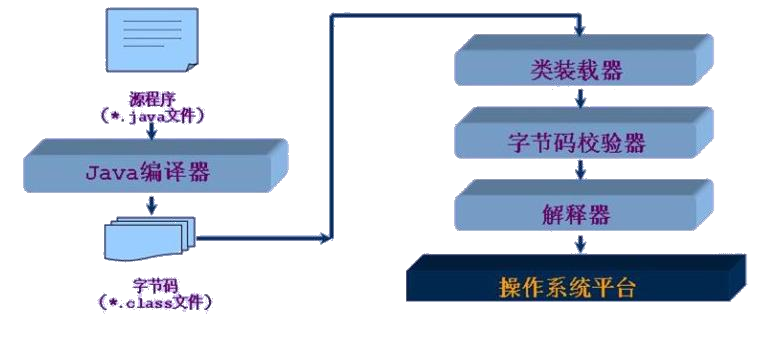
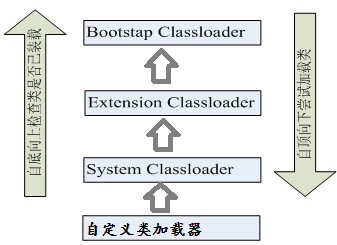

## Java反射机制概述

### 动态语言和静态语言

动态语言：在运行时可以改变自身结构的语言：例如引进新的函数，对象，删除某些结构等。常见动态语言有：Object-C、C#、JavaScript、PHP、Python、Erlang.

静态语言：与动态语言相对，运行时结构不可变的语言。如：Java、C、C++。

> Java虽然不是动态语言，但被称为**准动态语言**，即Java有一定的动态性，我们可以通过反射机制、字节码操作来体现类似动态语言的特性。
>

Reflection被视为**动态语言**的关键，反射机制允许程序在执行期借助于Reflection API取得一个类的任何内部信息，并能直接操作任意对象的内部属性及方法。

### Java反射机制提供的功能

- 在运行时判断一个对象所属的类
- 在运行时构造一个类的对象
- 在运行时判断一个类所具有的成员方法或属性
- 在运行时获取泛型信息
- 在运行时调用一个对象的成员变量和方法
- 在运行时处理注解
- 生成动态代理

### 反射相关的常用API

- java.lang.Class：代表一个类，所有类都是Class的一个实例
- java.lang.reflect.Method：代表类的方法
- java.lang.reflect.Field：代表类的属性
- java.lang.reflect.Constructor：代表类的构造器

### 问题

- 反射机制与面向对象的封装性是否矛盾，如何看待两个技术？
    不矛盾。封装性约束程序员不要在类的外部访问其私有成员，反射机制提供了访问类的私有成员的途径，但应不应该破坏封装性，还是靠程序员的自我约束。
- 通过直接实例化和反射都可以调用公共结构，开发中如何选择？
    一般还是用实例化。什么时候用反射：需要用到动态性时。

## 理解Class类并获取Class实例【重点】

### Class类

- Class类本身也是一个类，Class对象只能由系统创建。
- 一个加载的类在JVM中只能有一个Class实例
- 一个Class对象对应的是一个加载到JVM中的一个.class文件
- 通过Class可以完整地得到一个类中的所有被加载的结构
- 对任何类进行动态加载、动态运行，首先要创建其对应的Class对象。

### Class类常用方法

| 方法                                               | 说明                                                                 |
| -------------------------------------------------- | -------------------------------------------------------------------- |
| static Class forName(String name)                  | 返回指定类名 name 的 Class 对象                                      |
| Object newInstance()                               | 调用缺省构造函数，返回该Class对象的一个实例                          |
| getName()                                          | 返回此Class对象所表示的实体（类、接口、数组类、基本类型 或void）名称 |
| Class getSuperClass()                              | 返回当前Class对象的父类的Class对象                                   |
| Class[] getInterfaces()                            | 获取当前Class对象的接口                                              |
| ClassLoader getClassLoader()                       | 返回该类的类加载器                                                   |
| Class getSuperclass()                              | 返回表示此Class所表示的实体的超类的Class                             |
| Constructor[] getConstructors()                    | 返回一个包含某些Constructor对象的数组                                |
| Field[] getDeclaredFields()                        | 返回Field对象的一个数组                                              |
| Method getMethod(String name, Class … paramTypes) | 返回一个Method对象，此对象的形参类型为paramType                      |

### 获取Class实例的方式

- 方式一：调用运行时类的`class`属性：`Class c1 = Person.class;`
- 方式二：调用某个对象的`getClass()`方法：`Class c2 = p1.getClass();`
- **方式三：调用Class类的静态方法**：`Class c3 = Class.forName("java.lang.String");
  - >   - > 字符串必须是该类的全称，且此方法需要捕捉异常。
    >
- 方式四：使用类的加载器：ClassLoader
  ```java
    ClassLoader classLoader = ReflectionTest.class.getClassLoader();
    Class c4 = classLoader.loadClass("java.lang.String");
  ```

### 哪些类型可以有Class对象

- class:外部类、成员(成员内部类，静态内部类)、局部内部类、匿名内部类
- interface：接口
- []: 数组
- enum：枚举
- annotation：注解@interface
- 基本数据类型
- void

## 类的加载与ClassLoader的理解

### 类的加载

当程序主动使用某个类时，若该类还未加载到内存中，则系统会通过如下三个步骤来对该类进行初始化：`加载 --> 链接 --> 初始化`。

**加载**：通过`类加载器`将类对应的`.class`字节码文件加载到内存，并将这些静态数据转换成方法区的运行时数据结构，然后生成一个代表这个类的`java.lang.Class`对象，作为方法区中类数据的**访问入口**，所有对类数据的访问都要通过这个Class对象。

**链接**：将类的二进制代码合并到JRE中。

- 验证：确保加载的类信息符合JVM规范，例如：以`cafe`开头，没有安全方面的问题
- 准备：在`方法区`中为`静态变量`分配内存并设置默认初始值。
- 解析：虚拟机常量池内的符号引用（常量名）替换为直接引用（地址）的过程。

**初始化**：

- 执行**类构造器**`<clinit>()`方法的过程。 类构造器`<clinit>()`方法是由编译期自动收集类中所有类变量的赋值动作和静态代码块中的语句合并产生的。 （类构造器是构造类信息的，不是构造该类对象的构造器） 。
- 当初始化一个类的时候，如果发现其父类还没有进行初始化，则需要先触发其父类的初始化。
- **虚拟机会保证一个类的`<clinit>()`方法在多线程环境中被正确加锁和同步**。

什么时候会发生类的初始化：

- 类的主动引用（一定会发生类的初始化）
  -   - 当虚拟机启动， 先初始化main方法所在的类
  -   - new一个类的对象
  -   - 调用类的静态属性和静态方法
  -   - 使用java.lang.reflect包的方法对类进行反射调用
  -   - 当初始化一个类， 如果其父类没有被初始化， 则先会初始化它的父类
- 类的被动引用（不会发生类的初始化）
  -   - 当访问一个静态域时， 只有真正声明这个域的类才会被初始化
  -   - 当通过子类引用父类的静态变量， 不会导致子类初始化
  -   - 通过数组定义类引用， 不会触发此类的初始化
  -   - 引用常量不会触发此类的初始化（ 常量在链接阶段就存入调用类的常量池中了）

程序经过javac.exe命令以后，会生成一个或多个字节码文件(.class)，接着我们使用java.exe命令对某个字节码文件进行解释运行。相当于将某个字节码文件加载到内存中。此过程就称为类的加载。加载到内存中的类，我们称之为`运行时类`，运行时类是Class的一个实例。

### 类加载器



类加载器用于在加载阶段将class文件字节码内容加载到内存中， 并将这些静态数据转换成方法区的运行时数据结构， 然后在堆中生成一个代表这个类的java.lang.Class对象， 作为方法区中类数据的访问入口。
**类缓存**： 标准的JavaSE类加载器可以按要求查找类， 但一旦某个类被加载到类加载器中， 它将维持加载（缓存） 一段时间。 不过JVM垃圾回收机制可以回收这些Class对象。

加载器的类型：



**引导类加载器**：用C++编写的，是JVM自带的类加载器， **负责Java平台核心库**，用来装载核心类
库。该加载器无法直接获取
**扩展类加载器**：负责jre/lib/ext目录下的jar包或 –D java.ext.dirs 指定目录下的jar包装入工作库
**系统类加载器**：负责java –classpath 或 –Djava.class.path所指的目录下的类与jar包装入工作 ，是最常用的加载器

```java
//自定义类(系统类)通过System Classloader加载
ClassLoader classLoader = ReflectionTest.class.getClassLoader();
System.out.println(classLoader);//AppClassLoader@18b4aac2
//调用System ClassLoader的父类：Extension ClassLoader
ClassLoader classLoader1 = classLoader.getParent();
System.out.println(classLoader1);//ExtClassLoader@452b3a41
//调用Extension ClassLoader的父类：Bootstrap ClassLoader,无法获取
//Bootstrap ClassLoader负责加载java的核心类库(如：String)，无法加载自定义类
ClassLoader classLoader2 = classLoader1.getParent();
System.out.println(classLoader2);//null
```

类加载器的一个主要方法：getResourceAsStream(String str) --> 获取类路径下的指定文件的输入流

```java
InputStream in = null;
in=this.getClass().getClassLoader().getResourceAsStream("exer2\\test.properties");
System.out.println(in);
```

示例：读取配置文件

方式一：FileInputStream：此方式默认目录为当前module下

```java
ClassLoader classLoader = ReflectionTest.class.getClassLoader();
FileInputStream fis = new FileInputStream("jdbc.properties");
Properties properties = new Properties();
properties.load(fis);
```

方式二：ClassLoader.getResourceAsStream()：此方式默认目录为module的src下

```java
ClassLoader classLoader = ReflectionTest.class.getClassLoader();
Properties properties = new Properties();
InputStream is = classLoader.getResourceAsStream("jdbc1.properties");
properties.load(is);
```

## 创建运行时类的对象【重点】

对于运行时类，一般可以通过其对应的Class对象的newInstance()创建该运行时类的对象。但要求**该运行时类必须有一个无参的、权限为public的构造器**，这也是JavaBean要求自定义类需要提供一个公共的无参构造器的原因之一。

> javabean中要求自定义类需提供一个public的空参构造器，原因如下：
>
> - 便于通过反射，创建运行时类的对象
> - 保证子类继承该类时，默认调用super()时，父类有此构造器。
>

调用运行时类的带参构造器创建对象：

```java
//1. 获得指定构造器：
Class c1 = Person.class;
Constructor con = c1.getDeclaredConstructor(String name, int age);
//2. 通过获得的构造器创建对象【记得要强转类型】：
Person p = (Person) con.newInstance("Tom",20);
```

## 获取运行时类的完整结构

可以通过反射获得该运行时类的完整结构，包括：Field、 Method、 Constructor、 Superclass、 Interface、 Annotation。

获取实现的所有接口：public Class<?>[] getInterface()

获取所继承的父类：public Class<? super T> getSuperclass()

获取全部的构造器：

- `public Constructor<T>[] getConstructors()`：只能获取所有public构造器
- `public Constructor<T>[] getDeclaredConstructors()`：获取所有构造器

获取全部的方法：

- `public Method[] getMthods()`：只能获取所有public方法
- `public Method[] getDeclaredMethods()`：获取所有方法

获取全部属性：

- `public Field[] getFileds()`：获取当前运行时类及其父类的public属性
- `public Field[] getDeclaredFileds()`：获取当前运行时类的所有属性(不包括父类的属性)
    对于返回的Field对象：
  -   - public int getModifiers()：以**整数**形式返回修饰符
  -   - public Class<?> getTypes()：获得属性的类型
  -   - public String getName()：获得属性的名字

获取全部注解：

- `getAnnotation(Class<T> annotationClass)`
- `getDeclaredAnnotation()`

获取泛型：

- Type getGenericSuperclass()：获取父类泛型类型
- ParameterizedType
- getActualTypeArguments()获取实际的泛型类型参数数组

获取类所在的包：

- Package getPackage()

## 调用运行时类的指定结构【重点】

### 调用属性

public Object get(Object obj)：获取obj的属性值

public void set(Object obj, Object value)：将obj对象的值修改为value

```java
//1. 创建运行时类的对象
Class c1  = Person.class;
Person p = (Person) c1.newInstance();
//2. 获取运行时类的指定属性
Field name = c1.getDeclaredField("name");
//3. 若该属性不是public的，要设置可见性
name.setAccessible(true);
//4. 获取或设置该属性：
name.get(p);
name.set(p,"Tom");
```

### 调用方法

public Object invoke(Object obj, Object[] args)

说明：

- Object 对应原方法的返回值，若原方法无返回值，此时返回null
- 若原方法若为静态方法，此时形参Object obj可为null
- 若原方法形参列表为空，则Object[] args为null
- 若原方法声明为private,则需要在调用此invoke()方法前，显式调用方法对象的setAccessible(true)方法，将可访问private的方法。

```java
//1. 创建运行时类的对象并获取指定方法
Class c1  = Person.class;
Person p = (Person) c1.newInstance();
Method show = c1.getDeclaredMethod("show", String.css)//参数1：方法名，参数2：该方法的形参列表
//2. 非public的方法需要设置可见性
show.setAccessible(true);
//3. 调用该方法：invoke() 参数1：运行时类的对象，参数2：传入的实参。invoke()的返回值即原方法的返回值
String str = show.invoke(p,"CHN");//对应于String str = p.show("CHN");
```

> 调用静态方法时，invoke()的参数可以是该运行时类、该运行时类的对象，也可以填null，但不能为空
>

### 调用构造器

【不常用，一般用c1.newInstance()  //jdk9废弃了newInstance()为什么？】

```java
//1.获取运行时类，获取指定构造器
Class c1 = Person.class;
Constructor con = c1.getDeclaredConstructor(String.class);//对应于public Person(String name);
//2.非public的构造器要设置可见性
con.setAccessible(true);
//3.调用该构造器创建运行时类的对象
Person p = (Person) con.newInstance("Tom");
```

## 反射的应用：动态代理

代理设计模式的原理：

使用一个代理将对象包装起来, 然后用该代理对象取代原始对象。任何对原始对象的调用都要通过代理。代理对象决定是否以及何时将方法调用转到原始对象上。【可类比经纪人】
**静态代理**：代理类和目标对象的类都是在编译期间确定下来，不利于程序的扩展。同时，每一个代理类只能为一个接口服务，这样一来程序开发中必然产生过多的代理。

**动态代理**：在程序运行时根据需要动态创建目标类的代理对象。一个代理类可以为多个接口服务。

动态代理的使用场景：

- 调试
- 远程方法调用

动态代理相比于静态代理的优点：抽象角色中(接口)声明的所有方法都被转移到调用处理器一个集中的方法中处理，这样，我们可以更加灵活和统一地处理众多的方法。

### Proxy

专用于代理的操作类，是所有动态代理类的父类。通过此类为一个或多个接口动态地生成实现类。

创建动态代理类Class对象或其实例的静态方法：

```java
//创建动态代理类：
static Class<?> getProxyClass(ClassLoader loader, Class<?>[] interfaces)：创建一个动态代理类对应的Class对象
//直接创建动态代理对象：
static Object newProxyInstance(ClassLoader loader, Class<?>[] Interfaces, InvocationHandler h)
    //ClassLoader loader:被代理类的类加载器
    //Class<?>[] interfaces：被代理类实现的全部接口
    //InvocationHandler h：自定义invoke()方法的InvocationHandler实例
```

### 动态代理的步骤

示例：被代理类：Man  接口：Human  代理类对象：proxyman

```java
class Man implements Human{
    public void say(String name){
        System.out.println("I am a man! my name is:" + name);
    }
}
//1. 创建一个InvocationHandler的实现类，其内部重写invoke()，指定代理的具体操作。其构造器要与被代理类绑定
class MyHandler implements InvocationHandler{
    private Object targetObj;//targetObj：被代理类对象
    public MyHandler(Object targetObj){
        this.targetObj = targetObj;
    }
    public Object invoke(Object proxy, Method method, Object[] params) throws Throwable {//proxy：代理类对象，method：被代理类被调用的方法，params：该方法的参数
        Systom.out.println("We can add some operations here.");
		Object returnVal = method.invoke(targetObj, params);
		return returnVal;
	}
}
//2. 创建实现了某接口的被代理类的对象
Man m = new Man();
//3. 通过Proxy类的静态方法创建一个被代理类实例
Human proxyman = (Human) Proxy.newProxyInstance(man.getClass().getClassLoader(), 	man.getClass().getInterfaces(), new MyHandler(man));
//4.通过代理类调用被代理类的方法
proxyman.say();
```

### AOP(Aspect Oriented Programming)

AOP能体现动态代理的优越性。

具体用到了再学。