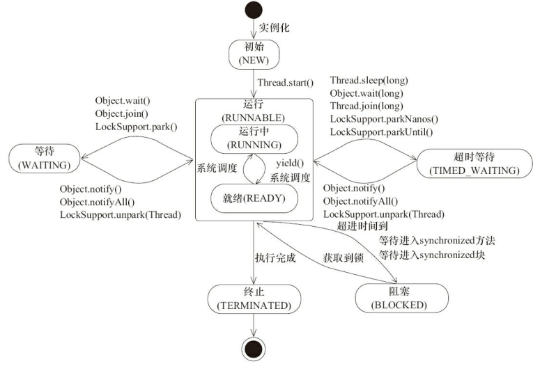
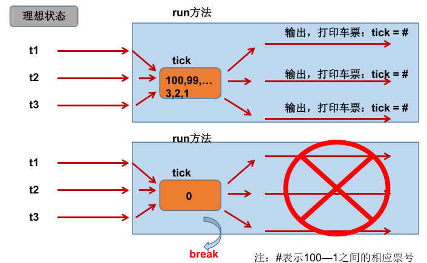
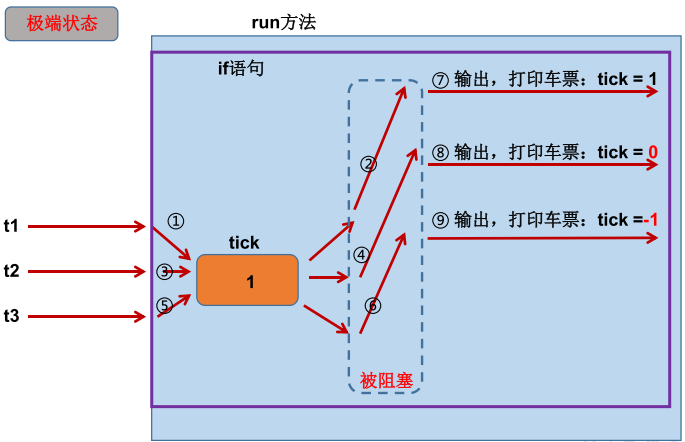

## 线程的创建和启动

### java.lang.Thread类

#### Thread类的构造器

| Thread()                              | 创建新线程对象                                          |
| ------------------------------------- | ------------------------------------------------------- |
| Thread(String  name)                  | 创建新线程并设置线程名                                  |
| -                                     | -                                                       |
| Thread(Runnable  target)              | 指定创建线程的目标对象，实现了Runnable接口中的run()方法 |
| Thread(Runnable  target, String name) | 指定创建线程的目标对象并设置线程名                      |

#### Thread类的常用方法

|                                                |                                                                                                                               |
| ---------------------------------------------- | ----------------------------------------------------------------------------------------------------------------------------- |
| **public static Thread currentThread()**       | 静态方法，返回当前线程，在Thread子类中就是this，通常用于主线程和Runnable实现类                                                |
| **public static void sleep(long millisecond)** | 静态方法，当前线程让出CPU，进入限时等待状态，不释放任何资源，在时间到后重新进入就绪队列；此方法可能抛出InterruptException异常 |
| -                                              | -                                                                                                                             |
| **public static void yield()**                 | 静态方法，当前线程让出CPU，进入就绪状态但不释放任何资源，再次与就绪队列的其他线程竞争CPU，即可能yield()后还是当前线程获得CPU  |
| **public void start()**                        | 启动线程，并调用该对象的run()方法                                                                                             |
| **public void run()**                          | 线程在被调度时执行的操作                                                                                                      |
| **public String getName()**                    | 返回线程名                                                                                                                    |
| public void setName(String name)               | 设置线程名                                                                                                                    |
| **public void join()**                         | 在线程A中执行`B.join()`，A线程将被阻塞，直到B线程执行完毕                                                                     |
| public boolean isAlive()                       | 判断当前线程是否存活，返回布尔值                                                                                              |
| public void stop()                             | deprecated。强制结束线程生命期，不推荐使用                                                                                    |

> 常用`Thread.currentThread().getName()`来获取各个线程的名字，默认线程名一般为Thread-0的格式。
>
> sleep() 可能会抛出 InterruptedException，因为**异常不能跨线程传播回 main() 中** ，因此必须使用try...catch在本地进行处理。**线程中抛出的其它异常也同样需要在本地进行处理。**
>
> yield() 的调用声明了当前线程**已经完成了生命周期中最重要的部分** ，可以切换给其它线程来执行。该方法**只是对线程调度器的一个建议** ，而且也只是建议具有相同优先级的其它线程可以运行。
>

### 创建线程的方式：

* 实现 Runnable 接口；
* 实现 Callable 接口；
* 继承 Thread 类；
* 线程池创建

实现 Runnable 和 Callable 接口的类只能当做一个可以在线程中运行的任务，不是真正意义上的线程，因此最后还需要通过 Thread 来调用。可以理解为任务是通过线程驱动从而执行的。

#### 方法一：实现Runnable接口

```
1. 定义实现类，实现Runnable接口。
2. 实现类重写Runnable接口中的run()方法。
3. 创建实现类的实例对象A。
4. 通过含参构造器Thread(Runnable target)创建线程对象，参数传入A【多态】。
5. 调用线程对象的start()方法：开启线程并自动调用Runnable子类的run()方法。
```

```
public class MyRunnable implements Runnable {
    @Override
    public void run() {
        // ...
    }
}
```

```
public static void main(String[] args) {
    MyRunnable instance = new MyRunnable();
    Thread thread = new Thread(instance);
    thread.start();
}
```

#### 方式二：实现Callable接口

Callable接口比Runnable接口更强大：call()相较于run()

* 带有返回值，支持泛型返回值
* 可以抛出异常，被外面的操作捕获，获取异常信息

Callable需要借助FutureTask类：FutureTask是Future接口的唯一的实现类，FutureTask同时实现了Runnable和Future接口。既可以作为Runnable被线程执行，又可以作为Future得到Callable的返回值

```
public class MyCallable implements Callable<Integer> {
    public Integer call() {
        return 123;
    }
}
```

```
public static void main(String[] args) throws ExecutionException, InterruptedException {
    MyCallable mc = new MyCallable();
    FutureTask<Integer> ft = new FutureTask<>(mc);
    Thread thread = new Thread(ft);
    thread.start();
    System.out.println(ft.get());
}
```

#### 方法三：继承Thread类

继承Thread类同样需要实现run()方法，因为Thread类实现了Runnable接口。

```
1. 创建一个Thread类的子类
2. 在子类中重写run()方法：声明此线程具体执行的操作
3. 创建该Thread子类的实例，即创建了新线程
4. 调用实例的start()方法，即启动新线程，并自动调用run()方法。
```

```
public class MyThread extends Thread {
    public void run() {
        // ...
    }
}
```

```
public static void main(String[] args) {
    MyThread mt = new MyThread();
    mt.start();
}
```

在一个线程中创建了另一个新线程，并调用其start()方法，此时两个线程并发执行。示例：

```
public class ThreadTest {
    public static void main(String[] args) {
        MyThread t1 = new MyThread();
        t1.start();
        for (int i = 0; i < 5; i++) {
            System.out.println(i + ":main");
        }
    }
}

class MyThread extends Thread {
    @Override
    public void run() {
        for (int i = 0; i < 5; i++) {
            System.out.println(i + ":MyThread");
        }
    }
}
```

每次运行的输出结果都可能不同。

> 当调用 start() 方法启动一个线程时，虚拟机会将该线程放入就绪队列中等待被调度，当一个线程被调度时会执行该线程的 run() 方法。
>
> 在一个线程中调用新线程的run()方法，只是普通的方法调用，没有启动多线程。
>
> **一个线程对象只能调用一次start()启动**，重复调用将抛出异常:`IllegalThreadStateException`。
>

#### 方法四：线程池【实际开发场景常用】

#### 实现接口 VS 继承Thread

实现接口会更好一些，因为：

* Java 不支持多重继承，因此继承了 Thread 类就无法继承其它类，但是可以实现多个接口；
* 类可能只要求可执行就行，继承整个 Thread 类开销过大。
* 当多个线程有共享数据时，可以传入同一个Runnable实例。

## 线程的优先级

* 同优先级线程先到先服务，使用时间片分配CPU
* 高优先级线程可以抢占低优先级线程的CPU

线程的优先级等级：

```
MAX_PRIORITY：10
NORM_PRIORITY：5【默认】
MIN _PRIORITY：1
```

优先级方法：

* getPriority(): 返回线程优先级值
* setPriority(): 设置线程的优先级

注：

* 子线程在创建时继承父线程的优先级
* 低优先级的线程并不一定晚于高优先级的线程被调用，只是获得调度的概率低

## 守护线程Daemon

Java线程分为用户线程和守护线程，两者的唯一区别是判断JVM何时离开。

守护线程是程序运行时在后台提供服务的线程，不属于程序中不可或缺的部分。

通过在start()方法前调用thread.setDaemon(true)可以把一个线程设置为守护线程。Java垃圾回收是一个典型的守护线程。

当所有非守护线程结束时，程序也就终止，同时会杀死所有守护线程。

main() 属于非守护线程。

```
public static void main(String[] args) {
    Thread thread = new Thread(new MyRunnable());
    thread.setDaemon(true);
}
```

## Java线程的几种状态

* 新建(New)：创建后尚未启动的线程的状态
* 可运行(Runnable)：就绪和运行两种状态统称为运行中
* 阻塞(Blocked)：等待获取排它锁
* 无限期等待(Waiting)：阻塞和等待的区别在于，阻塞是被动的，而等待是主动的，不会被分配CPU执行时间,需要显式被唤醒
* 限期等待(Timed Waiting)：在一定时间后会由系统自动唤醒
* 结束(Terminated)：已终止线程的状态,线程已经结束执行



## 线程通信

同一进程中的线程间以该进程的内存空间为共享内存，因此线程通信主要关注访问共享内存的互斥和同步机制。

操作系统一般有下面三种线程同步的方式：

1. 锁：主要有互斥锁、读写锁。
   1.    1. 互斥锁实现了共享资源被一个线程独占，防止数据被并发修改。Java中的 synchronized、volatile和各种 Lock(ReentrantLock/LockSupport) 都是这种机制。
   2.    2. 读写锁允许多个线程同时读取共享数据，但不能同时写，可以通过CopyOnWrite实现MVCC，以支持写时读。
2. 信号量：线程间也可以使用信号量控制对共享资源的并发访问度，有 accquire() 和 release() 方法(pv操作)；类似的还有CountDownLatch，控制线程等待，可以用来等待多个线程执行任务后进行汇总
3. 通知机制：在java中体现为notify/notifyAll/wait()或ReentranLock结合Condition的await()和signal()方法

```plaintext
wait(): 当前线程释放CPU和锁，并进入等待池，等待被唤醒，需处理异常：InterruptedException
notify(): 随机选取一个处于等待池中的线程进入锁池去竞争获取锁的机会
notifyAll(): 让所有处于等待池的线程全部进入锁池去竞争获取锁的机会
//这三个方法定义在Object类中，而非Thread类中。
//只用于synchronized方法或代码中，否则会报异常：`java.lang.IllegalMonitorStateException`。
//调用者必须是synchronized所用的同步监视器，如`锁.wait()`，否则会报异常：`java.lang.IllegalMonitorStateException`。
等待池WaitSet：调用了wait方法的线程会释放锁并进入等待池，在等待池的线程不会竞争锁。（休息的池子）
锁池EntryList：在等待池被唤醒的线程，或试图获取正在被占用的锁的线程，需要在锁池等待。（准备抢锁的池子）
```

### sleep()和wait()的异同

1. 两者都会让出CPU，主要区别是：wait()会释放锁，而sleep不会
2. wait属于Object类，sleep属于Thread类
3. wait需要在同步块中使用，sleep可以在任何地方使用
4. sleep需要捕获异常、wait不需要
5. 不带参数的wait()需要等待其他使用同一把锁的线程调用notify()/notifyAll()才能唤醒，而sleep(long)超时后自动唤醒。

## 线程中断

一个线程执行完毕之后会自动结束，如果在运行过程中发生异常也会提前结束。

线程中断是一种重要的线程协作机制。线程中断并不会使线程立即退出，而是给线程发送一个通知，告知线程需要退出了。至于目标线程接到通知后如何处理是由它自己决定。这也是和stop方法的根本区别。

### InterruptedException

通过调用一个线程的 interrupt() 来中断该线程，如果该线程处于阻塞、限期等待或者无限期等待状态，那么就会抛出InterruptedException，从而提前结束该线程。但是不能中断 I/O 阻塞和 synchronized 锁阻塞。

对于以下代码，在main() 中启动一个线程之后再中断它，由于线程中调用了 Thread.sleep() 方法，因此会抛出一个 InterruptedException，从而提前结束线程，不执行之后的语句。

```java
public class InterruptExample {

    private static class MyThread1 extends Thread {
        @Override
        public void run() {
            try {
                Thread.sleep(2000);
                System.out.println("Thread run");
            } catch (InterruptedException e) {
                e.printStackTrace();
            }
        }
    }
}
```

```java
public static void main(String[] args) throws InterruptedException {
    Thread thread1 = new MyThread1();
    thread1.start();
    thread1.interrupt();
    System.out.println("Main run");
}
```

```html
Main run
java.lang.InterruptedException: sleep interrupted
    at java.lang.Thread.sleep(Native Method)
    at InterruptExample.lambda$main$0(InterruptExample.java:5)
    at InterruptExample$$Lambda$1/713338599.run(Unknown Source)
    at java.lang.Thread.run(Thread.java:745)
```

### interrupted()

如果一个线程的 run() 方法执行一个无限循环，并且没有执行 sleep() 等会抛出 InterruptedException 的操作，那么调用线程的 interrupt() 方法就无法使线程提前结束。

但是调用 interrupt() 方法会设置线程的中断标记，此时调用 interrupted() 方法会返回 true。**因此可以在循环体中使用 interrupted() 方法来判断线程是否处于中断状态，从而提前结束线程。**

```java
public class InterruptExample {

    private static class MyThread2 extends Thread {
        @Override
        public void run() {
            while (!interrupted()) {
                // ..
            }
            System.out.println("Thread end");
        }
    }
}
```

```java
public static void main(String[] args) throws InterruptedException {
    Thread thread2 = new MyThread2();
    thread2.start();
    thread2.interrupt();
}
```

```html
Thread end
```

### Executor 的中断操作

调用 Executor 的 shutdown() 方法会等待线程都执行完毕之后再关闭，但是如果调用的是 shutdownNow() 方法，则相当于调用每个线程的 interrupt() 方法。

以下使用 Lambda 创建线程，相当于创建了一个匿名内部线程。

```java
public static void main(String[] args) {
    ExecutorService executorService = Executors.newCachedThreadPool();
    executorService.execute(() -> {
        try {
            Thread.sleep(2000);
            System.out.println("Thread run");
        } catch (InterruptedException e) {
            e.printStackTrace();
        }
    });
    executorService.shutdownNow();
    System.out.println("Main run");
}
```

```html
Main run
java.lang.InterruptedException: sleep interrupted
    at java.lang.Thread.sleep(Native Method)
    at ExecutorInterruptExample.lambda$main$0(ExecutorInterruptExample.java:9)
    at ExecutorInterruptExample$$Lambda$1/1160460865.run(Unknown Source)
    at java.util.concurrent.ThreadPoolExecutor.runWorker(ThreadPoolExecutor.java:1142)
    at java.util.concurrent.ThreadPoolExecutor$Worker.run(ThreadPoolExecutor.java:617)
    at java.lang.Thread.run(Thread.java:745)
```

如果**只想中断 Executor 中的一个线程**，可以通过使用 submit() 方法来提交一个线程，它会返回一个 Future<?> 对象，通过调用该对象的 cancel(true) 方法就可以中断线程。

```java
Future<?> future = executorService.submit(() -> {
    // ..
});
future.cancel(true);
```

## 线程安全问题

多线程同时执行可能出现的问题：

* 多个线程异步执行可能导致执行结果的不确定性
* 多个线程对共享数据的操作可能破坏数据的完整性。

买票模型：线程 操作 资源类

例子：模拟火车站售票程序，开启三个窗口售30张票

Ticket.java

```
public class Ticket {
    private int num = 10;

    public void sell() {
        if (num > 0) {
            try {
                Thread.sleep(100);//为了使错误更明显
            } catch (InterruptedException e) {
                e.printStackTrace();
            }
            System.out.println(Thread.currentThread().getName() + "售出车票，票号为：" + num);
            num--;
        }
    }
}
```

TicketWindow.java

```
public class TicketWindow {
    public static void main(String[] args) {
        Ticket t = new Ticket();
        new Thread(() -> {
            for (int i = 0; i < 10; i++) {
                t.sell();
            }
        }, "t1窗口").start();

        new Thread(() -> {
            for (int i = 0; i < 10; i++) {
                t.sell();
            }
        }, "t2窗口").start();

        new Thread(() -> {
            for (int i = 0; i < 10; i++) {
                t.sell();
            }
        }, "t3窗口").start();
    }
}
```

```
t1窗口售出车票，票号为：10
t2窗口售出车票，票号为：10
t3窗口售出车票，票号为：10
t2窗口售出车票，票号为：7
t3窗口售出车票，票号为：7
t1窗口售出车票，票号为：7
t1窗口售出车票，票号为：4
t3窗口售出车票，票号为：3
t2窗口售出车票，票号为：2
t1窗口售出车票，票号为：1
t2窗口售出车票，票号为：0
t3窗口售出车票，票号为：0
```





极端条件下，存在线程不安全的问题，在本例中表现为多个窗口同时访问同一个数据时，造成售出重票或错票的问题。

问题的原因：当多条语句在操作同一个线程共享数据时，一个线程对多条语句只执行了一部分，还没有执行完，另一个线程参与进来执行。导致共享数据的错误。

**解决办法：synchronized或锁**