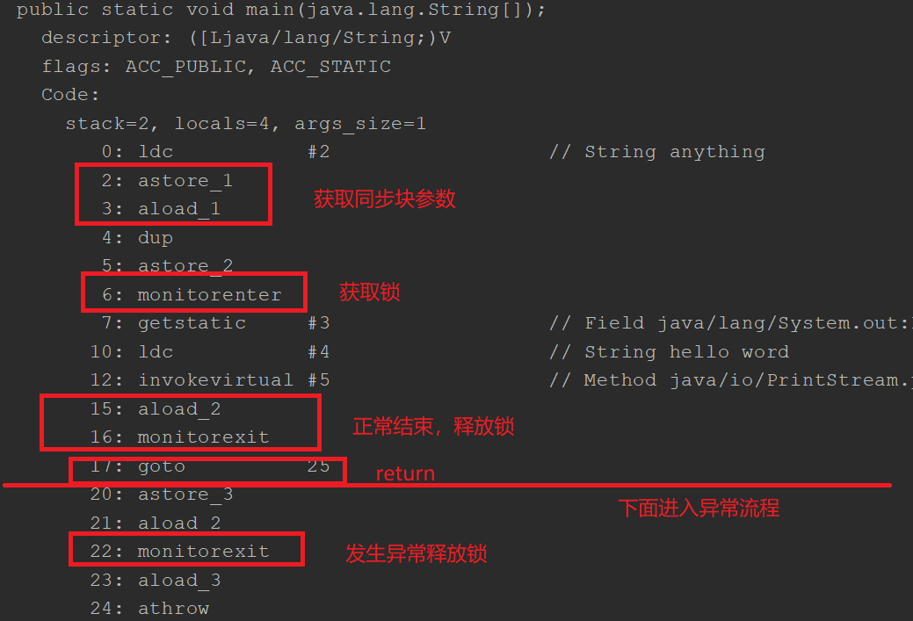
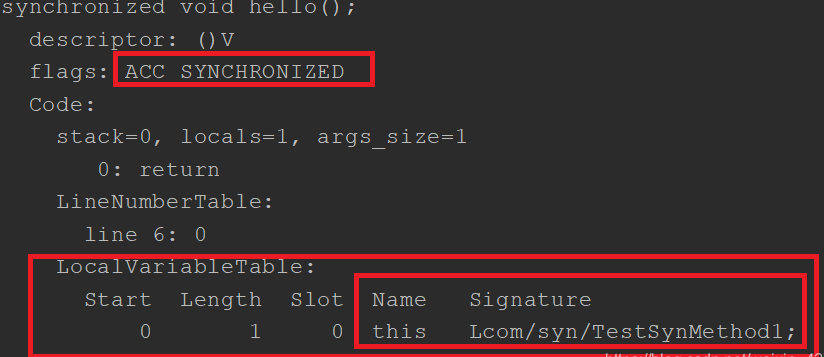
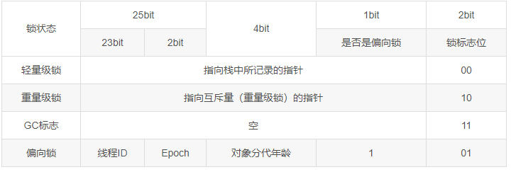
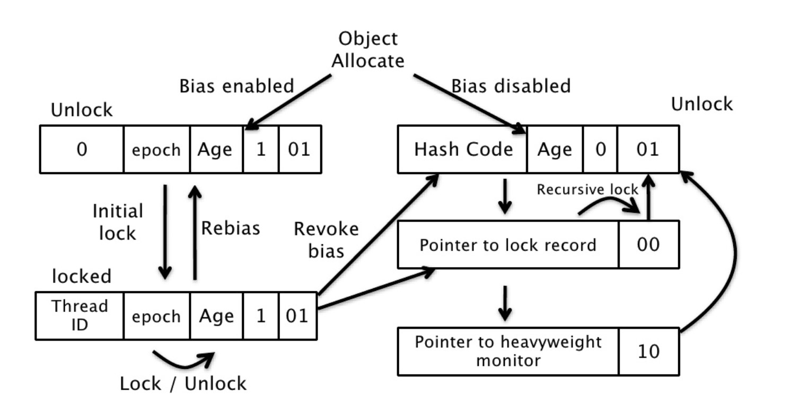
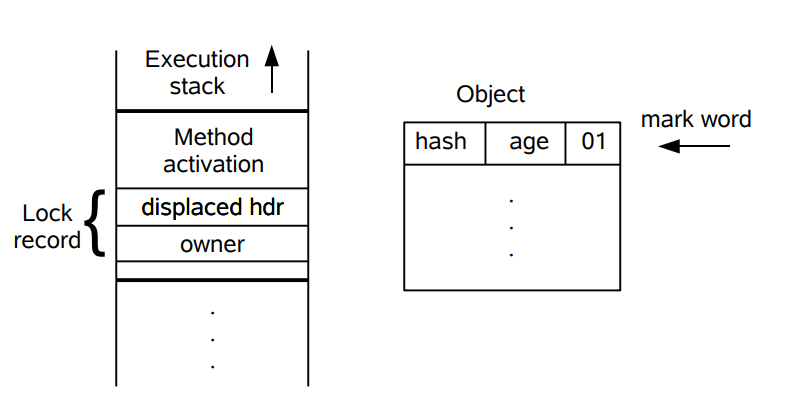
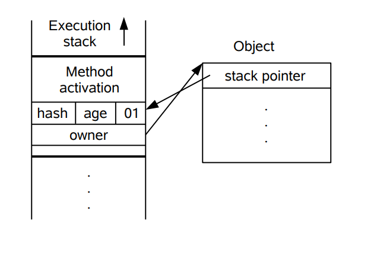

Java 中的并发锁大致分为**隐式锁**和**显式锁**两种。隐式锁就是我们最常使用的 synchronized 关键字，显式锁主要包含两个接口：`Lock` 和 `ReadWriteLock`，主要实现类为 ReentrantLock 和 ReentrantReadWriteLock，这两个类都是基于 AQS(AbstractQueuedSynchronizer) 的。在包括 AQS 在内的很多并发相关类中，`CAS思想` 扮演了很重要的角色。

我们只需要弄清楚 synchronized 和 AQS 的原理，再去理解并发锁的性质和局限就很简单了。因此这篇文章重点放在原理上，对于使用和特点不会过多涉及。

## 概念辨析

下面是关于锁的一些概念解释，这些都是一些关于锁的性质的描述，并非具体实现。

**悲观锁和乐观锁**

**悲观锁假设一定会发生冲突**，因此获取锁之后会阻塞其他等待线程。这么做的好处是简单安全，但是挂起线程和恢复线程都需要转入内核态进行，这样做会带来很大的性能开销。悲观锁的代表是 `synchronized`。然而在真实环境中，大部分时候都不会产生冲突。悲观锁会造成很大的浪费。而**乐观锁则假设不会产生冲突**，先去尝试执行某项操作，失败了再进行其他处理（一般都是不断循环重试）。这种锁不会阻塞其他的线程，也不涉及上下文切换，性能开销小。乐观锁都是基于`CAS`的。

**公平锁和非公平锁**

公平锁需要维护一个FIFO的阻塞队列，一个线程在获取锁时会先判断阻塞队列中是否有线程等待，若有则获取锁失败，该线程被加入到阻塞队列。非公平锁是指线程不考虑排队，直接尝试获取锁，获取不到再去队尾排队，这对已经在排队的线程来说是不公平的，但如果没能竞争到锁，这个线程仍然需要加入阻塞队列。

synchronized和ReentrantLock默认都是非公平锁。

**可重入锁和不可重入锁**

可重入锁又叫递归锁，是指一个线程可以连续多次获得同一把锁，每进入一次计数加1，释放锁的次数需要等于加锁次数，直到计数为0才释放资源。不可重入锁则是不支持多次进入的锁。

**独占锁与共享锁**

**读锁**是**共享的**，**写锁**是**独占的**。`ReentrantLock`和`synchronized`都是**独占锁**，独占锁就是**一个锁**只能被**一个线程**所持有。有的时候，需要**读写分离**，那么就要引入读写锁，即`ReentrantReadWriteLock`。

## synchronized 关键字

synchronized是悲观锁，独占锁，隐式锁，可重入锁，非公平锁。synchronized关键字可以保证被它修饰的方法或代码块在同一时刻只能有一个线程执行。它还可以保证共享变量在多线程下的可见性。

同一个类的所有synchronized 静态方法和synchronized(类名.class)代码块的锁都是该类。

同一个对象的所有synchronized 实例方法和synchronized(this)代码块的锁都是当前实例。

### 实现原理

以下为synchronized代码块和synchronized方法的`.class`字节码：





从`.class`字节码中看到，synchronized代码块使用了1个`monitorenter` 和2个`monitorexit`指令，其中 monitorenter 指令指向同步代码块的开始位置，monitorexit 指令则分别在同步代码块的结束位置和处理异常的开始位置，可知synchronized会在代码块执行完成或遇到异常时自动解锁。synchronized方法则是打了一个`ACC_SYNCHRONIZED` 标识，JVM 通过该标志来辨别一个方法是否声明为同步方法，从而执行相应的同步调用。

更深层次地说，synchronized 是基于 **Java 对象头**和 **Monitor 机制**实现的。

**Java 对象头**

一个对象在内存中包含三部分：`对象头、实例数据和对齐填充`。其中 Java 对象头主要包含两部分：

- Mark Word：存储对象自身运行时的数据，包括hashCode、GC分代年龄、偏向锁标志、锁类型等。Mark Word是实现偏向锁和轻量级锁的关键。
- Class Metadata Address：存储类的元数据的指针。虚拟机通过这个指针找到它是哪个类的实例。
- 对于数组还有Array Length。

非数组对象的对象头占用两个字节码，在32位虚拟机中，一个字节码占4字节，即32位。Mark Word默认存储对象的HashCode、分代年龄和锁标志位。32位JVM的Mark Word的默认存储结构如表所示：

| 锁状态   | 25bit          | 4bit         | 1bit是否偏向锁 | 2bit锁标志位 |
| -------- | -------------- | ------------ | -------------- | ------------ |
| 无锁状态 | 对象的hashCode | 对象分代年龄 | 0              | 01           |

Mark Word可能变化为存储以下4种数据，如表所示



epoch： 偏向时间戳

**Monitor**

当锁升级为重量级锁时，Mark Word有一个字段指向monitor对象。monitor 中记录了锁的持有线程，等待的线程队列等信息。前面说的每个对象都有一个锁和一个等待队列，就是在这里实现的。 monitor 对象由 C++ 实现。其中有三个关键字段：

`_owner`：记录当前持有锁的线程

`_EntryList`：是一个队列，记录所有阻塞等待锁的线程

`_WaitSet`：也是一个队列，记录调用 wait() 方法并还未被通知的线程。

Monitor的操作机制如下：

多个线程竞争锁时，会先进入 EntryList 队列。竞争成功的线程被标记为 Owner。其他线程继续在此队列中阻塞等待。

如果 Owner 线程调用 wait() 方法，则其释放对象锁并进入 WaitSet 中等待被唤醒。Owner 被置空，EntryList 中的线程再次竞争锁。

如果 Owner 线程执行完了，便会释放锁，Owner 被置空，EntryList 中的线程再次竞争锁。

**JVM 对 synchronized 的处理**

上面了解了 monitor 的机制，那虚拟机是如何将 synchronized 和 monitor 关联起来的呢？分两种情况：

如果同步的是代码块，编译时会直接在同步代码块前加上 monitorenter 指令，代码块后加上 monitorexit 指令。这称为显示同步。

如果同步的是方法，虚拟机会为方法设置 ACC_SYNCHRONIZED 标志。调用的时候 JVM 根据这个标志判断是否是同步方法。

### JDK1.6 之后的synchronized 关键字底层做了一些优化

主要包括：锁消除、锁粗化、偏向锁、自旋、适应性自旋、轻量级锁。

优化后的锁具有四种状态：无锁、偏向锁、轻量级锁、重量级锁，他们会随着竞争的激烈而逐渐升级。注意**锁可以升级不可降级**，这种策略是为了提高获得锁和释放锁的效率。

| 锁       | 优点                                   | 缺点                                     |
| -------- | -------------------------------------- | ---------------------------------------- |
| 偏向锁   | 加锁和解锁无额外开销, 性能近似无锁状态 | 若线程间存在锁竞争, 撤销偏向锁有额外消耗 |
| 轻量级锁 | 线程抢锁失败不阻塞, 提高了响应速度     | 自旋会消耗CPU                            |
| 重量级锁 | 线程竞争失败不用自旋, 不会消耗CPU      | 线程阻塞，响应时间缓慢                   |

#### 锁消除

锁消除是指对于被检测出不可能存在竞争的共享数据的锁进行消除。

锁消除主要是通过**逃逸分析**来支持，如果堆上的共享数据不可能逃逸出去被其它线程访问到，那么就可以把它们当成私有数据对待，也就可以将它们的锁进行消除。

对于一些看起来没有加锁的代码，其实隐式的加了很多锁。例如下面的字符串拼接代码就隐式加了锁：

```java
public static String concatString(String s1, String s2, String s3) {
    return s1 + s2 + s3;
}
```

String 是一个不可变的类，编译器会对 String 的拼接自动优化。在 JDK 1.5 之前，会转化为 StringBuffer 对象的连续 append() 操作：

```java
public static String concatString(String s1, String s2, String s3) {
    StringBuffer sb = new StringBuffer();
    sb.append(s1);
    sb.append(s2);
    sb.append(s3);
    return sb.toString();
}
```

每个 append() 方法中都有一个同步块。虚拟机观察变量 sb，很快就会发现它的动态作用域被限制在 concatString() 方法内部。也就是说，sb 的所有引用永远不会逃逸到 concatString() 方法之外，其他线程无法访问到它，因此可以进行消除。

#### 锁粗化

如果一系列的连续操作都对同一个对象反复加锁和解锁，频繁的加锁操作就会导致性能损耗。

上一节的示例代码中连续的 append() 方法就属于这类情况。如果虚拟机探测到由这样的一串零碎的操作都对同一个对象加锁，将会把加锁的范围扩展（粗化）到整个操作序列的外部。对于上一节的示例代码就是扩展到第一个 append() 操作之前直至最后一个 append() 操作之后，这样只需要加锁一次就可以了。

#### 偏向锁

当锁对象第一次被线程A获得的时候，会使用CAS操作在锁的对象头的Mark Word中会记录A的线程ID，表示偏向A线程，并将偏向锁标志为置为1。A以后每次进入这个锁相关的同步块就不需要再进行任何同步操作。

当线程B也尝试获取这个锁对象时，通过CAS尝试修改锁的对象头的Mark Word的线程ID，由于线程ID已经修改为A，尝试失败，偏向状态宣告结束，此时撤销偏向（Revoke Bias）锁并升级到轻量级锁状态。



#### 轻量级锁

下图左侧是一个线程的虚拟机栈，其中有一部分称为 Lock Record 的区域，这是在轻量级锁运行过程创建的，用于存放锁对象的 Mark Word。而右侧就是一个锁对象，包含了 Mark Word 和其它信息。



线程在执行同步块之前，JVM会先在当前线程的栈桢中创建用于存储锁记录的空间，并将对象头中的Mark Word复制到锁记录中。然后线程尝试使用 CAS将对象头中的Mark Word替换为指向锁记录的指针。如果成功，当前线程获得锁，如果失败，表示其他线程竞争锁，当前线程便尝试使用自旋来获取锁。



如果有两条以上的线程争用同一个锁，那轻量级锁就不再有效，要膨胀为重量级锁。

#### 自旋和适应性自旋

所谓自旋，就是尝试获取锁的线程，获取失败不会**立即阻塞**，而是采用**循环的方式去尝试获取**，就像“**自旋**”一样。这样的好处是减少**线程切换的上下文开销**，缺点是会**消耗CPU**。CAS底层的`getAndAddInt`就是**自旋锁**思想。

```java
//跟CAS类似，一直循环比较。
while (!atomicReference.compareAndSet(null, thread)) { }
```

在 JDK 1.6 中引入了自适应自旋。自适应意味着自旋的次数不再固定了，而是由前一次在同一个锁上的自旋次数及锁的拥有者的状态来决定。

### 其他

#### 释放锁和不释放锁的操作

会释放锁的操作：当前线程的同步方法、同步代码块执行结束或遇到异常，或调用了`this.wait()`。

不会释放锁的操作：线程执行同步代码块或同步方法时，调用了Thread.sleep()、 Thread.yield()方法，或其他线程调用了该线程的suspend()方法将该线程挂起，该线程不会释放锁（同步监视器）。【应尽量避免使用suspend()和resume()来控制线程】

#### 提高锁性能的几点建议

1. 只在必要的时候加锁
2. 减小锁粒度，就是缩小锁定对象的范围，降低锁冲突的可能性
3. 在读多写少的场合使用读写分离锁而不是独占锁
4. 锁粗化：如果一系列连续操作都对同一个对象反复加锁和解锁，把加锁的范围扩展到整个操作序列的外部

### 参考

https://blog.csdn.net/weixin_42762133/article/details/103241439