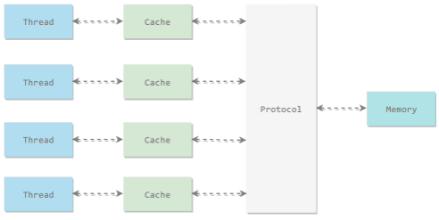
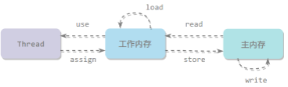
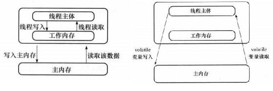

Java 内存模型试图屏蔽各种硬件和操作系统的内存访问差异，以实现让 Java 程序在各种平台下都能达到一致的内存访问效果。

## 主内存与工作内存

处理器上的寄存器的读写的速度比内存快几个数量级，为了解决这种速度矛盾，在它们之间加入了高速缓存。

加入高速缓存带来了一个新的问题：缓存一致性。如果多个缓存共享同一块主内存区域，那么多个缓存的数据可能会不一致，需要一些协议来解决这个问题。



Java 内存模型定义了 8 个操作来完成主内存和工作内存的交互操作。



- read：把一个变量的值从主内存传输到工作内存中
- load：在 read 之后执行，把 read 得到的值放入工作内存的变量副本中
- use：把工作内存中一个变量的值传递给执行引擎
- assign：把一个从执行引擎接收到的值赋给工作内存的变量
- store：把工作内存的一个变量的值传送到主内存中
- write：在 store 之后执行，把 store 得到的值放入主内存的变量中
- lock：作用于主内存的变量
- unlock

**如果要把一个变量从主存复制到工作内存：顺序执行 read 和 load 操作。
如果要把一个变量从工作内存同步会主存：顺序执行 store 和 write 操作。**

## 内存模型三大特性

### 1. 原子性

原子性是指一个操作或多个操作整体是不可分割的。要么都执行成功，要么都不执行。

Java 内存模型保证了 read、load、use、assign、store、write、lock 和 unlock 操作具有原子性，例如对一个 int 类型的变量执行 assign 赋值操作，这个操作就是原子性的。但是 Java 内存模型允许虚拟机将没有被 volatile 修饰的 64 位数据（long，double）的读写操作划分为两次 32 位的操作来进行，即 load、store、read 和 write 操作可以不具备原子性。

一般使用synchronized或AtomicInteger 来保证原子性。synchronized代码块对应的内存间交互操作为：lock 和 unlock，在虚拟机实现上对应的字节码指令为 monitorenter 和 monitorexit。

### 2. 可见性

可见性是指一个线程对某一个共享变量的修改应该立即被其他线程知晓。

根据JMM，可能发生如下情况：⼀个线程在主存中修改了⼀个共享变量的值，⽽另⼀个线程还继续使用该共享变量在它寄存器中的副本，从而造成数据的不⼀致。

示例：

```java
public class TestVolatile {
    public static void main(String[] args) {
        ThreadDemo td = new ThreadDemo();
        new Thread(td).start();
        while(true){
            if(td.flag){
                System.out.println("-------------");
                break;
            }
        }
    }
}

class ThreadDemo implements Runnable{

    public boolean flag = false;
    @Override
    public void run() {
        try {
            Thread.sleep(200);
        } catch (InterruptedException e) {
            e.printStackTrace();
        }
        flag  = true;
        if(flag) System.out.println("flag=true");
    }
}
```

执行上述代码，会发现main()线程死循环，是因为while(true)在拿到flag的初始值后，忙于执行循环而不会再去主存拿值，即使主存中flag已经改变，也仍然使用自己缓存中的值。给`public boolean flag = false;`添加一个volatile即可解决问题。

synchronized和volatile可以解决可见性问题。

### 3. 有序性

有序性是指代码执行时禁止指令重排。

在 Java 内存模型中，允许编译器和处理器对指令进行重排序，重排序过程不会影响到单线程程序的执行，却会影响到多线程并发执行的正确性。

volatile底层是用CPU的**内存屏障**（Memory Barrier）指令来实现的，有两个作用，一个是保证特定操作的顺序性，二是保证变量的可见性。在指令之间插入一条Memory Barrier指令，告诉编译器和CPU，在Memory Barrier指令之间的指令不能被重排序。

也可以通过 synchronized 来保证有序性，它保证每个时刻只有一个线程执行同步代码，相当于是让线程顺序执行同步代码。

### 哪些指令不能重排：Happens-Before 规则

* 程序顺序原则：一个线程内保证语义的串行性。
* volatile 规则：volatile 变量的写先于读发生，保证了这个变量的可见性。
* 一个 unlock 操作先行发生于后面对同一个锁的 lock 操作。
* Thread 对象的 start() 方法调用先行发生于此线程的每一个动作。
* 一个对象的初始化完成（构造函数执行结束）先行发生于它的 finalize() 方法的开始。
* Thread 对象的结束先行发生于 join() 方法返回。
* 对线程 interrupt() 方法的调用先行发生于被中断线程的代码，因此可以通过 interrupted() 方法检测到是否有中断发生。
* 如果操作 A 先行发生于操作 B，操作 B 先行发生于操作 C，那么操作 A 先行发生于操作 C。

## volatile

JVM提供的**轻量级**同步机制，保证了共享变量在多线程下的**可见性**。

普通变量和volatile变量的操作过程：



volatile向CPU添加了lock指令，通过缓存一致性机制，保证了当一个线程通过总线修改主内存中的数据时，其他线程能够嗅探到更改，并使各自内部的缓存失效，要使用这个变量必须去主存获取最新值，并通过插入内存屏障来禁止指令重排序来保证有序性。volatile不能保证i++这种复合操作在多线程下的原子性。

i++的操作包含成3条指令：get, add, put

```
getfield        //读操作
iconst_1	//++常量1
iadd		//加操作
putfield	//写操作
```

假设多个线程执行1000000次i++，在多线程情况下可能出现多个线程同时get取到相同值，然后add，放入内存，这样最后就会总数小于1000000。示例：

```java
public class Main {
    static AtomicInteger x = new AtomicInteger(0);
    volatile static int y = 0;

    public static void main(String[] args) throws InterruptedException {

        for (int i = 0; i < 1000; i++) {
            new Thread(() -> {
                for (int j = 0; j < 1000; j++) {
                    y++;
                    x.getAndIncrement();
                }
            }).start();
        }
        Thread.sleep(5000);
        System.out.println("x="+x);
        System.out.println("y="+y);
    }
}

//x=1000000
//y=970981
```

### synchronized 和 volatile 的区别

- volatile主要解决共享变量在多线程下的**可见性**，synchronized主要解决多个线程访问临界资源的**互斥性**
- volatile只能用于变量，而 synchronized可以修饰方法以及代码块。
- volatile能保证数据的可见性和有序性，但不能保证原子性。synchronized则都能保证。
- volatile是线程同步的轻量级实现，**volatile在其适用场景的性能肯定比synchronized要好**。

### 哪些地方用到过volatile？

单例模式的双重校验写法，需要利用volatile关键字禁止指令重排。

```java
public class Singleton{
    private volatile static Singleton instance;
    private Singleton(){};
    public static Singleton getInstance(){
        if(instance== null){
            synchronized (Singleton.class){
                if(instance== null){
                     instance= new Singleton();
                }
            }
        }
        return instance;
    }
}

/**
instance = new Singleton(); 这段代码其实是分为三步执行：
1.为instance分配内存空间  2.初始化instance  3.将instance指向分配的内存地址
由于JVM具有指令重排的特性，执行顺序有可能变成1->3->2。指令重排在单线程环境下不会出现问题，但是在多线程环境下会导致一个线程获得还没有初始化的实例。例如，线程T1执行了1和3，此时T2调用getInstance()后发现instance不为空，因此返回instance，但此时instance还未被初始化。

使用volatile可以禁止JVM 的指令重排，保证在多线程环境下也能正常运行。
*/
```

### 参考

https://blog.csdn.net/weixin_42762133/article/details/105264806