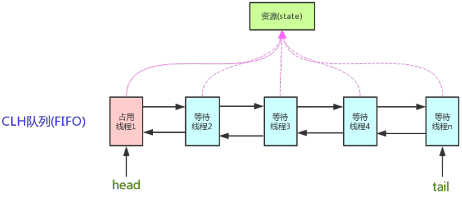
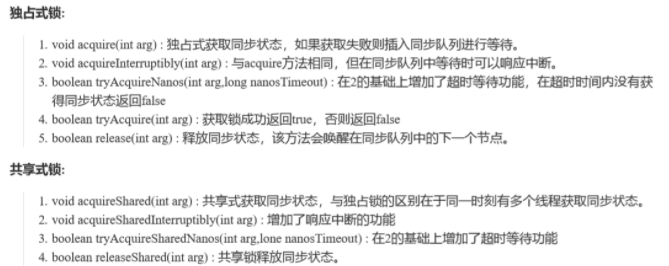
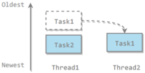

## AQS

### 核心思想

AbstractQueuedSynchronizer，抽象队列同步器，在`java.util.concurrent.locks`包下，**AQS是j.u.c包中同步组件的核心**，为这些同步组件提供了模板方法，体现了一种模板方法模式。

AQS 中有两个重要的成员：

- 成员变量`volatile int state`：表示锁现在的状态，volatile保证内存可见性。state 为0表示没有任何线程持有这个锁，线程持有该锁后将 state 加1，释放时减1。多次持有释放则多次加减。
- 一个**带头结点的双向链表**实现的同步**队列**：链表除了头结点外，每一个节点都记录了线程的信息，代表一个等待线程。



各线程通过CAS尝试修改state，成功则获取锁成功，失败则进入等待队列，等待被唤醒。对state操作的源码：

```java
private volatile int state;//共享变量，使用volatile修饰保证线程可见性

//返回同步状态的当前值
protected final int getState() {  
        return state;
}
// 设置同步状态的值
protected final void setState(int newState) { 
        state = newState;
}
//CAS
protected final boolean compareAndSetState(int expect, int update) {
        return unsafe.compareAndSwapInt(this, stateOffset, expect, update);
}
```

AQS是**自旋锁**：在等待唤醒的时候，经常会使用自旋(`while(!cas())`)的方式，不停地尝试获取锁，直到被其他线程获取成功。

### AQS对资源的共享方式

AQS定义两种资源共享方式：

- **Exclusive**：独占，只有一个线程能执行，如ReentrantLock
- **Share**：共享，多个线程可同时执行，如Semaphore/CountDownLatch/CyclicBarrier/ReadWriteLock



### AQS的模板方法模式

基于AQS的同步器，只是在争用共享资源的方式有所不同。自定义同步器在实现时只需要重写共享资源 state 的获取与释放方式即可，至于同步队列的维护（如获取资源失败入队/唤醒出队等），AQS已经在顶层实现好了。

自定义同步器常需要重写以下AQS提供的模板方法：

```java
isHeldExclusively()//该线程是否正在独占资源。只有用到condition才需要去实现它。
tryAcquire(int)//独占方式。尝试获取资源，成功则返回true，失败则返回false。
tryRelease(int)//独占方式。尝试释放资源，成功则返回true，失败则返回false。
tryAcquireShared(int)//共享方式。尝试获取资源。负数表示失败；0表示成功，但没有剩余可用资源；正数表示成功，且有剩余资源。
tryReleaseShared(int)//共享方式。尝试释放资源，成功则返回true，失败则返回false。
```

一般来说，自定义同步器要么是独占方法，要么是共享方式，他们也只需实现`tryAcquire-tryRelease`、`tryAcquireShared-tryReleaseShared`中的一种即可。但AQS也支持自定义同步器同时实现独占和共享两种方式，如`ReentrantReadWriteLock`。

以ReentrantLock为例，state初始化为0，表示未锁定状态。A线程lock()时，会调用tryAcquire()独占该锁并将state+1。此后，其他线程再tryAcquire()时就会失败，直到A线程unlock()到state=0（即释放锁）为止，其它线程才有机会获取该锁。当然，释放锁之前，A线程自己是可以重复获取此锁的（state会累加），这就是可重入的概念。但要注意，获取多少次就要释放多么次，这样才能保证state是能回到零态的。

### 常用基于AQS的组件

#### ReentrantLock

JDK5开始，可以通过**显式定义同步锁对象**来实现同步。同步锁类应实现`java.util.concurrent.locks.Lock`接口，最常用的是`ReentrantLock`类。

ReentrantLock 实现了和 synchronized 一样的语义，包括可重入，保证内存可见性和解决竞态条件问题等。相比 synchronized，它还可以实现更丰富的功能(见下文)。

ReentrantLock 的实现三要素：

* 原子状态。原子状态使用 CAS 操作来存储当前锁的状态，判断锁是否被其他线程持有。
* 等待队列（等待池）。
* 阻塞原语 park(),unpark()，用来挂起和恢复线程。有关 park(),unpark() 的介绍，见下文线程阻塞工具类： LockSupport。

**为了保证在出现异常情况下仍然能够解锁，应该用try-catch-finally语句包住同步代码，并将lock.unlock()写入finally中。**

```java
class A{
    private final Lock lock = new ReentrantLock();
    public void method(){
        lock.lock();
        try{
            //同步代码
        }finally{
            lock.unlock();  //置于finally中以保证即使出现异常也会解锁
        }
    }
}
```

synchronized与ReentrantLock的对比：

1. 锁的实现：synchronized 是 JVM 实现的，而 ReentrantLock 是 JDK 实现的。
2. 性能：JDK1.6对 synchronized 进行了很多优化，synchronized 与 ReentrantLock 性能大致相当。
3. **ReentrantLock是显式锁，需手动上锁和开锁**，synchronized是隐式锁，代码执行完或有异常自动解锁。
4. ReentrantLock可以实现更丰富的功能，如：
   -    - 中断响应：ReentrantLock.lockInterruptibly()可在等待锁的过程中响应中断，取消对锁的申请。
   -    - 锁申请等待限时：ReentrantLock.tryLock()方法可以实现等待超时后自动放弃锁请求。
   -    - 默认非公平锁，但支持公平锁：可避免线程饥饿现象。然而公平锁需要系统维护一个有序队列，成本较高，性能低下，因此非必要情况不要使用公平锁。ReentrantLock内部有两个内部类，分别是 FairSync 和 NoFairSync，对应公平锁和非公平锁。他们都继承自 Sync。Sync 又继承自AQS。
   -    - 可以绑定条件：一个ReentrantLock可以同时绑定多个Condition对象。
5. 使用选择：除非需要使用ReentrantLock 的高级功能，否则**优先使用 synchronized**。synchronized使用更方便，JVM保证在代码运行完成后或有异常时解锁，**不用担心没有释放锁而导致死锁的问题**。

#### 重入锁的搭档：Condition

ReentrantLock 和 Condition 的关系类似于synchronized与 wait(),notify() 的关系。

java.util.concureent.locks.Condition 接口提供基本方法如下：

* `void await() throws InterruptedException;` ：类似 wait()方法。
* `void awaitUninterruptibly();`  ：与 await() 方法基本相同。但不会在等待过程中响应线程中断。
* `signal()/signalAll()`：与 notify()/notifyAll() 方法类似。

Condition实现了多线程之间的顺序调用，**并可以唤醒指定线程**【优于synchronized的地方】。

示例：实现A->B->C三个线程顺序启动：A打印1次AA，B打印1次BB，C打印1次CC。循环3轮。

```java
import java.util.concurrent.locks.Condition;
import java.util.concurrent.locks.ReentrantLock;

public class ConditionDemo {
    public static void main(String[] args) {
        ShareData sd = new ShareData();
        new Thread(() -> {
            for (int i = 0; i < 3; i++) {
                sd.print("AA", 1);
            }
        }, "A").start();

        new Thread(() -> {
            for (int i = 0; i < 3; i++) {
                sd.print("BB", 2);
            }
        }, "B").start();

        new Thread(() -> {
            for (int i = 0; i < 3; i++) {
                sd.print("CC", 3);
            }
        }, "C").start();
    }
}

class ShareData {
    int flag = 1;//标志位 1:A,2:B,3:C

    ReentrantLock lock = new ReentrantLock();
    Condition c1 = lock.newCondition();
    Condition c2 = lock.newCondition();
    Condition c3 = lock.newCondition();

    public void print(String msg, int num) {
        Condition currentCondition;
        Condition nextCondition;
        if (num == 1) {
            currentCondition = c1;
            nextCondition = c2;
        } else if (num == 2) {
            currentCondition = c2;
            nextCondition = c3;
        } else {
            currentCondition = c3;
            nextCondition = c1;
        }
        lock.lock();
        try {
            while (flag != num) currentCondition.await(); //判断
            System.out.println(msg);//干活

            flag = num%3 + 1;//先改标志位再进行通知
            nextCondition.signal();//通知

        } catch (InterruptedException e) {
            e.printStackTrace();
        } finally {
            lock.unlock();
        }
    }
}
```

#### CountDownLatch

CountDownLatch通常用来控制线程等待，主线程等待其他子线程完成操作倒计数，再开始执行。

任务分为N个子线程去执行，state也初始化为N。这N个子线程是并行执行的，每个子线程执行完后countDown()一次，state会CAS(Compare and Swap)减1。等到所有子线程都执行完后(即state=0)，会unpark()主调用线程，然后主调用线程就会从await()函数返回，继续后续动作。

案例：班长关门，main线程是班长，6个线程是学生。只有6个线程运行完毕，都离开教室后，main线程班长才会关教室门。

```java
public class CountdownLatchExample {

    public static void main(String[] args) throws InterruptedException {
        final int totalThread = 10;
        CountDownLatch countDownLatch = new CountDownLatch(totalThread);
        ExecutorService executorService = Executors.newCachedThreadPool();
        for (int i = 0; i < totalThread; i++) {
            executorService.execute(() -> {
                System.out.print("run..");
                countDownLatch.countDown();
            });
        }
        countDownLatch.await();
        System.out.println("end");
        executorService.shutdown();
    }
}
//run..run..run..run..run..run..run..run..run..run..end
```

使用场景：商品距离，计算完follow/cart/search/buy各自的rate后，统一计算maxRate。

#### CyclicBarrier

CyclicBarrier 和 CountDownLatch 非常类似，它也可以实现线程间的等待，但是它的功能比 CountDownLatch 更加复杂和强大。而且，CountDownLatch每countDown()一个线程是减1，CyclicBarrier每await()一个线程是加1，相当于集齐7颗龙珠可以召唤神龙。

CyclicBarrier是可循环使用的屏障。它让一组线程到达一个屏障（也可以叫同步点）时被阻塞，直到最后一个线程到达屏障时，屏障才会开门，所有被屏障拦截的线程才会继续干活。CyclicBarrier默认的构造方法是 CyclicBarrier(int parties)，其参数表示屏障拦截的线程数量，每个线程调用await()方法告诉 CyclicBarrier 我已经到达了屏障，然后当前线程被阻塞。

```java
public class CyclicBarrierExample {

    public static void main(String[] args) {
        final int totalThread = 3;
        CyclicBarrier cyclicBarrier = new CyclicBarrier(totalThread);
        ExecutorService executorService = Executors.newCachedThreadPool();
        for (int i = 0; i < totalThread; i++) {
            executorService.execute(() -> {
                System.out.print("before..");
                try {
                    cyclicBarrier.await();
                } catch (InterruptedException | BrokenBarrierException e) {
                    e.printStackTrace();
                }
                System.out.print("after..");
            });
        }
        executorService.shutdown();
    }
}
//before..before..before..after..after..after..
```

#### Semaphore

Semaphore 类似于操作系统中的信号量，允许指定多个线程同时访问某个资源。而synchronized和ReentrantLock都是一次只允许一个线程访问资源。

以下代码模拟了对某个服务的并发请求，每次只能有 3 个客户端同时访问，请求总数为 10。

```java
public class SemaphoreExample {

    public static void main(String[] args) {
        final int clientCount = 3;
        final int totalRequestCount = 10;
        Semaphore semaphore = new Semaphore(clientCount);
        ExecutorService executorService = Executors.newCachedThreadPool();
        for (int i = 0; i < totalRequestCount; i++) {
            executorService.execute(()->{
                try {
                    semaphore.acquire();
                    System.out.print(semaphore.availablePermits() + " ");
                } catch (InterruptedException e) {
                    e.printStackTrace();
                } finally {
                    semaphore.release();
                }
            });
        }
        executorService.shutdown();
    }
}
//2 1 2 2 2 2 2 1 2 2
```

#### 读写锁（ReadWriteLock）

ReadWriteLock是读写分离锁们可以有限帮助减少锁竞争，提升系统性能。

如果在系统中，读操作次数远远大于写操作，则可以使用读写锁。

## j.u.c其它组件

### 线程阻塞工具类（LockSupport）

LockSupport 可以在线程内任意位置让线程阻塞，与 suspend() 方法相比，弥补了由于 resume() 方法发生导致线程无法继续执行的情况，和 wait 方法相比，他不需要获得锁也不会抛出中断异常。

LockSupport 包含静态方法 park() 可以阻塞当前线程，unpark() 方法可以解开。

LockSupport 使用类似信号量的机制，为每个线程准备了一个许可，如果这个许可可用，park 方法会返回，并把这个许可变为不可用，如果许可不可用，就阻塞线程。unpark 则相反。这个机制使得即使 unpark 方法操作发生在 park 之前，也可以使下一次的 park方法操作立即返回。

### FutureTask

在介绍 Callable 时我们知道它可以有返回值，返回值通过 Future<V> 进行封装。FutureTask 实现了 RunnableFuture 接口，该接口继承自 Runnable 和 Future<V> 接口，这使得 FutureTask 既可以当做一个任务执行，也可以有返回值。

```java
public class FutureTask<V> implements RunnableFuture<V>
```

```java
public interface RunnableFuture<V> extends Runnable, Future<V>
```

FutureTask 可用于异步获取执行结果或取消执行任务的场景。当一个计算任务需要执行很长时间，那么就可以用 FutureTask 来封装这个任务，主线程在完成自己的任务之后再去获取结果。

```java
public class FutureTaskExample {

    public static void main(String[] args) throws ExecutionException, InterruptedException {
        FutureTask<Integer> futureTask = new FutureTask<Integer>(new Callable<Integer>() {
            @Override
            public Integer call() throws Exception {
                int result = 0;
                for (int i = 0; i < 100; i++) {
                    Thread.sleep(10);
                    result += i;
                }
                return result;
            }
        });

        Thread computeThread = new Thread(futureTask);
        computeThread.start();

        Thread otherThread = new Thread(() -> {
            System.out.println("other task is running...");
            try {
                Thread.sleep(1000);
            } catch (InterruptedException e) {
                e.printStackTrace();
            }
        });
        otherThread.start();
        System.out.println(futureTask.get());
    }
}
```

```html
other task is running...
4950
```

### ForkJoin

主要用于并行计算中，和 MapReduce 原理类似，都是把大的计算任务拆分成多个小任务并行计算。

```java
public class ForkJoinExample extends RecursiveTask<Integer> {

    private final int threshold = 5;
    private int first;
    private int last;

    public ForkJoinExample(int first, int last) {
        this.first = first;
        this.last = last;
    }

    @Override
    protected Integer compute() {
        int result = 0;
        if (last - first <= threshold) {
            // 任务足够小则直接计算
            for (int i = first; i <= last; i++) {
                result += i;
            }
        } else {
            // 拆分成小任务
            int middle = first + (last - first) / 2;
            ForkJoinExample leftTask = new ForkJoinExample(first, middle);
            ForkJoinExample rightTask = new ForkJoinExample(middle + 1, last);
            leftTask.fork();
            rightTask.fork();
            result = leftTask.join() + rightTask.join();
        }
        return result;
    }
}
```

```java
public static void main(String[] args) throws ExecutionException, InterruptedException {
    ForkJoinExample example = new ForkJoinExample(1, 10000);
    ForkJoinPool forkJoinPool = new ForkJoinPool();
    Future result = forkJoinPool.submit(example);
    System.out.println(result.get());
}
```

ForkJoin 使用 ForkJoinPool 来启动，它是一个特殊的线程池，线程数量取决于 CPU 核数。

```java
public class ForkJoinPool extends AbstractExecutorService
```

ForkJoinPool 实现了工作窃取算法来提高 CPU 的利用率。每个线程都维护了一个双端队列，用来存储需要执行的任务。工作窃取算法允许空闲的线程从其它线程的双端队列中窃取一个任务来执行。窃取的任务必须是最晚的任务，避免和队列所属线程发生竞争。例如下图中，Thread2 从 Thread1 的队列中拿出最晚的 Task1 任务，Thread1 会拿出 Task2 来执行，这样就避免发生竞争。但是如果队列中只有一个任务时还是会发生竞争。



## 并发集合

j.u.c包中包含了并发集合类有：ConcurrentHashMap,CopyOnWriteArrayList,ConcurrentLinkedQueue,

BlockingQueue,ConcurrentSkipListMap.

### 高效读写的队列：ConcurrentLinkedQueue

ConcurrentLinkedQueue 这个队列使用链表作为其数据结构．**ConcurrentLinkedQueue 应该算是在高并发环境中性能最好的队列了**。它之所有能有很好的性能，是因为其内部复杂的实现。

ConcurrentLinkedQueue 内部代码我们就不分析了，大家知道 **ConcurrentLinkedQueue 主要使用 CAS 非阻塞算法来实现线程安全**就好了。

ConcurrentLinkedQueue 适合在对性能要求相对较高，同时对队列的读写存在多个线程同时进行的场景，即如果对队列加锁的成本较高则适合使用无锁的 ConcurrentLinkedQueue 来替代。

### 高效读取：CopyOnWriteArrayList

CopyOnWrite容器即写时复制的容器。往一个容器添加元素的时候，不直接往当前容器Object[]添加，而是先将当前容器Object[]进行Copy，复制出一个新的容器Object[] newElements，然后新的容器Object[] newElements里添加元素，添加完元素之后，再将原容器的引用指向新的容器 `setArray(newElements);`。这样做的好处是使得CopyOnWrite容器支持并发读，而不需要加锁，写入也不会阻塞读取。所以CopyOnWrite容器也是一种读写分离的思想。

CopyOnWriteArrayList()的add()源码：

```java
public boolean add(E e) {
    final ReentrantLock lock = this.lock;
    lock.lock();
    try {
        Object[] elements = getArray();
        int len = elements.length;
        Object[] newElements = Arrays.copyOf(elements, len + 1);
        newElements[len] = e;
        setArray(newElements);
        return true;
    } finally {
        lock.unlock();
    }
}
```

### 数据共享通道：BlockingQueue


Java 提供的线程安全的 Queue 可以分为**阻塞队列**和**非阻塞队列**，其中阻塞队列的典型例子就是 BlockingQueue。

阻塞队列（BlockingQueue）被广泛使用在“生产者-消费者”问题中，其原因是 BlockingQueue 提供了可阻塞的插入和移除的方法。当队列容器已满，生产者线程会被阻塞，直到队列未满；当队列容器为空时，消费者线程会被阻塞，直至队列非空时为止。

阻塞队列提供了阻塞的 take() 和 put() 方法：如果队列为空 take() 将阻塞，直到队列中有内容；如果队列为满 put() 将阻塞，直到队列有空闲位置。

**好处**：阻塞队列不用手动控制什么时候该被阻塞，什么时候该被唤醒，简化了操作。

**体系**：`Collection`→`Queue`→`BlockingQueue`→七个阻塞队列实现类。

| 类名                    | 作用                             |
| ----------------------- | -------------------------------- |
| **ArrayBlockingQueue**  | 由**数组**构成的**有界**阻塞队列 |
| **LinkedBlockingQueue** | 由**链表**构成的**有界**阻塞队列 |
| PriorityBlockingQueue   | 支持优先级排序的无界阻塞队列     |
| DelayQueue              | 支持优先级的延迟无界阻塞队列     |
| **SynchronousQueue**    | 单个元素的阻塞队列               |
| LinkedTransferQueue     | 由链表构成的无界阻塞队列         |
| LinkedBlockingDeque     | 由链表构成的双向阻塞队列         |

粗体标记的三个用得比较多，许多消息中间件底层就是用它们实现的。

队列只有一个元素，如果想插入多个，必须等队列元素取出后，才能插入，只能有一个“坑位”，用一个插一个。

需要注意的是`LinkedBlockingQueue`虽然是有界的，但有个巨坑，其默认大小是`Integer.MAX_VALUE`，高达21亿，一般情况下内存早爆了（在线程池的`ThreadPoolExecutor`有体现）。

**API**：抛出异常是指当队列满时，再次插入会抛出异常；返回布尔是指当队列满时，再次插入会返回false；阻塞是指当队列满时，再次插入会被阻塞，直到队列取出一个元素，才能插入。超时是指当一个时限过后，才会插入或者取出。

| 方法类型 | 抛出异常  | 返回布尔   | 阻塞     | 超时                     |
| -------- | --------- | ---------- | -------- | ------------------------ |
| 插入     | add(E e)  | offer(E e) | put(E e) | offer(E e,Time,TimeUnit) |
| 取出     | remove()  | poll()     | take()   | poll(Time,TimeUnit)      |
| 队首     | element() | peek()     | 无       | 无                       |

**使用 BlockingQueue 实现生产者消费者问题**

```java
public class ProducerConsumer {

    private static BlockingQueue<String> queue = new ArrayBlockingQueue<>(5);

    private static class Producer extends Thread {
        @Override
        public void run() {
            try {
                queue.put("product");
            } catch (InterruptedException e) {
                e.printStackTrace();
            }
            System.out.print("produce..");
        }
    }

    private static class Consumer extends Thread {

        @Override
        public void run() {
            try {
                String product = queue.take();
            } catch (InterruptedException e) {
                e.printStackTrace();
            }
            System.out.print("consume..");
        }
    }
}
```

```java
public static void main(String[] args) {
    for (int i = 0; i < 2; i++) {
        Producer producer = new Producer();
        producer.start();
    }
    for (int i = 0; i < 5; i++) {
        Consumer consumer = new Consumer();
        consumer.start();
    }
    for (int i = 0; i < 3; i++) {
        Producer producer = new Producer();
        producer.start();
    }
}
```

```html
produce..produce..consume..consume..produce..consume..produce..consume..produce..consume..
```

## Atomic类

所谓原子类说简单点就是具有原子/原子操作特征的类。

### 基本数据类型的原子类

* AtomicLong/AtomicInteger/AtomicBoolean：通过底层工具类 unsafe 类实现，基于 CAS。unsafe 类提供了类似 C 的指针操作，都是本地方法。
* LongAdder/LongAccumulator：基于 Cell 实现，基于分段锁思想，是一种以空间换时间的策略，适合高并发场景。
* AtomicReference：引用类型原子类，用于原子性对象的读写。
* AtomicStampedReference/AtomicMarkableReference：解决 ABA 问题的类

### Atomic类如何保证原子性⭐

```
CAS，Compare and Swap即比较并交换。主要利用 CAS (compare and swap) + volatile 和 unsafe 类的底层 native 方法来保证原子操作，从而避免 synchronized 的高开销，执行效率大为提升。
```

### 并发编程一些良好实践

- 缩小同步范围，从而减少锁争用。例如对于 synchronized，应该尽量使用同步块而不是同步方法。
- 多用同步工具少用 wait() 和 notify()。首先，CountDownLatch, CyclicBarrier, Semaphore 和 Exchanger 这些同步类简化了编码操作，而用 wait() 和 notify() 很难实现复杂控制流；
- 使用 BlockingQueue 实现生产者消费者问题。
- 多用并发集合少用同步集合，例如应该使用 ConcurrentHashMap 而不是 Hashtable。
- 使用本地变量和不可变类来保证线程安全。
- 使用线程池而不是直接创建线程，这是因为创建线程代价很高，线程池可以有效地利用有限的线程来启动任务。
- 给线程起个有意义的名字，这样可以方便找 Bug。