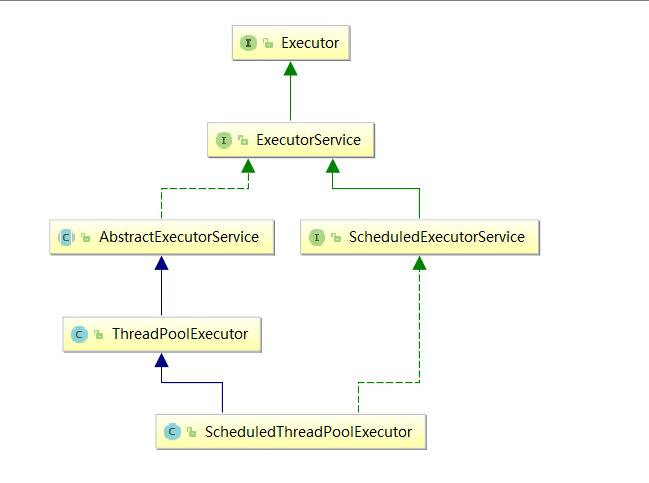

# 线程池

线程池提供了一种管理资源的手段，基于池化思想，能有效提高对资源的利用率。使用线程池的好处：

- 降低资源消耗：通过重复利用已创建的线程降低线程创建和销毁的开销。
- 提高响应速度：当任务达到时，不用等待创建新的线程就能立即执行。
- 方便管理线程：可以控制核心线程数，最大并发数，自定义拒绝策略。

**体系**：



`ThreadPoolExecutor`是线程池创建的核心类。

类似`Arrays`、`Collections`工具类，`Executor`也有自己的工具类`Executors`。

**ExecutorService**：真正的线程池接口。常见子类ThreadPoolExecutor

```java
void execute(Runnable command)：执行任务，没有返回值，参数为Runnable实例
<T> Future<T> submit(Callable<T> task)：执行任务，有返回值，参数为Callable实例或Runnable实例
void shutdown() ：等待所有线程的任务完成后关闭连接池
void shutdownNow()：立即对所有线程执行interrupt()，期待尽快关闭连接池
```

**Executors**：工具类、线程池的工厂类，用于创建并返回不同类型的线程池

```java
Executors.newCachedThreadPool()：创建一个线程数量可变线程池，底层SynchronousQueue
Executors.newFixedThreadPool(n)： 创建一个固定线程数的线程池，底层LinkedBlockingQueue
Executors.newSingleThreadExecutor()：创建一个单线程的线程池，底层LinkedBlockingQueue
Executors.newScheduledThreadPool(n)：创建一个线程池，它可安排在给定延迟后运行命令或者定期地执行
```

## 创建线程池的步骤

```java
1. 创建指定线程数量的线程池：
   ExecutorService service = Executors.newFixedThreadPool(10);
2. 实现Runnable接口或Callable接口，以创建一个完成某操作的线程
   class A implements Runnable{};或class A implements Callable{…};
3. 调用service.execute()或service.submit()开启一个线程，参数为实现类的对象
   - service.execute(a)适用于Runnable接口
   - service.submit(a)适用于Callable接口和Runnable接口
4. 若线程池不再需要，可以关闭：service.shutdown()
```

示例：

```java
public class ThreadPool{
    public static void main(String[] args){
        ExecutorService service = Excecutors.newFixedThreadPool(10);
        service.execute(...Runnable command...);
        service.submit(...Callable task...);
        service.shutdown();
    }
}
```

## 线程池的七个创建参数

| 参数            | 意义                       |
| --------------- | -------------------------- |
| corePoolSize    | 线程池常驻核心线程数       |
| maximumPoolSize | 能够容纳的最大线程数       |
| keepAliveTime   | 空闲线程存活时间           |
| unit            | 存活时间单位               |
| workQueue       | 存放提交但未执行任务的队列 |
| threadFactory   | 创建线程的工厂类           |
| handler         | 等待队列满后的拒绝策略     |

**理解**：线程池的创建参数，就像一个**银行**。

`corePoolSize`就像银行的“**当值窗口**“，比如今天有**2位柜员**在受理**客户请求**（任务）。如果超过2个客户，那么新的客户就会在**等候区**（等待队列`workQueue`）等待。当**等候区**也满了，这个时候就要开启“**加班窗口**”，让其它3位柜员来加班，此时达到**最大窗口**`maximumPoolSize`，为5个。如果开启了所有窗口，等候区依然满员，此时就应该启动”**拒绝策略**“`handler`，告诉不断涌入的客户，叫他们不要进入，已经爆满了。由于不再涌入新客户，办完事的客户增多，窗口开始空闲，这个时候就通过`keepAlivetTime`将多余的3个”加班窗口“取消，恢复到2个”当值窗口“。

## ThreadPoolexecutor工作流程


新任务到达，若核心线程池未满，创建核心线程；否则，尝试放入等待队列。

若等待队列已满，创建非核心线程，但不超过`maximumPoolSize`；此后，还有新任务进来则启动拒绝策略。

线程空闲时间超过`keepAliveTime`后，若总线程数大于`corePoolSize`，则关闭非核心线程。

## 线程池的拒绝策略

当等待队列满时，且达到最大线程数，再有新任务到来，就需要启动拒绝策略。JDK提供了四种拒绝策略：

1. ThreadPoolExecutor.AbortPolicy：丢弃任务并抛出RejectedExecutionException异常。
2. ThreadPoolExecutor.DiscardPolicy：丢弃任务，但是不抛出异常。
3. ThreadPoolExecutor.DiscardOldestPolicy：丢弃队列最前面的任务，然后重新提交被拒绝的任务
4. ThreadPoolExecutor.CallerRunsPolicy：由提交任务的线程直接处理该任务

## ThreadFactory

自定义线程创建，ThreadFactory 是一个接口，只有一个创建线程的方法，我们可以通过这个自定义线程池。

下面这个例子就是自定义线程池：

```java
public static void main(String[] args) throws InterruptedException {
		MyTask task = new MyTask();
		ExecutorService es = new ThreadPoolExecutor(5, 5,
                0L, TimeUnit.MILLISECONDS,
                new SynchronousQueue<Runnable>(),
                new ThreadFactory(){
					@Override
					public Thread newThread(Runnable r) {
						Thread t= new Thread(r);
						t.setDaemon(true);
						System.out.println("create "+t);
						return t;
					}
				}
               );
		for (int i = 0; i < 5; i++) {
			es.submit(task);
		}
		Thread.sleep(2000);
	}
}
```

## 实际生产使用哪一个线程池？

* `FixedThreadPool`和 `SingleThreadExecutor` ： 允许请求的队列长度为 Integer.MAX_VALUE,可能堆积大量的请求，从而导致 OOM。
* `CachedThreadPool` 和 `ScheduledThreadPool`： 允许创建的线程数量为 Integer.MAX_VALUE ，可能会创建大量线程，从而导致 OOM。

建议通过`ThreadPoolExecutor`的7个参数，自定义线程池。

```java
ExecutorService threadPool=new ThreadPoolExecutor(2,5,
                        1L,TimeUnit.SECONDS,
                        new LinkedBlockingQueue<>(3),
                        Executors.defaultThreadFactory(),
                        new ThreadPoolExecutor.AbortPolicy());
```

### 自定义线程池参数选择

1. 一般来说，如果是CPU密集型应用，则线程池大小设置为N+1。
2. 一般来说，如果是IO密集型应用，则线程池大小设置为2N+1。
3. 在IO优化中，线程等待时间所占比例越高，需要越多线程，线程CPU时间所占比例越高，需要越少线程。这样的估算公式可能更适合：最佳线程数目 = ((线程等待时间+线程CPU时间)/线程CPU时间 )* CPU数目