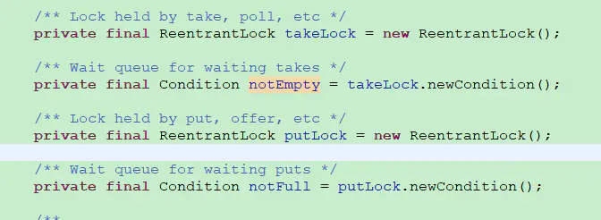

生产者和消费者模型是线程通信的典型应用。

实现的方法：锁、信号量、线程通信、阻塞队列。

遵循`判断 操作 通知`的步骤，如果有标志位，应该在通知之前修改标志位【见Java面试题--> 并发基础-->Condition】。

### 实现一：wait()和notify()/notifyAll()

值得注意的是wait()必须用在while循环判断中，否则会导致虚假唤醒问题。

示例：使用synchronized和this.wait()/this.notifyAll()实现生产者消费者模型。使用if判断导致错误

```java
public class ProducerConsumer {
    public static void main(String[] args) {
        Product p = new Product();

        new Thread(() -> {
            for (int i = 0; i < 5; i++) {
                try {
                    p.increment();
                } catch (Exception e) {
                    e.printStackTrace();
                }
            }
        }, "producer1").start();

        new Thread(() -> {
            for (int i = 0; i < 5; i++) {
                try {
                    p.decrement();
                } catch (Exception e) {
                    e.printStackTrace();
                }
            }
        }, "consumer1").start();

        new Thread(() -> {
            for (int i = 0; i < 5; i++) {
                try {
                    p.increment();
                } catch (Exception e) {
                    e.printStackTrace();
                }
            }
        }, "producer2").start();

        new Thread(() -> {
            for (int i = 0; i < 5; i++) {
                try {
                    p.decrement();
                } catch (Exception e) {
                    e.printStackTrace();
                }
            }
        }, "consumer2").start();
    }
}


class Product {
    private int number = 0;

    public synchronized void increment() throws Exception {
        if (number > 0) {//1.判断
            System.out.println(Thread.currentThread().getName() + ":我进来了if，开始等待");
            this.wait();
            System.out.println(Thread.currentThread().getName() + ":我等待结束");
        }
        //2.操作
        System.out.println(Thread.currentThread().getName() + ":我进来了else");
        number++;
        System.out.println(Thread.currentThread().getName() + "\t" + number);
        //3.通知
        this.notifyAll();
    }

    public synchronized void decrement() throws Exception {
        if (number <= 0) {
            System.out.println(Thread.currentThread().getName() + ":我进来了if，开始等待");
            this.wait();
            System.out.println(Thread.currentThread().getName() + ":我等待结束");
        }
        System.out.println(Thread.currentThread().getName() + ":我进来了else");
        number--;
        System.out.println(Thread.currentThread().getName() + "\t" + number);
        this.notifyAll();
    }
}
```

可能的输出情况：

<details><summary>示例1: typora支持 无语法高亮</summary>

```
//producer1:我进来了else
```

//producer1	1
//producer1:我进来了if，开始等待
//consumer1:我进来了else
//consumer1	0
//consumer1:我进来了if，开始等待
//producer1:我等待结束
//producer1:我进来了else
//producer1	1
//producer1:我进来了if，开始等待
//consumer1:我等待结束
//consumer1:我进来了else
//consumer1	0
//consumer1:我进来了if，开始等待
//producer1:我等待结束
//producer1:我进来了else
//producer1	1
//producer1:我进来了if，开始等待
//producer2:我进来了if，开始等待
//consumer1:我等待结束
//consumer1:我进来了else
//consumer1	0
//consumer1:我进来了if，开始等待
//producer2:我等待结束
//producer2:我进来了else
//producer2	1
//producer2:我进来了if，开始等待
//producer1:我等待结束
//producer1:我进来了else
//producer1	2
//producer1:我进来了if，开始等待
//producer2:我等待结束
//producer2:我进来了else
//producer2	3
//producer2:我进来了if，开始等待
//consumer1:我等待结束
//consumer1:我进来了else
//consumer1	2
//consumer1:我进来了else
//consumer1	1
//consumer2:我进来了else
//consumer2	0
//consumer2:我进来了if，开始等待
//producer2:我等待结束
//producer2:我进来了else
//producer2	1
//producer2:我进来了if，开始等待
//producer1:我等待结束
//producer1:我进来了else
//producer1	2
//producer2:我等待结束
//producer2:我进来了else
//producer2	3
//producer2:我进来了if，开始等待
//consumer2:我等待结束
//consumer2:我进来了else
//consumer2	2
//consumer2:我进来了else
//consumer2	1
//consumer2:我进来了else
//consumer2	0
//consumer2:我进来了if，开始等待
//producer2:我等待结束
//producer2:我进来了else
//producer2	1
//consumer2:我等待结束
//consumer2:我进来了else
//consumer2	0
</code></pre>
</details>

将if改为while循环就能解决以上的问题。

总结：

this.wait()一定要用在while循环中，不能用在if判断中，防止虚假唤醒。即：

用if判断的话，唤醒后线程不会重新判断if条件，直接执行if代码块之后的语句；而使用while循环判断，唤醒后的线程会重新判断循环条件是否仍然成立，成立则继续wait()，不成立才会执行while()循环之后的代码。

另外，从上述过程可以看出：刚刚执行notifyAll()或notify()释放完资源的线程，可以继续与其他在wait的线程争抢线程，而且往往优先抢到，具体原因不解，按理说notifyAll()争夺资源是公平的。

使用 wait() notify()/notifyAll()的缺点在于在生产者唤醒消费者或者消费者唤醒生产者时，由于生产者和消费者使用同一个锁，所以生产者也会将生产者唤醒，消费者也会将消费者唤醒。

举例：假设现在池子满了，然后有3个生产者被阻塞，现在一个消费者拿走一个item，调用notify，此时一个被阻塞的生产者被唤醒了。这个生产者向池子里放入一个产品，并执行notify意图唤醒被阻塞的消费者，此时这个notify有可能唤醒另外2个被阻塞的生产者中的一个。

### 实现二：await()和signal()/signalAll()

```java
import java.util.concurrent.ExecutorService;
import java.util.concurrent.Executors;
import java.util.concurrent.locks.Condition;
import java.util.concurrent.locks.Lock;
import java.util.concurrent.locks.ReentrantLock;

public class Pool {
    private int capacity;
    private Object[] queue;
    private int count;
    private Lock lock = new ReentrantLock();
    private Condition prod = lock.newCondition();
    private Condition cons = lock.newCondition();

    public Pool(int capacity) {
        this.capacity = capacity;
        queue = new Object[capacity];
        count = 0;
    }

    public void produce(Object o) throws InterruptedException {
        lock.lock();
        try {
            while (count == capacity) {
                prod.await();
            }
            queue[count++] = o;
            System.out.println(Thread.currentThread().getName()
                    + " produce " + o.toString() + ". current count: " + count);
            cons.signal();
        } finally {
            lock.unlock();
        }
    }

    public Object consume() throws InterruptedException {
        lock.lock();
        try {
            while (count == 0) {
                cons.await();
            }
            Object res = queue[--count];
            queue[count] = null;
            System.out.println(Thread.currentThread().getName()
                    + " consume " + res.toString() + ". current count: " + count);
            prod.signal();
            return res;
        } finally {
            lock.unlock();
        }
    }

    public static void main(String[] args) {
        Pool pool = new Pool(10);
        ExecutorService executorService = Executors.newCachedThreadPool();
        int cnt = 20;
        while (cnt-- > 0) {
            executorService.execute(() -> {
                try {
                    pool.produce(new Object());
                } catch (InterruptedException e) {
                    e.printStackTrace();
                }
            });
            executorService.execute(() -> {
                try {
                    pool.consume();
                } catch (InterruptedException e) {
                    e.printStackTrace();
                }
            });
        }
    }
}
```

### 实现三：使用阻塞队列

首先谈谈阻塞队列：
当阻塞队列为空时，从阻塞队列中取数据的操作会被阻塞。
当阻塞队列为满时，往阻塞队列中添加数据的操作会被阻塞。

JDK中的七大阻塞队列

|     阻塞队列名称     |                  说明                  |
| :-------------------: | :------------------------------------: |
|  ArrayBlockingQueue  |   一个由数组结构组成的有界阻塞队列。   |
|  LinkedBlockingQueue  |   一个由链表结构组成的有界阻塞队列。   |
| PriorityBlockingQueue |   一个支持优先级排序的无界阻塞队列。   |
|      DelayQueue      | 一个使用优先级队列实现的无界阻塞队列。 |
|   SynchronousQueue   |       一个不存储元素的阻塞队列。       |
|  LinkedTransferQueue  |   一个由链表结构组成的无界阻塞队列。   |
|  LinkedBlockingDeque  |   一个由链表结构组成的双向阻塞队列。   |

**ArrayBlockingQueue:**
基于数组的阻塞队列实现，其内部维护一个定长的数组，用于存储队列元素。线程阻塞的实现是通过ReentrantLock来完成的，数据的插入与取出共用同一个锁，因此ArrayBlockingQueue并不能实现生产、消费同时进行。而且在创建ArrayBlockingQueue时，我们还可以控制对象的内部锁是否采用公平锁，默认采用非公平锁。

**LinkedBlockingQueue:**
基于单向链表的阻塞队列实现，在初始化LinkedBlockingQueue的时候可以指定对立的大小，也可以不指定，默认类似一个无限大小的容量（Integer.MAX_VALUE），不指队列容量大小也是会有风险的，一旦数据生产速度大于消费速度，系统内存将有可能被消耗殆尽，因此要谨慎操作。另外LinkedBlockingQueue中用于阻塞生产者、消费者的锁是两个（锁分离），因此生产与消费是可以同时进行的。



```java
package com.zhb.juc;

/*
使用阻塞队列实现生产者消费者模型
 */

import java.util.concurrent.ArrayBlockingQueue;
import java.util.concurrent.BlockingQueue;
import java.util.concurrent.LinkedBlockingQueue;
import java.util.concurrent.TimeUnit;
import java.util.concurrent.atomic.AtomicInteger;


//资源类
class ShareDataV3{
    private static final int MAX_CAPACITY = 10; //阻塞队列容量
    private static BlockingQueue<Integer> blockingQueue= new ArrayBlockingQueue<>(MAX_CAPACITY); //阻塞队列
    private  volatile boolean FLAG = true;
    private  AtomicInteger atomicInteger = new AtomicInteger();

    public void produce() throws InterruptedException {
        while (FLAG){
            boolean retvalue = blockingQueue.offer(atomicInteger.incrementAndGet(), 2, TimeUnit.SECONDS);
            if (retvalue==true){
                System.out.println(Thread.currentThread().getName()+"\t 插入队列"+ atomicInteger.get()+"成功"+"资源队列大小= " + blockingQueue.size());
            }else {
                System.out.println(Thread.currentThread().getName()+"\t 插入队列"+ atomicInteger.get()+"失败"+"资源队列大小= " + blockingQueue.size());

            }
          TimeUnit.SECONDS.sleep(1);
        }
        System.out.println(Thread.currentThread().getName()+"FLAG变为flase，生产停止");
    }

    public void consume() throws InterruptedException {
        Integer result = null;
        while (true){
            result = blockingQueue.poll(2, TimeUnit.SECONDS);
            if (null==result){
                System.out.println("超过两秒没有取道数据，消费者即将退出");
                return;
            }
            System.out.println(Thread.currentThread().getName()+"\t 消费"+ result+"成功"+"\t\t"+"资源队列大小= " + blockingQueue.size());
            Thread.sleep(1500);
        }

    }

    public void stop() {
        this.FLAG = false;
    }
}

public class ProducerConsumer_V3 {

    public static void main(String[] args) {
        ShareDataV3 v3 = new ShareDataV3();
        new Thread(()->{
            try {
                v3.produce();
            } catch (InterruptedException e) {
                e.printStackTrace();
            }
        }, "AAA").start();

        new Thread(()->{
            try {
                v3.consume();
            } catch (InterruptedException e) {
                e.printStackTrace();
            }
        }, "BBB").start();

        try {
            Thread.sleep(5000);
        } catch (InterruptedException e) {
            e.printStackTrace();
        }
        v3.stop();
    }
}
```

可以看到使用阻塞队列根本不需要我们去加锁，通知什么的，完全解放了。