## JVM 的主要组成部分及其作用

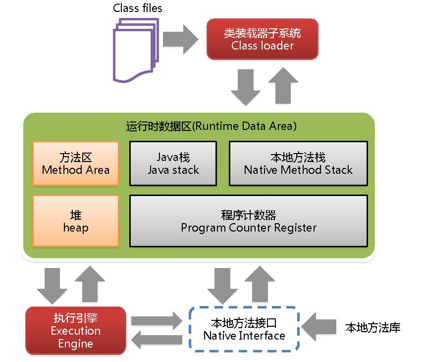

- 类加载器（ClassLoader）
- 运行时数据区（Runtime Data Area）
  -   - 亮色：进程中的所有线程共享，占用主要空间，存在垃圾回收
  -   - 灰色：线程私有，占用少量空间，一般不存在垃圾回收
- 执行引擎（Execution Engine）
- 本地方法接口（Native Interface）

组件的作用： `类加载器`负责检查并加载符合要求的类到内存。`运行时数据区`**是JVM的重点**，我们编写的所有程序都被加载到这里，之后才开始运行。`执行引擎`将字节码翻译成底层系统指令，再交由 CPU 去执行，而这个过程中需要调用其他语言的`本地方法接口`，从而实现整个程序的功能。

## 一、运行时数据区域

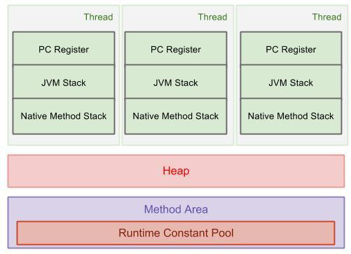

**线程私有的**：程序计数器、虚拟机栈、本地方法栈

**线程共享的**：堆方法、区

### 程序计数器

指向**当前线程**正在执行的字节码的行号。如果当前线程执行的是native方法，则其值为null。

作用：

- 流程控制：字节码解释器通过改变程序计数器的值来选取下一条需要执行的字节码指令，分支、循环、跳转、异常处理、线程恢复等功能都依赖程序计数器。
- 线程恢复：指向当前线程执行的位置。

**程序计数器是唯一一个不报OutOfMemoryError的JVM内存区域。**

### Java 虚拟机栈

其生命周期与线程一致。存储**当前线程**执行**方法**时所需要的数据，指令，返回地址。内部结构是**栈帧**(stack frame)，包含：**局部变量表、操作数栈、动态链接、方法出口**。如下图：

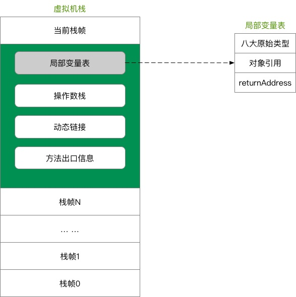

- 局部变量表：存放了八大基本数据类型（boolean、byte、char、short、int、float、long、double）、对象引用(指向对象起始地址的一个指针、或代表对象的句柄、或其他与对象相关联的位置)和returnAddress类型（指向一条字节码指令的地址）；局部变量表的单位存储空间是4字节，刚好可以放一个int类型，所以long和double类型的数据会占用2个局部变量空间（Slot），局部变量表所需的内存空间在编译器就已经确定了
- 操作数栈：主要用来存储运算结果以及运算的操作数，它不同于局部变量表通过索引来访问，而是压栈和出栈的方式
- 每个栈帧都包含一个指向运行时常量池中该栈帧所属方法的引用，持有这个引用是为了支持方法调用过程中的动态链接。动态链接就是将常量池中的符号引用在运行期转化为直接引用。

一个方法对应一个栈帧，每次方法调用会有对应的栈帧被压入栈，调用结束则弹出，return和throw都会导致栈帧被弹出。

可以通过 -Xss 这个虚拟机参数来指定每个线程的 Java 虚拟机栈内存大小，默认为 1M：`java -Xss2M HackTheJava`

该区域可能抛出以下异常：

- 当线程请求的栈深度超过最大值，会抛出 StackOverflowError 异常；
- 栈进行动态扩展时如果无法申请到足够内存，会抛出 OutOfMemoryError 异常。HotSpot虚拟机的栈容量不允许动态控制，除非初始申请时空间就不够报OOM，一般只会报SOF。

### 本地方法栈

作用类似 Java 虚拟机栈，它们之间的区别只不过是本地方法栈为**当前线程**的native方法服务。在HotSpot虚拟机中两者合二为一。

### 堆

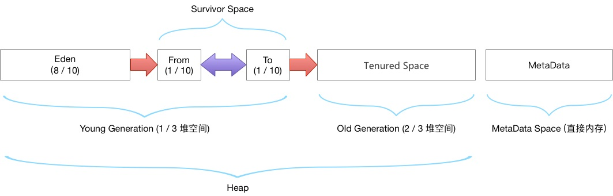

堆是JVM内存占用**最大**，**最复杂**的一块区域。其唯一的用途就是存放对象实例：**几乎所有**的对象实例及数组都在堆上进行分配。JDK1.7后，字符串常量池从永久代中剥离出来，存放在堆中。堆有自己进一步的内存分块划分，按照GC分代收集角度的划分请参见上图。

命令行上执行如下命令，查看所有默认的jvm参数

```
java -XX:+PrintFlagsFinal -version

[Global flags]
    uintx InitialSurvivorRatio   = 8                   {product}
    uintx NewRatio               = 2                   {product}
    ... ...
java version "1.8.0_91"
Java(TM) SE Runtime Environment (build 1.8.0_91-b14)
Java HotSpot(TM) 64-Bit Server VM (build 25.91-b14, mixed mode)
```

参数解释：

| 参数                     | 作用                              |
| ------------------------ | --------------------------------- |
| -XX:InitialSurvivorRatio | 新生代Eden/Survivor空间的初始比例 |
| -XX:Newratio             | Old区 和 Yong区 的内存比例        |

堆不需要连续内存，并且可以动态增加其内存，如果在堆中没有内存来完成实例分配，并且堆无法再扩展，会抛出 OutOfMemoryError 异常。

可以通过 -Xms 和 -Xmx 这两个虚拟机参数来指定一个程序的堆内存大小，第一个参数设置初始值，第二个参数设置最大值。

```java
java -Xms1M -Xmx2M HackTheJava
```

### 方法区

用于存放已被加载的**类信息、常量、静态变量、即时编译器编译后的代码等数据**。

方法区和堆一样不需要连续的内存，并且可以动态扩展，动态扩展失败一样会抛出 OutOfMemoryError 异常。

对这块区域进行垃圾回收的主要目标是对常量池的回收和对类的卸载，但是一般比较难实现。

**方法区是一个 JVM 规范，永久代与元空间都是其一种实现方式**。**在 JDK 1.8 之后，原来永久代的数据被分到了堆和元空间中。元空间存储类的元信息，静态变量和常量池等放入堆中。**

为什么要将永久代替换为元空间：永久代受限于JVM的内存大小，元空间使用直接内存，可以单独调整所需空间大小，可以方便管理、不占用JVM内存空间；另一个原因是JDK8将HotSpot与JRocket合并代码时，JRocket并没有永久代，合并之后也没必要设置永久代了。

### 运行时常量池

方法区的一部分，Class 文件中的常量池（编译器生成的字面量和符号引用）会在类加载后被放入这个区域。运行时常量池在不同商用虚拟机中实现各有不同。在HotSpot虚拟机中，JDK1.7开始，字符串常量池从永久代转到堆中，其他则仍在在永久代，而这些在JDK1.8中又转移到元空间。

JVM运行时常量池(除字符串常量池)存放的是对象引用，而非对象本身。

**当常量池无法再申请到内存时也会抛出OutOfMemoryError异常**

### 直接内存

直接内存并不是JVM运行时数据区的部分，但这部分被经常使用，也可能导致OOM，姑且一起讨论。

JDK 1.4 新加入的的NIO 类，引入了一种基于通道(channel)和缓冲区(buffer)的I/O方式，可以使用 Native 函数库直接分配堆外内存，然后通过 Java 堆里的 DirectByteBuffer 对象作为这块内存的引用进行操作。这样能在一些场景中显著提高性能，因为避免了在堆内存和堆外内存来回拷贝数据。

面试题：堆内存和栈内存的区别⭐

1. 栈内存存储的是局部变量而堆内存存储的是实体；
2. 栈内存的更新速度要快于堆内存，因为局部变量的生命周期很短；
3. 栈内存存放的变量生命周期一旦结束就会被释放，而堆内存存放的实体会被垃圾回收机制不定时的回收。

## 二、垃圾回收

垃圾收集主要是针对堆和方法区进行。程序计数器、虚拟机栈和本地方法栈这三个区域属于线程私有的，只存在于线程的生命周期内，线程结束之后就会消失，因此不需要对这三个区域进行垃圾回收。

### 判断一个对象是否可被回收

#### 1. 引用计数算法

为对象添加一个引用计数器，当对象增加一个引用时计数器加 1，引用失效时计数器减 1。引用计数为 0 的对象可被回收。

在两个对象出现循环引用的情况下，此时引用计数器永远不为 0，导致无法对它们进行回收。**正是因为循环引用的存在，因此 Java 虚拟机不使用引用计数算法。**

```java
public class Test {

    public Object instance = null;

    public static void main(String[] args) {
        Test a = new Test();
        Test b = new Test();
        a.instance = b;
        b.instance = a;
        a = null;
        b = null;
        doSomething();
    }
}
```

在上述代码中，a 与 b 引用的对象实例互相持有了对象的引用，因此当我们把对 a 对象与 b 对象的引用去除之后，由于两个对象还存在互相之间的引用，导致两个 Test 对象无法被回收。

#### 2. 可达性分析算法

以 GC Roots 为起始点进行搜索，可达的对象都是存活的，不可达的对象可被回收。

**Java 虚拟机使用该算法来判断对象是否可被回收**，GC Roots 一般包含以下内容：

- 虚拟机栈中本地变量表中引用的对象
- 本地方法栈中 JNI 中引用的对象
- 方法区中类静态属性引用的对象
- 方法区中的常量引用的对象

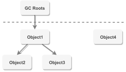

方法区的回收：因为方法区主要存放永久代对象，而永久代对象的回收率比新生代低很多，所以在方法区上进行回收性价比不高。

**主要是对常量池的回收和对类的卸载**。

为了避免内存溢出，在大量使用反射和动态代理的场景都需要虚拟机具备类卸载功能。

类的卸载条件很多，需要满足以下三个条件，并且满足了条件也不一定会被卸载：

- 该类所有的实例都已经被回收，此时堆中不存在该类的任何实例。
- 加载该类的ClassLoader已经被回收。
- 该类对应的 Class 对象没有在任何地方被引用，也就无法在任何地方通过反射访问该类方法。

### 引用类型

无论是通过引用计数算法判断对象的引用数量，还是通过可达性分析算法判断对象是否可达，判定对象是否可被回收都与引用有关。

Java 提供了四种强度不同的引用类型。

#### 1. 强引用

被强引用关联的对象不会被回收。使用 new 一个新对象的方式来创建强引用。

```java
Object obj = new Object();
```

#### 2. 软引用

被软引用关联的对象只有在内存不够的情况下才会被回收。使用 SoftReference 类来创建软引用。

```java
Object obj = new Object();
SoftReference<Object> sf = new SoftReference<Object>(obj);
obj = null;  // 使对象只被软引用关联
```

#### 3. 弱引用

被弱引用关联的对象在下次垃圾回收时一定会被回收。使用 WeakReference 类来创建弱引用。

```java
Object obj = new Object();
WeakReference<Object> wf = new WeakReference<Object>(obj);
obj = null;
```

#### 4. 虚引用

又称为幽灵引用或者幻影引用，一个对象是否有虚引用的存在，不会对其生存时间造成影响，也无法通过虚引用得到一个对象。为一个对象设置虚引用的唯一目的是能在这个对象被回收时收到一个系统通知。

使用 PhantomReference 来创建虚引用。

```java
Object obj = new Object();
PhantomReference<Object> pf = new PhantomReference<Object>(obj, null);
obj = null;
```

### 垃圾收集算法

看书重新整理

#### 1. 标记 - 清除

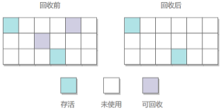

在标记阶段，程序利用可达性遍历堆内存，把“存活”对象和“垃圾”对象进行标记。

在清除阶段，会进行对象回收并取消标志位，另外，还会判断回收后的分块与前一个空闲分块是否连续，若连续，会合并这两个分块。**回收对象就是把对象作为分块**，连接到被称为 “空闲链表” 的单向链表，之后进行分配时只需要遍历这个空闲链表，就可以找到分块。

在分配时，程序会搜索空闲链表寻找空间大于等于新对象大小 size 的块 block。如果它找到的块等于 size，会直接返回这个分块；如果找到的块大于 size，会将块分割成大小为 size 与 (block - size) 的两部分，返回大小为 size 的分块，并把大小为 (block - size) 的块返回给空闲链表。

不足：

- 标记和清除过程效率都不高；
- **会产生大量不连续的内存碎片**，导致无法给大对象分配内存。

#### 2.复制

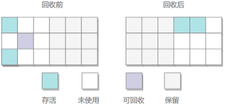

将内存划分为大小相等的两块，每次只使用其中一块，当这一块内存用完了就将还存活的对象复制到另一块上面，然后再把使用过的内存空间进行一次清理。因此不容易产生内存碎片问题。

**主要不足是只使用了内存的一半。适合存活对象少，垃圾多的情况**，只需要堆存活对象进行复制。

现在的商业虚拟机都采用这种收集算法**回收新生代**，但是并不是划分为大小相等的两块，而是一块较大的 Eden 空间和两块较小的 Survivor 空间，每次使用 Eden 和其中一块 Survivor。在回收时，将 Eden 和 Survivor 中还存活着的对象全部复制到另一块 Survivor 上，最后清理 Eden 和使用过的那一块 Survivor。

HotSpot 虚拟机的 Eden 和 Survivor 大小比例默认为 8:1，保证了内存的利用率达到 90%。如果每次回收有多于 10% 的对象存活，那么一块 Survivor 就不够用了，此时需要依赖于老年代进行空间分配担保，也就是借用老年代的空间存储放不下的对象。

#### 3. 标记 - 整理

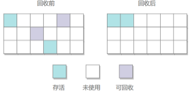

根据老年代特点提出的一种标记算法，标记过程与"标记清除"一致，在整理阶段，让所有存活的对象都向一端移动，然后直接清理掉端边界以外的内存。

优点：**不会产生内存碎片**

不足：如果存活对象多，需要移动大量对象，影响效率。

#### 4. 分代回收

分代回收根据年轻代和老年代的特点选择合适的垃圾回收算法。

- 年轻代的特点是垃圾多，存活少，因此适合复制算法，只需复制少量对象即可完成垃圾回收。
- 老年代的特点是垃圾少，存活多，且没有额外的空间进行分配担保，只能使用标记整理或标记清除算法。

延伸问题：为什么Hotspot要将堆分为老年代和新生代？

根据垃圾回收特点回答。

### 垃圾回收过程

GC过程：创建对象进入Eden，触发minorGC时，存活的对象进入Survivor并年龄加1，再次minorGC，Eden和From存活对象进入To，年龄达到一定阈值(默认15岁)，对象晋升到老年区，晋升阈值通过-XX:MaxTenuringThreshold来设置.

> 细节：HotSpot遍历所有对象，按年龄从大到小对各年龄段所占用的大小进行累计，当累计内存超过survivor区的一半时，取此时的年龄与默认阈值的较小数作为新的晋升年龄。
>

在GC开始的时候，对象只会存在于Eden区和名为“From”的Survivor区，Survivor区“To”是空的。紧接着进行GC，Eden区中所有存活的对象都会被复制到“To”，而在“From”区中，仍存活的对象会根据他们的年龄值来决定去向。年龄达到一定值(年龄阈值可以通过-XX: MaxTenuringThreshold来设置)的对象会被移动到年老代中，没有达到阈值的对象会被复制到“To”区域。经过这次GC后，Eden区和From区已经被清空。这个时候，“From”和“To”会交换他们的角色，也就是新的“To”就是上次GC前的“From”，新的“From”就是上次GC前的“To”。不管怎样，都会**保证名为To的Survivor区域是空的**。Minor GC会一直重复这样的过程，直到“To”区被填满，“To”区被填满之后，会将所有对象移动到年老代中。

### 垃圾收集器

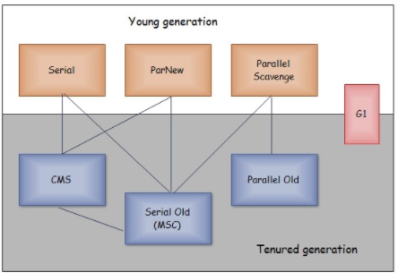

以上是 HotSpot 虚拟机中的 7 个垃圾收集器，连线表示垃圾收集器可以配合使用。

- 单线程与多线程：单线程指的是垃圾收集器只使用一个线程，而多线程使用多个线程；
- 串行与并行：串行指的是垃圾收集器与用户程序交替执行，这意味着在执行垃圾收集的时候需要停顿用户程序；并行指的是垃圾收集器和用户程序同时执行。**除了 CMS 和 G1 之外，其它垃圾收集器都是以串行的方式执行。**

**新生代垃圾回收器和老生代垃圾回收器都有哪些？有什么区别？**

- 新生代回收器：Serial、ParNew、Parallel Scavenge
- 老年代回收器：Serial Old、Parallel Old、CMS
- 整堆回收器：G1

#### 1. Serial


最古老的垃圾收集器，它是**单线程的收集器**，单线程不仅意味着只是用一个线程进行垃圾回收，还会在进行垃圾回收时暂停其他所有工作线程(stop the world)，直到GC完成为止。

它的优点是简单高效，在单个 CPU 环境下，由于没有线程交互的开销，因此拥有最高的单线程收集效率。

Serial对于运行在Client模式下的虚拟机来说是个不错的选择。

#### 2. ParNew 收集器


它是 **Serial 收集器的多线程版本**。除了使用多线程进行垃圾回收外，其余行为(控制参数、收集算法、回收策略等等)与Serial完全一致。

ParNew是许多运行在Server模式下的虚拟机的首要选择，除了Serial之外，只有它能与CMS配合使用。

#### 3. Parallel Scavenge 收集器

与 ParNew 一样是多线程收集器。

多数收集器以最短停顿时间优先，而ParNew是**吞吐量优先**的收集器。吞吐量指高效利用CPU。

停顿时间越短就越适合需要与用户交互的程序，良好的响应速度能提升用户体验。而高吞吐量则可以高效率地利用 CPU 时间，尽快完成程序的运算任务，适合在后台运算而不需要太多交互的任务。

缩短停顿时间是以牺牲吞吐量和新生代空间来换取的：新生代空间变小，垃圾回收变得频繁，导致吞吐量下降。

可以通过一个开关参数打开 GC 自适应的调节策略（GC Ergonomics），就不需要手工指定新生代的大小（-Xmn）、Eden 和 Survivor 区的比例、晋升老年代对象年龄等细节参数了。虚拟机会根据当前系统的运行情况收集性能监控信息，动态调整这些参数以提供最合适的停顿时间或者最大的吞吐量。

parallel scavenge 提供了很多参数供用户找到最合适的停顿时间或最大吞吐量，如果对收集器运作不太了解，手工优化存在困难的时候，可以使用parallel scavenge配合自适应调节策略，把内存管理优化交给虚拟机去完成。

parallel scavenge+parallel old是jdk8的默认收集器。

#### 4. Serial Old 收集器

是 Serial 收集器的老年代版本，也是给 Client 场景下的虚拟机使用。如果用在 Server 场景下，它有两大用途：

- 在 JDK 1.5 以及之前版本（Parallel Old 诞生以前）中与 Parallel Scavenge 收集器搭配使用。
- 作为 CMS 收集器的后备预案，在并发回收发生 Concurrent Mode Failure 时使用。

#### 5. Parallel Old 收集器


是 Parallel Scavenge 收集器的老年代版本。

在注重吞吐量以及 CPU 资源敏感的场合，都可以优先考虑 Parallel Scavenge 加 Parallel Old 收集器。

#### 6. CMS 收集器⭐


CMS（Concurrent Mark Sweep），并发标记清除。

CMS是HotSpot虚拟机第一款真正意义上的并发收集器，它第一次实现了让垃圾收集线程与用户线程(几乎)同时工作。CMS以**最短回收停顿时间**为目标。在整个过程中耗时最长的并发标记和并发清除过程中，收集器线程都可以与用户线程一起工作，不需要进行停顿。非常适用于注重用户体验的应用。如**要求服务器响应速度**的应用。在启动 JVM 的参数加上“-XX:+UseConcMarkSweepGC”来指定使用 CMS 垃圾回收器。

分为以下四个流程：

- 初始标记：记录直接与GC Roots相连的对象，速度很快，需要停顿所有其他线程。
- 并发标记：进行 GC Roots Tracing 的过程，它在整个回收过程中耗时最长，不需要停顿其他线程。
- 重新标记：为了修正并发标记期间因用户程序继续运作而导致标记产生变动的那一部分对象的标记记录，需要停顿，比初始标记阶段停顿时间稍长，但远比并发标记阶段耗时短。
- 并发清除：开启用户线程，同时GC线程开始对未标记的区域做清扫，不需要停顿。

主要优点：并发收集、停顿时间短。

CMS具有以下缺点：

- 吞吐量低：低停顿时间是以牺牲吞吐量为代价的，导致 CPU 利用率不够高。
- 无法处理浮动垃圾，可能出现 Concurrent Mode Failure。浮动垃圾是指并发清除阶段由于用户线程继续运行而产生的垃圾，这部分垃圾只能到下一次 GC 时才能进行回收。由于浮动垃圾的存在，因此需要预留出一部分内存，意味着 CMS 收集不能像其它收集器那样等待老年代快满的时候再回收。如果预留的内存不够存放浮动垃圾，就会出现 Concurrent Mode Failure，这时虚拟机将临时启用 Serial Old 来替代 CMS。
- 标记 - 清除算法导致的空间碎片，往往出现老年代空间剩余，但无法找到足够大连续空间来分配当前对象，不得不提前触发一次 Full GC。

#### 7. G1 收集器⭐

G1（Garbage-First），它是一款面向服务端应用的垃圾收集器，**在多 CPU 和大内存的场景下有很好的性能**。HotSpot 开发团队赋予它的使命是未来可以替换掉 CMS 收集器。

具备如下特点：

- 并行与并发：G1能充分利用CPU、多核环境下的硬件优势，使用多个CPU来缩短stop the world的停顿时间。部分其他收集器原本需要停顿Java线程执行的GC动作，G1收集器仍然可以通过并发的方式让Java程序继续执行。
- 分代收集：虽然G1可以不需要其他收集器配合就能独立管理整个GC堆，但是还是保留了分代的概念。
- 空间整合：G1从整体看是基于标记整理算法实现的，从局部看是基于复制算法实现的。
- 可预测的停顿：这是G1相对于CMS的另一个大优势，降低停顿时间是G1和CMS共同的关注点，但G1除了追求低停顿外，还能建立可预测的停顿时间模型，能让使用者明确指定在一个长度为M毫秒的时间片段内。

其它收集器进行收集的范围都是整个新生代或者老年代，而 **G1 可以直接对新生代和老年代一起回收。**

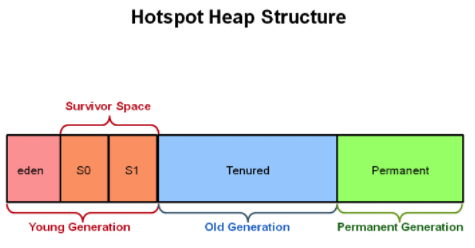

G1 把堆划分成多个大小相等的独立区域（Region），新生代和老年代不再物理隔离。

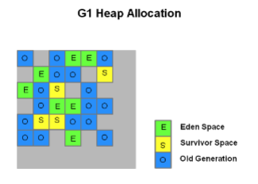

通过引入 Region 的概念，从而将原来的一整块内存空间划分成多个的小空间，使得每个小空间可以单独进行垃圾回收。这种划分方法带来了很大的灵活性，使得可预测的停顿时间模型成为可能。通过记录每个 Region 垃圾回收时间以及回收所获得的空间（这两个值是通过过去回收的经验获得），并维护一个优先列表，每次根据允许的收集时间，优先回收价值最大的 Region。

每个 Region 都有一个 Remembered Set，用来记录该 Region 对象的引用对象所在的 Region。通过使用 Remembered Set，在做可达性分析的时候就可以避免全堆扫描。

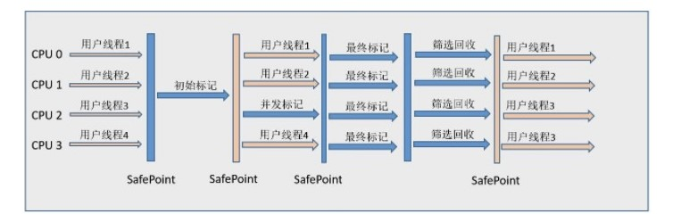

如果不计算维护 Remembered Set 的操作，G1 收集器的运作大致可划分为以下几个步骤：

- 初始标记
- 并发标记
- 最终标记：为了修正在并发标记期间因用户程序继续运作而导致标记产生变动的那一部分标记记录，虚拟机将这段时间对象变化记录在线程的 Remembered Set Logs 里面，最终标记阶段需要把 Remembered Set Logs 的数据合并到 Remembered Set 中。这阶段需要停顿线程，但是可并行执行。
- 筛选回收：首先对各个 Region 中的回收价值和成本进行排序，根据用户所期望的 GC 停顿时间来制定回收计划。此阶段其实也可以做到与用户程序一起并发执行，但是因为只回收一部分 Region，时间是用户可控制的，而且停顿用户线程将大幅度提高收集效率。

#### G1和CMS的比较

1. CMS收集器是获取最短回收停顿时间为目标的收集器，因为CMS工作时，GC工作线程与用户线程可以并发执行，以此来达到降低收集停顿时间的目的（只有初始标记和重新标记会STW）。但是CMS收集器对CPU资源非常敏感。在并发阶段，虽然不会导致用户线程停顿，但是会占用CPU资源而导致引用程序变慢，总吞吐量下降。
2. CMS仅作用于老年代，是基于标记清除算法，所以清理的过程中会有大量的空间碎片。
3. CMS收集器无法处理浮动垃圾，由于CMS并发清理阶段用户线程还在运行，伴随程序的运行自热会有新的垃圾不断产生，这一部分垃圾出现在标记过程之后，CMS无法在本次收集中处理它们，只好留待下一次GC时将其清理掉。
4. G1适用于多核处理器、大内存容量的服务端系统。G1能充分利用CPU、多核环境下的硬件优势，使用多个CPU来缩短STW的停顿时间，它满足短时间停顿的同时达到一个高的吞吐量。
5. 从JDK 9开始，G1成为默认的垃圾回收器。当应用有以下任何一种特性时非常适合用G1：**Full GC持续时间太长或者太频繁**；对象的创建速率和存活率变动很大；应用不希望停顿时间长(长于0.5s甚至1s)。
6. G1将空间划分成很多块（Region），然后他们各自进行回收。整体上看属于标记整理算法,局部(region之间)属于复制算法。堆比较大的时候可以采用复制算法，碎片化问题不严重。
7. G1 需要记忆集 (具体来说是卡表)来记录新生代和老年代之间的引用关系，这种数据结构在 G1 中需要占用大量的内存，可能达到整个堆内存容量的 20% 甚至更多。而且 G1 中维护记忆集的成本较高，带来了更高的执行负载，影响效率。所以 CMS 在小内存应用上的表现要优于 G1，而大内存应用上 G1 更有优势，大小内存的界限是6GB到8GB。

## 三、内存分配与回收策略

### Minor GC 和 Full GC

- Minor GC：**回收新生代**，因为新生代对象存活时间很短，因此 Minor GC 会**频繁执行**，执行的速度一般也会比较**快**。
- Full GC：**回收老年代和新生代**，老年代对象其存活时间长，因此 Full GC **很少执行**，执行速度会比 Minor GC **慢很多**。

### 内存分配策略

#### 1. 对象优先在 Eden 分配

大多数情况下，对象在新生代 Eden 上分配，当 Eden 空间不够时，发起 Minor GC。

#### 2. 大对象直接进入老年代

大对象是指需要连续内存空间的对象，最典型的大对象是那种很长的字符串以及数组。

经常出现大对象会提前触发垃圾收集以获取足够的连续空间分配给大对象。

-XX:PretenureSizeThreshold，大于此值的对象直接在老年代分配，避免在 Eden 和 Survivor 之间的大量内存复制。

#### 3. 长期存活的对象进入老年代

虚拟机为每个对象维护一个年龄计数器，对象在 Eden 出生后，每熬过一次Minor GC，年龄就增加 1 岁，当它的年龄达到阈值(由`-XX:MaxTenuringThreshold`设定，parallel为15，CMS为6)，就会晋升到老年代中。

#### 4. 动态对象年龄判定

虚拟机并不是永远要求对象的年龄必须达到 MaxTenuringThreshold 才能晋升老年代，如果在 Survivor 中相同年龄所有对象大小的总和大于 Survivor 空间的一半，则年龄大于或等于该年龄的对象可以直接进入老年代，无需等到 MaxTenuringThreshold 中要求的年龄。

#### 5. 空间分配担保

在发生 Minor GC 之前，虚拟机先检查老年代最大可用的连续空间是否大于新生代所有对象总空间，如果条件成立的话，那么 Minor GC 可以确认是安全的。

如果不成立的话虚拟机会查看 HandlePromotionFailure 的值是否允许担保失败，如果允许那么就会继续检查老年代最大可用的连续空间是否大于历次晋升到老年代对象的平均大小，如果大于，将尝试着进行一次 Minor GC；如果小于，或者 HandlePromotionFailure 的值不允许冒险，那么就要进行一次 Full GC。

### Minor GC和Full GC 的触发条件⭐

对于 Minor GC，其触发条件非常简单，当 Eden 空间满时，就将触发一次 Minor GC。而 Full GC 则相对复杂，有以下条件：

**1.调用 System.gc()**

只是建议虚拟机执行 Full GC，但是虚拟机不一定真正去执行。不建议使用这种方式，而是让虚拟机管理内存。

**2.老年代空间不足**

老年代空间不足的常见场景为前文所讲的大对象直接进入老年代、长期存活的对象进入老年代等。

为了避免以上原因引起的 Full GC，应当尽量不要创建过大的对象以及数组。除此之外，可以通过 -Xmn 虚拟机参数调大新生代的大小，让对象尽量在新生代被回收掉，不进入老年代。还可以通过 -XX:MaxTenuringThreshold 调大对象进入老年代的年龄，让对象在新生代多存活一段时间。

**3.方法区空间不足**

在 JDK 1.7 及以前，HotSpot 虚拟机中的方法区是用永久代实现的，永久代中存放的为一些 Class 的信息、常量、静态变量等数据。

当系统中要加载的类、反射的类和调用的方法较多时，永久代可能会被占满，在未配置为采用 CMS GC 的情况下也会执行 Full GC。如果经过 Full GC 仍然回收不了，那么虚拟机会抛出 java.lang.OutOfMemoryError。

为避免以上原因引起的 Full GC，可采用的方法为增大永久代空间或转为使用 CMS GC。

从JDK8开始，永久代(PermGen)的概念被废弃掉了，取而代之的是一个称为Metaspace的存储空间。Metaspace使用的是本地内存，而不是堆内存，也就是说在默认情况下Metaspace的大小只与本地内存大小有关。-XX:MetaspaceSize=21810376B（约为20.8MB）超过这个值就会引发Full GC，这个值不是固定的，是会随着JVM的运行进行动态调整的，与此相关的参数还有多个，详细情况请参考这篇文章[jdk8 Metaspace 调优](https://blog.csdn.net/bolg_hero/article/details/78189621)

**4.统计得到的Minor GC后晋升到老年代的平均大小大于老年代的可用内存**。

Survivor区域对象晋升到老年代有两种情况：

1. 一种是给每个对象定义一个对象计数器，如果对象在Eden区域出生，并且经过了第一次GC，那么就将他的年龄设置为1，在Survivor区域的对象每熬过一次GC，年龄计数器加一，等到到达默认值15时，就会被移动到老年代中，默认值可以通过-XX:MaxTenuringThreshold来设置。
2. 另外一种情况是如果JVM发现Survivor区域中的相同年龄的对象占到所有对象的一半以上时，就会将大于这个年龄的对象移动到老年代，在这批对象在统计后发现可以晋升到老年代，但是发现老年代没有足够的空间来放置这些对象，这就会引起Full GC。

**5.Minor GC时，eden space和from space区大小大于to space且大于老年代内存，触发Full GC。**

**6.CMS GC时出现promotion failed和concurrent mode failure**

这个原因引发的Full GC可以参考这篇文章，下面也摘抄自这篇文章：[JVM 调优 —— GC 长时间停顿问题及解决方法](http://www.importnew.com/22886.html)

1. **提升失败（promotion failed），**在 Minor GC 过程中，Survivor Unused 可能不足以容纳 Eden 和另一个 Survivor 中的存活对象， 那么多余的将被移到老年代， 称为过早提升（Premature Promotion）。 这会导致老年代中短期存活对象的增长， 可能会引发严重的性能问题。  再进一步， 如果老年代满了， Minor GC 后会进行 Full GC， 这将导致遍历整个堆， 称为提升失败（Promotion Failure）。
2. 在 CMS 启动过程中，新生代提升速度过快，老年代收集速度赶不上新生代提升速度。在 CMS 启动过程中，老年代碎片化严重，无法容纳新生代提升上来的大对象，这是因为CMS采用标记清理，会产生连续空间不足的情况，这也是CMS的缺点

总结：可以发现其实堆内存的Full GC一般都是**两个原因**引起的，**要么是老年代内存过小，要么是老年代连续内存过小。**无非是这两点，而元数据区Metaspace引发的Full GC可能是阈值引起的，详细原因还是建议参考其他文章，我就不误人子弟了。

## 四、类加载机制

类是在运行期间**第一次使用时**动态加载的，而不是一次性加载所有类。因为如果一次性加载，那么会占用很多的内存。

### 类的生命周期

包括7个阶段：加载(Loading)、验证(Verification)、准备(Preparation)、解析(Resolution)、初始化(initialization)、使用(Using)、(卸载)。

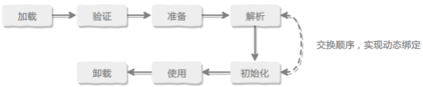

### 类加载过程

包含了加载、验证、准备、解析和初始化这 5 个阶段。

1. 加载：根据查找路径找到相应的 class 文件然后导入；
2. 验证：验证加载的 class 文件的正确性；
3. 准备：给类中的静态变量分配内存空间；
4. 解析：虚拟机将常量池中的符号引用替换成直接引用的过程。符号引用就理解为一个标示，而在直接引用直接指向内存中的地址；
5. 初始化：对静态变量和静态代码块执行初始化工作。

#### 1. 加载

加载过程完成以下三件事：

- 通过类的完全限定名称获取定义该类的二进制字节流。
- 将该字节流表示的静态存储结构转换为方法区的运行时存储结构。
- 在内存中生成一个代表该类的 **Class 对象**，作为方法区中该类各种数据的访问入口。

其中二进制字节流可以从以下方式中获取：

- 从 ZIP 包读取，成为 JAR、EAR、WAR 格式的基础。
- 从网络中获取，最典型的应用是 Applet。
- 运行时计算生成，例如动态代理技术，在 java.lang.reflect.Proxy 使用 ProxyGenerator.generateProxyClass 的代理类的二进制字节流。
- 由其他文件生成，例如由 JSP 文件生成对应的 Class 类。

#### 2. 验证

确保 Class 文件的字节流中包含的信息符合当前虚拟机的要求，并且不会危害虚拟机自身的安全。

#### 3. 准备

类变量是被 static 修饰的变量，准备阶段为类变量分配内存并设置初始值，使用的是方法区的内存。

实例变量不会在这阶段分配内存，它会在对象实例化时随着对象一起被分配在堆中。应该注意到，实例化不是类加载的一个过程，类加载发生在所有实例化操作之前，并且类加载只进行一次，实例化可以进行多次。

初始值一般为 0 值，例如下面的类变量 value 被初始化为 0 而不是 123。

```java
public static int value = 123;
```

如果类变量是常量，那么它将初始化为表达式所定义的值而不是 0。例如下面的常量 value 被初始化为 123 而不是 0。

```java
public static final int value = 123;
```

#### 4. 解析

将常量池的符号引用替换为直接引用的过程。

其中解析过程在某些情况下可以在初始化阶段之后再开始，这是为了支持 Java 的动态绑定。

补充为什么可以支持动态绑定

#### 5. 初始化

初始化阶段才真正开始执行类中定义的 Java 程序代码。初始化阶段是虚拟机执行类构造器 `<clinit>()`方法的过程。在准备阶段，类变量已经赋过一次系统要求的初始值，而在初始化阶段，根据程序员通过程序制定的主观计划去初始化类变量和其它资源。

`<clinit>()` 是由编译器自动收集类中所有类变量的赋值动作和静态语句块中的语句合并产生的，编译器收集的顺序由语句在源文件中出现的顺序决定。特别注意的是，静态语句块只能访问到定义在它之前的类变量，定义在它之后的类变量只能赋值，不能访问。例如以下代码：

```java
public class Test {
    static {
        i = 0;                // 给变量赋值可以正常编译通过
        System.out.print(i);  // 这句编译器会提示“非法向前引用”
    }
    static int i = 1;
}
```

由于父类的 `<clinit>()` 方法先执行，也就意味着父类中定义的静态语句块的执行要优先于子类。例如以下代码：

```java
static class Parent {
    public static int A = 1;
    static {
        A = 2;
    }
}

static class Sub extends Parent {
    public static int B = A;
}

public static void main(String[] args) {
     System.out.println(Sub.B);  // 2
}
```

接口中不可以使用静态语句块，但仍然有类变量初始化的赋值操作，因此接口与类一样都会生成 &lt;clinit>() 方法。但接口与类不同的是，执行接口的 &lt;clinit>() 方法不需要先执行父接口的 &lt;clinit>() 方法。只有当父接口中定义的变量使用时，父接口才会初始化。另外，接口的实现类在初始化时也一样不会执行接口的 &lt;clinit>() 方法。

虚拟机会保证一个类的 &lt;clinit>() 方法在多线程环境下被正确的加锁和同步，如果多个线程同时初始化一个类，只会有一个线程执行这个类的 &lt;clinit>() 方法，其它线程都会阻塞等待，直到活动线程执行 &lt;clinit>() 方法完毕。如果在一个类的 &lt;clinit>() 方法中有耗时的操作，就可能造成多个线程阻塞，在实际过程中此种阻塞很隐蔽。

### 类初始化时机

#### 1. 主动引用

虚拟机规范中并没有强制约束何时进行加载，但是规范严格规定了有且只有下列五种情况必须对类进行初始化（加载、验证、准备都会随之发生）：

- 遇到 new、getstatic、putstatic、invokestatic 这四条字节码指令时，如果类没有进行过初始化，则必须先触发其初始化。最常见的生成这 4 条指令的场景是：使用 new 关键字实例化对象的时候；读取或设置一个类的静态字段（被 final 修饰、已在编译期把结果放入常量池的静态字段除外）的时候；以及调用一个类的静态方法的时候。
- 使用 java.lang.reflect 包的方法对类进行反射调用的时候，如果类没有进行初始化，则需要先触发其初始化。
- 当初始化一个类的时候，如果发现其父类还没有进行过初始化，则需要先触发其父类的初始化。
- 当虚拟机启动时，用户需要指定一个要执行的主类（包含 main() 方法的那个类），虚拟机会先初始化这个主类；
- 当使用 JDK 1.7 的动态语言支持时，如果一个 java.lang.invoke.MethodHandle 实例最后的解析结果为 REF_getStatic, REF_putStatic, REF_invokeStatic 的方法句柄，并且这个方法句柄所对应的类没有进行过初始化，则需要先触发其初始化；

#### 2. 被动引用

以上 5 种场景中的行为称为对一个类进行主动引用。除此之外，所有引用类的方式都不会触发初始化，称为被动引用。被动引用的常见例子包括：

- 通过子类引用父类的静态字段，不会导致子类初始化。

```java
System.out.println(SubClass.value);  // value 字段在 SuperClass 中定义
```

- 通过数组定义来引用类，不会触发此类的初始化。该过程会对数组类进行初始化，数组类是一个由虚拟机自动生成的、直接继承自 Object 的子类，其中包含了数组的属性和方法。

```java
SuperClass[] sca = new SuperClass[10];
```

- 常量在编译阶段会存入调用类的常量池中，本质上并没有直接引用到定义常量的类，因此不会触发定义常量的类的初始化。

```java
System.out.println(ConstClass.HELLOWORLD);
```

### 类与类加载器

两个类相等，需要类本身相等，并且使用同一个类加载器进行加载。这是因为每一个类加载器都拥有一个独立的类名称空间。

这里的相等，包括类的 Class 对象的 equals() 方法、isAssignableFrom() 方法、isInstance() 方法的返回结果为 true，也包括使用 instanceof 关键字做对象所属关系判定结果为 true。

### 类加载器分类

从 Java 虚拟机的角度来讲，只存在以下两种不同的类加载器：

- 启动类加载器（Bootstrap ClassLoader），使用 C++ 实现，是虚拟机自身的一部分；
- 所有其它类的加载器，使用 Java 实现，独立于虚拟机，继承自抽象类 java.lang.ClassLoader。

从 Java 开发人员的角度看，类加载器可以划分得更细致一些：

- 启动类加载器（Bootstrap ClassLoader）此类加载器负责将存放在 &lt;JRE_HOME>\lib 目录中的，或者被 -Xbootclasspath 参数所指定的路径中的，并且是虚拟机识别的（仅按照文件名识别，如 rt.jar，名字不符合的类库即使放在 lib 目录中也不会被加载）类库加载到虚拟机内存中。启动类加载器无法被 Java 程序直接引用，用户在编写自定义类加载器时，如果需要把加载请求委派给启动类加载器，直接使用 null 代替即可。
- 扩展类加载器（Extension ClassLoader）这个类加载器是由 ExtClassLoader（sun.misc.Launcher$ExtClassLoader）实现的。它负责将 &lt;JAVA_HOME>/lib/ext 或者被 java.ext.dir 系统变量所指定路径中的所有类库加载到内存中，开发者可以直接使用扩展类加载器。
- 应用程序类加载器（Application ClassLoader）这个类加载器是由 AppClassLoader（sun.misc.Launcher$AppClassLoader）实现的。由于这个类加载器是 ClassLoader 中的 getSystemClassLoader() 方法的返回值，因此一般称为系统类加载器。它负责加载用户类路径（ClassPath）上所指定的类库，开发者可以直接使用这个类加载器，如果应用程序中没有自定义过自己的类加载器，一般情况下这个就是程序中默认的类加载器。

### 双亲委派模型

应用程序是由三种类加载器互相配合从而实现类加载，除此之外还可以加入自己定义的类加载器。

下图展示了类加载器之间的层次关系，称为双亲委派模型（Parents Delegation Model）。该模型要求除了顶层的启动类加载器外，其它的类加载器都要有自己的父类加载器。这里的父子关系一般通过组合关系（Composition）来实现，而不是继承关系（Inheritance）。

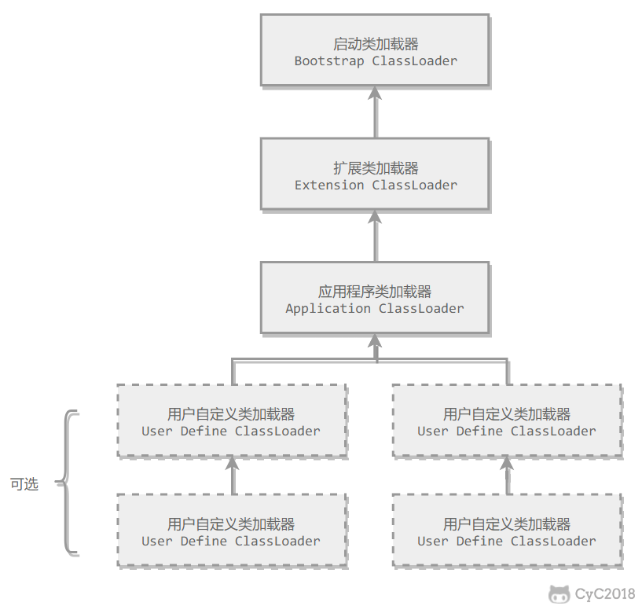

#### 1. 特点

**一个类加载器首先将类加载请求委派给父类加载器，层层向上委派，只有当父类加载器无法完成时才尝试自己加载。**

#### 2. 好处

保证了Java程序的稳定运行，可以避免类的重复加载（JVM 区分不同类的方式不仅仅根据类名，相同的类文件被不同的类加载器加载产生的是两个不同的类）。

保证了 Java 的核心 API 不被篡改。如果没有使用双亲委派模型，而是每个类加载器加载自己的话就会出现一些问题，比如我们编写一个称为 `java.lang.Object` 类的话，那么程序运行的时候，系统就会出现多个不同的 `Object` 类。

#### 3. 实现

以下是抽象类 java.lang.ClassLoader 的代码片段，其中的 loadClass() 方法运行过程如下：先检查类是否已经加载过，如果没有则让父类加载器去加载。当父类加载器加载失败时抛出 ClassNotFoundException，此时尝试自己去加载。

```java
public abstract class ClassLoader {
    // The parent class loader for delegation
    private final ClassLoader parent;

    public Class<?> loadClass(String name) throws ClassNotFoundException {
        return loadClass(name, false);
    }

    protected Class<?> loadClass(String name, boolean resolve) throws ClassNotFoundException {
        synchronized (getClassLoadingLock(name)) {
            // First, check if the class has already been loaded
            Class<?> c = findLoadedClass(name);
            if (c == null) {
                try {
                    if (parent != null) {
                        c = parent.loadClass(name, false);
                    } else {
                        c = findBootstrapClassOrNull(name);
                    }
                } catch (ClassNotFoundException e) {
                    // ClassNotFoundException thrown if class not found
                    // from the non-null parent class loader
                }

                if (c == null) {
                    // If still not found, then invoke findClass in order
                    // to find the class.
                    c = findClass(name);
                }
            }
            if (resolve) {
                resolveClass(c);
            }
            return c;
        }
    }

    protected Class<?> findClass(String name) throws ClassNotFoundException {
        throw new ClassNotFoundException(name);
    }
}
```

### 自定义类加载器实现

除了 `BootstrapClassLoader` 其他类加载器均由 Java 实现且全部继承自`java.lang.ClassLoader`。如果我们要自定义自己的类加载器，很明显需要继承 `ClassLoader`。

如果我们不想打破双亲委派模型，就重写 `ClassLoader` 类中的 `findClass()` 方法即可，无法被父类加载器加载的类最终会通过这个方法被加载。但是，如果想打破双亲委派模型则需要重写 `loadClass()` 方法。

以下代码中的 FileSystemClassLoader 是自定义类加载器，继承自 java.lang.ClassLoader，用于加载文件系统上的类。它首先根据类的全名在文件系统上查找类的字节代码文件（.class 文件），然后读取该文件内容，最后通过 defineClass() 方法来把这些字节代码转换成 java.lang.Class 类的实例。

```java
public class FileSystemClassLoader extends ClassLoader {

    private String rootDir;

    public FileSystemClassLoader(String rootDir) {
        this.rootDir = rootDir;
    }

    protected Class<?> findClass(String name) throws ClassNotFoundException {
        byte[] classData = getClassData(name);
        if (classData == null) {
            throw new ClassNotFoundException();
        } else {
            return defineClass(name, classData, 0, classData.length);
        }
    }

    private byte[] getClassData(String className) {
        String path = classNameToPath(className);
        try {
            InputStream ins = new FileInputStream(path);
            ByteArrayOutputStream baos = new ByteArrayOutputStream();
            int bufferSize = 4096;
            byte[] buffer = new byte[bufferSize];
            int bytesNumRead;
            while ((bytesNumRead = ins.read(buffer)) != -1) {
                baos.write(buffer, 0, bytesNumRead);
            }
            return baos.toByteArray();
        } catch (IOException e) {
            e.printStackTrace();
        }
        return null;
    }

    private String classNameToPath(String className) {
        return rootDir + File.separatorChar
                + className.replace('.', File.separatorChar) + ".class";
    }
}
```

## 五、对象的创建过程

### Step1:类加载检查

虚拟机遇到一条 new 指令时，首先去常量池寻找这个类的符号引用，检查符号引用代表的类是否已被加载、解析和初始化过。如果没有，则先执行相应的**类加载过程**。

### Step2:分配内存

从堆中为新生对象**分配内存**。对象所需的内存大小在类加载完成后便可确定。为对象分配空间的任务等同于把一块确定大小的内存从Java堆中划分出来。**分配方式**有 **“指针碰撞”** 和 **“空闲列表”** 两种。具体采用哪种取决于**堆是否规整**：标记-整理和复制算法是规整的，使用指针碰撞，标记-清除则使用空闲列表。

- 指针碰撞：用一个分界指针将用已用内存和空闲内存分界，分配内存时将指针移动该对象所需空间长度的距离即可
- 空闲列表：虚拟机会维护一个列表，记录了哪些内存块是可用的，在分配的时候，找一块足够大的内存块给该对象，然后更新列表记录。

虚拟机分配内存如何保证线程安全：

- CAS+失败重试：CAS为乐观锁，每次不加锁，而是假设没有冲突去完成某项操作，若因冲突导致失败则重试，直到成功为止。虚拟机采用CAS+失败重试来保证更新操作的原子性。
- TLAB：为每一个线程在Eden预先分配一块内存，JVM在给对象分配内存时，首先在TLAB分配，TLAB剩余内存不足以分配给新对象时，再在堆中采用CAS进行内存分配。

### Step3:初始化零值

内存分配完成后，虚拟机需要将分配到的内存空间都初始化为零值（不包括对象头），这一步操作保证了对象的实例字段在 Java 代码中可以不赋初始值就直接使用，程序能访问到这些字段的数据类型所对应的零值。

### Step4:设置对象头

初始化零值完成之后，**虚拟机要对对象进行必要的设置**，例如这个对象是哪个类的实例、如何才能找到类的元数据信息、对象的哈希码、对象的 GC 分代年龄等信息。 **这些信息存放在对象头中**。另外，根据虚拟机当前运行状态的不同，如是否启用偏向锁等，对象头会有不同的设置方式。

### Step5:执行 init 方法

在上面工作都完成之后，从虚拟机的视角来看，一个新的对象已经产生了，但从 Java 程序的视角来看，对象创建才刚开始，`<init>`方法还没有执行，所有的字段都还为零。所以一般来说，执行 new 指令之后会接着执行`<init>`方法，把对象按照程序员的意愿进行初始化，这样一个真正可用的对象才算完全产生出来。

## 六、对象在内存中的布局

HotSpot虚拟机中，对象在内存中的布局包括：对象头、示例数据、对齐填充

对象头：

- 类型指针：指向类的元数据
- 对象的运行时数据：hash值，GC分代年龄、锁标志状态等

案例数据：存储对象中真正的有效数据，即代码中定义的字段和方法

对齐填充：无特殊含义，仅用于占位，以满足对象的大小必须是8字节的整数倍，由于对象头一定是8字节的整数倍，则当示例数据未对齐时，需要进行对齐填充。

## 七、对象的访问定位

Java程序通过栈上的引用数据来操作堆中的具体对象，对象的访问方式主要由：句柄和直接指针。

句柄：包含对象实例数据和对象类型数据的指针。堆中需要单独划分一块内存作为句柄池，此时栈上的引用数据指向对象句柄的地址。优点是reference指向稳定的句柄地址，对象被移动时只需要修改句柄中的实例数据指针，reference本身无需修改。

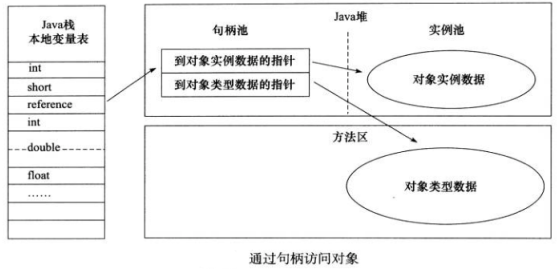

直接指针：栈上引用数据直接指向对象实例，指向类型数据的地址在对象内部。优点是快，节省了一次指针定位的开销。

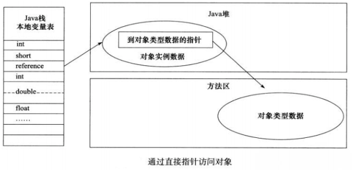

## 八、JVM调优工具

JDK 自带了很多监控工具，都位于 JDK 的 bin 目录下，其中最常用的是 jconsole 和 jvisualvm 这两款视图监控工具。

- jconsole：用于对 JVM 中的内存、线程和类等进行监控；
- jvisualvm：JDK 自带的全能分析工具，可以分析：内存快照、线程快照、程序死锁、监控内存的变化、gc 变化等。

**常用的 jvm 调优的参数都有哪些？**

- -Xms2g：初始化推大小为 2g；
- -Xmx2g：堆最大内存为 2g；
- -XX:NewRatio=4：设置年轻的和老年代的内存比例为 1:4；
- -XX:SurvivorRatio=8：设置新生代 Eden 和 Survivor 比例为 8:2；
- –XX:+UseParNewGC：指定使用 ParNew + Serial Old 垃圾回收器组合；
- -XX:+UseParallelOldGC：指定使用 ParNew + ParNew Old 垃圾回收器组合；
- -XX:+UseConcMarkSweepGC：指定使用 CMS + Serial Old 垃圾回收器组合；
- -XX:+PrintGC：开启打印 gc 信息；
- -XX:+PrintGCDetails：打印 gc 详细信息。