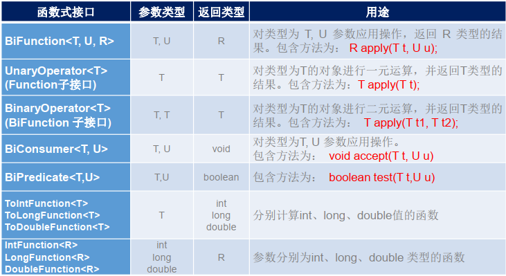
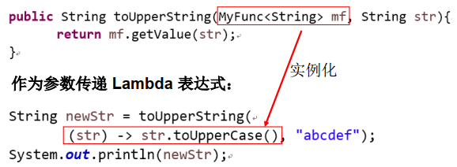
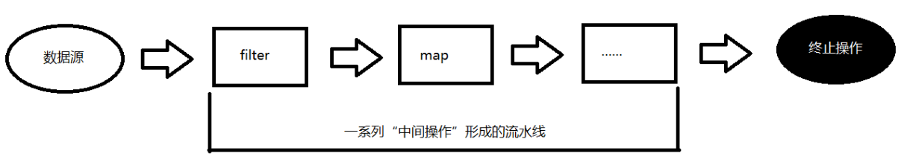
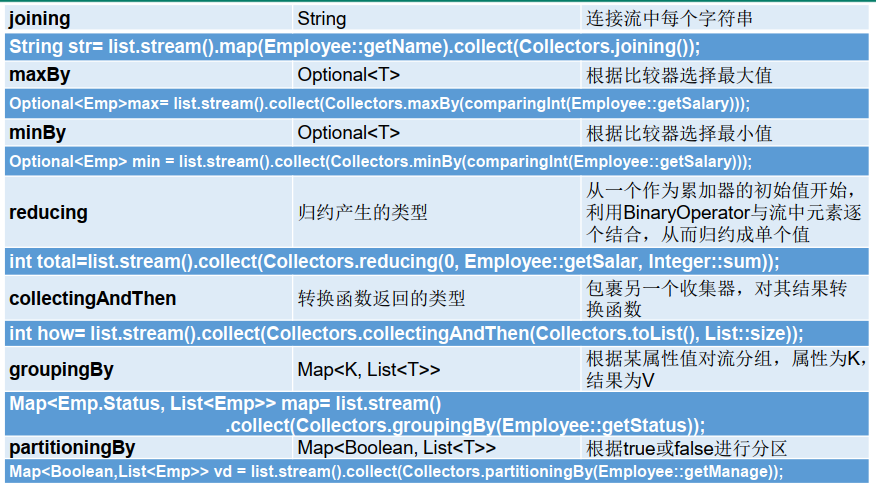

## Lambda表达式

为什么要引入Lambda表达式：把函数式编程风格引入Java，可以简化代码。

Lambda表达式的本质：作为**函数式接口**的实例

Lambda 是一个**匿名函数**，我们可以把 Lambda 表达式理解为是**一段可以传递的代码**（将代码像变量一样进行传递）。使用它可以写出更简洁、更灵活的代码。

Lambda操作符：->

左侧：指定了Lambda表达式需要的参数列表

右侧：指定了Lambda体，是抽象方法的实现逻辑，也即Lambda表达式要执行的功能。

从匿名类到Lambda表达式的转换示例：

```java
//匿名类
Runnable r1 = new Runnable(){
    @Override
    public void run() {
        System.out.println("Hello World!");
    }
};
//Lambda表达式
Runnable r2 = () -> System.out.println("Hello World");
```

### 语法省略

```java
//1.无参或多个参数时，()不能省略，只有一个参数时()可省略
//2.数据类型可推断出时，可以省略
//3.只有一条语句时，大括号可以省略，return关键字可以省略
Runnable r1 = () -> System.out.println("Hello!");
Consumer<String> con = str -> System.out.println(str);
Comparator<Integer> com = (x,y) -> Integer.compare(x,y);
Comparator<Integer> com = (x,y) -> {
    System.out.println("Hello!");
    return Integer.compare(x,y);
};
```

## 函数式(Functional)接口

**只包含一个抽象方法**的接口，称为函数式接口。

函数式接口都可以用Lambda表达式替换。若Lambda表达式抛出一个非运行时异常，那么该异常需要在目标接口的抽象方法上进行声明。

java.util.function包下定义了Java8中的丰富的函数式接口。

可以在一个接口上使用@FunctionalInterface注解，来检查该接口是否是一个函数式接口。同时javadoc也会包含一条声明，说明这个接口是一个函数式接口。

如何理解函数式接口：

在函数式编程语言中，Lambda表达式是一个函数，在Java8中，Lambda表达式是一个函数式接口实例，它必须依赖于函数式接口。

### Java内置四大核心函数式接口：

| 函数式接口                  | 参数类型 | 返回类型 | 用途                                                                              |
| --------------------------- | -------- | -------- | --------------------------------------------------------------------------------- |
| `Consumer<T>` 消费型接口    | T        | void     | 对类型为T的对象应用操作，包含方法：`void accept(T t)`                             |
| `Supplier<T>` 供给型接口    | 无       | T        | 返回类型为T的对象，包含方法： `T get()`                                           |
| `Function<T, R>` 函数型接口 | T        | R        | 对类型为T的对象应用操作，并返回R类型的对象。方法： `R apply(T t)`                 |
| `Predicate<T>` 断定型接口   | T        | boolean  | 确定类型为T的对象是否满足某约束，并返回boolean 值。包含方法： `boolean test(T t)` |

### 其他函数式接口



### 自定义函数式接口

```java
@FunctionnalInterface
public interface MyFunc<T>{
    public T getValue(T t);
}
```

### 作为参数传递Lambda表达式



为了将 Lambda 表达式作为参数传递，接收Lambda表达式的参数类型必须是与该 Lambda 表达式兼容的函数式接口的类型。

## 方法引用与构造器引用

### 方法引用

使用情景：当要传递给Lambda体的操作已经有实现的方法时，可以使用方法引用。

方法引用(method references)本质上就是Lambda表达式，因此方法引用也是函数式接口的实例。

方法引用有三种情况：

- 对象::实例方法
- 类::静态方法
- 类::实例方法

情况1和情况2要求：接口中的抽象方法的形参列表和返回值类型与方法引用的形参列表和返回值类型相同。

情况3要求：当函数式接口方法的第一个参数是需要引用方法的调用者，并且第二个参数是需要引用方法的参数(或无参数)时： ClassName::methodName

```java
//情况1: 对象::实例方法
Consumer<String> con = System.out::println;
//等价于 Consumer<String> con = x -> System.out.println(x);

//情况2：类::静态方法
Comparator<Integer> com = Integer::compare;
//等价于 Comparator<Integer> com = (x,y) -> Integer.compare(x,y);
int value = com.compare(12,32);

//情况3：类::实例方法
Bipredicate<String,String> bp = String::equals;
//等价于 Bipredicate<String,String> bp = (x,y) -> x.equals(y);
```

### 构造器引用

格式：`ClassName::new`

与函数式接口相结合，自动与函数式接口中方法兼容。
可以把构造器引用赋值给定义的方法，要求构造器参数列表要与接口中抽象方法的参数列表一致！且方法的返回值即为构造器对应类的对象。

```java
Function<Integer, MyClass> fun = MyClass::new;
//等价于 Function<Integer, MyClass> fun = n -> new MyClass(n);
```

### 数组引用

格式：`type[]::new`

```java
Function<Integer, Integer[]> fun = Integer[]::new;
//等价于 Function<Integer, Integer[]> fun = n -> new Integer[n];
```

## 强大的Stream API

### Stream API说明

Java8中有两大最为重要的改变。第一个是 Lambda 表达式；另外一个则是 Stream API。

Stream API ( java.util.stream) 把真正的**函数式编程风格**引入到Java中。这是目前为止对Java类库最好的补充，因为Stream API可以极大提供Java程序员的生产力，让程序员写出高效率、干净、简洁的代码。

Stream 是 Java8 中**处理集合**的关键抽象概念，它可以指定你希望对集合进行的操作，可以执行非常复杂的**查找、过滤和映射**数据等操作。 **使用Stream API 对集合数据进行操作，就类似于使用 SQL 执行的数据库查询。**也可以使用 Stream API 来并行执行操作。简言之， Stream API 提供了一种高效且易于使用的处理数据的方式。

### 为什么要使用Stream API

实际开发中，项目中多数数据源都来自于Mysql， Oracle等。但现在数据源可以更多了，有MongDB， Redis等，而这些NoSQL的数据就需要Java层面去处理。

Stream 和 Collection 集合的区别： Collection 是一种静态的内存数据结构，而 Stream 是有关计算的。 **前者是主要面向内存，存储在内存中，后者主要是面向 CPU，通过 CPU 实现计算。**

### 什么是Stream

是数据渠道，用于操作数据源（集合、数组等）所生成的元素序列。

集合讲的是数据， Stream讲的是计算

注意：
①Stream 自己不会存储元素。
②Stream 不会改变源对象。相反，他们会返回一个持有结果的新Stream。
③Stream 操作是**延迟执行**的。这意味着他们会等到需要结果的时候才执行。

操作Stream的三个步骤：

①创建Stream

一个数据源，如集合、数组，用于获取一个流

②中间操作

一个中间操作链，对数据源的数据进行处理

③终端操作

一旦执行终止操作，就执行中间操作链，并产生结果。



### 创建Stream的方式

创建Stream方式一：通过集合

Java8 中的 Collection 接口被扩展，提供了两个获取流的方法：

```java
default Stream<E> stream() : 返回一个顺序流
default Stream<E> parallelStream() : 返回一个并行流  
```

创建Stream方式二：通过数组

Java8 中的 Arrays 的静态方法 stream() 可以获取数组流：

```java
static <T> Stream<T> stream(T[] array): 返回一个流
//重载形式，能够处理对应基本类型的数组：
public static IntStream stream(int[] array)
public static LongStream stream(long[] array)
public static DoubleStream stream(double[] array)  
```

创建Stream方式三：通过`Stream.of()`静态方法

可以调用Stream类静态方法 of(), 通过显示值创建一个流。它可以接收任意数量的参数。

```java
public static<T> Stream<T> of(T... values) : 返回一个流  
```

创建 Stream方式四：创建无限流

可以使用静态方法 `Stream.iterate()` 和 `Stream.generate()`，创建无限流。

```java
//迭代
public static<T> Stream<T> iterate(final T seed, final UnaryOperator<T> f)
//生成
public static<T> Stream<T> generate(Supplier<T> s)
  
@Test
public void test4() {
Stream<Integer> stream1 = Stream.iterate(0, x -> x + 2);
stream1.limit(10).forEach(System.out::println);

Stream<Double> stream2 = Stream.generate(Math::random);
stream2.limit(10).forEach(System.out::println);
}
```

### Stream的中间操作

多个中间操作可以连接起来形成一个**流水线**，除非流水线上触发终止操作，否则中间操作不会执行任何的处理！而在终止操作时一次性全部处理，称为“惰性求值” 。

①筛选与切片

| 方 法               | 描 述                                                                                        |
| ------------------- | -------------------------------------------------------------------------------------------- |
| filter(Predicate p) | 接收 Lambda ， 从流中排除某些元素                                                            |
| distinct()          | 筛选，通过流所生成元素的 hashCode() 和 equals() 去除重复元素                                 |
| limit(long maxSize) | 截断流，使其元素不超过给定数量                                                               |
| skip(long n)        | 跳过元素，返回一个扔掉了前 n 个元素的流。若流中元素不足 n 个，则返回一个空流。与limit(n)互补 |

②映射

| 方法                            | 描述                                                                          |
| ------------------------------- | ----------------------------------------------------------------------------- |
| map(Function f)                 | 接收一个函数作为参数，该函数会被应用到每个元素上，并将其映射成一个新的元素。  |
| mapToDouble(ToDoubleFunction f) | 接收一个函数作为参数，该函数会被应用到每个元素上，产生一个新的 DoubleStream。 |
| mapToInt(ToIntFunction f)       | 接收一个函数作为参数，该函数会被应用到每个元素上，产生一个新的 IntStream。    |
| mapToLong(ToLongFunction f)     | 接收一个函数作为参数，该函数会被应用到每个元素上，产生一个新的 LongStream。   |
| flatMap(Function f)             | 接收一个函数作为参数，将流中的每个值都换成另一个流，然后把所有流连接成一个流  |

③排序

| 方法                   | 描述                               |
| ---------------------- | ---------------------------------- |
| sorted()               | 产生一个新流，其中按自然顺序排序   |
| sorted(Comparator com) | 产生一个新流，其中按比较器顺序排序 |

### Stream的终止操作

终端操作会从流的流水线生成结果。其结果可以是任何不是流的值，例如： List、 Integer，甚至是 void 。

流进行了终止操作后，不能再次使用。

①匹配与查找

| 方法                   | 描述                                                                                                             |
| ---------------------- | ---------------------------------------------------------------------------------------------------------------- |
| allMatch(Predicate p)  | 检查是否匹配所有元素                                                                                             |
| anyMatch(Predicate p)  | 检查是否至少匹配一个元素                                                                                         |
| noneMatch(Predicate p) | 检查是否没有匹配所有元素                                                                                         |
| findFirst()            | 返回第一个元素                                                                                                   |
| findAny()              | 返回当前流中的任意元素                                                                                           |
| count()                | 返回流中元素总数                                                                                                 |
| max(Comparator c)      | 返回流中最大值                                                                                                   |
| min(Comparator c)      | 返回流中最小值                                                                                                   |
| forEach(Consumer c)    | 内部迭代(使用 Collection 接口需要用户去做迭代，称为外部迭代。相反， Stream API 使用内部迭代——它帮你把迭代做了) |

②归约

| 方法                             | 描述                                                      |
| -------------------------------- | --------------------------------------------------------- |
| reduce(T iden, BinaryOperator b) | 可以将流中元素反复结合起来，得到一 个值。返回 T           |
| reduce(BinaryOperator b)         | 可以将流中元素反复结合起来，得到一 个值。返回 Optional<T> |

备注： map 和 reduce 的连接通常称为 map-reduce 模式，因 Google用它来进行网络搜索而出名。

③收集

| 方 法                | 描 述                                                                            |
| -------------------- | -------------------------------------------------------------------------------- |
| collect(Collector c) | 将流转换为其他形式。接收一个 Collector接口的实现，用于给Stream中元素做汇总的方法 |

Collector 接口中方法的实现决定了如何对流执行收集的操作(如收集到 List、 Set、Map)。
另外， Collectors 实用类提供了很多静态方法，可以方便地创建常见收集器实例，具体方法与实例如下表：




## Optional类

到目前为止，臭名昭著的空指针异常是导致Java应用程序失败的最常见原因。以前，为了解决空指针异常， Google公司著名的Guava项目引入了Optional类，Guava通过使用检查空值的方式来防止代码污染，它鼓励程序员写更干净的代码。受到Google Guava的启发， Optional类已经成为Java 8类库的一部分。

Optional<T> 类(java.util.Optional) 是一个容器类， 它可以保存类型T的值， 代表这个值存在。或者仅仅保存null，表示这个值不存在。原来用 null 表示一个值不存在，现在 Optional 可以更好的表达这个概念。并且可以避免空指针异常。

Optional类的Javadoc描述如下：这是一个可以为null的容器对象。如果值存在则isPresent()方法会返回true，调用get()方法会返回该对象。

Optional提供很多有用的方法，这样我们就不用显式进行空值检测。

创建Optional类对象的方法：

```java
Optional.of(T t) : 创建一个 Optional 实例， t必须非空；
Optional.empty() : 创建一个空的 Optional 实例
Optional.ofNullable(T t)： t可以为null
```

判断Optional容器中是否包含对象：

```java
boolean isPresent() : 判断是否包含对象
void ifPresent(Consumer<? super T> consumer) ： 
//如果有值，就执行Consumer接口的实现代码，并且该值会作为参数传给它。
```

获取Optional容器的对象：

```java
T get(): 如果调用对象包含值，返回该值，否则抛异常
T orElse(T other) ： 如果有值则将其返回，否则返回指定的other对象。
T orElseGet(Supplier<? extends T> other) ： 
//如果有值则将其返回，否则返回由Supplier接口实现提供的对象。
T orElseThrow(Supplier<? extends X> exceptionSupplier) ：
//如果有值则将其返回，否则抛出由Supplier接口实现提供的异常。 
```

```java
@Test
public void test1() {
Boy b = new Boy("张三");
Optional<Girl> opt = Optional.ofNullable(b.getGrilFriend());
// 如果女朋友存在就打印女朋友的信息
opt.ifPresent(System.out::println);
}
@Test
public void test2() {
Boy b = new Boy("张三");
Optional<Girl> opt = Optional.ofNullable(b.getGrilFriend());
// 如果有女朋友就返回他的女朋友，否则只能欣赏“嫦娥”了
Girl girl = opt.orElse(new Girl("嫦娥"));
System.out.println("他的女朋友是： " + girl.getName());
}

@Test
public void test3(){
Optional<Employee> opt = Optional.of(new Employee("张三", 8888));
//判断opt中员工对象是否满足条件，如果满足就保留，否则返回空
Optional<Employee> emp = opt.filter(e -> e.getSalary()>10000);
System.out.println(emp);
}
@Test
public void test4(){
Optional<Employee> opt = Optional.of(new Employee("张三", 8888));
//如果opt中员工对象不为空，就涨薪10%
Optional<Employee> emp = opt.map(e ->
{e.setSalary(e.getSalary()%1.1);return e;});
System.out.println(emp);
}
```