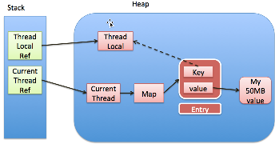

ThreadLocal提供了线程的**局部变量**，每个线程都可以通过`set()`和`get()`来对这个局部变量进行操作，但不会和其他线程的局部变量进行冲突，**实现了线程间的数据隔离**。

## 主要应用场景

- 主要应用场景为管理多实例的访问，每个线程对应一个实例，并且这个实例在各个线程中很多地方都要用到。如在线程池应用场景中，每个线程对应一个数据库连接，线程内部对数据库的各种操作都与这个连接有关，而线程之间并无联系，使用ThreadLocal可以体现数据库事务的隔离性。
- 减少参数传递，线程内部多个方法需要频繁传递一些context上下文，这些都需要通过参数传递，将这些上下文对象封装为ThreadLocal对象，就可以避免这些参数传递，在各个方法中使用ThreadLocal的get()方法即可。

## 实现原理

每个线程中有一个`ThreadLocalMap`对象，ThreadLocalMap其实是ThreadLocal的一个内部类，调用ThreadLocal对象的`get()`和`set()`，其实都是作用到各个线程的ThreadLocalMap。这个map底层是一个`Entry`数组，用以保存多个ThreadLocal对象，每个Entry是一个键值对，key是ThreadLocal对象的**弱引用**，value是要set()的对象的**强引用**，hash冲突使用**线性探查法**处理。

ThreadLocal对象和ThreadLocalMap都存在堆中，线程的栈中只有ThreadLocal和当前Thread的引用。


如果需要线程共享ThreadLocal对象，可以使用InheritableThreadLocal。

## 内存泄漏问题

ThreadLocalMap 中使用的 key 为 ThreadLocal对象的**弱引用**,而 value 是存入对象的**强引用**。当使用完ThreadLocal对象后，将其在栈中的强引用置为null，则只有一个弱引用的key指向该对象，一旦发生GC，key 指向的对象会被清理掉，而value指向的对象不会。从而在ThreadLocalMap中就会出现 key 为 null 的 Entry。假如我们不做任何措施的话，只要线程一直运行，value 永远无法被 GC 回收，导致内存泄露。因此使用完ThreadLocal对象后，记得调用remove()方法以避免内存泄漏。

**key为什么要设计为弱引用，value为什么不设计为弱引用**：当删除栈中的ThreadLocal引用后，若map中的key是强引用，则和value一样会导致内存泄漏。而value指向的对象只有value一个引用，若为弱引用，一旦GC就将回收，则通过get()得到的都是null。

另：可以看看netty的fastThreadLocal怎样弥补ThreadLocal存在的不足。

## 源码

```java
/**
 * This class provides thread-local variables.  These variables differ from
 * their normal counterparts in that each thread that accesses one (via its
 * {@code get} or {@code set} method) has its own, independently initialized
 * copy of the variable.  {@code ThreadLocal} instances are typically private
 * static fields in classes that wish to associate state with a thread (e.g.,
 * a user ID or Transaction ID).
 *
 * <p>For example, the class below generates unique identifiers local to each
 * thread.
 * A thread's id is assigned the first time it invokes {@code ThreadId.get()}
 * and remains unchanged on subsequent calls.
 * <pre>
 * import java.util.concurrent.atomic.AtomicInteger;
 *
 * public class ThreadId {
 *     // Atomic integer containing the next thread ID to be assigned
 *     private static final AtomicInteger nextId = new AtomicInteger(0);
 *
 *     // Thread local variable containing each thread's ID
 *     private static final ThreadLocal<Integer> threadId =
 *         new ThreadLocal<Integer>() {
 *             @Override protected Integer initialValue() {
 *                 return nextId.getAndIncrement();
 *         }
 *     };
 *
 *     // Returns the current thread's unique ID, assigning it if necessary
 *     public static int get() {
 *         return threadId.get();
 *     }
 * }
 * </pre>
 * <p>Each thread holds an implicit reference to its copy of a thread-local
 * variable as long as the thread is alive and the {@code ThreadLocal}
 * instance is accessible; after a thread goes away, all of its copies of
 * thread-local instances are subject to garbage collection (unless other
 * references to these copies exist).
 *
 * @author  Josh Bloch and Doug Lea
 * @since   1.2
 */
    public ThreadLocal() {
    }

    public T get() {
        Thread t = Thread.currentThread();
        ThreadLocalMap map = getMap(t);
        if (map != null) {
            ThreadLocalMap.Entry e = map.getEntry(this);
            if (e != null) {
                @SuppressWarnings("unchecked")
                T result = (T)e.value;
                return result;
            }
        }
        return setInitialValue();
    }

    private T setInitialValue() {
        T value = initialValue();
        Thread t = Thread.currentThread();
        ThreadLocalMap map = getMap(t);
        if (map != null)
            map.set(this, value);
        else
            createMap(t, value);
        return value;
    }

    public void set(T value) {
        Thread t = Thread.currentThread();
        ThreadLocalMap map = getMap(t);
        if (map != null)
            map.set(this, value);
        else
            createMap(t, value);
    }

    public void remove() {
        ThreadLocalMap m = getMap(Thread.currentThread());
        if (m != null)
            m.remove(this);
    }

    ThreadLocalMap getMap(Thread t) {
        return t.threadLocals;
    }

    void createMap(Thread t, T firstValue) {
        t.threadLocals = new ThreadLocalMap(this, firstValue);
    }
}
```