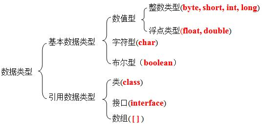
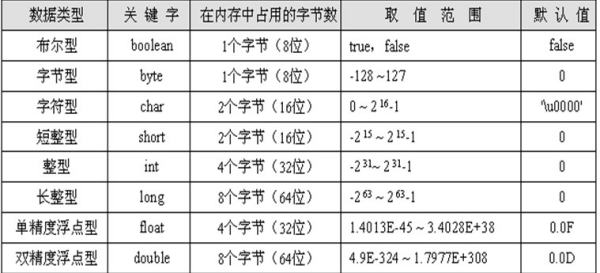
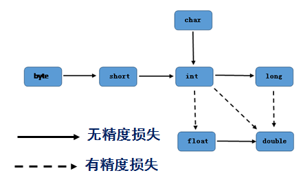

Java是一门**强类型(strongly typed)** 语言，**所有的变量必须先声明后使用** ，指定类型的变量只接受与该类型匹配的值，**变量的数据类型一经定义不能改变** 。

强类型语言可以在编译过程中发现源代码的错误，从而使程序更加健壮。



取值范围：



> 理论上存储布尔型只需要1bit，但通常JVM内部会把boolean表示为int。
>

如果需要系统把一个整数型当成long类型处理，需要在这个数后面加 `l` 或`L`，推荐大写，如`92399328232323L`.

二进制数值型第一位为**符号位** ，符号位值为1时是负数，负数在计算机中以**补码** 存在

> 补码：反码加1，反码：首位不变，其他位按位取反
>

数值可以自由使用下划线分隔，以直观分辨该数的位数：如`0B10000000_00000000_00000000_00000011`

## 整型

整型默认是int，有4种表示方式：十进制、二进制(0b/0B)、八进制(0)、十六进制(0x/0X, a~f表示10~ 15)，用这四种进制定义整数时，默认占32位。如果定义时在末尾加L，则占64位。如：

`0b11101001;` --> 233，占32位，由于只给出8位，前面24位补0，该数为正数

`0b11101001L;` --> 233，占64位，由于只给出8位，前面56位补0，该数为正数

`byte binVal1 = (byte)0b11101001;` --> 强制类型转换，只保留8位，第一位为1，负数，此为补码，原码为100010111，第一位为符号位，10111为23，即-23

`long binVal2 = 0B10000000_00000000_00000000_00000011L;` --> 64位，前32位补0，该数为正数，即2147483651。

## 字符型

字符型表示单个Unicode字符，必须用单引号括起来。字符型有3种表现形式：

* 单个字符：`'a'`,`'0'`
* 转义字符：`'\n'`,`'\t'`
* Unicode字符：`'\uXXXX'` (XXXX表示十六进制整数)

常用转义字符：

| 转义字符 | 说明   | Unicode表示方式 |
| -------- | ------ | --------------- |
| \b       | 退格符 | \u0008          |
| \n       | 换行符 | \u000a          |
| \r       | 回车符 | \u000d          |
| \t       | 制表符 | \u0009          |
| "        | 双引号 | \u0022          |
| '        | 单引号 | \u0027          |
| \        | 反斜线 | \u005c          |

字符型可以直接作为整型参与计算。

Java字符串String类通过双括号括起，String不是基本数据类型。

## 浮点型

Java浮点数使用二进制数据的科学计数法来表示浮点数

float: 第1位为符号位，接下来8位表示指数，后23位为尾数

double: 第一位为符号位，接下来11位表示指数，后52位为尾数

浮点数的表示方法：

* 十进制：5.123, 512.0
* 科学计数法：5.12e2 --> 51200.0

Java中浮点数默认为double型，要更改为float，须在该浮点数后加f或F.

Java中有三个特殊的浮点数：正无穷大、负无穷大、非数，用于表示溢出或出错。

正无穷大：Double类或Float类中的Infinity，*用正浮点数除以0得到*

负无穷大：Double类或Float类中的-Infinity，*用负浮点数除以0得到*

非数：Double类或Float类中的NaN，*用0.0 除以 0.0得到*

**所有的正无穷大相等，所有的负无穷大相等，所有的非数各不相等。**

只有浮点数除以0才能得到正负无穷大，整数除以0会抛出异常：`ArithmeticException:/by zero`.

> 注：浮点数在高精度时都不准确，double稍好，如果需要精确保存一个浮点数，需要使用`java.math.BigDecimal`类。
>
> 浮点数运算误差举例：
>

```java
public class Main {
 public static void main(String[] args) {
     double x = 1.0 / 10;
     double y = 1 - 9.0 / 10;
     // 观察x和y是否相等:
     System.out.println(x);//0.1
     System.out.println(y);//0.09999999999999998
 }
}
```

**由于浮点数存在运算误差，常常不能用等号比较两个浮点数是否相等，应判断两个浮点数之差的绝对值是否小于一个很小的数。**

## 布尔型

Java中布尔型只能是true或false，不能用0和非0来代替。

## 基本数据类型的转换

Java中数值类型和浮点型直接可以相互转换：自动类型转换和强制类型转换。

**自动类型转换(类型提升)** ：不同数据类型的数据参与运算时，范围小类型的数据会自动类型提升



在算术表达式中，所有的byte/short/char类型自动转换为int类型，且整个表达式的数据类型与最高等级的操作数的数据类型相同。如:

```java
short v1 = 5;
v1 = v1 - 2;
//报错，v1是short类型，v1 - 5是int类型，int型不能直接赋值给short类型。
```

注：在一个复杂的算式中，两个整数的运算不会自动提升，如：

```java
double d = 1.2 + 24/5; //5.2 先计算24/5取整为4，4+1.2时才自动提升
```

另外：**当把任何基本类型的值和字符串值进行连接运算(+)时，基本类型的值将自动类型转换为字符串类型** ，虽然字符串类型不是基本类型，而是引用类型。因此，如果希望把基本类型的值转换为对应的字符串时，可以把基本类型的值和一个空字符串进行连接。例如：

```java
System.out.println(3+4+"hello!") ;
>>>7hello  -->先运算3+4得7，再将7与字符串连接，7转化为字符串，拼接后是7hello
  
System.out.println("hello"+3+4);
>>>hello34  -->"hello"和3连接，得到"hello3"，再与4连接，得到"hello34"
```

**强制类型转换：** 范围大的类型转换为范围小的类型，必须进行强制类型转换，强制类型转换可能造成数据丢失。如：

```java
int v1 = 233;
byte v2 = (byte)v1;
System.out.println(v2);
>>>-23  -->转换后溢出，信息丢失
  
double v3 = 1.23;
int v4 = (int)v3;
System.out.println(v4);
>>>1  -->浮点数转整数，直接去掉小数部分。
  
System.out.println((int)1.2e20);
>>>2147483647 -->转型后超过整型的最大范围，将返回整形的最大值。
```

技巧：浮点数的**四舍五入** ：将浮点数加上0.5，再强制类型转换，如：

```java
double d = 2.6;
int n = (int)(d + 0.5);
```

java引用类型的强制类型转换见"多态"。