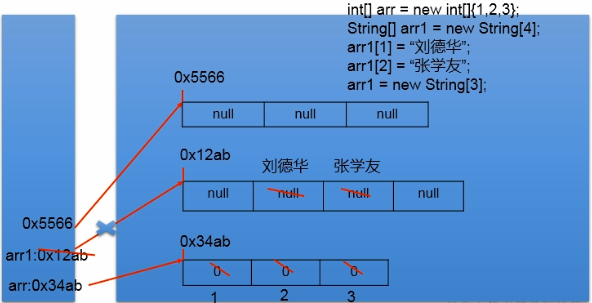
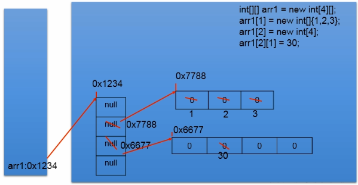

数组是多个**相同类型** 数据按**一定顺序排列** 的集合。

### 数组的特点

* 数组是有序排列的。
* 一个数组的所有元素应属于相同数据类型(引用数据类型可以是继承于同一父类的子类)。
* 数组元素既可以是基本数据类型，也可以是引用数据类型，数组本身是引用数据类型。
* 创建数组对象会在内存中开辟一整块连续空间，数组名引用的是这块连续空间的**首地址** 。
* **数组的长度一旦确定，就不能修改** 。
* 数组在初始化之后才能使用。

## 一维数组

### 一维数组的声明与初始化

**声明** ：`type[] arrayName;`

> 支持C语言风格的定义(但不推荐)：`type arrayName[];`
>

**初始化** ：为数组元素分配内存空间，并为每个元素赋初值。

> 注：初始化数组时的type必须是定义数组时的type的子类或同类。
>

* **静态初始化** ：指定每个元素的初始值，系统据此确定数组长度。
    `arrayName = new type[] {elem1, elem2, elem3, elem4 ...}`
    定义数组的同时初始化：
    `type[] arrayName =new type[] {elem1, elem2, elem3, elem4 ...}`

> 简写：`type[] arrayName = {elem1, elem2, elem3, elem4 ...}`
>

* **动态初始化** ：程序员只指定数组长度，由系统自动为元素分配初值。
    `arrayName = new type[length];`
    定义数组并初始化：`type[] arrayName = new type[length];`
    动态初始化的初值：

|                        |          |
| ---------------------- | -------- |
| byte/short/char/int    | 0        |
| float/double           | 0.0      |
| char                   | '\u0000' |
| boolean                | false    |
| 引用类型(类/接口/数组) | null     |

### 数组的访问

访问元素：通过索引访问: `arrayName[n]`.

为元素赋值：`arrayName[n] = new_value;`

获取数组长度：`arrayName.length`。

> 注：访问数组时，索引值小于0或大于等于数组长度，编译该程序时，不会报错，但运行时会出现异常：`java.lang.ArrayIndexOutOfBoundsException:N`(数组索引越界异常)
>

### 数组的内存解析

声明并初始化一个数组后，在内存中分配了两个空间：

* 数组变量：即数组名，一般是方法中的一个局部变量，存在栈(stack)中，内容即数组对象的地址；
* 数组对象：一般存在方法外的堆(heap)中，以便被多个变量引用。



## 多维数组

从数组底层的运行机制来看，没有所谓的多维数组，无非是数组的多层嵌套。

元素是一维数组的数组就是二维数组。

声明二维数组：`type[][] arrayName;`  -->即引用的引用：arrayName的每个元素都是一个type[]引用，每个引用指向一个元素为type类型的一维数组。

初始化二维数组： `arrayName = new type[length][];` -->length必须指定，相当于定义了length个type[]类型的变量，每个type[]变量指向一个type数组。

二维数组的默认初始值：

* `int[][] arr = new int[4][3];`
* 外层元素的初始值：地址值，指向一个数组对象
* 内存元素的初始值：规则同一维数组
* `int[][] arr = new int[4][];`
* 外层元素的初始值：null
* 内层元素的初始值：不存在，不能调用，否则报错

二维数组的内存解析：



## Java 8 增强工具类：Arrays

`java.util.Arrays`类中包含一些静态方法，用于操作数组：

|                                                         |                                                                                                                                                    |
| ------------------------------------------------------- | -------------------------------------------------------------------------------------------------------------------------------------------------- |
| int  binarySearch(type[] a, type key)                   | 使用二分查找获取key元素在数组a中的索引，要求数组已经升序排列，若a中没有值为key的元素，则返回负数                                                   |
| int  binarySearch(type[] a, int from, int to, type key) | 方法同上，只是索引区间为  [from, to)                                                                                                               |
| -                                                       | -                                                                                                                                                  |
| type[]  copyOf(type[] original, int length)             | 根据length复制original数组，若length < original.length，则只复制前length个元素，若length > original.lenth，后续元素根据type补0、0.0、false、null。 |
| type[]  copyOfRange(type[] original, int from, int to)  | 方法同上，只是索引区间为  [from, to)                                                                                                               |
| boolean  equals(type[] a, type[] b)                     | 当数组a和b等长且元素对应相同时，返回true。                                                                                                         |
| **void  fill(type[] a, type value)**                    | 将数组a所有元素赋值为value                                                                                                                         |
| void  fill(type[] a, int from, int to, type value)      | 方法同上，只是索引区间为  [from, to)                                                                                                               |
| **void  sort(type[] a)**                                | 对数组a所有元素升序排序                                                                                                                            |
| void  sort(type[] a, int from, int to)                  | 方法同上，只是索引区间为  [from, to)                                                                                                               |
| String  toString(type[] a)                              | 将数组a转换成一个字符串，元素被[]括起，各元素间以逗号和空格隔开                                                                                    |

示例:

```
jshell> int[] intArray = {1,4,2,15,11,16,3,9};
jshell> int a = Arrays.binarySearch(intArray, 15)
a ==> 3
jshell>int b = Arrays.binarySearch(intArray,2,6,16)
b ==> 5
jshell> int[] c = Arrays.copyOf(intArray, 5)
c ==> int[5] { 1, 4, 2, 15, 11 }
jshell> int[] d = Arrays.copyOfRange(intArray,2,6)
d ==> int[4] { 2, 15, 11, 16 }
jshell> Arrays.sort(intArray)
jshell> intArray
intArray ==> int[8] { 1, 2, 3, 4, 9, 11, 15, 16 }
jshell> String str = Arrays.toString(intArray)
str ==> "[1, 2, 3, 4, 9, 11, 15, 16]"
```

应用：数组反转：

```
int[] arr = new int[]{1, 2, 3, 4, 5, 6};
        //方法1：
        for (int i = 0; i < arr.length / 2; i++) {
            int temp = arr[i];
            arr[i] = arr[arr.length - 1 - i];
            arr[arr.length - 1 - i] = temp;
        }
        //方法2：
        for (int i = 0, j = arr.length - 1; i < j; i++, j--) {
            int temp = arr[i];
            arr[i] = arr[j];
            arr[j] = temp;
        }
```