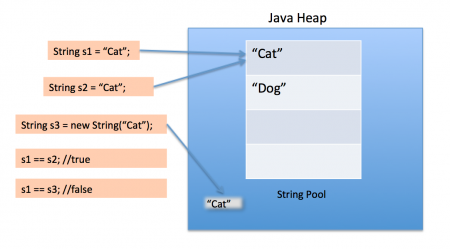

Java SE提供了三个字符串类：**String** 、**StringBuffer** 和**StringBuilder** 。

# String

```java
public final class String
    implements java.io.Serializable, Comparable<String>, CharSequence {
    /** The value is used for character storage. */
    private final char value[];

    /** Cache the hash code for the string */
    private int hash; // Default to 0
  
    ...
}

//final class String 说明String不能被继承以进行功能的扩展
//implements Serializable和 Comparable 说明String支持序列化，可比较大小
//final char[] value 字符数组 说明String对象在创建后不可变[但指向该对象的引用可以指向其他字符串]
```

## 字符串的实例化

```java
//方式一：字符串常量赋值
String s1 = "abc";

//方式二：通过构造器
String s2 = new String();

//常见构造器：
public String() {this.value = "".value;}
public String(String original) {this.value = original.value;this.hash = original.hash;}
public String(char value[]) {this.value = Arrays.copyOf(value, value.length);}
public String(char value[], int offset, int count) {
    //offset和count的边界条件
    ...
    this.value = Arrays.copyOfRange(value, offset, offset+count);
}
```

* 方式一是在**字符串常量池** 中拿对象：如果字符串常量池中没有"abc"，则创建一个，然后 s1 指向字符串常量池中的对象，如果有，则直接将 s1 指向"abcd"；
* 方式二是直接在**堆中**创建一个新的对象，每次调用构造器都创建一个新对象。



* `s.intern()`：Native方法，它的作用是：如果运行时常量池中已经包含一个值等于 s 的字符串，则返回常量池中该字符串的引用；如果没有，则将 s 加入字符串常量池，并返回其引用。

### 常见面试题

面试题1：String s1 = new String("abc");方式创建对象，在内存中创建了几个对象？

将创建 1 或 2 个字符串。如果池中已存在字符串常量“abc”，则只会在堆空间创建一个字符串常量“abc”。如果池中没有字符串常量“abc”，那么它将首先在池中创建，然后在堆空间中创建，因此将创建总共 2 个字符串对象。

面试题2：

```
String s1 = "hello";
String s2 = "world";
String s3 = "hello" + "world";
String s4 = s1 + "world";
String s5 = s1 + s2;
String s6 = (s1 + s2).intern();
String s7 = "helloworld";
System.out.println(s3 == s4);//false
System.out.println(s3 == s5);//false
System.out.println(s4 == s5);//false
System.out.println(s3 == s6);//true
System.out.println(s3 == s7);//true
```

结论：

* **字面量与字面量的拼接结果仍在常量池中** 。且常量池中不会存在相同内容的常量。
* 相拼接的两个对象中只要有一个是变量，结果就在堆中。

## String类常用方法

| int length()                                        | 返回字符串的长度： return value.length                 |
| --------------------------------------------------- | ------------------------------------------------------ |
| **char charAt(int  index)**                         | 返回某索引处的字符return value[index]                  |
| -                                                   | -                                                      |
| boolean isEmpty()                                   | 判断是否是空字符串：return value.length == 0           |
| String  toLowerCase()                               | 将 String 中的所有字符转换为小写                       |
| String  toUpperCase()                               | 将 String 中的所有字符转换为大写                       |
| **String trim()**                                   | 返回去除两端空白后的字符串                             |
| **boolean  equals(Object obj)**                     | 比较字符串的内容是否相同                               |
| boolean  equalsIgnoreCase(String anotherString)     | 与equals方法类似，忽略大小写                           |
| **String  concat(String str)**                      | 将指定字符串拼接到此字符串的结尾。等价于用“+”        |
| int  compareTo(String anotherString)                | 比较两个字符串的大小  返回值是第一个不同字符的差距     |
| String  substring(int beginIndex)                   | 返回从beginIndex开始到最后的子字符串                   |
| **String  substring(int beginIndex, int endIndex)** | 返回范围为[beginIndex, endIndex)的子字符串             |
| boolean  endsWith(String suffix)                    | 测试此字符串是否以指定的后缀结束                       |
| boolean  startsWith(String prefix)                  | 测试此字符串是否以指定的前缀开始                       |
| boolean  startsWith(String prefix, int toffset)     | 测试此字符串从指定索引开始的子字符串是否以指定前缀开始 |

//索引

|                                             |                                                                            |
| ------------------------------------------- | -------------------------------------------------------------------------- |
| **boolean  contains(CharSequence s)**       | 判断此字符串是否包含指定的 char 值序列                                     |
| **int indexOf(String  str)**                | 返回指定子字符串在此字符串中第一次出现处的索引                             |
| -                                           | -                                                                          |
| int indexOf(String  str, int fromIndex)     | 返回指定子字符串在此字符串中第一次出现处的索引，从指定的索引开始           |
| int  lastIndexOf(String str)                | 返回指定子字符串在此字符串中最右边出现处的索引                             |
| int  lastIndexOf(String str, int fromIndex) | 返回指定子字符串在此字符串中最后一次出现处的索引，从指定的索引开始反向搜索 |

> `indexOf()`和`lastIndexOf()`方法如果未找到都是返回-1
>

//替换

|                                                                    |                                                                                 |
| ------------------------------------------------------------------ | ------------------------------------------------------------------------------- |
| **String  replace(char oldChar, char newChar)**                    | 返回一个新的字符串，它是通过用newChar 替换此字符串中出现的所有 oldChar 得到的。 |
| **String  replace(CharSequence target, CharSequence replacement)** | 使用指定的字面值替换序列替换此字符串所有匹配字面值目标序列的子字符串。          |
| -                                                                  | -                                                                               |
| String  replaceAll(String regex, String replacement)               | 使用给定的 replacement 替换此字符串所有匹配给定的**正则表达式** 的子字符串。    |
| String  replaceFirst(String regex, String replacement)             | 使用给定的 replacement 替换此字符串匹配给定的**正则表达式** 的第一个子字符串。  |

//匹配

|                                |                                        |
| ------------------------------ | -------------------------------------- |
| boolean  matches(String regex) | 告知此字符串是否匹配给定的正则表达式。 |
| -                              | -                                      |

//拆分

|                                          |                                                                                                       |
| ---------------------------------------- | ----------------------------------------------------------------------------------------------------- |
| **String[]  split(String regex)**        | 根据给定正则表达式的匹配拆分此字符串。                                                                |
| String[]  split(String regex, int limit) | 根据匹配给定的正则表达式来拆分此字符串，最多不超过limit个，如果超过了，剩下的全部都放到最后一个元素中 |
| -                                        | -                                                                                                     |

## String与其他类的转换

### 与基本数据类型/包装类的转换

```
//String-->基本数据类型/包装类：
int i = Integer.parseInt("13");
Integer integer = Integer.valueOf("13");
//基本数据类型/包装类 -->String: 
String s1 = String.valueOf(123);
String s2 = String.valueOf(1.2);
```

### 与字符数组char[]的转换

* String --> char[]:
* 调用String类的public char[] toCharArray()方法。
* public void getChars(int srcBegin, int srcEnd, char[] dst, int dstBegin)可以将字符串指定索引范围的字符存放到数组中
* char[] --> String: String类的构造器
* String(char[] value)或String(char[] value, int offset, int length)

### 与字节数组的转换

* String--> byte[]:【编码】
* public byte[] getBytes()//使用默认编码字符集utf-8
* public byte[] getBytes(String charsetName)//自定义编码字符集【如：gbk】
* byte[]--> String: String类的构造器【解码】
* String(byte[])//默认字符集解码
* String(byte[], String charsetName)//自定义字符集解码
* String(byte[], int offset, int length, String charsetName)

# StringBuffer与StringBuilder

* StringBuffer**线程安全，效率低，** 适用于考虑线程安全时。
* StringBuilder**线程不安全，效率高** ，适用于不考虑线程安全时。
* 两者父类都是`AbstractStringBuilder`，为可变字符序列，对指向的字符串的修改作用到自身，不产生新的字符串对象。
* 两者拥有相同的方法，StringBuffer的每个方法多了一个`synchronized`。

AbstractStringBuilder的源码如下：

```
abstract class AbstractStringBuilder implements Appendable, CharSequence {
    /**The value is used for character storage. value数组没有final声明，可以不断扩容。*/
    char[] value;
    /**The count is the number of characters used.*/
    int count;
}
```

StringBuffer和StringBuilder的很多方法与String相同。

### 创建对象

* StringBuffer():初始化一个容量为16的默认字符串缓冲区
    源码：char[] value = new char[16]
* StringBuffer(int size)：初始化一个指定容量的字符串缓冲区
    源码：char[] value = new char[size]
* StringBuffer(String str): 初始化为指定字符串内容，字符串缓冲区初始容量为`str.length+16`
    源码：char[] value = new char[str.length + 16]

> 开发中，推荐使用StringBuffer(int size)或StringBuilder(int size)。
>

### 常用方法

//增

```
StringBuffer append(***) : 提供了多个append()方法，用于将各种数据类型加入字符串
```

注：若预留的16个空闲容量不够，底层字符数组会进行扩容：原数组总容量的2倍 + 2

//删

```
StringBuffer  delete(int start,int end) : 删除[start,end)指定位置的内容
```

//改

|                                                       |                            |
| ----------------------------------------------------- | -------------------------- |
| StringBuffer  replace(int start, int end, String str) | 把[start,end)位置替换为str |
| public  void setCharAt(int n ,char ch)                | 改一个字符                 |

//查

|                                |              |
| ------------------------------ | ------------ |
| public char charAt(int n )     | 查找一个字符 |
| public int indexOf(String str) | 查找子串     |

//插

```
StringBuffer insert(int offset, xxx): 在指定位置插入xxx
```

注：若预留的16个空闲容量不够，底层字符数组会进行扩容：原数组总容量的2倍 + 2

//长度: length()

//其他

|                                              |                    |
| -------------------------------------------- | ------------------ |
| StringBuffer  reverse()                      | 把当前字符序列逆转 |
| public  String substring(int start, int end) | 取子串             |
| **public String toString()**                 | 转换成String       |

# String、StringBuffer、StringBuilder的对比

三者的效率：`StringBuilder > StringBuffer >> String`.

* String(JDK1.0)：不可变字符序列，线程安全
* StringBuffer(JDK1.0)：可变字符序列、效率低、线程安全
* StringBuilder(JDK5)：可变字符序列、效率高、线程不安全
* 注意：作为参数传递的话，方法内部String不会改变其值，StringBuffer和StringBuilder会改变其值。