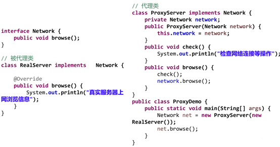
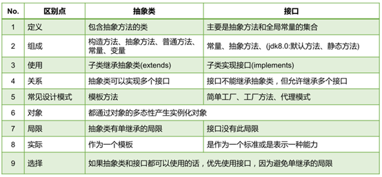

### 接口的定义

接口使用interface来定义。

* 接口中没有构造器，意味着接口不可以实例化。
* 子类使用implements实现接口：`<strong>class</strong>`` Class1 ``<strong>implements</strong>`` Interface1{…};`
* **实现类覆盖了接口中的所有抽象方法时，方可实例化** 。否则该实现类仍为抽象类。
* **一个类可以实现多个接口** ，弥补了Java只能单继承的局限性，如：`class Class1 implements Interface1, Interface2 {…} ;`
* **一个接口可以继承一个或多个接口** ：`interface A extends B, C {…};`
* 有继承有实现时，书写形式为：`class A extends B implements C, D, E {…};`
* 与继承关系类似，**接口与实现类之间存在多态性。**
* 接口的属性和方法都是public的，默认省略。

### JDK7、JDK8、JDK9中接口的变化：

**JDK7及以前** ：只能定义全局静态常量和抽象方法。

* 全局静态常量：`public static final int i;`建议写为`int i;`
* 抽象方法：`public abstract void method;`建议写为`void method();`

**JDK8** ：除了全局常量和抽象方法，还可以定义静态方法、默认方法。

> 为什么JDK8中接口增加了默认方法：**不支持默认方法的接口的维护成本太高** 了。在 Java 8 之前，如果一个接口想要添加新的方法，那么要修改所有实现了该接口的类，让它们都实现新增的方法。
>

* 静态方法：`[public] static void method1(){…};`

> **接口中的静态方法，只能通过接口来调用** ，实现类和其实例都不能调用。
>

* 默认方法：`[public] default void method2(){…};`

> **接口中的默认方法，可以通过实现类的实例进行调用，也可以被实现类重写。**
>
> 若一个类同时实现的两个接口中存在同名默认方法，则子类必须重写该方法。否则报错：**接口冲突**
>
> 若一个类继承了普通类并实现了接口，父类的方法和接口抽象或者默认方法重名，不重写也不报错，调用时使用父类的方法
>

**JDK9** ：接口允许定义私有方法和私有静态方法。

### 继承和实现并存时的注意点

若`class B extends A1 implements A2 {…};`

* 若一个类继承了普通类并实现了接口，父类的方法和接口抽象或者默认方法重名，不重写也不报错，调用时使用父类的方法
* 父类A1与接口A2含有同名字段a，子类B的实例不能使用b.a来调用该字段，只能在子类的类体中通过`super.a`调用父类的a字段，通过`A2.a`调用接口的a字段。
* 子类重写了父类的方法，可以在子类的类体中使用`super.method()`调用父类的方法，实现类重写了接口A2的默认方法，可以在子类的类体中使用`A2.super.method()`调用接口的方法。

```
public class TestDemo {
    public static void main(String[] args) {
        B b = new B();
        b.func1();
        b.func2();
    }
}

class A1 {
    int a = 2;
    public void func1() {
        System.out.println("A1");
    }

    public void func2() {
        System.out.println("A1");
    }
}

interface A2 {
    int a = 3;
    void func1();

    default void func2() {
        System.out.println("A2");
    }
}

class B extends A1 implements A2 {
    public void func2(){
        super.func2();
        A2.super.func2();
    }
}
```

### 接口的应用：代理模式（Proxy）

代理模式是Java开发中使用较多的一种设计模式。代理设计就是为其他对象提供一种代理以控制对这个对象的访问。

应用场景：

* 安全代理：屏蔽对真实角色的直接访问。
* 远程代理：通过代理类处理远程方法调用（RMI）
* 延迟加载：先加载轻量级的代理对象，真正需要再加载真实对象

比如你要开发一个大文档查看软件，大文档中有大的图片，有可能一个图片有100MB，在打开文件时，不可能将所有的图片都显示出来，这样就可以使用代理模式，当需要查看图片时，用proxy来进行大图片的打开。

分类

* 静态代理（静态定义代理类）
* 动态代理（动态生成代理类）
* JDK自带的动态代理，需要反射等知识

举例：



### 接口和抽象类之间的对比：

### 

> 在开发中，常看到一个类不是去继承一个已经实现好的类，而是要么继承抽象类，要么实现接口。
>

**比较：**

* 从设计层面上看，抽象类提供了一个模版；而接口更像是一种行为规范。
* 从使用上来看，一个类可以实现多个接口，但是不能继承多个抽象类。
* 默认情况下，接口是一个完全抽象类，所有的属性和方法都是public权限，默认只包含静态常量和抽象方法，抽象类则没有这些限制。
* 接口中不能有构造器，抽象类可以有构造器，用于子类的实例化时调用。

**使用选择**

使用接口的场景：

* 需要让不相关的类都实现一个方法，例如不相关的类都可以实现 Compareable 接口中的 compareTo() 方法；
* 需要使用多重继承。

使用抽象类的场景：

* 需要在几个相关的类中共享代码。
* 需要能控制继承来的成员的访问权限，而不是都为 public。
* 需要继承非静态和非常量字段。

在很多情况下，接口优先于抽象类。因为接口没有抽象类严格的类层次结构要求，可以灵活地为一个类添加行为。并且从 Java 8 开始，接口也可以有默认的方法实现，使得修改接口的成本也变的很低。

其他：

* [Abstract Methods and Classes](https://docs.oracle.com/javase/tutorial/java/IandI/abstract.html)
* [深入理解 abstract class 和 interface](https://www.ibm.com/developerworks/cn/java/l-javainterface-abstract/)
* [When to Use Abstract Class and Interface](https://dzone.com/articles/when-to-use-abstract-class-and-intreface)