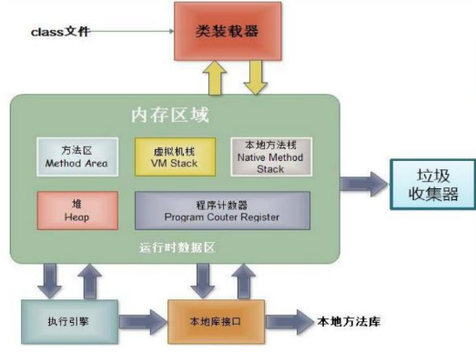

Java是一种纯粹的面向对象的程序设计语言，Java程序必须以类(class)的形式存在，**类是Java程序的最小程序单位** 。Java不允许可执行性语句、方法等成分独立存在，所有的执行部分都必须放在类里面。

## 类与对象的关系

类是对象的抽象，对象是类的实例(instance)。

所有的类都是引用类型。

## 对象的内存解析



* **堆（Heap）** ，用于且仅用于**存放对象** ，所有的对象和数组都要在堆上分配内存空间。
* **虚拟机栈(VM Stack)** 。用于**存储局部变量** 等。 局部变量表存放了编译期可知长度的各种基本数据类型（boolean/byte/char/short/int/float/long/double）、对象引用（它不等同于对象本身，是对象在堆内存的首地址）。 方法执行完，栈内存会自动释放。
* **方法区（Method Area）** ，用于存储已被虚拟机加载的**类信息、常量、静态变量、即时编译器编译后的代码** 等数据。

## 类的声明

```
[修饰符] class 类名{
    零个到多个构造器定义...
    零个到多个成员变量...
    零个到多个方法...
}
```

修饰符：可以是public、final、abstract，缺省则为default。

类名：**驼峰式** ，如：HelloWorld。

**字段(field)** ：定义类所包含的状态属性。也成为属性或成员变量。

定义成员变量：`[修饰符] 类型 成员变量名 [= 初始值];`

* 修饰符：public/protected/private、static、final，缺省为default。
* 类型：包括基本类型和引用类型
* 字段名：应该由一个或多个有意义的英文名词组成，首单词小写，后续单词首字母大写

**方法(method)：** 定义类的行为和功能。

定义方法：

```
[修饰符] 返回值类型 方法名(参数列表){
    可执行语句;
}
```

* 修饰符：public/protected/private、static、final/abstract，缺省为default。
* 返回值类型：有返回值时，方法中必须有正确的return语句；无返回值时，类型为void。
* 方法名：应该由一个或多个有意义的英文动词组成，首单词小写，后续单词首字母大写
* 参数列表：零组到多组"参数类型 参数名"组成，各组之间以逗号隔开。

### 成员变量和局部变量

成员变量：定义在类中的变量，包括**类变量、实例变量** 。当系统加载类时，会自动为类变量(static)分配空间并赋初值；实例化类时，系统会自动为实例(非static)变量分配空间并初始化。

局部变量：定义在方法中的变量。包括**形参、方法局部变量、代码块局部变量**

* 形参的作用范围：在整个方法内有效
* 方法局部变量的作用范围：从定义该变量开始，到该方法结束
* 代码块局部变量的作用范围：从定义该变量开始，到该代码块结束

#### 成员变量和局部变量的区别

```
①在类中声明的位置不同：属性：定义在类的一对{}内；局部变量：声明在方法内、方法形参、代码块内、构造器形参、构造器内部变量都可

②权限修饰符：属性可以使用权限修饰符，局部变量不能使用权限修饰符

③默认初始值：**属性有默认初始值(规则同数组元素初始值)，局部变量没有默认初始值。因此调用局部变量前，一定要显式赋值。**

④在内存中的加载位置：属性(非static)加载到**堆** 中，局部变量加载到**栈** 中。

⑤从变量在内存中的生存时间看：成员变量是对象的一部分，它随着对象的创建而存在，局部变量随着方法的调用而自动消失。
```

#### 变量的选取原则

**在满足使用要求的前提下，尽量缩小变量的作用范围。**

变量范围扩大的坏处：增大了变量的生存时间，导致更大的内存开销；扩大了变量的作用域，不利于提高程序内聚性。

建议使用成员变量的情形：

* 该变量用于描述某个类或对象的固有信息，如人的身高、体重、器官等：人的眼睛数量都是2，因此是类相关的，推荐定义为类变量，人的身高、体重不尽相同，是对象相关的，推荐定义为实例变量。
* 该变量反应某个类或对象的实时状态。
* 该变量需要在类中多个方法间共享。

#### 可以给属性赋值的地方

* 默认初始化，如int a;
* 显式初始化，如int a = 1;
* 代码块中赋值
* 构造器中赋值
* 方法中赋值
* 实例化对象后，通过对象.属性或对象.方法进行赋值

赋值顺序由上到下。

属性在类体中，**不能先声明后赋值** (类体中不能有游离的执行语句)，可以声明的同时赋值(显式初始化)。

### 方法

#### 方法的参数传递机制

**值传递** ，实参将副本传给形参，实参本身不会受到任何影响。参数是引用类型时，实际上也是值传递，只是值为被引用对象的地址。

#### 方法重载(overload)

在**同一个类** 中包含了两个或多个**参数列表各不相同** 的**同名** 方法，则称为方法重载。【两同一不同】

> 参数列表不同：参数个数、类型或顺序至少一个不同
>
> 方法重载跟方法的权限修饰符、返回值类型、形参变量名、方法体没有关系，即若两个方法其他部分完全相同，但以上情况不同，并不构成方法重载。
>

若重载方法B的执行体完全包含方法A的执行体，即方法B完全包含了方法A，推荐用this.A()调用A()来执行重复的那部分代码，如：

```
public void test(String name, int age){
    System.out.println(name);
    System.out.println(age);
}
public void test(String name, int age, String gender){
    this.test(name, age);
    System.out.println(gender);
}
//特别地，如果使重载的构造方法B完全包含构造方法A，则直接用this()调用构造方法A。如：
public Example(String name){...};
public Example(String name, int age){
    this(name);
    ...
}
```

注意：**this(…)语句只能在构造方法中使用，且必须是第一条语句** 。

用this.A()或this()的好处：同一段代码最好能复用，否则当重复的代码需要更新时，需要更改几处代码，加大软件的维护成本。

#### 可变参数

定义方法时，在**最后一个形参** 的数据类型后增加三个点(`...`)，表示该参数可以接受若干个值，该参数称为可变参数，实际上定义了一个数组，**多个参数传入时存入该数组中** 。如：

`void test(int a, String... books){...};`

注意`void test(int a, String[] books){...};`形式与可变参数的区别：

* **String...只能置于参数列表最后** ，String[]可以在任何位置。
* **String...可以接收多个参数，也可以接收一个数组** ，String[]只能接收一个数组。

含有可变参数的方法与本类中方法名相同，形参不同的方法构成重载。

含有可变参数的方法，与将可变参数替换为同类型的数组形参后得到的同名方法，两者之间不能共存。如`void test(int a, int... ints){};`与`void test(int a, int[] ints){};`不共存。

#### 其他

**方法不能嵌套定义，即方法中不能再定义方法。**

## 引用和指针

* 当一个对象被创建以后，这个对象被保存在**堆内存** 中，Java程序不允许直接访问堆内存中的对象，只能通过该对象的引用间接访问该对象。而引用该对象的变量保存在**栈内存** 中，变量空间存储的就是该对象在内存的地址。
* Java中的引用相当于C中的指针，只是把这个指针封装了起来，避开了繁琐的指针操作。
* 如果堆内存中的对象没有被任何变量引用，程序就无法访问该对象，该对象就变成了垃圾，会被回收掉。

## this关键字

this关键字指向对象本身【python里的self】，在类中通过this来访问对象自身的字段或方法。this用于以下三种情况：

* 调用实例变量：`this.field;`
* 调用实例方法：`this.method();`
* 调用构造器：`this();`

同一个实例的成员可以直接调用本实例的其他成员，**只要不引起混淆，就可以省略this前缀** 。当方法中有局部变量和该实例的成员变量同名时，**局部变量覆盖了该成员变量，在该方法中调用该成员变量，必须使用this前缀。**

使用this访问属性和方法时，若在本类中未找到，会从父类中查找。

> **static方法中不能使用this引用** ：this指向一个对象，依赖于实例。而静态方法是类方法，不依赖实例就可以运行。因此静态方法中不能存在需要实例化的东西。
>

## 匿名对象

实例化一个类时，不赋值给该类型的变量。常用于传递给函数形参。如`System.out.println(new String("hello"));`