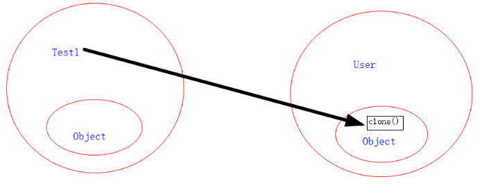

设计良好的模块会隐藏所有的实现细节，**把它的 API 与它的实现清晰地隔离开来** 。模块之间只通过它们的 API 进行通信，一个模块不需要知道其他模块的内部工作情况，这个概念被称为信息隐藏或封装。因此访问权限应当尽可能地使每个类或者成员不被外界访问。

为什么需要封装：程序设计追求”高内聚，低耦合“。

* 高内聚：类的内部数据操作细节自己完成，不允许外部干涉。
* 低耦合：仅对外暴露少量的方法用于使用。

即隐藏对象内部的复杂细节，只对外开放便于调用的接口，从而提高系统的可扩展性、可维护性。

### 封装的作用

* 隐藏类的实现细节。
* 外部只能通过特定方法访问内部数据，可以在这些特定方法中加入控制逻辑，限制外部的不合理访问。
* 可进行数据检查，有利于保证对象信息的完整性。
* 便于修改，提高代码的维护性。

### 访问控制权限

封装性的体现，需要访问控制权限来配合。访问控制权限可以修饰属性、方法、构造器、类。

访问权限控制表：

|                  | private | (default) | protected | public |
| ---------------- | ------- | --------- | --------- | ------ |
| 同一个类         | √      | √        | √        | √     |
| 同一个包         |         | √        | √        | √     |
| 同类、同包或子类 |         |           | √        | √     |
| 同一个工程(全局) |         |           |           | √     |

类访问权限：在其他类中可以用这个类创建实例

* 外部类：要么用public修饰，要么default(缺省)，不能使用private和protectd修饰。
* 内部类：类中定义的类，可以看作一个成员

成员访问权限：其它类可以用这个类的实例访问到该成员

* private：限制该成员只能在本类中可见。常用于修饰成员变量和辅助方法。
* 默认：无修饰符修饰的成员，允许同包的其他类访问，称为**包访问权限** 。
* protected：允许被同包的其他类或子类访问，**常用于修饰希望被子类重写的方法。**
* public：可以被所有类访问

权限问题深究：通过案例认清调用者和权限提供者：

```
public class Test1 {
    public static void main(String[] args){
        User user = new User();
        System.out.println(user.name);
        System.out.println(user.clone());//出错
    }
}

class User {
    String name = "Yeqianqiu";
    //@Override
    //protected Object clone() throws CloneNotSupportedException {
    //    return super.clone();
    //}
}
```

上述代码，Test1类想调用user对象的clone()方法，然而User类没有重写clone()方法，其父类Object中有protected修饰的clone()方法，由于调用者为Test1，提供者为Object，而两者不同类、不同包，**也不是父子类关系** 【下面解释】，则无法访问。User类自己重写一个clone()后，问题就解决了。

> 虽然Object是所有类的的父类。但是User的父类Object和Test1的父类Object并不是同一个。从内存的角度很好理解：Test1和User各自包含了Object的全部功能，两个Object的内存空间是互相独立的，而Test1想要调用与User相关的那个Object类里的protected方法，显然是做不到的。
>



关于protected修饰符的再深究：

结合Object类的clone方法进行说明。其中clone方法如下：**protected Object Object.clone()；**

关于protected修饰符的访问权限如下：

* **子类与基类在同一包中** ：被声明为 protected 的变量、方法和构造器能被同一个包中的任何其他类访问；
* **子类与基类不在同一包中** ：那么在子类内部，子类实例可以访问其从基类继承而来的 protected 方法，子类不能访问基类实例的protected方法。在其他无关类中，既不能通过子类的实例，也不能通过父类的实例访问protected方法。

**示例：**

示例1

```
package modify.pack1;
public class FaObject1 {
    protected void sp(){
        System.out.println("father method");
    }
}

package modify.pack1;
public class SonObject1 extends FaObject1{
    public static void main(String[] args){

        SonObject1 sb1 = new SonObject1();
        sb1.sp();          //  （1）

        FaObject1 fb = new FaObject1();
        fb.sp();          //   （2）
    }
}

package modify.pack2;
import modify.pack1.FaObject1;
public class SonObject2 extends FaObject1 {
    public static void main(String[] args){

        SonObject2 sb2 = new SonObject2();
        sb2.sp();             //  （3）

        FaObject1 fb = new FaObject1();
//        fb.sp();            //  （4）编译错误
    }
}

package modify.pack2;
import modify.pack1.FaObject1;
public class UnrelatedObject {
    public static void main(String[] args){

        FaObject1 fb = new FaObject1();
//    fb.sp();       // (5) 编译错误
    }
}
```

解释说明如下：

（1）FaObject1和SonObject1在同一个包内，子类实例可以访问自身继承的sp方法，编译通过；

（2）FaObject1和SonObject1在同一个包内，子类可以访问父类实例的sp方法，编译通过；

（3）FaObject1和SonObject2不在同一个包内，子类实例可以访问自身继承的sp方法，编译通过；

（4）FaObject1和SonObject2**不在同一个包内** ，子类**不可以** 访问父类实例的sp方法，编译错误；

（5）FaObject1和UnrelatedObject**不在同一个包内** ，该类**不可以** 访问其他类实例的protected方法，编译错误；

示例2

```
package modify.pack3;
public class FaObject3 {
    public static void main(String[] args){

        FaObject3 fb3 = new FaObject3();
        try {
            fb3.clone();      // (1)
        }
        catch (CloneNotSupportedException e) {
            e.printStackTrace();
        }

        SonObject3 sb3 = new SonObject3();
        try {
            sb3.clone();      // (2)
        }
        catch (CloneNotSupportedException e) {
            e.printStackTrace();
        }
    }
}

package modify.pack3;
public class SonObject3 extends FaObject3{
    public static void main(String[] args){

        SonObject3 sb3 = new SonObject3();
        try {
            sb32.clone();      // (3)
        }
        catch (CloneNotSupportedException e) {
            e.printStackTrace();
        }

        FaObject3 fb3 = new FaObject3();
//        fb3.clone();       // (4) 编译错误
    }
}
```

（1）Object和FaObject3**不在同一个包内** ，子类实例可以访问继承Object类的clone方法，编译通过；

（2）FaObject3和SonObject3在同一个包内，子类实例可以访问继承FaObject3类的clone方法，编译通过；

（3）FaObject3和SonObject3在同一个包内，子类实例可以访问继承FaObject3类的clone方法，编译通过；

（4）fb3的clone方法来自于Object类，该方法的可见性为java.lang包和Object类的FaObject3子类，对于SonObject3类不可见，因此编译错误；

### 访问控制权限设置原则

* 类中绝大多数成员变量、辅助方法都应该使用private修饰；
* 父类中希望被子类重写的方法应该使用protected修饰；
* 一些static修饰的、类似全局变量的成员变量，可以考虑使用public修饰；
* 希望暴露出来给其他类自由调用的方法应该使用public修饰，如：
* **类的构造器** 通常使用public修饰，以便在其他地方创建该类的实例；
* **大部分外部类** ：通常都希望被其他类调用。

**Java源文件命名规则：**

**一个Java源文件可以包含多个类定义，但最多只能包含一个public类定义；**

**如果Java源文件中包含public类定义，则该源文件的文件名必须与该public类的类名相同。**

### 符合JavaBean规范的类

JavaBean是一种Java语言写成的可重用组件。JavaBean是一个封装良好的类。

JavaBean是指符合如下标准的Java类：

* 有一个公共的无参构造器
* 所有属性为private，并提供public的getter和setter
* 实现Serializable接口（用于实现bean的持久性）

如果一个Java类的每个实例变量都是用private修饰，并都提供有各自的set和get方法，那么这个类就是符合JavaBean规范的类。

封装示例：

```
public class Person {
    private String name;
    private int age;

    public void setName(String name) {
        if (name.length() > 6 || name.length() < 2) {
            System.out.println("名字不符合要求");
            return;
        } else
            this.name = name;
    }

    public String getName() {
        return this.name;
    }

    public void setAge(int age) {
        if (age > 100 || age < 0) {
            System.out.println("年龄不符合要求");
            return;
        } else
            this.age = age;
    }

    public int getAge() {
        return this.age;
    }
}
```

要操作或访问Person类中的name和age变量，只能使用各自对应的set和get方法。如果创建了一个Person实例p，使用p.name或p.age会报错。**set方法中增加有控制逻辑，可以阻止不符合要求的访问，从而提高了安全性。**

> 名为abc私有成员变量的setter和getter方法推荐写为：setAbc(...)和getAbc(...)。
>