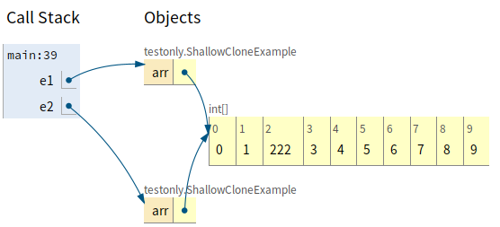

Object类是所有类的根父类

`obj.getClass()`返回obj对象所属的类

`obj.getClass().getSuperClass()`返回obj对象的父类

Object类没有属性，只有一个空参构造器。

常用的方法有：

equals()/toString()/getClass()/hashCode()/clone()/finalize()/wait()/notify()/notifyAll()

### == 操作符与equals()方法

==操作符：

* 基本数据类型变量比较时：比较两个变量保存的值是否相等(类型可不同)
* 引用数据类型变量比较时：比较两个对象的地址值是否相等(是否指向同一个对象)

引用数据类型：类、接口、字符串、数组

equals()方法：

* 只能用于比较引用数据类型
* Object类中的equals()方法底层实现用的是==：若不重写equals()方法，也是用于比较地址值

```
public boolean equals(Object obj){
    return (this == obj);
}

Object obj1 = new Object();
Object obj2 = new Object();
System.out.println(obj1.equals(obj2));//false
```

* =String/Date/File和包装类都重写了Object类中的equals()方法，转而比较两个变量保存的内容值是否相同。=

```
String str1 = new String("very good");
String str2 = new String("very good");
System.out.println(str1.equals(str2));//true
System.out.println(str1 == str2);//false

String s1 = "very good";
String s2 = "very good";
System.out.println(s1.equals(s2));//true
System.out.println(s1 == s2);//true
```

> 注意两种初始化字符串方式不同：str1 与str2是两个不同的对象，s1和s2指向同一个对象。
>

#### 手动重写equals()方法的原则

* 对称性：如果x.equals(y)返回“true”，那么y.equals(x)也应该返回 “true”。
* 自反性：x.equals(x)必须返回“true”。
* 传递性：如果x.equals(y)返回“true”，且y.equals(z)返回“true”， 那么z.equals(x)也应该返回“true”。
* 一致性：如果x.equals(y)返回是“true”，只要x和y内容一直不变，不管你重复x.equals(y)多少次，返回都是“true”。
* 任何情况下，x.equals(null)，永远返回是“false”； x.equals(和x不同类型的对象)永远返回是“false”。

#### 重写equals()的步骤

* 检查是否为同一个对象的引用，如果是直接返回 true；
* 检查是否是同一个类型，如果不是，直接返回 false；
* 将 Object 对象进行转型；
* 判断每个关键域是否相等。

```
public class EqualExample {

    private int x;
    private int y;
    private int z;

    public EqualExample(int x, int y, int z) {
        this.x = x;
        this.y = y;
        this.z = z;
    }

    @Override
    public boolean equals(Object o) {
        if (this == o) return true;
        if (o == null || getClass() != o.getClass()) return false;

        EqualExample that = (EqualExample) o;

        if (x != that.x) return false;
        if (y != that.y) return false;
        return z == that.z;
    }
}
```

## hashCode()

hashCode() 返回哈希值，而 equals() 是用来判断两个对象是否等价。**等价的两个对象散列值一定相同，但是散列值相同的两个对象不一定等价** ，这是因为计算哈希值具有随机性，两个值不同的对象可能计算出相同的哈希值。

**在覆盖 equals() 方法时应当总是覆盖 hashCode() 方法，保证等价的两个对象哈希值也相等。**

HashSet  和 HashMap 等集合类使用了 hashCode()  方法来计算对象应该存储的位置，因此要将对象添加到这些集合类中，需要让对应的类实现 hashCode()  方法。

下面的代码中，新建了两个等价的对象，并将它们添加到 HashSet 中。我们希望将这两个对象当成一样的，只在集合中添加一个对象。但是 EqualExample 没有实现 hashCode() 方法，因此这两个对象的哈希值是不同的，最终导致集合添加了两个等价的对象。

```
EqualExample e1 = new EqualExample(1, 1, 1);
EqualExample e2 = new EqualExample(1, 1, 1);
System.out.println(e1.equals(e2)); // true
HashSet<EqualExample> set = new HashSet<>();
set.add(e1);
set.add(e2);
System.out.println(set.size());   // 2
```

理想的哈希函数应当具有均匀性，即不相等的对象应当均匀分布到所有可能的哈希值上。这就要求了哈希函数要把所有域的值都考虑进来。可以将每个域都当成 R 进制的某一位，然后组成一个 R 进制的整数。

R 一般取 31，因为它是一个奇素数，如果是偶数的话，当出现乘法溢出，信息就会丢失，因为与 2 相乘相当于向左移一位，最左边的位丢失。并且一个数与 31 相乘可以转换成移位和减法：`31*x == (x<<5)-x`，编译器会自动进行这个优化。

```
@Override
public int hashCode() {
    int result = 17;
    result = 31 * result + x;
    result = 31 * result + y;
    result = 31 * result + z;
    return result;
}
```

### toString()方法：

**当我们输出一个对象的引用时，实际上就是调用该对象的toString()方法** 。如：

```
Object obj = new Object();
System.out.println(obj);//java.lang.Object@723279cf
System.out.println(obj.toString());//java.lang.Object@723279cf
```

Object类中的原生toString()：

```
public String toString(){
    return getClass().getName() + "@" + Integer.toHexString(hashCode());
}
```

String/Date/File/包装类等重写了Object类中的toString()方法，使得在调用对象的toString()方法时，返回其所关心的实体内容信息。

自定义类也可以重写toString()，使得调用此方法时返回实体内容。如：

```
public class Person{
    private int age;
    private String name;
    …
    @Override
    public String toString() {
    return "Person[name=" + name +", age=" + age + "]";
    }
}
```

> equals()和toString()可以通过generate自动生成。
>

## clone()

**1. cloneable**

clone() 是 Object 的 protected 方法，它不是 public，一个类不显式去重写 clone()，其它类就不能直接去调用该类实例的 clone() 方法。

```
public class CloneExample {
    private int a;
    private int b;
}
```

```
CloneExample e1 = new CloneExample();
// CloneExample e2 = e1.clone(); // 'clone()' has protected access in 'java.lang.Object'
```

重写 clone() 得到以下实现：

```
public class CloneExample {
    private int a;
    private int b;

    @Override
    public CloneExample clone() throws CloneNotSupportedException {
        return (CloneExample)super.clone();
    }
}
```

```
CloneExample e1 = new CloneExample();
try {
    CloneExample e2 = e1.clone();
} catch (CloneNotSupportedException e) {
    e.printStackTrace();
}
```

```
java.lang.CloneNotSupportedException: CloneExample
```

以上抛出了 CloneNotSupportedException，这是因为 CloneExample 没有实现 Cloneable 接口。

应该注意的是，clone() 方法并不是 Cloneable 接口的方法，而是 Object 的一个 protected 方法。Cloneable 接口只是规定，**如果一个类没有实现 Cloneable 接口又调用了 clone() 方法，就会抛出 CloneNotSupportedException。**

```
public class CloneExample implements Cloneable {
    private int a;
    private int b;

    @Override
    public Object clone() throws CloneNotSupportedException {
        return super.clone();
    }
}
```

**2. 浅拷贝**

Object原生的clone()方法属于浅拷贝：克隆出来的对象，其每个引用类型的成员都指向原对象的对应成员。



```
public class ShallowCloneExample implements Cloneable {

    private int[] arr;

    public ShallowCloneExample() {
        arr = new int[10];
        for (int i = 0; i < arr.length; i++) {
            arr[i] = i;
        }
    }

    public void set(int index, int value) {
        arr[index] = value;
    }

    public int get(int index) {
        return arr[index];
    }

    @Override
    protected ShallowCloneExample clone() throws CloneNotSupportedException {
        return (ShallowCloneExample) super.clone();
    }
}
```

```
public static void main(String[] args) {
    ShallowCloneExample e1 = new ShallowCloneExample();
    ShallowCloneExample e2 = null;
    try {
        e2 = e1.clone();
    } catch (CloneNotSupportedException e) {
        e.printStackTrace();
    }
    e1.set(2, 222);
    System.out.println(e2.get(2)); // 222
}
```

**3. 深拷贝**

拷贝出来的对象，其每个引用类型的成员和原对象的对应成员指向不同的地址。

```
public class DeepCloneExample implements Cloneable {

    private int[] arr;

    public DeepCloneExample() {
        arr = new int[10];
        for (int i = 0; i < arr.length; i++) {
            arr[i] = i;
        }
    }

    public void set(int index, int value) {
        arr[index] = value;
    }

    public int get(int index) {
        return arr[index];
    }

    @Override
    protected DeepCloneExample clone() throws CloneNotSupportedException {
        DeepCloneExample result = (DeepCloneExample) super.clone();
        result.arr = new int[arr.length];
        for (int i = 0; i < arr.length; i++) {
            result.arr[i] = arr[i];
        }
        return result;
    }
}
```

```
DeepCloneExample e1 = new DeepCloneExample();
DeepCloneExample e2 = null;
try {
    e2 = e1.clone();
} catch (CloneNotSupportedException e) {
    e.printStackTrace();
}
e1.set(2, 222);
System.out.println(e2.get(2)); // 2
```

**4. clone() 的替代方案**

使用 clone() 方法来拷贝一个对象即复杂又有风险，还会抛出异常，并且还需要类型转换。Effective Java 书上讲到，最好不要去使用 clone()，可以使用拷贝构造函数或者拷贝工厂来拷贝一个对象。

```
public class CloneConstructorExample {

    private int[] arr;

    public CloneConstructorExample() {
        arr = new int[10];
        for (int i = 0; i < arr.length; i++) {
            arr[i] = i;
        }
    }

    public CloneConstructorExample(CloneConstructorExample original) {
        arr = new int[original.arr.length];
        for (int i = 0; i < original.arr.length; i++) {
            arr[i] = original.arr[i];
        }
    }

    public void set(int index, int value) {
        arr[index] = value;
    }

    public int get(int index) {
        return arr[index];
    }
}
```

```
CloneConstructorExample e1 = new CloneConstructorExample();
CloneConstructorExample e2 = new CloneConstructorExample(e1);
e1.set(2, 222);
System.out.println(e2.get(2)); // 2
```