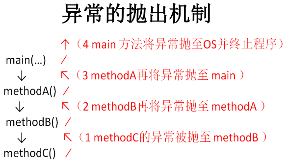

## 错误和异常

Error和Exception都继承于java.lang.Throwable。

**错误(Error)** ：程序本身无法解决的严重问题。如：

* VirtualMachineError(虚拟机内部错误)
* StackOverflowErorr(虚拟机栈溢出)
* OutOfMemoryError(虚拟机内存不足)

```
public class ErrorTest{
    public static void main(String[] args){
        main(args);  //StackOverflowError
    }
}
```

**异常(Exception)** ：可以被程序本身处理的问题。如：

* 空指针访问
* 试图读取不存在的文件
* 网络连接中断
* 数组角标越界

对于异常，一般有两种解决方法：

* 终止程序的运行
* 程序员在编程时考虑到错误的检测、提示和处理。

## Exception的分类

### 编译时异常

又称为受检异常(checked exception)，在编译时由**编译器检测并处理的异常** 。**编译时异常必须进行捕捉并处理或抛出以转化为运行时异常** 。

### 运行时异常

又成为非受检异常(unchecked exception)，编译时不进行检查和处理的异常，一般指编程时的**逻辑错误** ，是程序员应该积极避免出现的异常。如除0引发的ArithmeticException.

**java.lang.RuntimeException及它的子类都是运行时异常** 。运行时异常**可以不做处理** ，因为这类异常很普遍，若全处理，可能会对程序的可读性和运行效率产生影响。

## 异常处理机制：抓抛模型

Java程序的执行过程中如出现异常，会生成一个**异常类对象** ， 该异常对象将被提交给Java运行时系统，这个过程称为**抛出 (throw)异常** 。对下层抛出的异常的捕获并处理称为**捕获(catch)异常** ，若本层方法无法处理异常，会使用throws抛出，直到异常被处理。若异常到达main()方法仍然无法被处理，则程序运行终止。**
**

**
**

### 抛出异常

异常对象的生成：

* **虚拟机自动抛出** ：程序运行过程中，虚拟机检测到异常，如果在当前代码中没有找到相应的处理逻辑，就会在后台自动创建一个对应异常类的实例并抛出
* **开发者手动创建** ：`throw new Exception("message...");`

**
**

一旦抛出异常对象，其后的代码就不再执行。

异常对象的方法：

* getMessage()：获取异常信息字符串
* toStrin()：返回异常发生时的详细信息
* printStackTrace()：获取异常类名和异常信息，以及异常出现在程序中的位置

### 处理异常

**方式一：try-catch-finally**

```
try{
    ......//可能产生异常的代码
}catch(ExceptionName1 e){
    ......//当产生ExceptionName1型异常时的处理语句
}catch(ExceptionName2 e){
    ......//当产生ExceptionName2型异常时的处理语句
}finally{
    ......//无论是否发生异常，都无条件执行的语句
}
```

> try-catch-finally只能解决编译时异常，不保证运行时不发生异常。
>
> 一个try语句块可以对应多个catch语句，用于处理可能产生的不同类型的异常对象。若多个异常类型没有子父类关系，则顺序无所谓，但若存在子父类关系，则子类一定要写在父类的前面。
>
> finally常常用于数据库连接、输入输出流、Socket等JVM不能自动回收的**资源的释放操作** 。 此语句是可选的，但一旦存在，即使try中出现return语句，或者catch语句中又引发了新的异常，在程序结束前，finally都会执行。
>

如果明确知道产生的是何种异常，可以用该异常类或其父类作为catch的参数。比如：可以用 ArithmeticException 类作为参数的地方，就可以用RuntimeException类作为参数，或者用所有异常的父类Exception类作为参数。 但不能是与ArithmeticException类无关的异常，如NullPointerException，catch中的语句将不会执行。

**方式二：throws继续上抛**

`throws 异常`写在方法的声明处，指明此方法被执行时可能会抛出的异常类型。当方法体被执行时，一旦出现异常，仍会在异常代码处生成一个异常类的对象。此对象满足throws后的异常类型时，就会被抛出。后续代码不会被执行。

> try-catch-finally真正处理掉了异常，throws方式只是将异常抛给了上级方法，并没有真正处理异常。
>

### 开发中如何选择try-catch-finally和throws

* 如果父类中被重写的方法没有throws异常，则子类重写该方法时也不能使用throws，若重写方法时有异常，只能使用try-catch-finally方式处理。
* 方法A先后调用了另外的几个方法，这几个方法是递进关系执行的，建议这几个方法使用throws，A方法使用try-catch-finally处理。
* 涉及到资源的关闭时，应该使用try-catch-finally保证在异常发生时能在finally中关闭资源，不推荐使用throws。

### throw和throws

throw：抛出一个具体的异常对象。

* 用在方法体内，跟的是异常对象名
* 一次只能抛出一个异常对象
* 抛出的非RuntimeException异常必须在本方法体内处理

throws：声明一个方法可能产生的所有异常(并不一定发生)

* 用在方法声明后面，跟的是异常类名
* 可以同时上抛多个异常类
* 对异常不做任何处理，而是上抛给该方法的调用者处理

## 自定义异常类

要求：

* 继承于现有的异常结构：RuntimeException、Exception等。

> 用户自定义异常类一般都是RuntimeException的子类。
>

* 提供类的序列号：`static final long serialVersionID = -1321654649446L;`
* 提供重载的多个构造器

示例：

```
public class MyException extends Exception{
    static final long serialVersionUID = -7034897193246939L;
    public MyException(){
    
    }
    public MyException(String msg){
        super(msg);
    }
}
```

自定义的异常通过throw抛出。