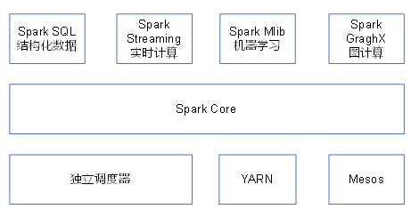
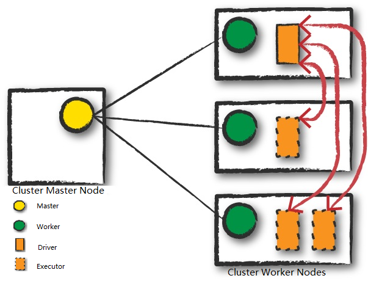
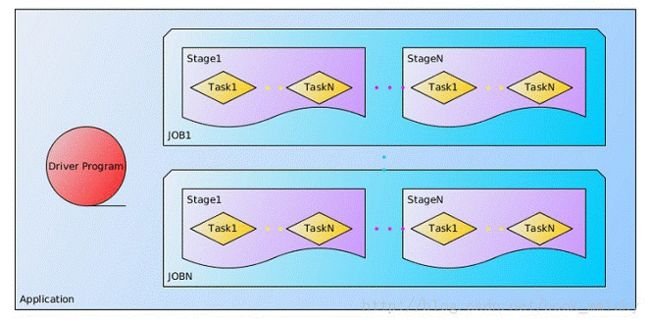

Spark是一种**基于内存** 的**快速** 、通用、**可扩展** 的大数据计算框架。

Spark使用Scala语言开发，**天生适合迭代式计算**

**存储、调度、计算：HDFS+Yarn+Spark**

## Spark的特点

**快** ：与hadoop的mapreduce相比，spark**基于内存** 的运算要快100倍以上，基于硬盘的运算也要快10倍以上，spark实现了高效的**DAG执行引擎** ，可以通过基于内存来高效处理数据流。

**易用** ：spark支持Java、python和Scala的API，使用户可以快速构建不同的应用。

**通用** ：spark提供了统一的解决方案。可以用于批处理、交互式查询(spark SQL)、实时流处理(spark streaming)、机器学习(spark MLlib)和图计算(GraphX)。这些不同类型的处理都可以在同一个应用中无缝使用。减少了开发和维护的人力成本和部署平台的物力成本。

**扩展** ：spark可以非常方便地与其他开源产品进行融合。比如，spark可以使用Hadoop的yarn和apache Mesos作为它的资源管理和调度器，并且可以处理所有Hadoop支持的数据，包括HDFS、HBase等。这对于已经部署Hadoop集群的用户特别重要，因为不需要做任何数据迁移就可以使用spark的强大处理能力。

## Spark内置模块

**Spark Core：** 实现了Spark的基本功能，包含任务调度、内存管理、错误恢复、与存储系统交互等模块。Spark Core中还包含了对弹性分布式数据集(Resilient Distributed DataSet，简称RDD)的API定义。

**Spark SQL：** 用于操作结构化数据。通过Spark SQL，我们可以使用 SQL来查询数据。Spark SQL支持多种数据源，比如Hive表、Parquet以及JSON等。

**Spark Streaming：** 是Spark提供的对实时数据进行流式计算的组件。提供了用来操作数据流的API，并且与Spark Core中的 RDD API高度对应。

**Spark MLlib：** 提供常见的机器学习(ML)功能的程序库。包括分类、回归、聚类、协同过滤等，还提供了模型评估、数据导入等额外的支持功能。

**集群管理器：** Spark支持在多种集群管理器(Cluster Manager)上运行，包括Hadoop YARN、Apache Mesos，以及Spark自带的standalone调度器。

## Spark中的重要概念

### Master

在standalone模式下就是自带的Master，**在Yarn模式下指的是ResourceManager节点** 。

### Worker

集群中的可用节点。在Standalone模式中指的是通过workers(老版本的slaves)文件配置的worker节点，**在Yarn模式中指的就是NodeManager节点** 。

### Driver

Driver是执行开发程序中的main()方法的**进程** 。Driver主要负责：

1. 将用户程序转化为Application
2. 任务的调度与监控
3. 通过UI展示运行情况

### Executor

Worker节点上负责运行task的**进程** 。

> 在Spark on Yarn模式下，其进程名称为 CoarseGrainedExecutorBackend，该进程有且仅有一个executor对象，它负责将Task包装成TaskRunner，并从线程池中抽取出一个空闲线程运行Task，这样，每个CoarseGrainedExecutorBackend能并行运行Task的数据就取决于分配给它的CPU的个数。
>

Executor主要负责：

* 运行driver分配的任务，并将结果返回给Driver；
* 通过自身的块管理器（BlockManager）为task中要求缓存的RDD提供**内存资源** 。

### Application/Job/Stage/Task

Application：用户提交的应用程序，可能包含多个job

Job：一般根据shuffle划分为多个Stage，一个action算子触发一个job

Stage：根据shuffle划分的阶段，一个Stage有一个taskset，包含多个可以并行执行的task

Task：在Executor进程中执行的具体任务，task数量由分区数决定，每个分区对应一个Task

