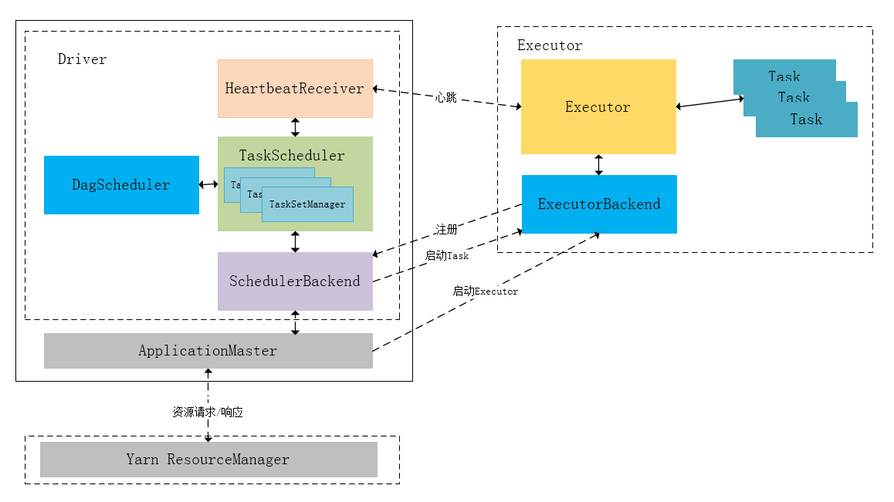
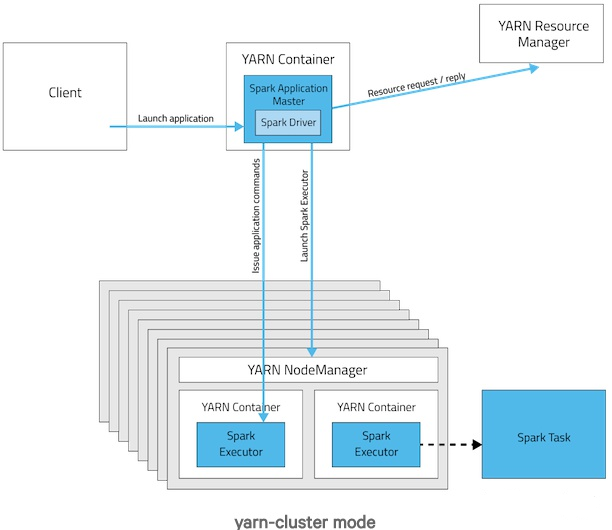
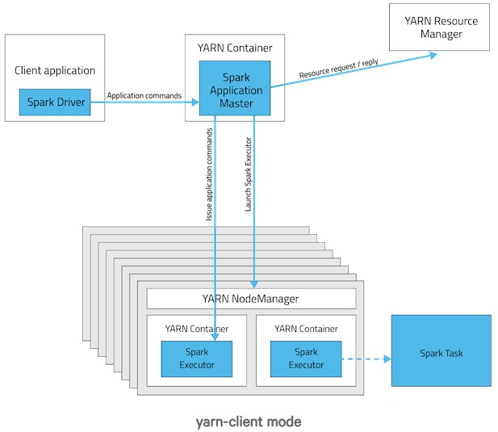

## 一、Spark的基本运行流程(待整理)

### 1、流程(以yarn-cluster模式为例)

1. Client向ResourceManager提交应用
2. ResourceManager选择一个节点创建ApplicationMaster，并创建Driver进程，准备Driver的运行环境(启动SparkContext、创建DAG Scheduler和Task Scheduler等)，就绪后Driver向ResourceManager注册并申请要启动的Executor资源；
3. 资源就绪时，ResourceManager在合适的节点上启动Executor；
4. Driver执行main()，通过DAG Scheduler划分stage，从action算子进行反向推算，划分stage的依据是宽依赖，构建好stage后，将各个Stage的Taskset发送给Task Scheduler。
5. Task Scheduler根据**数据本地性** 和**推测执行** 将Task分配给Executor运行。
6. Executor通过心跳机制向Driver报告任务执行情况。
7. 运行完毕释放所有资源。

### YARN-Client 与 YARN-Cluster 区别

主要区别就是**Driver**的位置不同。

> 1、YARN-Cluster模式下，Driver运行在AM(ApplicationMaster)中，它负责向YARN申请资源，并监督作业的运行状况。当用户提交了作业之后，就可以关掉Client，作业会继续在YARN上运行，因而YARN-Cluster模式不适合运行交互类型的作业；
>
> 2、YARN-Client模式下，ApplicationMaster仅仅向YARN请求Executor，Client本地的Driver会和Executor通信来调度他们工作，也就是说Client不能离开。yarn-client模式下导致本地机器负责spark任务的调度，本机网卡流量会激增，yarn-cluster模式没有这个问题。且本地机器和yarn集群很可能不在一个机房，通信较慢，因此性能可能不及yarn-cluster模式。
>

### 2、DAGScheduler

负责Stage级别的调度。主要是将job切分成若干Stages，并将每个Stage打包成TaskSet交给TaskScheduler调度。

**主要职能：**

1、接收提交Job的主入口，`submitJob(rdd, ...)`或`runJob(rdd, ...)`。在`SparkContext`里会调用这两个方法。

* 生成一个Stage并提交，接着判断Stage是否有父Stage未完成，若有，提交并等待父Stage，以此类推。结果是：DAGScheduler里增加了一些waiting stage和一个running stage。
* running stage提交后，分析stage里Task的类型，生成一个Task描述，即TaskSet。
* 调用`TaskScheduler.submitTask(taskSet, ...)`方法，把Task描述提交给TaskScheduler。TaskScheduler依据资源量和触发分配条件，会为这个TaskSet分配资源并触发执行。
* `DAGScheduler`提交job后，异步返回`JobWaiter`对象，能够返回job运行状态，能够cancel job，执行成功后会处理并返回结果

2、处理`TaskCompletionEvent`

* 如果task执行成功，对应的stage里减去这个task，做一些计数工作：
* 如果task是ResultTask，计数器`Accumulator`加一，在job里为该task置true，job finish总数加一。加完后如果finish数目与partition数目相等，说明这个stage完成了，标记stage完成，从running stages里减去这个stage，做一些stage移除的清理工作
* 如果task是ShuffleMapTask，计数器`Accumulator`加一，在stage里加上一个output location，里面是一个`MapStatus`类。`MapStatus`是`ShuffleMapTask`执行完成的返回，包含location信息和block size(可以选择压缩或未压缩)。同时检查该stage完成，向`MapOutputTracker`注册本stage里的shuffleId和location信息。然后检查stage的output location里是否存在空，若存在空，说明一些task失败了，整个stage重新提交；否则，继续从waiting stages里提交下一个需要做的stage
* 如果task是重提交，对应的stage里增加这个task
* 如果task是fetch失败，马上标记对应的stage完成，从running stages里减去。如果不允许retry，abort整个stage；否则，重新提交整个stage。另外，把这个fetch相关的location和map任务信息，从stage里剔除，从`MapOutputTracker`注销掉。最后，如果这次fetch的blockManagerId对象不为空，做一次`ExecutorLost`处理，下次shuffle会换在另一个executor上去执行。
* 其他task状态会由`TaskScheduler`处理，如Exception, TaskResultLost, commitDenied等。

3、其他与job相关的操作还包括：cancel job， cancel stage, resubmit failed stage等

其他职能：

cacheLocations 和 preferLocation

### 3、TaskScheduler

**TaskScheduler负责Task级的调度** ，将DAGScheduler给过来的TaskSet按照指定的调度策略分发到Executor上执行，调度过程中SchedulerBackend负责提供可用资源，其中**SchedulerBackend有多种实现，分别对接不同的资源管理系统** 。

维护task和executor对应关系，executor和物理资源对应关系，在排队的task和正在跑的task。

内部维护一个任务队列，根据FIFO或Fair策略，调度任务。

`TaskScheduler`本身是个接口，spark里只实现了一个`TaskSchedulerImpl`，理论上任务调度可以定制。

主要功能：

`1、submitTasks(taskSet)`，接收`DAGScheduler`提交来的tasks

* 为tasks创建一个`TaskSetManager`，添加到任务队列里。`TaskSetManager`跟踪每个task的执行状况，维护了task的许多具体信息。
* 触发一次资源的索要。
* 首先，`TaskScheduler`对照手头的可用资源和Task队列，进行executor分配(考虑优先级、本地化等策略)，符合条件的executor会被分配给`TaskSetManager`。
* 然后，得到的Task描述交给`SchedulerBackend`，调用`launchTask(tasks)`，触发executor上task的执行。task描述被序列化后发给executor，executor提取task信息，调用task的`run()`方法执行计算。

`2、cancelTasks(stageId)`，取消一个stage的tasks

* 调用`SchedulerBackend`的`killTask(taskId, executorId, ...)`方法。taskId和executorId在`TaskScheduler`里一直维护着。

`3、resourceOffer(offers: Seq[Workers])`，这是非常重要的一个方法，调用者是`SchedulerBacnend`，用途是底层资源`SchedulerBackend`把空余的workers资源交给`TaskScheduler`，让其根据调度策略为排队的任务分配合理的cpu和内存资源，然后把任务描述列表传回给`SchedulerBackend`

* 从worker offers里，搜集executor和host的对应关系、active executors、机架信息等等
* worker offers资源列表进行随机洗牌，任务队列里的任务列表依据调度策略进行一次排序
* 遍历每个taskSet，按照进程本地化、worker本地化、机器本地化、机架本地化的优先级顺序，为每个taskSet提供可用的cpu核数，看是否满足
* 默认一个task需要一个cpu，设置参数为`"spark.task.cpus=1"`
* 为taskSet分配资源，校验是否满足的逻辑，最终在`TaskSetManager`的`resourceOffer(execId, host, maxLocality)`方法里
* 满足的话，会生成最终的任务描述，并且调用`DAGScheduler`的`taskStarted(task, info)`方法，通知`DAGScheduler`，这时候每次会触发`DAGScheduler`做一次`submitMissingStage`的尝试，即stage的tasks都分配到了资源的话，马上会被提交执行

`4、statusUpdate(taskId, taskState, data)`,另一个非常重要的方法，调用者是`SchedulerBacnend`，用途是`SchedulerBacnend`会将task执行的状态汇报给`TaskScheduler`做一些决定

* 若`TaskLost`，找到该task对应的executor，从active executor里移除，避免这个executor被分配到其他task继续失败下去。
* task finish包括四种状态：finished, killed, failed, lost。只有finished是成功执行完成了。其他三种是失败。
* task成功执行完，调用`TaskResultGetter.enqueueSuccessfulTask(taskSet, tid, data)`，否则调用`TaskResultGetter.enqueueFailedTask(taskSet, tid, state, data)`。`TaskResultGetter`内部维护了一个线程池，负责异步fetch task执行结果并反序列化。默认开四个线程做这件事，可配参数`"spark.resultGetter.threads"=4`。

2、对于failed task，从data里解析出fail的理由，调用

> 1、对于success task，如果taskResult里的数据是直接结果数据，直接把data反序列出来得到结果；如果不是，会调用`blockManager.getRemoteBytes(blockId)`从远程获取。如果远程取回的数据是空的，那么会调用`TaskScheduler.handleFailedTask`，告诉它这个任务是完成了的但是数据是丢失的。否则，取到数据之后会通知`BlockManagerMaster`移除这个block信息，调用`TaskScheduler.handleSuccessfulTask`，告诉它这个任务是执行成功的，并且把result data传回去。2、对于failed task，从data里解析出fail的理由，调用`TaskScheduler.handleFailedTask`，告诉它这个任务失败了，理由是什么。
>

### 4、SchedulerBackend

在`TaskScheduler`下层，用于对接不同的资源管理系统，`SchedulerBackend`是个接口，需要实现的主要方法如下：

def start(): Unit def stop(): Unit def reviveOffers(): Unit // 重要方法：SchedulerBackend把自己手头上的可用资源交给TaskScheduler，TaskScheduler根据调度策略分配给排队的任务吗，返回一批可执行的任务描述，SchedulerBackend负责launchTask，即最终把task塞到了executor模型上，executor里的线程池会执行task的run() def killTask(taskId: Long, executorId: String, interruptThread: Boolean): Unit = throw new UnsupportedOperationException

粗粒度：进程常驻的模式，典型代表是standalone模式，mesos粗粒度模式，yarn

细粒度：mesos细粒度模式

这里讨论粗粒度模式，更好理解：`CoarseGrainedSchedulerBackend`。

维护executor相关信息(包括executor的地址、通信端口、host、总核数，剩余核数)，手头上executor有多少被注册使用了，有多少剩余，总共还有多少核是空的等等。

主要职能

1、Driver端主要通过actor监听和处理下面这些事件：

* `RegisterExecutor(executorId, hostPort, cores, logUrls)`。这是executor添加的来源，通常worker拉起、重启会触发executor的注册。`CoarseGrainedSchedulerBackend`把这些executor维护起来，更新内部的资源信息，比如总核数增加。最后调用一次`makeOffer()`，即把手头资源丢给`TaskScheduler`去分配一次，返回任务描述回来，把任务launch起来。这个`makeOffer()`的调用会出现在*任何与资源变化相关的事件* 中，下面会看到。
* `StatusUpdate(executorId, taskId, state, data)`。task的状态回调。首先，调用`TaskScheduler.statusUpdate`上报上去。然后，判断这个task是否执行结束了，结束了的话把executor上的freeCore加回去，调用一次`makeOffer()`。
* `ReviveOffers`。这个事件就是别人直接向`SchedulerBackend`请求资源，直接调用`makeOffer()`。
* `KillTask(taskId, executorId, interruptThread)`。这个killTask的事件，会被发送给executor的actor，executor会处理`KillTask`这个事件。
* `StopExecutors`。通知每一个executor，处理`StopExecutor`事件。
* `RemoveExecutor(executorId, reason)`。从维护信息中，那这堆executor涉及的资源数减掉，然后调用`TaskScheduler.executorLost()`方法，通知上层我这边有一批资源不能用了，你处理下吧。`TaskScheduler`会继续把`executorLost`的事件上报给`DAGScheduler`，原因是`DAGScheduler`关心shuffle任务的output location。`DAGScheduler`会告诉`BlockManager`这个executor不可用了，移走它，然后把所有的stage的shuffleOutput信息都遍历一遍，移走这个executor，并且把更新后的shuffleOutput信息注册到`MapOutputTracker`上，最后清理下本地的`CachedLocations`Map。

`2、reviveOffers()`方法的实现。直接调用了`makeOffers()`方法，得到一批可执行的任务描述，调用`launchTasks`。

`3、launchTasks(tasks: Seq[Seq[TaskDescription]])`方法。

* 遍历每个task描述，序列化成二进制，然后发送给每个对应的executor这个任务信息
* 如果这个二进制信息太大，超过了9.2M(默认的akkaFrameSize 10M 减去 默认 为akka留空的200K)，会出错，abort整个taskSet，并打印提醒增大akka frame size
* 如果二进制数据大小可接受，发送给executor的actor，处理`LaunchTask(serializedTask)`事件。

### 5、Executor

Executor可以套用到不同的资源管理系统上，与`SchedulerBackend`配合使用。内部有个线程池，running tasks map，以及actor，接收上面提到的由`SchedulerBackend`发来的事件。

1. `launchTask`。根据task描述，生成一个`TaskRunner`线程，丢进running tasks map里，用线程池执行这个`TaskRunner`
2. `killTask`。从running tasks map里拿出线程对象，调它的kill方法。

任务的并行度：

分区数：可以通过rdd.partitions.size获取分区数

初始分区数可以自定义，未自定义则默认为程序分到的核数，若为HDFS文件，分区数为文件块数，计算过程中，某些算子可以调整分区数，如repartition()

task的最大并行度：executors*executor-cores

当分区数大于并行度时，每个executor可能需要执行多轮task。