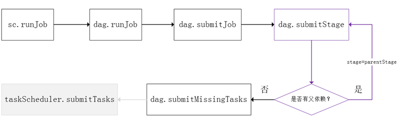
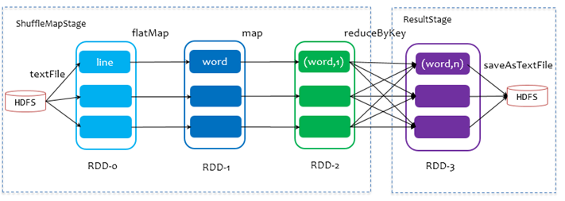
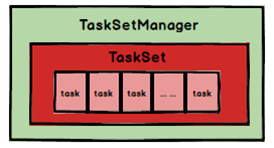
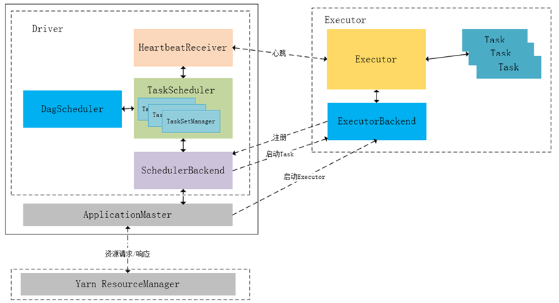
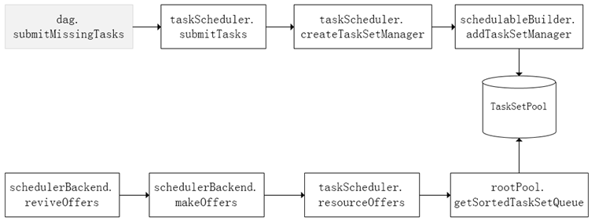
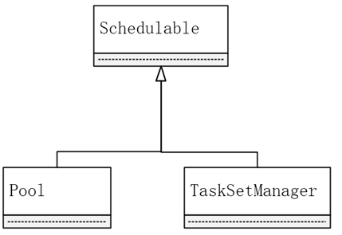
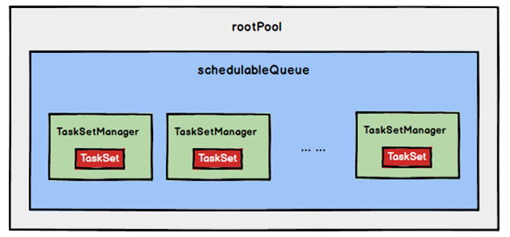
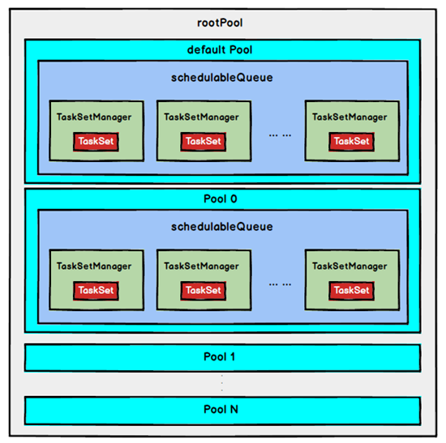
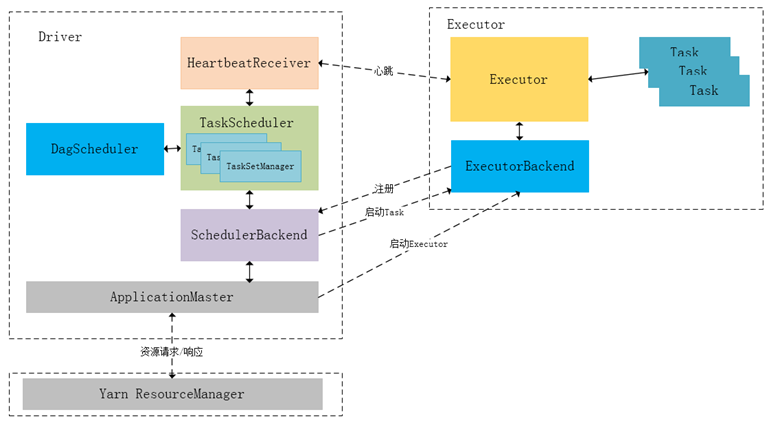

## 1. Spark Stage级调度

Spark的任务调度是从DAG切割开始，主要是由DAGScheduler来完成。当遇到一个Action操作后就会触发一个Job的计算，并交给DAGScheduler来提交，下图是涉及到Job提交的相关方法调用流程图。

Job由最终的RDD和Action方法封装而成，SparkContext将Job交给DAGScheduler提交，它会根据RDD的血缘关系构成的DAG进行切分，将一个Job划分为若干Stages，具体划分策略是，由最终的RDD不断通过依赖回溯判断父依赖是否是宽依赖，即以Shuffle为界，划分Stage，窄依赖的RDD之间被划分到同一个Stage中，可以进行pipeline式的计算，如上图紫色流程部分。划分的Stages分两类，一类叫做ResultStage，为DAG最下游的Stage，由Action方法决定，另一类叫做ShuffleMapStage，为下游Stage准备数据，下面看一个简单的例子WordCount。

Job由saveAsTextFile触发，该Job由RDD-3和saveAsTextFile方法组成，根据RDD之间的依赖关系从RDD-3开始回溯搜索，直到没有依赖的RDD-0，在回溯搜索过程中，RDD-3依赖RDD-2，并且是宽依赖，所以在RDD-2和RDD-3之间划分Stage，RDD-3被划到最后一个Stage，即ResultStage中，RDD-2依赖RDD-1，RDD-1依赖RDD-0，这些依赖都是窄依赖，所以将RDD-0、RDD-1和RDD-2划分到同一个Stage，即ShuffleMapStage中，实际执行的时候，数据记录会一气呵成地执行RDD-0到RDD-2的转化。不难看出，**其本质上是一个深度优先搜索算法**。

一个Stage是否被提交，需要判断它的父Stage是否执行，只有在父Stage执行完毕才能提交当前Stage，如果一个Stage没有父Stage，那么从该Stage开始提交。Stage提交时会将Task信息（分区信息以及方法等）序列化并被打包成TaskSet交给TaskScheduler，一个Partition对应一个Task，另一方面TaskScheduler会监控Stage的运行状态，只有Executor丢失或者Task由于Fetch失败才需要重新提交失败的Stage以调度运行失败的任务，其他类型的Task失败会在TaskScheduler的调度过程中重试。

相对来说DAGScheduler做的事情较为简单，仅仅是在Stage层面上划分DAG，提交Stage并监控相关状态信息。TaskScheduler则相对较为复杂，下面详细阐述其细节。

## 2. Spark Task级调度

Spark Task的调度是由TaskScheduler来完成，由前文可知，DAGScheduler将Stage打包到TaskSet交给TaskScheduler，TaskScheduler会将TaskSet封装为TaskSetManager加入到调度队列中，TaskSetManager结构如下图所示。

TaskSetManager负责监控管理同一个Stage中的Tasks，TaskScheduler就是以TaskSetManager为单元来调度任务。

前面也提到，TaskScheduler初始化后会启动SchedulerBackend，它负责跟外界打交道，接收Executor的注册信息，并维护Executor的状态，所以说SchedulerBackend是管“粮食”的，同时它在启动后会定期地去“询问”TaskScheduler有没有任务需要运行，TaskScheduler在SchedulerBackend“问”它的时候，会从调度队列中按照指定的调度策略选择TaskSetManager去调度运行，大致方法调用流程如下图所示：

将TaskSetManager加入rootPool调度池中之后，调用SchedulerBackend的riviveOffers方法给driverEndpoint发送ReviveOffer消息；driverEndpoint收到ReviveOffer消息后调用makeOffers方法，过滤出活跃状态的Executor（这些Executor都是任务启动时反向注册到Driver的Executor），然后将Executor封装成WorkerOffer对象；准备好计算资源（WorkerOffer）后，taskScheduler基于这些资源调用resourceOffer在Executor上分配task。

### 2.1 调度策略

前面讲到，TaskScheduler会先把DAGScheduler给过来的TaskSet封装成TaskSetManager扔到任务队列里，然后再从任务队列里按照一定的规则把它们取出来在SchedulerBackend给过来的Executor上运行。这个调度过程实际上还是比较粗粒度的，是面向TaskSetManager的。

TaskScheduler是以树的方式来管理任务队列，树中的节点类型为Schdulable，叶子节点为TaskSetManager，非叶子节点为Pool，下图是它们之间的继承关系。

TaskScheduler**支持两种调度策略，一种是FIFO****，也是默认的调度策略，另一种是FAIR**。在TaskScheduler初始化过程中会实例化rootPool，表示树的根节点，是Pool类型。

#### 1.  FIFO调度策略

如果是采用FIFO调度策略，则直接简单地将TaskSetManager按照先来先到的方式入队，出队时直接拿出最先进队的TaskSetManager，其树结构如下图所示，TaskSetManager保存在一个FIFO队列中。

#### 2.  FAIR调度策略

FAIR调度策略的树结构如下图所示：

FAIR模式中有一个rootPool和多个子Pool，各个子Pool中存储着所有待分配的TaskSetMagager。

**在FAIR****模式中，需要先对子Pool****进行排序，再对子Pool****里面的TaskSetMagager****进行排序，因为Pool****和TaskSetMagager****都继承了Schedulable****特质，因此使用相同的排序算法**。

排序过程的比较是基于**Fair-share**来比较的，每个要排序的对象包含三个属性: runningTasks值（正在运行的Task数）、minShare值、weight值，比较时会综合考量runningTasks值，minShare值以及weight值。

注意，minShare、weight的值均在公平调度配置文件fairscheduler.xml中被指定，调度池在构建阶段会读取此文件的相关配置。

1) 如果A对象的runningTasks大于它的minShare，B对象的runningTasks小于它的minShare，那么B排在A前面；（**runningTasks****比minShare****小的先执行**）
2) 如果A、B对象的runningTasks都小于它们的minShare，那么就比较runningTasks与minShare的比值（**minShare****使用率**），谁小谁排前面；（**minShare****使用率低的先执行**）
3) 如果A、B对象的runningTasks都大于它们的minShare，那么就比较runningTasks与weight的比值（**权重使用率**），谁小谁排前面。（**权重使用率低的先执行**）
4) 如果上述比较均相等，则比较名字。

**整体上来说就是通过minShare****和weight****这两个参数控制比较过程，可以做到让minShare****使用率和权重使用率少（实际运行task****比例较少）的先运行**。

FAIR模式排序完成后，所有的TaskSetManager被放入一个ArrayBuffer里，之后依次被取出并发送给Executor执行。

从调度队列中拿到TaskSetManager后，由于TaskSetManager封装了一个Stage的所有Task，并负责管理调度这些Task，那么接下来的工作就是TaskSetManager按照一定的规则一个个取出Task给TaskScheduler，TaskScheduler再交给SchedulerBackend去发到Executor上执行。

### 2.2 数据本地性调度

DAGScheduler切割Job，划分Stage, 通过调用submitStage来提交一个Stage对应的tasks，submitStage会调用submitMissingTasks，submitMissingTasks确定每个需要计算的task 的preferredLocations，通过调用getPreferrdeLocations()得到partition的优先位置，由于一个partition对应一个task，此partition的优先位置就是task的优先位置，对于要提交到TaskScheduler的TaskSet中的每一个task，该task优先位置与其对应的partition对应的优先位置一致。

从调度队列中拿到TaskSetManager后，那么接下来的工作就是TaskSetManager按照一定的规则一个个取出task给TaskScheduler，TaskScheduler再交给SchedulerBackend去发到Executor上执行。前面也提到，TaskSetManager封装了一个Stage的所有task，并负责管理调度这些task。

根据每个task的优先位置，确定task的Locality级别，Locality一共有五种，优先级由高到低顺序：

表4-1 Spark本地性等级

| **名称**          | **解析**                                                                                             |
| ----------------- | ---------------------------------------------------------------------------------------------------- |
| **PROCESS_LOCAL** | 进程本地化，task和数据在同一个Executor中，性能最好。                                                 |
| **NODE_LOCAL**    | 节点本地化，task和数据在同一个节点中，但是task和数据不在同一个Executor中，数据需要在进程间进行传输。 |
| **RACK_LOCAL**    | 机架本地化，task和数据在同一个机架的两个节点上，数据需要通过网络在节点之间进行传输。                 |
| **NO_PREF**       | 对于task来说，从哪里获取都一样，没有好坏之分。                                                       |
| **ANY**           | task和数据可以在集群的任何地方，而且不在一个机架中，性能最差。                                       |

在调度执行时，Spark调度总是会尽量让每个task以最高的本地性级别来启动，当一个task以X本地性级别启动，但是该本地性级别对应的所有节点都没有空闲资源而启动失败，此时并不会马上降低本地性级别启动而是在某个时间长度内再次以X本地性级别来启动该task，若超过限时时间则降级启动，去尝试下一个本地性级别，依次类推。

可以通过调大每个类别的最大容忍延迟时间，在等待阶段对应的Executor可能就会有相应的资源去执行此task，这就在在一定程度上提到了运行性能。

### 2.3 失败重试与黑名单机制

除了选择合适的Task调度运行外，还需要监控Task的执行状态，前面也提到，与外部打交道的是SchedulerBackend，Task被提交到Executor启动执行后，Executor会将执行状态上报给SchedulerBackend，SchedulerBackend则告诉TaskScheduler，TaskScheduler找到该Task对应的TaskSetManager，并通知到该TaskSetManager，这样TaskSetManager就知道Task的失败与成功状态，对于失败的Task，会记录它失败的次数，如果失败次数还没有超过最大重试次数，那么就把它放回待调度的Task池子中，否则整个Application失败。

在记录Task失败次数过程中，会记录它上一次失败所在的Executor Id和Host，这样下次再调度这个Task时，会使用黑名单机制，避免它被调度到上一次失败的节点上，起到一定的容错作用。黑名单记录Task上一次失败所在的Executor Id和Host，以及其对应的“拉黑”时间，“拉黑”时间是指这段时间内不要再往这个节点上调度这个Task了。