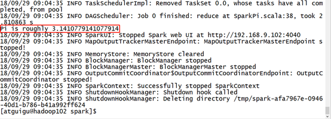
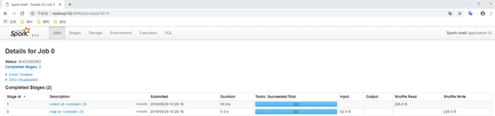
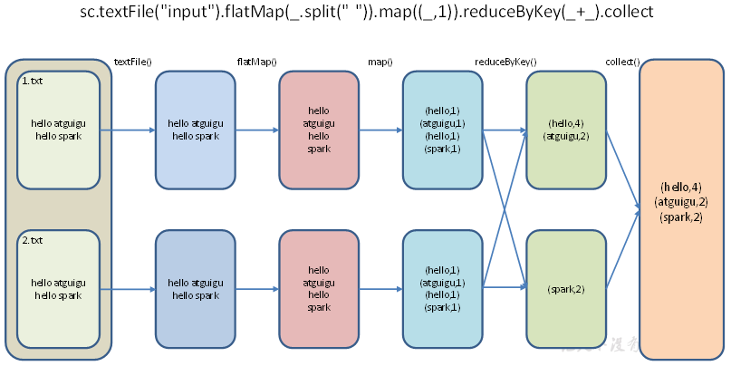
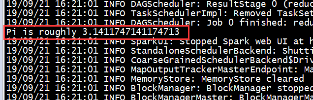
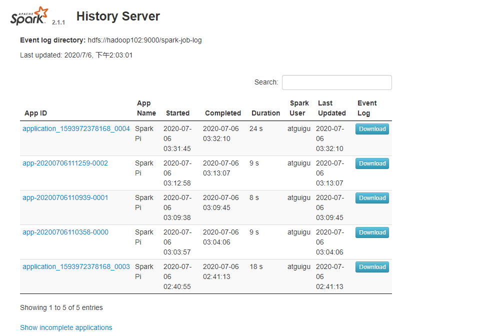
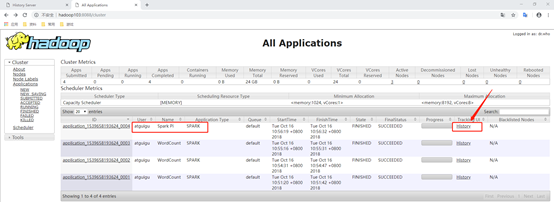
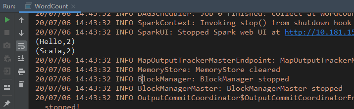

## 应用提交

基本语法：

```shell
spark-submit \
--class <main-class>
--master <master-url> \
--deploy-mode <deploy-mode> \
--conf <key>=<value> \
... # other options
--executor-cores 4 \
--queue root.bdp_jmart_ad_data.jd_ad_data_track \
--executor-memory 24g \
--driver-memory 15g \
--num-executors 600 \
--total-executor-cores 2400 \
<application-jar> \
[application-arguments]

//实习时用的配置
nohup spark-submit --class sku.SkuDistanceStep3 \
--master yarn --deploy-mode client \
--executor-cores 4 \
--queue root.bdp_jmart_ad_data.jd_ad_data_track \
--executor-memory 24g \
--driver-memory 15g \
--num-executors 600 \
--total-executor-cores 2400 \
--conf spark.sql.shuffle.partitions=6000 \
--conf spark.yarn.executor.memoryOverhead=4096 \
--conf spark.core.connection.ack.wait.timeout=300 \
--conf spark.rpc.askTimeout=300 \
./brand_distance_project-1.0-SNAPSHOT.jar 2020-10-20 > SkuDistanceStep3.txt &
```

> \# 参数说明：
>
> --class: 你的应用的启动类 (如 org.apache.spark.examples.SparkPi)
>
> --master 指定Master的地址
>
> --deploy-mode: client(默认)/cluster 区别是client模式Driver在本地，cluster模式Driver在集群
>
> --conf: 任意的Spark配置属性，格式 key=value. 如果值包含空格，可以加引号，如"key=va lue"
>
> application-jar: 打包好的jar应用,包含依赖。
>
> application-arguments: 传给main()方法的参数
>
> --executor-memory 1G 指定每个executor可用内存为1G
>
> --total-executor-cores 2 指定每个executor使用的cup核数为2个
>

--master参数可选值：

| Master URL                      | Meaning                                                                                                                                                      |
| ------------------------------- | ------------------------------------------------------------------------------------------------------------------------------------------------------------ |
| local                           | 在本地运行，只有一个工作进程，无并行计算能力。默认值                                                                                                         |
| local[K]                        | 在本地运行，有K个工作进程，通常设置K为机器的CPU核心数量。                                                                                                    |
| local[*]                        | 在本地运行，工作进程数量等于机器的CPU核心数量。                                                                                                              |
| spark://HOST:PORT               | 连接至指定的standalone集群的master节点，默认端口号: 7077                                                                                                     |
| spark://HOST1:PORT1,HOST2:PORT2 | 如果 standalone 集群采用 Zookeeper 实现高可用，则必须包含由 zookeeper 设置的所有 master 主机地址。                                                           |
| mesos://HOST:PORT               | 在Mesos集群上运行，默认端口号5050。对于使用了 ZooKeeper 的 Mesos cluster 来说，使用mesos://zk://...来指定地址，部署模式必须使用固定值:--deploy-mode  cluster |
| yarn                            | 在Yarn集群上运行，Yarn集群地址必须定义在HADOOP_CONF_DIR或YARN_CONF_DIR中                                                                                     |

## Local模式

Local模式用于练手和测试，在一台计算机上模拟集群。

示例：

1. 上传spark安装包到服务器并解压

```
[atguigu@hadoop102 sorfware]$ tar -zxvf spark-2.1.1-bin-hadoop2.7.tgz -C /opt/module/
[atguigu@hadoop102 module]$ mv spark-2.1.1-bin-hadoop2.7 spark
```

1. 运行官方求PI案例

```
[atguigu@hadoop102 spark]$ bin/spark-submit \
--class org.apache.spark.examples.SparkPi \
./examples/jars/spark-examples_2.11-2.1.1.jar \
100
```

> 该算法使用蒙特卡罗算法求PI，进行了100次迭代
>

1. 结果展示：



1. 准备文件: 创建input文件夹，并创建两个文件

```
[atguigu@hadoop102 spark]$ mkdir input
[atguigu@hadoop102 input]$ touch 1.txt 2.txt
# 在1.txt和2.txt中输入以下内容
hello atguigu
hello spark
```

1. 启动spark-shell

```
[atguigu@hadoop102 spark]$ bin/spark-shell --master local[*]
```

1. 开启另一个窗口

```
[atguigu@hadoop102 spark]$ jps
3627 SparkSubmit
4047 Jps
```

1. 运行WordCount程序

```
scala>sc.textFile("input").flatMap(_.split(" ")).map((_,1)).reduceByKey(_+_).collect
res16: Array[(String, Int)] = Array((hello,4), (atguigu,2), (spark,2))
```

1. 可登录hadoop102:4040查看程序运行状态



1. WordCount程序分析：


数据流分析：读取-->扁平化-->分组-->聚合-->收集
`textFile("input")`：读取本地文件input文件夹数据；
`flatMap(_.split(" "))`：压平操作，按照空格分割符将一行数据映射成一个个单词；
`map((_,1))`：对每一个元素操作，将单词映射为元组；
`reduceByKey(_+_)`：按照key将value进行reduce归约，此处为相加；
`collect`：将数据收集到Driver端展示。

## Standalone模式

standalone表示不使用Yarn或Mesos，构建一个由Master+Slave构成的Spark集群。

1. 修改配置

进入spark的conf目录下，修改三个文件名

```
mv slaves.template slaves
mv spark-env.sh.template spark-env.sh
mv spark-defaults.conf.template spark-defaults.conf
```

修改slaves，添加work节点

```
hadoop102
hadoop103
hadoop104
```

> 注意事项：
>
> - 主机名与 IP 地址的映射必须在 `/etc/hosts` 文件中已经配置，否则就直接使用 IP 地址；
> - 每个主机名必须独占一行；
> - Spark 的 Master 主机是通过 SSH 访问所有的 Worker 节点，所以需要预先配置免密登录。
>

修改spark.env.sh，添加

```
SPARK_MASTER_HOST=hadoop102
SPARK_MASTER_PORT=7077
```

分发spark到集群各个节点，之后启动Spark

```
[atguigu@hadoop102 module]$ xsync spark/
[atguigu@hadoop102 spark]$ sbin/start-all.sh
[atguigu@hadoop102 spark]$ xcall jps
================atguigu@hadoop102================
3330 Jps
3238 Worker
3163 Master
================atguigu@hadoop103================
2966 Jps
2908 Worker
================atguigu@hadoop104================
2978 Worker
3036 Jps
```

1. 运行官方案例：求PI

```
bin/spark-submit \
--class org.apache.spark.examples.SparkPi \
--master spark://hadoop102:7077 \
--executor-memory 1G \
--total-executor-cores 2 \
./examples/jars/spark-examples_2.11-2.1.1.jar \
100
```

结果：



1. Spark-Shell模式测试

```
/opt/module/spark/bin/spark-shell \
--master spark://hadoop102:7077 \
--executor-memory 1g \
--total-executor-cores 2

scala> sc.textFile("input").flatMap(_.split(" ")).map((_,1)).reduceByKey(_+_).collect
```

1. JobHistoryServer配置

修改spark-default.conf文件，开启Log：

```
[atguigu@hadoop102 conf]$ vi spark-defaults.conf

spark.eventLog.enabled      true
spark.eventLog.dir        hdfs://hadoop102:9000/directory
```

> 注意：HDFS上的目录需要提前创建。
>

修改spark-env.sh文件，添加如下配置：

```
[atguigu@hadoop102 conf]$ vi spark-env.sh

export SPARK_HISTORY_OPTS="-Dspark.history.ui.port=18080 
-Dspark.history.retainedApplications=30 
-Dspark.history.fs.logDirectory=hdfs://hadoop102:9000/directory"
```

```
参数描述：
spark.eventLog.dir：Application在运行过程中所有的信息均记录在该属性指定的路径下； 
spark.history.ui.port=18080  WEBUI访问的端口号为18080
spark.history.fs.logDirectory=hdfs://hadoop102:9000/directory  配置了该属性后，在start-history-server.sh时就无需再显式的指定路径，Spark History Server页面只展示该指定路径下的信息
spark.history.retainedApplications=30 指定保存Application历史记录的个数，如果超过这个值，旧的应用程序信息将被删除，这个是内存中的应用数，而不是页面上显示的应用数。
```

分发配置文件：

```
[atguigu@hadoop102 conf]$ xsync spark-defaults.conf
[atguigu@hadoop102 conf]$ xsync spark-env.sh
```

启动历史服务

```
[atguigu@hadoop102 spark]$ sbin/start-history-server.sh
```

再次执行任务

```
[atguigu@hadoop102 spark]$ bin/spark-submit \
--class org.apache.spark.examples.SparkPi \
--master spark://hadoop102:7077 \
--executor-memory 1G \
--total-executor-cores 2 \
./examples/jars/spark-examples_2.11-2.1.1.jar \
100
```

查看历史服务：hadoop102:18080



## yarn模式(重点)

Spark客户端直接连接Yarn，不需要额外构建Spark集群。

有client和cluster两种模式，主要区别在于：Driver程序的运行节点。

- client：Driver运行在客户端，适用于交互、调试，希望立即看到app的输出。
- cluster：Driver运行在由ResourceManager启动的APPMaster，适用于生产环境。

1）修改配置

在spark-env.sh中配置hadoop的配置目录的位置，可以使用`YARN_CONF_DIR` 或 `HADOOP_CONF_DIR`进行指定：

```
[atguigu@hadoop102 conf]$ vi spark-env.sh

YARN_CONF_DIR=/opt/module/hadoop-2.7.2/etc/hadoop
```

2）在提交Spark application之前需启动HDFS以及YARN集群。

3） 执行求PI案例

```
[atguigu@hadoop102 spark]$ bin/spark-submit \
--class org.apache.spark.examples.SparkPi \
--master yarn \
--deploy-mode client \
./examples/jars/spark-examples_2.11-2.1.1.jar \
100
```

4）日志查看

首先在hdfs上创建一个/spark-job-log文件夹

修改配置文件spark-defaults.conf，添加如下内容：

```
spark.eventLog.enabled           true
spark.eventLog.dir               hdfs://hadoop102:9000/spark-job-log
spark.yarn.historyServer.address        hadoop102:18080
spark.history.ui.port   18080
```

重启spark历史服务

```
[atguigu@hadoop102 spark]$ sbin/stop-history-server.sh 
stopping org.apache.spark.deploy.history.HistoryServer
[atguigu@hadoop102 spark]$ sbin/start-history-server.sh 
starting org.apache.spark.deploy.history.HistoryServer, logging to /opt/module/spark/logs/spark-atguigu-org.apache.spark.deploy.history.HistoryServer-1-hadoop102.out
```

提交任务到Yarn执行

```
[atguigu@hadoop102 spark]$ bin/spark-submit \
--class org.apache.spark.examples.SparkPi \
--master yarn \
--deploy-mode client \
./examples/jars/spark-examples_2.11-2.1.1.jar \
100
```

web页面查看日志




## 三种模式对比

| 模式       | Spark安装机器数 | 需启动的进程   | 所属者 |
| ---------- | --------------- | -------------- | ------ |
| Local      | 1               | 无             | Spark  |
| Standalone | 3               | Master及Worker | Spark  |
| Yarn       | 1               | Yarn及HDFS     | Hadoop |

## 案例实操：**IDEA创建Maven工程并编写Wordcount程序**

Spark Shell仅在测试和验证我们的程序时使用的较多，在生产环境中，通常会在IDE中编制程序，然后打成jar包，然后提交到集群，最常用的是创建一个Maven项目，利用Maven来管理jar包的依赖。

1）IDEA创建一个Maven项目WordCount并导入依赖

```
<dependencies>
    <dependency>
        <groupId>org.apache.spark</groupId>
        <artifactId>spark-core_2.11</artifactId>
        <version>2.1.1</version>
    </dependency>
</dependencies>
<build>
        <finalName>WordCount</finalName>
<plugins>
<plugin>
    <groupId>net.alchim31.maven</groupId>
    <artifactId>scala-maven-plugin</artifactId>
    <version>3.2.2</version>
    <executions>
        <execution>
            <goals>
                <goal>compile</goal>
                <goal>testCompile</goal>
            </goals>
        </execution>
    </executions>
    </plugin>
  
    <plugin>
        <groupId>org.apache.maven.plugins</groupId>
        <artifactId>maven-compiler-plugin</artifactId>
        <configuration>
            <source>1.8</source>
            <target>1.8</target>
        </configuration>
    </plugin>
</plugins>
</build>
```

编写代码

本地测试版：如果是在window下测试，需要windows版hadoop的winutils.exe

```
object WordCount {
  def main(args: Array[String]): Unit = {
    //使用开发工具完成Spark WordCount的开发

    //创建sparkconf对象，设定Master的运行模式为local[*]，设定AppName(app id)为WC
    val conf: SparkConf = new SparkConf().setMaster("local[*]").setAppName("WC")

    //创建sparkcontext对象，传入conf，sparkcontext对象是提交spark application的入口
    val sc = new SparkContext(conf)

    //读取文件: 将文件内容一行一行地读取出来，创建RDD
    val lines: RDD[String] = sc.textFile("D:\\input\\1.txt")
    //将每行数据分解为一个个的单词
    val words = lines.flatMap(_.split(" "))
    //为了统计方便，将单词数据进行结构转换
    val wordToOne: RDD[(String, Int)] = words.map((_, 1))

    //将转换后的数据进行分组规约
    val result: RDD[(String, Int)] = wordToOne.reduceByKey(_+_)
  
    //输出数据
    result.foreach(println)
  
    //关闭连接
    sc.stop()
  }
}
```

执行结果：



集群测试版：将代码打包成jar包，在集群上进行测试

```
object WordCount {
  def main(args: Array[String]): Unit = {
    //使用开发工具完成Spark WordCount的开发

    //创建sparkconf对象，设定AppName(app id)为WC
    val conf: SparkConf = new SparkConf().setAppName("WC")

    //创建sparkcontext对象，传入conf，sparkcontext对象是提交spark application的入口
    val sc = new SparkContext(conf)

    //读取文件: 将文件内容一行一行地读取出来，创建RDD
    val lines: RDD[String] = sc.textFile(args(0))
    //将每行数据分解为一个个的单词
    val words = lines.flatMap(_.split(" "))
    //为了统计方便，将单词数据进行结构转换
    val wordToOne: RDD[(String, Int)] = words.map((_, 1))

    //将转换后的数据进行分组规约
    val result: RDD[(String, Int)] = wordToOne.reduceByKey(_+_)
  
    //保存数据
    result.saveAsTextFile(args(1))
  
    //关闭连接
    sc.stop()
  }
}
```

> 路径查找位置默认从当前的部署环境查找，若为yarn模式，应从hdfs:///input查找，若为本地模式，应为file:///opt/module/spark/input。为避免错误，可以一直写全路径。
>

打包到集群需要在pom.xml里添加如下配置

```
<plugin>
    <groupId>org.apache.maven.plugins</groupId>
    <artifactId>maven-assembly-plugin</artifactId>
    <version>3.0.0</version>
    <configuration>
        <archive>
            <manifest>
                <mainClass>WordCount</mainClass>
            </manifest>
        </archive>
        <descriptorRefs>
            <descriptorRef>jar-with-dependencies</descriptorRef>
        </descriptorRefs>
    </configuration>
    <executions>
        <execution>
            <id>make-assembly</id>
            <phase>package</phase>
            <goals>
                <goal>single</goal>
            </goals>
        </execution>
    </executions>
</plugin>
```

上传到集群后进行测试：

```
bin/spark-submit \
--class WordCount \
--master yarn \
WordCount.jar \
/input \
/output
```

> 默认是hdfs，要输入linux本地文件夹，使用file:///opt/module/....
>