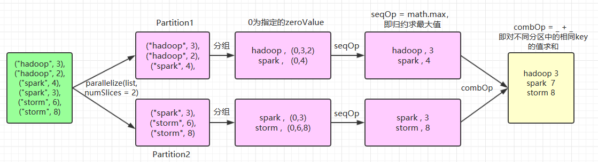
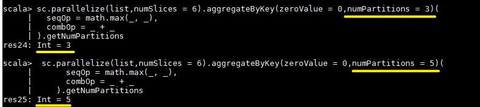

## 一、Transformation

### Value类型

#### 1.1 map(func)

对原 RDD 中每个元素运用 *func* 函数，并生成新的 RDD

```
val list = List(1,2,3)
sc.parallelize(list).map(_ * 10).foreach(println)

// 输出结果： 10 20 30 （这里为了节省篇幅去掉了换行,后文亦同）
```

#### 1.2 filter(func)

将原RDD中每个元素传入*func* 函数进行过滤，保留结果为true的元素，形成新的RDD

```
val list = List(3, 6, 9, 10, 12, 21)
sc.parallelize(list).filter(_ >= 10).foreach(println)

// 输出： 10 12 21
```

#### 1.3 flatMap(func)

`flatMap(func)` 与 `map` 类似，但每一个输入的 item 会被映射成 0 个或多个输出的 items（ *func* 返回类型需要为 `Seq`）。

```
val list = List(List(1, 2), List(3), List(), List(4, 5))
sc.parallelize(list).flatMap(_.toList).map(_ * 10).foreach(println)

// 输出结果 ： 10 20 30 40 50
```

flatMap 这个算子在日志分析中使用概率非常高，这里进行一下演示：拆分输入的每行数据为单个单词，并赋值为 1，代表出现一次，之后按照单词分组并统计其出现总次数，代码如下：

```
val lines = List("spark flume spark",
                 "hadoop flume hive")
sc.parallelize(lines).flatMap(line => line.split(" ")).
map(word=>(word,1)).reduceByKey(_+_).foreach(println)

// 输出：
(spark,2)
(hive,1)
(hadoop,1)
(flume,2)
```

#### 1.4 mapPartitions(func)

与 map结果相同，但函数每次处理一个分区的数据， *func* 函数的类型为 `Iterator[T] => Iterator[U]` (其中 T 是 RDD 的类型)，即输入和输出都必须是可迭代类型。

```
val list = List(1, 2, 3, 4, 5, 6)
sc.parallelize(list, 3).mapPartitions(iterator => {
  val buffer = new ListBuffer[Int]
  while (iterator.hasNext) {
    buffer.append(iterator.next() * 100)
  }
  buffer.toIterator
}).foreach(println)
//简写：sc.parallelize(list, 3).mapPartitions(it=>it.map(_ * 100)).foreach(println)
//输出结果
100 200 300 400 500 600
```

**map和mappartition的区别：**

* **map 操作：** 对 RDD 中的**每个元素** 进行操作（可以理解为遍历），比如使用一个function则需要**执行该 function n 次** ，其中 n 为元素个数；
* **mappartition 操作：** 对 RDD 中**每个 partition** 的 iterator 进行操作，比如使用一个 function 则**每个 partition 只需要各执行该 function 1 次** （一个partition中的所有元素被一次传给该 function）；

因此，存在如下结论：

1. **map 操作：** 执行 1 次 function 只处理 1 个元素（或者称为一条数据），比如 partition 中的元素较多，当前已经处理了 1000 个元素，在内存不足的情况下，Spark 可以通过GC等方法（比如将已处理掉的 1000 个元素从内存中回收）**回收内存** 。因此，通常 map 操作不会导致OOM的异常；
2. **mappartition 操作：** 执行 1 次 function 需要接收该 partition 中的所有元素，这个分区的数据处理完后，原RDD中分区的数据才能释放，因此**一旦元素很多** 而处理内存不足，就**容易导致OOM的异常** ；
3. 一般而言，mapPartition 的性能更高；**初始化、数据库访问** 等操作**适合使用 mapPartition** ，这是因为：

* 假设需要对 RDD 中的每个元素做加密计算，在加密之前需要在每个 executor 中执行 initialization 操作，试想一下，如果该 initialization 放在 map 中执行将会导致**该 initialization 被执行很多次，非常耗时** ；但是如果放在 mappartition 中则只需要每个 executor 中执行 1 次即可；
* 假设需要将 RDD 中的每个元素写入数据库中，这时候就应该**把创建数据库的链接connection 操作放置在 mappartition 中** ，访问数据库操作本身就是个比较耗时的任务，如果该操作放在 map 中执行将会非常耗时且影响数据库的稳定。

#### 1.5 mapPartitionsWithIndex(func)

与 mapPartitions 类似，但 *func* 类型为 `(Int, Iterator[T]) => Iterator[U]` ，其中第一个参数为所在分区的索引值，可以根据分区不同执行一些不同的操作。

```
val list = List(1, 2, 3, 4, 5, 6)
sc.parallelize(list, 3).mapPartitionsWithIndex((index, iterator) => {
  val buffer = new ListBuffer[String]
  while (iterator.hasNext) {
    buffer.append(index + "分区:" + iterator.next() * 100)
  }
  buffer.toIterator
}).foreach(println)
//简写：sc.parallelize(list, 3).mapPartitionsWithIndex((index, it) => it.map((index,_))).collect

//输出
0 分区:100
0 分区:200
1 分区:300
1 分区:400
2 分区:500
2 分区:600
```

#### 1.6 glom()

将每一个分区形成一个数组，形成新的RDD类型是RDD[Array[T]]

```
//需求：创建一个4个分区的RDD，并将每个分区的数据放到一个数组
scala> val rdd = sc.parallelize(1 to 16,4)
rdd: org.apache.spark.rdd.RDD[Int] = ParallelCollectionRDD[65] at parallelize at <console>:24

scala> rdd.glom().collect()
res25: Array[Array[Int]] = Array(Array(1, 2, 3, 4), Array(5, 6, 7, 8), Array(9, 10, 11, 12), Array(13, 14, 15, 16))
```

#### 1.7 groupBy(func)

按照传入函数的返回值进行分组。将结果相同的元素放入一个迭代器。

```
//创建一个RDD，按照元素模以2的值进行分组。
scala> val rdd = sc.parallelize(1 to 4)
rdd: org.apache.spark.rdd.RDD[Int] = ParallelCollectionRDD[65] at parallelize at <console>:24

scala> val group = rdd.groupBy(_%2)
group: org.apache.spark.rdd.RDD[(Int, Iterable[Int])] = ShuffledRDD[2] at groupBy at <console>:26

scala> group.collect
res0: Array[(Int, Iterable[Int])] = Array((0,CompactBuffer(2, 4)), (1,CompactBuffer(1, 3)))
```

#### 1.8 sortBy(func,[ascending], [numTasks])

使用func先对数据进行处理，**按照处理后的数据排序** ，默认为正序。

```
//创建一个RDD，按照不同的规则进行排序
scala> val rdd = sc.parallelize(List(2,1,3,4))
rdd: org.apache.spark.rdd.RDD[Int] = ParallelCollectionRDD[21] at parallelize at <console>:24

scala> rdd.sortBy(x => x).collect()
res11: Array[Int] = Array(1, 2, 3, 4)

scala> rdd.sortBy(x => x%3).collect()
res12: Array[Int] = Array(3, 4, 1, 2)
```

#### 1.9 sample(withReplacement, fraction, seed)

数据采样。有三个可选参数：设置是否放回 (withReplacement)、采样的百分比 (fraction)、随机数生成器的种子 (seed) ：

```
val list = List(1, 2, 3, 4, 5, 6)
sc.parallelize(list).sample(withReplacement = false, fraction = 0.5).foreach(println)
```

#### 1.10 distinct([numTasks]))

去重。默认只有8个并行任务来操作，但是可以传入一个可选的numTasks参数改变它。

```
val list = List(1, 2, 2, 4, 4)
sc.parallelize(list).distinct().foreach(println)
// 输出: 4 1 2
```

#### 1.11 coalesce(numPartitions)   [ˌkəʊəˈles]

将之前分区合并为指定个数的分区【不会打乱之前的分区数据，一个被合并的分区会整体并入某个存留的分区】，用于大数据集过滤后，提高小数据集的执行效率。

```
//创建一个4个分区的RDD，对其缩减分区
scala> val rdd = sc.parallelize(1 to 16,4)
rdd: org.apache.spark.rdd.RDD[Int] = ParallelCollectionRDD[54] at parallelize at <console>:24

scala> rdd.partitions.size
res20: Int = 4

scala> val coalesceRDD = rdd.coalesce(3)
coalesceRDD: org.apache.spark.rdd.RDD[Int] = CoalescedRDD[55] at coalesce at <console>:26

scala> coalesceRDD.partitions.size
res21: Int = 3
```

#### 1.12 repartition(numPartitions)

根据分区数，重新通过网络**随机shuffle** 所有数据，并在它们之间进行平衡。

```
#创建一个4个分区的RDD，对其重新分区
scala> val rdd = sc.parallelize(1 to 16,4)
rdd: org.apache.spark.rdd.RDD[Int] = ParallelCollectionRDD[56] at parallelize at <console>:24

scala> rdd.partitions.size
res22: Int = 4

scala> val rerdd = rdd.repartition(2)
rerdd: org.apache.spark.rdd.RDD[Int] = MapPartitionsRDD[60] at repartition at <console>:26

scala> rerdd.partitions.size
res23: Int = 2
```

> 随机shuffle意味着不使用自身的key，而是每一个记录获得一个随机key，根据这个随机key进行分区。能很好的解决数据倾斜问题。
>
> **coalesce和repartition的区别:**
>
> * coalesce适合不需要shuffle，仅仅将小分区合并成大分区的场景。
> * repartition底层调用coalesce，默认需要shuffle。既可以增加分区，也可以减少分区。源码如下：
>
> ```
> def repartition(numPartitions: Int)(implicit ord: Ordering[T] = null): RDD[T] = withScope {
>  coalesce(numPartitions, shuffle = true)
> }
> ```
>
> repartition主要解决两个问题：
>
> * 处理能力不足：将分区数调大，但是分区数大于最大可得核心数时不起作用，反而因为随机shuffle增加了开销。
> * 数据倾斜： 将数据随机打散，避免数据倾斜导致各分区耗时不均匀的问题。这个方法是处理数据倾斜很好的方法，但是治标不治本，更应该关注数据倾斜的原因，比如提前统计一下key的分布，导致倾斜的key如果本身就是脏数据，可以提前避免。例如：
> * hive中的数据：`select key, cnt from (select key, count(1) cnt from table group by key) order by cnt desc`
> * rdd/DF/DS中的数据：`rdd.map((k,v)=>(k,1)).reduceByKey(_+_).sortBy(_._2, false).take(100)`
>

repartition(numPartitions, partitionExprs) 可以根据某个表达式形成的`Column`进行分区，如：`ds: DataSet[ClickLog, OrderInfo];ds.repartition(100, $"_2.orderid")`

#### 1.13 pipe(command, [envVars])

管道，针对每个分区，都执行一个shell脚本，返回输出的RDD。

注意：脚本需要放在Worker节点可以访问到的位置

```
#编写一个脚本，使用管道将脚本作用于RDD上。
#（1）编写一个脚本
#!/bin/sh
echo "AA"
while read LINE; do
   echo ">>>"${LINE}
done
#（2）创建一个只有一个分区的RDD
scala> val rdd = sc.parallelize(List("hi","Hello","how","are","you"),1)
rdd: org.apache.spark.rdd.RDD[String] = ParallelCollectionRDD[50] at parallelize at <console>:24
#（3）将脚本作用该RDD并打印
scala> rdd.pipe("/opt/module/spark/pipe.sh").collect()
res18: Array[String] = Array(AA, >>>hi, >>>Hello, >>>how, >>>are, >>>you)
#（4）创建一个有两个分区的RDD
scala> val rdd = sc.parallelize(List("hi","Hello","how","are","you"),2)
rdd: org.apache.spark.rdd.RDD[String] = ParallelCollectionRDD[52] at parallelize at <console>:24
#（5）将脚本作用该RDD并打印
scala> rdd.pipe("/opt/module/spark/pipe.sh").collect()
res19: Array[String] = Array(AA, >>>hi, >>>Hello, AA, >>>how, >>>are, >>>you)
```

### 双Value

#### 1.14 union

合并两个 RDD，不去重：

```
val list1 = List(1, 2, 3)
val list2 = List(4, 5, 6)
sc.parallelize(list1).union(sc.parallelize(list2)).foreach(println)
// 输出: 1 2 3 4 5 6
```

#### 1.15 intersection

求两个 RDD 的交集：

```
val list1 = List(1, 2, 3, 4, 5)
val list2 = List(4, 5, 6)
sc.parallelize(list1).intersection(sc.parallelize(list2)).foreach(println)
// 输出:  4 5
```

#### 1.16 subtract (otherDataset)

计算差的一种函数，去除两个RDD中相同的元素，不同的RDD将保留下来

```
#创建两个RDD，求第一个RDD与第二个RDD的差集
#（1）创建第一个RDD
scala> val rdd = sc.parallelize(3 to 8)
rdd: org.apache.spark.rdd.RDD[Int] = ParallelCollectionRDD[70] at parallelize at <console>:24
#（2）创建第二个RDD
scala> val rdd1 = sc.parallelize(1 to 5)
rdd1: org.apache.spark.rdd.RDD[Int] = ParallelCollectionRDD[71] at parallelize at <console>:24
#（3）计算第一个RDD与第二个RDD的差集并打印
scala> rdd.subtract(rdd1).collect()
res27: Array[Int] = Array(8, 6, 7)
```

#### 1.17 cartesian(otherDataset)

笛卡尔积（尽量避免使用）

```
#创建两个RDD，计算两个RDD的笛卡尔积
#（1）创建第一个RDD
scala> val rdd1 = sc.parallelize(1 to 3)
rdd1: org.apache.spark.rdd.RDD[Int] = ParallelCollectionRDD[47] at parallelize at <console>:24
#（2）创建第二个RDD
scala> val rdd2 = sc.parallelize(2 to 5)
rdd2: org.apache.spark.rdd.RDD[Int] = ParallelCollectionRDD[48] at parallelize at <console>:24
#（3）计算两个RDD的笛卡尔积并打印
scala> rdd1.cartesian(rdd2).collect()
res17: Array[(Int, Int)] = Array((1,2), (1,3), (1,4), (1,5), (2,2), (2,3), (2,4), (2,5), (3,2), (3,3), (3,4), (3,5))
```

#### 1.18 zip(otherDataset)

将两个RDD组合成Key/Value形式的RDD,这里要求两个RDD的分区数量以及元素数量都相同，否则会抛出异常。

```
#创建两个RDD，并将两个RDD组合到一起形成一个(k,v)RDD
#（1）创建第一个RDD
scala> val rdd1 = sc.parallelize(Array(1,2,3),3)
rdd1: org.apache.spark.rdd.RDD[Int] = ParallelCollectionRDD[1] at parallelize at <console>:24
#（2）创建第二个RDD（与1分区数相同）
scala> val rdd2 = sc.parallelize(Array("a","b","c"),3)
rdd2: org.apache.spark.rdd.RDD[String] = ParallelCollectionRDD[2] at parallelize at <console>:24
#（3）第一个RDD组合第二个RDD并打印
scala> rdd1.zip(rdd2).collect
res1: Array[(Int, String)] = Array((1,a), (2,b), (3,c))
#（4）第二个RDD组合第一个RDD并打印
scala> rdd2.zip(rdd1).collect
res2: Array[(String, Int)] = Array((a,1), (b,2), (c,3))
#（5）创建第三个RDD（与1,2分区数不同）
scala> val rdd3 = sc.parallelize(Array("a","b","c"),2)
rdd3: org.apache.spark.rdd.RDD[String] = ParallelCollectionRDD[5] at parallelize at <console>:24
#（6）第一个RDD组合第三个RDD并打印
scala> rdd1.zip(rdd3).collect
java.lang.IllegalArgumentException: Can't zip RDDs with unequal numbers of partitions: List(3, 2)
  at org.apache.spark.rdd.ZippedPartitionsBaseRDD.getPartitions(ZippedPartitionsRDD.scala:57)
  at org.apache.spark.rdd.RDD$$anonfun$partitions$2.apply(RDD.scala:252)
  at org.apache.spark.rdd.RDD$$anonfun$partitions$2.apply(RDD.scala:250)
  at scala.Option.getOrElse(Option.scala:121)
  at org.apache.spark.rdd.RDD.partitions(RDD.scala:250)
  at org.apache.spark.SparkContext.runJob(SparkContext.scala:1965)
  at org.apache.spark.rdd.RDD$$anonfun$collect$1.apply(RDD.scala:936)
  at org.apache.spark.rdd.RDDOperationScope$.withScope(RDDOperationScope.scala:151)
  at org.apache.spark.rdd.RDDOperationScope$.withScope(RDDOperationScope.scala:112)
  at org.apache.spark.rdd.RDD.withScope(RDD.scala:362)
  at org.apache.spark.rdd.RDD.collect(RDD.scala:935)
  ... 48 elided
```

### Key-Value类型

#### 1.19 partitionBy

使用分区器对pairRDD进行分区操作，如果原有的partioner和现有的partioner是一致的话就不进行分区， 否则会发生shuffle。

查看RDD的分区器：`rdd.partitioner`。返回一个scala.Option对象，通过get()方法获取其中的值。

查看分区数：`rdd.partitions.size`

示例：

```
#创建一个4个分区的RDD，对其重新分区
#（1）创建一个RDD
scala> val rdd = sc.parallelize(Array((1,"aaa"),(2,"bbb"),(3,"ccc"),(4,"ddd")),4)
rdd: org.apache.spark.rdd.RDD[(Int, String)] = ParallelCollectionRDD[44] at parallelize at <console>:24
#（2）查看RDD的分区数
scala> rdd.partitions.size
res24: Int = 4
#（3）对RDD重新分区
scala> var rdd2 = rdd.partitionBy(new org.apache.spark.HashPartitioner(2))
rdd2: org.apache.spark.rdd.RDD[(Int, String)] = ShuffledRDD[45] at partitionBy at <console>:26
#（4）查看新RDD的分区数
scala> rdd2.partitions.size
res25: Int = 2
```

自定义Partitioner见Spark pairRDD分区器。

#### 1.20 groupByKey([numTasks])

将key相同的value分到同一个分区，生成的RDD每个元素类型为 (K, CompactBuffer[V])

**Note:** 如果分组是为了在每一个 key 上执行聚合操作（例如，sum 或 average)，此时使用 `reduceByKey` 或 `aggregateByKey` 性能会更好

**Note:** 默认情况下，并行度取决于父 RDD 的分区数。可以传入 `numTasks` 参数进行修改。

```
#创建一个pairRDD，将相同key对应值聚合到一个sequence中，并计算相同key对应值的相加结果。
#（1）创建一个pairRDD
scala> val words = Array("one", "two", "two", "three", "three", "three")
words: Array[String] = Array(one, two, two, three, three, three)

scala> val wordPairsRDD = sc.parallelize(words).map(word => (word, 1))
wordPairsRDD: org.apache.spark.rdd.RDD[(String, Int)] = MapPartitionsRDD[4] at map at <console>:26
#（2）将相同key对应值聚合到一个sequence中
scala> val group = wordPairsRDD.groupByKey()
group: org.apache.spark.rdd.RDD[(String, Iterable[Int])] = ShuffledRDD[5] at groupByKey at <console>:28
#（3）打印结果
scala> group.collect()
res1: Array[(String, Iterable[Int])] = Array((two,CompactBuffer(1, 1)), (one,CompactBuffer(1)), (three,CompactBuffer(1, 1, 1)))
#（4）计算相同key对应值的相加结果
scala> group.map(t => (t._1, t._2.sum))
res2: org.apache.spark.rdd.RDD[(String, Int)] = MapPartitionsRDD[6] at map at <console>:31
#（5）打印结果
scala> res2.collect()
res3: Array[(String, Int)] = Array((two,2), (one,1), (three,3))
```

#### 1.21 reduceByKey(*func* , [*numTasks* ])

按照 key 值进行分组，并对分组后的数据执行归约操作。

```
val list = List(("hadoop", 2), ("spark", 3), ("spark", 5), ("storm", 6), ("hadoop", 2))
sc.parallelize(list).reduceByKey(_ + _).foreach(println)

//输出
(spark,8)
(hadoop,4)
(storm,6)
```

> **reduceByKey和groupByKey的区别**
>
> * reduceByKey：按照key进行聚合，在shuffle之前有combine（预聚合）操作，返回结果是RDD[k,v].
> * groupByKey：按照key进行分组，直接进行shuffle。
>
> reduceByKey()一般都可以通过groupByKey().map(func)实现同样效果。但reduceByKey由于预聚合，效率更高。
>
> 开发指导：在不影响业务逻辑的前提下，优先使用reduceByKey。
>

#### 1.22 sortByKey

**sortByKey** ([*ascending* ], [*numTasks* ])  按照 key 进行排序，其中的 key 需要实现 Ordered 特质，即可比较

```
val list01 = List((100, "hadoop"), (90, "spark"), (120, "storm"))
sc.parallelize(list01).sortByKey(ascending = false).foreach(println)
// 输出
(120,storm)
(90,spark)
(100,hadoop)
```

#### 1.23 mapValues

对key-value型RDD的value进行map操作

```
#创建一个pairRDD，并将value添加字符串"|||"
#（1）创建一个pairRDD
scala> val rdd3 = sc.parallelize(Array((1,"a"),(1,"d"),(2,"b"),(3,"c")))
rdd3: org.apache.spark.rdd.RDD[(Int, String)] = ParallelCollectionRDD[67] at parallelize at <console>:24
#（2）对value添加字符串"|||"
scala> rdd3.mapValues(_+"|||").collect()
res26: Array[(Int, String)] = Array((1,a|||), (1,d|||), (2,b|||), (3,c|||))
```

#### 1.24 join

**join** (*otherDataset* , [*numTasks* ])  在一个 (K, V) 和 (K, W) 类型的 dataset 上调用时，返回一个 (K, (V, W)) pairs 的 dataset，等价于**内连接** 操作。如果想要执行外连接，可以使用 `leftOuterJoin`, `rightOuterJoin` 和 `fullOuterJoin` 等算子。

```
val list01 = List((1, "student01"), (2, "student02"), (3, "student03"))
val list02 = List((1, "teacher01"), (2, "teacher02"), (3, "teacher03"))
sc.parallelize(list01).join(sc.parallelize(list02)).foreach(println)

// 输出
(1,(student01,teacher01))
(3,(student03,teacher03))
(2,(student02,teacher02))
```

#### 1.25 cogroup

**cogroup** (*otherDataset* , [*numTasks* ])  在一个 (K, V) 对的 dataset 上调用时，返回一个 (K, (Iterable<V>, Iterable<W>)) 类型的RDD，两个RDD不共有的key不会被舍弃【并集】

```
#创建两个pairRDD，并将key相同的数据聚合到一个迭代器。
#（1）创建第一个pairRDD
scala> val rdd = sc.parallelize(Array((1,"a"),(2,"b"),(3,"c")))
rdd: org.apache.spark.rdd.RDD[(Int, String)] = ParallelCollectionRDD[37] at parallelize at <console>:24
#（2）创建第二个pairRDD
scala> val rdd1 = sc.parallelize(Array((1,4),(2,5),(3,6)))
rdd1: org.apache.spark.rdd.RDD[(Int, Int)] = ParallelCollectionRDD[38] at parallelize at <console>:24
#（3）cogroup两个RDD并打印结果
scala> rdd.cogroup(rdd1).collect()
res14: Array[(Int, (Iterable[String], Iterable[Int]))] = Array((1,(CompactBuffer(a),CompactBuffer(4))), (2,(CompactBuffer(b),CompactBuffer(5))), (3,(CompactBuffer(c),CompactBuffer(6))))
```

#### 1.26 aggregateByKey

aggregateByKey(zeroValue:U,[partitioner: Partitioner]) (seqOp: (U, V) => U,combOp: (U, U) => U)

在kv对的RDD中，按key将value进行分组合并，合并时，将每个value和初始值作为seq函数的参数，进行计算，返回的结果作为一个新的kv对，然后再将结果按照key进行合并，最后将每个分组的value传递给combine函数进行计算（先将前两个value进行计算，将返回结果和下一个value传给combine函数，以此类推），将key与计算结果作为一个新的kv对输出。

参数描述：

* zeroValue：分区内聚合初始值；
* seqOp：用于分区内聚合；
* combOp：用于分区间聚合。

```
val list = List(("hadoop", 3), ("hadoop", 2), ("spark", 4), ("spark", 3), ("storm", 6), ("storm", 8))
sc.parallelize(list,numSlices = 2).aggregateByKey(zeroValue = 0,numPartitions = 3)(seqOp = math.max(_, _), combOp = _ + _).collect.foreach(println)
//输出结果：
(hadoop,3)
(storm,8)
(spark,7)
```

这里使用了 `numSlices = 2` 指定 aggregateByKey 父操作 parallelize 的分区数量为 2，其执行流程如下：



基于同样的执行流程，如果 `numSlices = 1`，则意味着只有输入一个分区，则其最后一步 combOp 相当于是无效的，执行结果为：

```
(hadoop,3)
(storm,8)
(spark,4)
```

同样的，如果每个单词对一个分区，即 `numSlices = 6`，此时相当于求和操作，执行结果为：

```
(hadoop,5)
(storm,14)
(spark,7)
```

`aggregateByKey(zeroValue = 0,numPartitions = 3)` 的第二个参数 `numPartitions` 决定的是输出 RDD 的分区数量，想要验证这个问题，可以对上面代码进行改写，使用 `getNumPartitions` 方法获取分区数量：

```
sc.parallelize(list,numSlices = 6).aggregateByKey(zeroValue = 0,numPartitions = 3)(
  seqOp = math.max(_, _),
  combOp = _ + _
).getNumPartitions
```



#### 1.27 foldByKey

foldByKey(zeroValue: V)(func: (V, V) => V): RDD[(K, V)]

aggregateByKey的简化操作，seqop和combop相同

```
#创建一个pairRDD，计算相同key对应值的相加结果
#（1）创建一个pairRDD
scala> val rdd = sc.parallelize(List((1,3),(1,2),(1,4),(2,3),(3,6),(3,8)),3)
rdd: org.apache.spark.rdd.RDD[(Int, Int)] = ParallelCollectionRDD[91] at parallelize at <console>:24
#（2）计算相同key对应值的相加结果
scala> val agg = rdd.foldByKey(0)(_+_)
agg: org.apache.spark.rdd.RDD[(Int, Int)] = ShuffledRDD[92] at foldByKey at <console>:26
#（3）打印结果
scala> agg.collect()
res61: Array[(Int, Int)] = Array((3,14), (1,9), (2,3))
```

#### 1.28 combineByKey

combineByKey(createCombiner: V => C, mergeValue: (C, V) => C, mergeCombiners: (C, C) => C)

根据Key把V合并成一个集合。

参数描述：

* createCombiner: 如果这是一个新的元素,会为该key初始化一个累加器，将value传入 createCombiner()的函数得到累加器初始结果。
* mergeValue: 如果这个key在此分区已经遇到过，它会使用mergeValue()方法将该键的累加器对应的当前值与这个新值传入mergeValue()以更新累加器结果。
* mergeCombiners: 由于每个分区都是独立处理的， 因此对于同一个键可以有多个累加器。如果有两个或者更多的分区都有对应同一个键的累加器， 就需要mergeCombiners() 方法将各个分区的结果进行合并。

```
#示例：创建一个pairRDD，根据key计算每种key的均值。（先计算每个key出现的次数以及可以对应值的总和，再相除得到结果）
#（1）创建一个pairRDD
scala> val input = sc.parallelize(Array(("a", 88), ("b", 95), ("a", 91), ("b", 93), ("a", 95), ("b", 98)),2)
input: org.apache.spark.rdd.RDD[(String, Int)] = ParallelCollectionRDD[52] at parallelize at <console>:26
#（2）将相同key对应的值相加，同时记录该key出现的次数，放入一个二元组
scala> val combine = input.combineByKey((_,1),(acc:(Int,Int),v)=>(acc._1+v,acc._2+1),(acc1:(Int,Int),acc2:(Int,Int))=>(acc1._1+acc2._1,acc1._2+acc2._2))
combine: org.apache.spark.rdd.RDD[(String, (Int, Int))] = ShuffledRDD[5] at combineByKey at <console>:28
#（3）打印合并后的结果
scala> combine.collect
res5: Array[(String, (Int, Int))] = Array((b,(286,3)), (a,(274,3)))
#（4）计算平均值
scala> val result = combine.map{case (key,value) => (key,value._1/value._2.toDouble)}
# 或者scala> val result = combine.map(t=>(t._1,t._2._1/t._2._2.toDouble))
result: org.apache.spark.rdd.RDD[(String, Double)] = MapPartitionsRDD[54] at map at <console>:30
#（5）打印结果
scala> result.collect()
res33: Array[(String, Double)] = Array((b,95.33333333333333), (a,91.33333333333333))
```

#### 1.29 repartitionAndSortWithinPartitions(*partitioner* )

根据给定的 partitioner（分区器）对 RDD 进行重新分区，并对分区中的数据按照 key 值进行排序。这比调用 `repartition` 然后再 sorting（排序）效率更高，因为它可以将排序过程推送到 shuffle 操作所在的机器。

#### 案例实操

数据结构：时间戳，省份，城市，用户，广告，中间字段使用空格分割。

文件：[agent.log](assets/agent-20210409193527-kyf59k2.log)

样本如下：

```
1516609143867 6 7 64 16
1516609143869 9 4 75 18
1516609143869 1 7 87 12
```

需求：统计出每一个省份广告被点击次数的TOP3

实现过程：

```
package com.package.practice

import org.apache.spark.rdd.RDD
import org.apache.spark.{SparkConf, SparkContext}

//需求：统计出每一个省份广告被点击次数的TOP3
object Practice {

  def main(args: Array[String]): Unit = {

    //1.初始化spark配置信息并建立与spark的连接
    val sparkConf = new SparkConf().setMaster("local[*]").setAppName("Practice")
    val sc = new SparkContext(sparkConf)

    //2.读取数据生成RDD：TS，Province，City，User，AD
    val line = sc.textFile("E:\\IDEAWorkSpace\\SparkTest\\src\\main\\resources\\agent.log")

    //3.按照最小粒度聚合：((Province,AD),1)
    val provinceAdToOne = line.map { x =>
      val fields: Array[String] = x.split(" ")
      ((fields(1), fields(4)), 1)
    }

    //4.计算每个省中每个广告被点击的总数：((Province,AD),sum)
    val provinceAdToSum = provinceAdToOne.reduceByKey(_ + _)

    //5.将省份作为key，广告加点击数为value：(Province,(AD,sum))
    val provinceToAdSum = provinceAdToSum.map(x => (x._1._1, (x._1._2, x._2)))

    //6.将同一个省份的所有广告进行聚合(Province,List((AD1,sum1),(AD2,sum2)...))
    val provinceGroup = provinceToAdSum.groupByKey()

    //7.对同一个省份所有广告的集合进行排序并取前3条，排序规则为广告点击总数
    val provinceAdTop3 = provinceGroup.mapValues { x =>
      x.toList.sortWith((x, y) => x._2 > y._2).take(3)
    }

    //8.将数据拉取到Driver端并打印
    provinceAdTop3.collect().foreach(println)

    //9.关闭与spark的连接
    sc.stop()
  } 
}
```

## 二、Action

行动算子都会发出一个runJob().

### 2.1 reduce(func)

通过func函数聚集RDD中的所有元素，先聚合分区内数据，再聚合分区间数据。

```
 val list = List(1, 2, 3, 4, 5)
sc.parallelize(list).reduce((x, y) => x + y)
sc.parallelize(list).reduce(_ + _)

// 输出 15
```

### 2.2 collect()

在Driver中，以数组的形式返回数据集的所有元素。

```
#创建一个RDD，并将RDD内容收集到Driver端打印
#（1）创建一个RDD
scala> val rdd = sc.parallelize(1 to 10)
rdd: org.apache.spark.rdd.RDD[Int] = ParallelCollectionRDD[0] at parallelize at <console>:24
#（2）将结果收集到Driver端
scala> rdd.collect
res0: Array[Int] = Array(1, 2, 3, 4, 5, 6, 7, 8, 9, 10)
```

### 2.3 count()

返回RDD中元素的个数

```
 val rdd = sc.parallelize(1 to 10)
 println(rdd.count) //10
```

### 2.4 first()

返回RDD中的第一个元素

```
val rdd = sc.parallelize(1 to 10)
println(rdd.first) //1
```

### 2.5 take(n)

返回RDD的前n个元素组成的一个数组

> **RDD****只有****take****没有****takeRight()****，要使用****takeRight****，需要转换为****List**
>

```
scala> val rdd = sc.parallelize(Array(2,5,4,6,8,3))
rdd: org.apache.spark.rdd.RDD[Int] = ParallelCollectionRDD[2] at parallelize at <console>:24

scala> rdd.take(3)
res10: Array[Int] = Array(2, 5, 4)
```

### 2.6 takeOrdered

按自然顺序（natural order）或自定义比较器（custom comparator）排序后返回前 *n* 个元素。

自然排序：

```
scala> val rdd = sc.parallelize(Array(2,5,4,6,8,3))
rdd: org.apache.spark.rdd.RDD[Int] = ParallelCollectionRDD[2] at parallelize at <console>:24

scala> rdd.takeOrdered(3)
res18: Array[Int] = Array(2, 3, 4)
```

自定义排序：

需要注意的是 `takeOrdered` 使用隐式参数进行隐式转换，以下为其源码。所以在使用自定义排序时，需要继承 `Ordering[T]` 实现自定义比较器，然后将其作为隐式参数引入。

```
def takeOrdered(num: Int)(implicit ord: Ordering[T]): Array[T] = withScope {
  .........
}
```

自定义规则排序：

```
// 继承 Ordering[T],实现自定义比较器，按照 value 值的长度进行排序
class CustomOrdering extends Ordering[(Int, String)] {
    override def compare(x: (Int, String), y: (Int, String)): Int
    = if (x._2.length > y._2.length) 1 else -1
}

val list = List((1, "hadoop"), (1, "storm"), (1, "azkaban"), (1, "hive"))
//  引入隐式默认值
implicit val implicitOrdering = new CustomOrdering
sc.parallelize(list).takeOrdered(5)

// 输出： Array((1,hive), (1,storm), (1,hadoop), (1,azkaban)
```

### 2.7 aggregate

aggregate(zeroValue: U)(seqOp: (U, T) ⇒ U, combOp: (U, U) ⇒ U)

aggregate函数将每个分区里面的元素通过seqOp和初始值进行聚合，然后用combine函数将每个分区的结果和初始值(zeroValue)进行combine操作。这个函数最终返回的类型不需要和RDD中元素类型一致。

分区内要和初始值聚合，分区间也要和初始值聚合

```
#创建一个RDD，将所有元素相加得到结果
#（1）创建一个RDD
scala> var rdd1 = sc.makeRDD(1 to 10,2)
rdd1: org.apache.spark.rdd.RDD[Int] = ParallelCollectionRDD[88] at makeRDD at <console>:24
#（2）将该RDD所有元素相加得到结果
scala> rdd.aggregate(0)(_+_,_+_)
res22: Int = 55
#若初始值为10：
scala> rdd.aggregate(10)(_+_,_+_)
res22: Int = 85
```

### 2.8 fold(num)(func)

折叠操作，aggregate的简化操作，seqop和combop一样。

**注意scala的list.fold()()与spark的fold()()算子不同**

```
#创建一个RDD，将所有元素相加得到结果
#（1）创建一个RDD
scala> var rdd1 = sc.makeRDD(1 to 10,2)
rdd1: org.apache.spark.rdd.RDD[Int] = ParallelCollectionRDD[88] at makeRDD at <console>:24
#（2）将该RDD所有元素相加得到结果
scala> rdd.fold(0)(_+_)
res24: Int = 55
```

### 2.9 countByKey

计算每个key出现的次数：

```
val list = List(("hadoop", 10), ("hadoop", 10), ("storm", 3), ("storm", 3), ("azkaban", 1))
sc.parallelize(list).countByKey()

// 输出： Map(hadoop -> 2, storm -> 2, azkaban -> 1)
```

### 2.10 saveAsTextFile

将 dataset 中的元素以文本文件的形式写入本地文件系统、HDFS 或其它 Hadoop 支持的文件系统中。Spark 将对每个元素调用 toString 方法，将元素转换为文本文件中的一行记录。

```
val list = List(("hadoop", 10), ("hadoop", 10), ("storm", 3), ("storm", 3), ("azkaban", 1))
sc.parallelize(list).saveAsTextFile("/usr/file/temp")
```

### 2.11 saveAsSequenceFile(path)

作用：将数据集中的元素以Hadoop sequencefile的格式保存到指定的目录下，可以是HDFS或者其他Hadoop支持的文件系统。

### 2.12 saveAsObjectFile(path)

作用：用于将RDD中的元素序列化成对象，存储到文件中。

### 2.13 foreach(func)

在数据集的每一个元素上，运行函数func进行更新。

> **Rdd.foreach()****和****rdd.collect().foreach()****的区别：**
>
> **Rdd.foreach()****本身就是行动算子，对各个****Executor****中的****rdd****每个分区进行****foreach**
>
> **Rdd.collect() ****是行动算子，返回一个收集好的****array,****再使用****scala****的****foreach****，是对本地****Driver****内存中的****array****进行的****foreach**
>

```
#创建一个RDD，对每个元素进行打印
#（1）创建一个RDD
scala> var rdd = sc.makeRDD(1 to 5,2)
rdd: org.apache.spark.rdd.RDD[Int] = ParallelCollectionRDD[107] at makeRDD at <console>:24
#（2）对该RDD每个元素进行打印
scala> rdd.foreach(println(_))
3
4
5
1
2
```