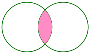
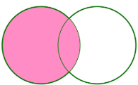
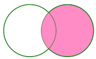
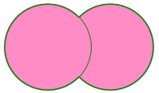
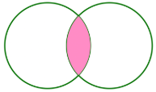
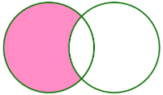

Hive3.x和Spark 3.x 版本中，一共支持以下七种 Join 类型：

- INNER JOIN
- CROSS JOIN
- LEFT OUTER JOIN
- RIGHT OUTER JOIN
- FULL OUTER JOIN
- LEFT SEMI JOIN
- LEFT ANTI JOIN

在Spark的实现上，这七种 Join 对应的实现类分别如下：

```
object JoinType {
  def apply(typ: String): JoinType = typ.toLowerCase(Locale.ROOT).replace("_", "") match {
    case "inner" => Inner
    case "outer" | "full" | "fullouter" => FullOuter
    case "leftouter" | "left" => LeftOuter
    case "rightouter" | "right" => RightOuter
    case "leftsemi" | "semi" => LeftSemi
    case "leftanti" | "anti" => LeftAnti
    case "cross" => Cross
    case _ =>
      val supported = Seq(
        "inner",
        "outer", "full", "fullouter", "full_outer",
        "leftouter", "left", "left_outer",
        "rightouter", "right", "right_outer",
        "leftsemi", "left_semi", "semi",
        "leftanti", "left_anti", "anti",
        "cross")
 
      throw new IllegalArgumentException(s"Unsupported join type '$typ'. " +
        "Supported join types include: " + supported.mkString("'", "', '", "'") + ".")
  }
}
```

假设我们有顾客（customer）和订单（order）相关的两张表，如下：

```
scala> val orders = sc.parallelize(Seq(
     |   (1,101,2500), (2,102,1110), (3,103,500), (4 ,102,400)
     | )).toDF("paymentId", "customerId","amount")
orders: org.apache.spark.sql.DataFrame = [paymentId: int, customerId: int ... 1 more field]
 //hive QL: create table orders (paymentId int, customerId int, amount int);
 //insert into orders values(1,101,2500), (2,102,1110), (3,103,500), (4 ,102,400);
 
scala> orders.show
+---------+----------+------+
|paymentId|customerId|amount|
+---------+----------+------+
|        1|       101|  2500|
|        2|       102|  1110|
|        3|       103|   500|
|        4|       102|   400|
+---------+----------+------+
 
scala> val customers = sc.parallelize(Seq(
     |     (101,"iteblog") ,(102,"iteblog_hadoop") ,(103,"iteblog001"), (104,"iteblog002"), (105,"iteblog003"), (106,"iteblog004")
     | )).toDF("customerId", "name")
customers: org.apache.spark.sql.DataFrame = [customerId: int, name: string]

//hive QL: create table customers(customerId int, name string);
//insert into customers values(101,"iteblog") ,(102,"iteblog_hadoop"),(103,"iteblog001"), (104,"iteblog002"), (105,"iteblog003"), (106,"iteblog004");
 
scala> customers.show
+----------+--------------+
|customerId|          name|
+----------+--------------+
|       101|       iteblog|
|       102|iteblog_hadoop|
|       103|    iteblog001|
|       104|    iteblog002|
|       105|    iteblog003|
|       106|    iteblog004|
+----------+--------------+
```

## INNER JOIN



**不指定具体 join 类型或指定为inner join，即是内连接**。内连接只会返回左右表都满足关联条件的数据，具体如下：

```
scala> val df = customers.join(orders,"customerId")
df: org.apache.spark.sql.DataFrame = [customerId: int, name: string ... 2 more fields]
 
 //hive QL: select * from customers join orders on customers.customerId = orders.customerId;
scala> df.show
+----------+--------------+---------+------+
|customerId|          name|paymentId|amount|
+----------+--------------+---------+------+
|       101|       iteblog|        1|  2500|
|       103|    iteblog001|        3|   500|
|       102|iteblog_hadoop|        2|  1110|
|       102|iteblog_hadoop|        4|   400|
+----------+--------------+---------+------+
```

在生成的结果中，关联字段在spark中只保留一个，hive则会保留两个表中的各自字段。

## CROSS JOIN

cross join即笛卡儿积（Cartesian Product），左表的每行数据都会跟右表的每行数据进行 Join，产生的结果行数为 `m * n`，在生产环境下尽量不要用这种 Join。下面是 CROSS JOIN 的使用例子：

```
scala> val df = customers.crossJoin(orders)
df: org.apache.spark.sql.DataFrame = [customerId: int, name: string ... 3 more fields]
//hive QL1: select * from customers cross join orders; 
//hive QL2: select * from customers, orders;

scala> df.show
+----------+--------------+---------+----------+------+
|customerId|          name|paymentId|customerId|amount|
+----------+--------------+---------+----------+------+
|       101|       iteblog|        1|       101|  2500|
|       101|       iteblog|        2|       102|  1110|
|       101|       iteblog|        3|       103|   500|
|       101|       iteblog|        4|       102|   400|
|       102|iteblog_hadoop|        1|       101|  2500|
|       102|iteblog_hadoop|        2|       102|  1110|
|       102|iteblog_hadoop|        3|       103|   500|
|       102|iteblog_hadoop|        4|       102|   400|
|       103|    iteblog001|        1|       101|  2500|
|       103|    iteblog001|        2|       102|  1110|
|       103|    iteblog001|        3|       103|   500|
|       103|    iteblog001|        4|       102|   400|
|       104|    iteblog002|        1|       101|  2500|
|       104|    iteblog002|        2|       102|  1110|
|       104|    iteblog002|        3|       103|   500|
|       104|    iteblog002|        4|       102|   400|
|       105|    iteblog003|        1|       101|  2500|
|       105|    iteblog003|        2|       102|  1110|
|       105|    iteblog003|        3|       103|   500|
|       105|    iteblog003|        4|       102|   400|
+----------+--------------+---------+----------+------+
only showing top 20 rows
```

## LEFT OUTER JOIN



LEFT OUTER JOIN 等价于 LEFT JOIN，JOIN操作符左边表中符合WHERE子句的所有记录将会被返回，右表悬浮字段补NULL。下面三种写法都是等价的：

```
val leftJoinDf = customers.join(orders,Seq("customerId"), "left_outer")
val leftJoinDf = customers.join(orders,Seq("customerId"), "leftouter")
val leftJoinDf = customers.join(orders,Seq("customerId"), "left")
//hive QL: select * from customers left join orders on customers.customerId = orders.customerId;
 
scala> leftJoinDf.show
+----------+--------------+---------+------+
|customerId|          name|paymentId|amount|
+----------+--------------+---------+------+
|       101|       iteblog|        1|  2500|
|       103|    iteblog001|        3|   500|
|       102|iteblog_hadoop|        2|  1110|
|       102|iteblog_hadoop|        4|   400|
|       105|    iteblog003|     null|  null|
|       106|    iteblog004|     null|  null|
|       104|    iteblog002|     null|  null|
+----------+--------------+---------+------+
```

## RIGHT OUTER JOIN



RIGHT OUTER JOIN 等价于 RIGHT JOIN，JOIN操作符右边表中符合WHERE子句的所有记录将会被返回，左表悬浮字段补NULL。下面三种写法也是等价的：

```
val rightJoinDf = orders.join(customers,Seq("customerId"), "right")
val rightJoinDf = orders.join(customers,Seq("customerId"), "right_outer")
val rightJoinDf = orders.join(customers,Seq("customerId"), "rightouter")
//hive QL: select * from orders right join customers on customers.customerId = orders.customerId;

scala> rightJoinDf.show
+----------+---------+------+--------------+
|customerId|paymentId|amount|          name|
+----------+---------+------+--------------+
|       101|        1|  2500|       iteblog|
|       103|        3|   500|    iteblog001|
|       102|        2|  1110|iteblog_hadoop|
|       102|        4|   400|iteblog_hadoop|
|       105|     null|  null|    iteblog003|
|       106|     null|  null|    iteblog004|
|       104|     null|  null|    iteblog002|
+----------+---------+------+--------------+
```

## FULL OUTER JOIN



full outer join 将会返回所有表中符合WHERE语句条件的所有记录。如果任一表的指定字段没有符合条件的值的话，那么就使用NULL值替代。FULL OUTER JOIN 有以下四种写法：

```
val fullJoinDf = orders.join(customers,Seq("customerId"), "outer")
val fullJoinDf = orders.join(customers,Seq("customerId"), "full")
val fullJoinDf = orders.join(customers,Seq("customerId"), "full_outer")
val fullJoinDf = orders.join(customers,Seq("customerId"), "fullouter")

//hive QL: select * from orders full join customers on customers.customerId = orders.customerId;
 
scala> fullJoinDf.show
+----------+---------+------+--------------+
|customerId|paymentId|amount|          name|
+----------+---------+------+--------------+
|       101|        1|  2500|       iteblog|
|       103|        3|   500|    iteblog001|
|       102|        2|  1110|iteblog_hadoop|
|       102|        4|   400|iteblog_hadoop|
|       105|     null|  null|    iteblog003|
|       106|     null|  null|    iteblog004|
|       104|     null|  null|    iteblog002|
+----------+---------+------+--------------+
```

## LEFT SEMI JOIN



LEFT SEMI JOIN 相当于只返回INNER JOIN的结果中左表的字段，下面三种写法等价：

```
val leftSemiJoinDf = orders.join(customers,Seq("customerId"), "leftsemi")
val leftSemiJoinDf = orders.join(customers,Seq("customerId"), "left_semi")
val leftSemiJoinDf = orders.join(customers,Seq("customerId"), "semi")

//hive QL: select * from orders left semi join customers on orders.customerId = customers.customerId;
 
scala> leftSemiJoinDf.show
+----------+---------+------+
|customerId|paymentId|amount|
+----------+---------+------+
|       101|        1|  2500|
|       103|        3|   500|
|       102|        2|  1110|
|       102|        4|   400|
+----------+---------+------+
```

LEFT SEMI JOIN 可以用 IN/EXISTS 来改写，但是三者效率并不同：left semi join和exists效率相当，IN效率则差很多。

> hive3.x中三者的执行计划已经完全相同了。
>

```
scala> orders.registerTempTable("orders")
warning: there was one deprecation warning (since 2.0.0); for details, enable `:setting -deprecation' or `:replay -deprecation'
 
scala> customers.registerTempTable("customers")
warning: there was one deprecation warning (since 2.0.0); for details, enable `:setting -deprecation' or `:replay -deprecation'
 
scala> val r = spark.sql("select * from orders where customerId in (select customerId from customers)")
//或者val r = spark.sql("explain select * from orders where exists(select 1 from customers where orders.customerId = customers.customerId);")
r: org.apache.spark.sql.DataFrame = [paymentId: int, customerId: int ... 1 more field]
 
scala> r.show
+---------+----------+------+
|paymentId|customerId|amount|
+---------+----------+------+
|        1|       101|  2500|
|        3|       103|   500|
|        2|       102|  1110|
|        4|       102|   400|
+---------+----------+------+
```

## LEFT ANTI JOIN



LEFT ANTI JOIN 相当于返回左表中不存在于INNER JOIN结果集中的数据，下面三种写法等价：

```
val leftAntiJoinDf = customers.join(orders,Seq("customerId"), "leftanti")
val leftAntiJoinDf = customers.join(orders,Seq("customerId"), "left_anti")
val leftAntiJoinDf = customers.join(orders,Seq("customerId"), "anti")

//hive中好像没有left anti join，可以用left outer join改写
//hive QL: select customers.* from customers left join orders on orders.customerId = customers.customerId where orders.customerId is null;
 
scala> leftAntiJoinDf.show
+----------+----------+
|customerId|      name|
+----------+----------+
|       105|iteblog003|
|       106|iteblog004|
|       104|iteblog002|
+----------+----------+
```

同理，LEFT ANTI JOIN 也可以用 NOT IN 来改写：

```
scala> val r = spark.sql("select * from customers where customerId not in (select customerId from orders)")
r: org.apache.spark.sql.DataFrame = [customerId: int, name: string]
 
scala> r.show
+----------+----------+
|customerId|      name|
+----------+----------+
|       104|iteblog002|
|       105|iteblog003|
|       106|iteblog004|
+----------+----------+
```