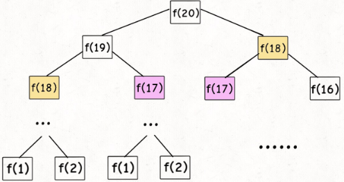
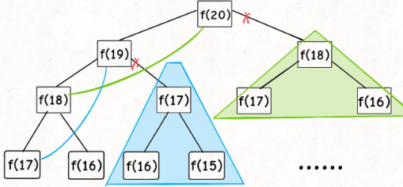
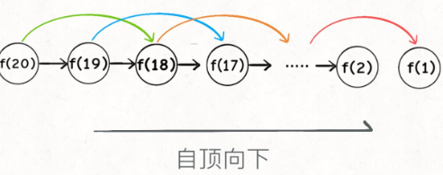
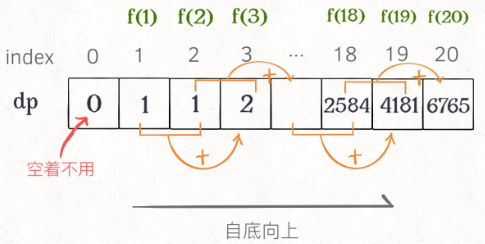
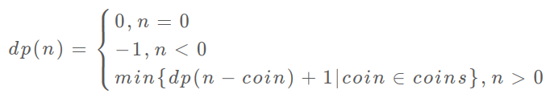
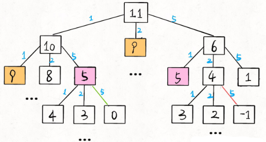
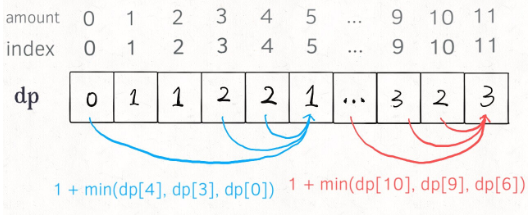

读完本文，你不仅学会了算法套路，还可以顺便去 LeetCode 上拿下如下题目：

[509.斐波那契数](https://leetcode-cn.com/problems/fibonacci-number)

[322.零钱兑换](https://leetcode-cn.com/problems/coin-change)

动态规划是对一类特殊暴力穷举的问题的优化，这类问题**存在「重叠子问题」**，可以通过**「****备忘录****」****(或称dp table)**避免对重叠子问题的重复计算，再者，动态规划问题一定会**具备「最优子结构」**，通过求解子问题的最优解得到原问题的最优解。从子问题到原问题推进的过程称为状态转移，需要列出正确的**「状态转移方程」**。

**以上提到的重叠子问题、最优子结构、状态转移方程就是动态规划三要素。**在实际的算法问题中，**写出状态转移方程是最困难的**，这也就是为什么很多朋友觉得动态规划问题困难的原因，我来提供我研究出来的一个思维框架，辅助你思考状态转移方程：**明确 base case -> 明确「状态」-> 明确「选择」 -> 定义 dp 数组/函数的含义**。

动态规划的整个流程一般分为三步：**暴力递归 -> 带备忘录的递归 -> 迭代的动态规划**。

按上面的套路走，最后的结果就可以套这个框架：

```
# 初始化 base case
dp[0][0][...] = base
# 进行状态转移
for 状态1 in 状态1的所有取值：
    for 状态2 in 状态2的所有取值：
        for ...
            dp[状态1][状态2][...] = 求最值(选择1，选择2...)
```

下面通过斐波那契数列问题和凑零钱问题来详解动态规划的基本原理。前者主要是让你明白什么是重叠子问题，后者主要集中于如何列出状态转移方程。

# 一、斐波那契数列

**1、暴力递归**

斐波那契数列的数学形式就是递归的，写成代码就是这样：

```
int fib(int N) {
    if (N == 1 || N == 2) return 1;
    return fib(N - 1) + fib(N - 2);
}
```

这样写代码虽然简洁易懂，但是十分低效。如下为 n = 20时的递归树：



想要计算原问题 `f(20)`，我就得先计算出子问题 `f(19)` 和 `f(18)`，要计算 `f(19)`，就要先算出子问题 `f(18)` 和 `f(17)`，以此类推。最后遇到 `f(1)` 或者 `f(2)` 的时候，结果已知，就能直接返回结果，递归树不再向下生长了。

**递归算法的时间复杂度为：子问题个数乘以解决一个子问题需要的时间。**

对于N层的递归树，其节点个数为2^N，子问题的个数为O(2^N)，解决一个子问题的时间，在本算法中，只有 `f(n - 1) + f(n - 2)` 一个加法操作，时间为 O(1)。则本算法的时间复杂度为 O(2^n)，指数级别，爆炸。

此递归树存在大量重复计算(**重叠子问题**)，比如 `f(18)` 被计算了两次，而且以 `f(18)` 为根的递归树体量巨大，多算一遍，会耗费大量时间，所以这个算法极其低效。

带备忘录的递归解法可以避免对重叠子问题的重复计算。

**2、带备忘录的递归解法**

即然耗时的原因是重复计算，那么我们可以造一个「备忘录」，每次算出某个子问题的答案后，先记到「备忘录」里再返回；每次遇到一个子问题先去「备忘录」里查一查，如果发现之前已经解决过这个问题了，直接把答案拿出来用，不要再耗时去计算了。

一般使用一个数组充当这个「备忘录」，当然你也可以使用哈希表（字典）。

使用了备忘录的递归树如下：



实际上，带「备忘录」的递归算法，把一棵存在巨量冗余的递归树通过「剪枝」，改造成了一幅不存在冗余的递归图，极大减少了子问题（即递归图中节点）的个数。



此时，子问题就是 `f(1)`, `f(2)`, `f(3)` ... `f(20)`，数量和输入规模 n = 20 成正比，所以子问题个数为 O(n)。解决一个子问题的时间为O(1)，则本算法的时间复杂度是 O(n)。比起暴力算法，是降维打击。

至此，**带备忘录的递归解法的效率已经和迭代的动态规划解法一样了**。实际上，这种解法和迭代的动态规划已经差不多了，只不过这种方法叫做「自顶向下」，动态规划叫做「自底向上」。

啥叫「自顶向下」？注意我们刚才画的递归树（或者说图），是从上向下延伸，都是从一个规模较大的原问题比如说 `f(20)`，向下逐渐分解规模，直到 `f(1)` 和 `f(2)` 这两个 base case，然后逐层返回答案，这就叫「自顶向下」。

啥叫「自底向上」？反过来，我们直接从问题规模最小的 `f(1)` 和 `f(2)` 开始往上推，直到推到我们想要的答案 `f(20)`，这就是动态规划的思路，这也是为什么**动态规划一般都脱离了递归，而是由循环迭代完成计算**。

**3、dp 数组的迭代解法**

有了上一步「备忘录」的启发，我们可以把这个「备忘录」独立出来成为一张表，就叫做 DP table 吧，在这张表上完成「自底向上」的推算岂不美哉！

```
int fib(int N) {
    int[] dp = new int[N+1];
    // base case
    dp[1] = dp[2] = 1;
    for (int i = 3; i <= N; i++)
        dp[i] = dp[i - 1] + dp[i - 2];
    return dp[N];
}
```



画个图就很好理解了，而且你发现这个 DP table 特别像之前那个「剪枝」后的结果，只是反过来算而已。实际上，带备忘录的递归解法中的「备忘录」，最终完成后就是这个 DP table，所以说这两种解法其实是差不多的，大部分情况下，效率也基本相同。

这里，引出「状态转移方程」这个名词，实际上就是描述问题结构的数学形式：


为啥叫「状态转移方程」？其实就是为了听起来高端。你把 `f(n)` 想做一个状态 `n`，这个状态 `n` 是由状态 `n - 1` 和状态 `n - 2` 相加转移而来，这就叫状态转移，仅此而已。

你会发现，上面的几种解法中的所有操作，例如 `return f(n - 1) + f(n - 2)`，`dp[i] = dp[i - 1] + dp[i - 2]`，以及对备忘录或 DP table 的初始化操作，都是围绕这个方程式的不同表现形式。可见列出「状态转移方程」的重要性，它是解决问题的核心。而且很容易发现，其实**状态转移方程直接代表着暴力解法。**

当然，根据斐波那契数列的状态转移方程，当前状态只和之前的两个状态有关，其实并不需要那么长的一个 DP table 来存储所有的状态，只要想办法存储之前的两个状态就行了。所以，可以进一步优化，把空间复杂度降为 O(1)：

```
int fib(int n) {
    if (n == 2 || n == 1) 
        return 1;
    int prev = 1, curr = 1;
    for (int i = 3; i <= n; i++) {
        int sum = prev + curr;
        prev = curr;
        curr = sum;
    }
    return curr;
}
```

这个技巧就是所谓的「**状态压缩**」，如果我们发现每次状态转移只需要 DP table 中的一部分，那么可以尝试用状态压缩来缩小 DP table 的大小，只记录必要的数据，上述例子就相当于把DP table 的大小从 `n` 缩小到 2。后续的动态规划章节中我们还会看到这样的例子，一般来说是把一个二维的 DP table 压缩成一维，即把空间复杂度从 O(n^2) 压缩到 O(n)。

斐波那契数列只是动态规划的一个特例，没有涉及动态规划的另一个重要特性「最优子结构」。下面，看第二个例子，凑零钱问题。

# 二、凑零钱问题

先看下题目：给你 `k` 种面值的硬币，面值分别为 `c1, c2 ... ck`，每种硬币的数量无限，再给一个总金额 `amount`，问你**最少**需要几枚硬币凑出这个金额，如果不可能凑出，算法返回 -1 。算法的函数签名如下：

```
// coins 中是可选硬币面值，amount 是目标金额
int coinChange(int[] coins, int amount);
```

比如说 `k = 3`，面值分别为 1，2，5，总金额 `amount = 11`。那么最少需要 3 枚硬币凑出，即 11 = 5 + 5 + 1。

你认为计算机应该如何解决这个问题？显然，就是把所有可能的凑硬币方法都穷举出来，然后找找看最少需要多少枚硬币。

**1、暴力递归**

首先，这个问题是动态规划问题，因为它具有「最优子结构」。**要符合「最优子结构」，子问题间必须互相独立**。

回到凑零钱问题，为什么说它符合最优子结构呢？比如你想求 `amount = 11` 时的最少硬币数（原问题），如果你知道凑出 `amount = 10` 的最少硬币数（子问题），你只需要把子问题的答案加一（再选一枚面值为 1 的硬币）就是原问题的答案。因为硬币的数量是没有限制的，所以子问题之间没有相互制约，是互相独立的。

那么，既然知道了这是个动态规划问题，就要思考**如何列出正确的状态转移方程**？

1、**确定 base case**，这个很简单，显然目标金额 `amount` 为 0 时算法返回 0，因为不需要任何硬币就已经凑出目标金额了。

2、**确定「状态」，也就是原问题和子问题中的变量**。由于硬币数量无限，硬币的面额也是题目给定的，只有目标金额会不断地向 base case 靠近，所以唯一的「状态」就是目标金额 `amount`。

3、**确定「选择」，也就是导致「状态」产生变化的行为**。目标金额为什么变化呢，因为你在选择硬币，你每选择一枚硬币，就相当于减少了目标金额。所以说所有硬币的面值，就是你的「选择」。

4、**明确** **`dp`** **函数/数组的定义**。我们这里讲的是自顶向下的解法，所以会有一个递归的 `dp` 函数，**一般来说函数的参数就是状态转移中会变化的量，也就是上面说到的「状态」；函数的返回值就是题目要求我们计算的量**。就本题来说，状态只有一个，即「目标金额」，题目要求我们计算凑出目标金额所需的最少硬币数量。所以我们可以这样定义 `dp` 函数：

`dp(n)` 的定义：输入一个目标金额 `n`，返回凑出目标金额 `n` 的最少硬币数量。

搞清楚上面这几个关键点，解法的伪码就可以写出来了：

```
# 伪码框架
def coinChange(coins: List[int], amount: int):

    # 定义：要凑出金额 n，至少要 dp(n) 个硬币
    def dp(n):
        # 做选择，选择需要硬币最少的那个结果
        for coin in coins:
            res = min(res, 1 + dp(n - coin))
        return res

    # 题目要求的最终结果是 dp(amount)
    return dp(amount)
```

根据伪码，我们加上 base case 即可得到最终的答案。显然目标金额为 0 时，所需硬币数量为 0；当目标金额小于 0 时，无解，返回 -1：

```
def coinChange(coins: List[int], amount: int):

    def dp(n):
        # base case
        if n == 0: return 0
        if n < 0: return -1
        # 求最小值，所以初始化为正无穷
        res = float('INF')
        for coin in coins:
            subproblem = dp(n - coin)
            # 子问题无解，跳过
            if subproblem == -1: continue
            res = min(res, 1 + subproblem)

        return res if res != float('INF') else -1

    return dp(amount)
```

至此，状态转移方程其实已经完成了，以上算法已经是暴力解法了，以上代码的数学形式就是状态转移方程：



至此，这个问题其实就解决了，只不过需要消除一下重叠子问题，比如 `amount = 11, coins = {1,2,5}` 时画出递归树看看：



**递归算法的时间复杂度分析：子问题总数 x 每个子问题的时间**。

子问题总数为递归树非叶节点的个数， 为O(k^(n-1) )。每个子问题需要枚举所有面值，复杂度为 O(k)。所以总时间复杂度为 O(k^n)，指数级别。

**2、带备忘录的递归**

类似之前斐波那契数列的例子，只需要稍加修改，就可以通过备忘录消除子问题：

```
def coinChange(coins: List[int], amount: int):
    # 备忘录
    memo = dict()
    def dp(n):
        # 查备忘录，避免重复计算
        if n in memo: return memo[n]
        # base case
        if n == 0: return 0
        if n < 0: return -1
        res = float('INF')
        for coin in coins:
            subproblem = dp(n - coin)
            if subproblem == -1: continue
            res = min(res, 1 + subproblem)

        # 记入备忘录
        memo[n] = res if res != float('INF') else -1
        return memo[n]

    return dp(amount)
```

Java解法：

```
class Solution {
    int[] memo;
    public int coinChange(int[] coins, int amount) {
        memo = new int[amount+1];
        Arrays.fill(memo,amount+1); 
        return dp(coins, amount);
    }

    public int dp(int[] coins, int amount){
        if(amount == 0) return 0;
        if(amount < 0) return -1;
        if(memo[amount] < memo[0]) return memo[amount];  //已经计算过
        for(int i : coins) {
            int ret = dp(coins, amount -i);
            if(ret != -1) memo[amount] = Math.min(memo[amount], ret+1);
        }
        if(memo[amount] == memo[0]) memo[amount] = -1; //此路不通，置为-1
        return memo[amount];
    }
}
```

「备忘录」大大减小了子问题数目，完全消除了子问题的冗余，所以子问题总数不会超过金额数 `n`，即子问题数目为 O(n)。处理一个子问题需要枚举面额值，为 O(k)，所以总的时间复杂度是 O(kn)。

**3、dp 数组的迭代解法**

当然，我们也可以自底向上使用 dp table 来消除重叠子问题，关于「状态」「选择」和 base case 与之前没有区别，`dp` 数组的定义和刚才 `dp` 函数类似，也是把「状态」，也就是目标金额作为变量。不过 `dp` 函数体现在函数参数，而 `dp` 数组体现在数组索引：

**`dp`** **数组的定义：当目标金额为** **`i`** **时，至少需要** **`dp[i]`** **枚硬币凑出**。

根据我们文章开头给出的动态规划代码框架可以写出如下解法：

```
class Solution {
    public int coinChange(int[] coins, int amount) {
        int[] dp = new int[amount+1];
        Arrays.fill(dp, amount+1);
        dp[0] = 0;
        for(int i = 0; i <= amount; i++){
            for(int coin : coins){
                if(coin <= i) {
                    dp[i] = Math.min(dp[i], dp[i-coin] + 1);
                }
            }
        }
        return dp[amount] == amount+1 ? -1 : dp[amount];
    }
}
```



PS：为啥 `dp` 数组初始化为 `amount + 1` 呢，因为凑成 `amount` 金额的硬币数最多只可能等于 `amount`（全用 1 元面值的硬币），所以初始化为 `amount + 1` 就相当于初始化为正无穷，便于后续取最小值。