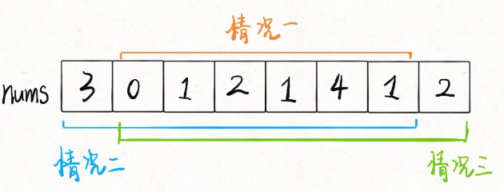

读完本文，你不仅学会了算法套路，还可以顺便去 LeetCode 上拿下如下题目：

[198.打家劫舍](https://leetcode-cn.com/problems/house-robber)

[213.打家劫舍II](https://leetcode-cn.com/problems/house-robber-ii)

[337.打家劫舍III](https://leetcode-cn.com/problems/house-robber-iii)

**-----------**

打家劫舍系列总共有三道，难度设计非常合理，层层递进。第一道是比较标准的动态规划问题，而第二道融入了环形数组的条件，第三道更绝，把动态规划的自底向上和自顶向下解法和二叉树结合起来，我认为很有启发性。如果没做过的朋友，建议学习一下。

下面，我们从第一道开始分析。

### House Robber I

你是一个专业的小偷，计划偷窃沿街的房屋。每间房内都藏有一定的现金，影响你偷窃的唯一制约因素就是相邻的房屋装有相互连通的防盗系统，如果两间相邻的房屋在同一晚上被小偷闯入，系统会自动报警。

给定一个代表每个房屋存放金额的非负整数数组，计算你 不触动警报装置的情况下 ，一夜之内能够偷窃到的最高金额。

示例 1：

```
输入：[1,2,3,1]
输出：4
解释：偷窃 1 号房屋 (金额 = 1) ，然后偷窃 3 号房屋 (金额 = 3)。
     偷窃到的最高金额 = 1 + 3 = 4 。
```

示例 2：

```
输入：[2,7,9,3,1]
输出：12
解释：偷窃 1 号房屋 (金额 = 2), 偷窃 3 号房屋 (金额 = 9)，接着偷窃 5 号房屋 (金额 = 1)。
     偷窃到的最高金额 = 2 + 9 + 1 = 12 。
```

题目很容易理解，而且动态规划的特征很明显。我们前文「动态规划详解」做过总结，**解决动态规划问题就是找「状态」和「选择」，仅此而已**。

假想你就是这个专业强盗，从左到右走过这一排房子，在每间房子前都有两种**选择**：抢或者不抢。

如果你抢了这间房子，那么你**肯定**不能抢相邻的下一间房子了，只能从下下间房子开始做选择。

如果你不抢这件房子，那么你可以走到下一间房子前，继续做选择。

当你走过了最后一间房子后，你就没得抢了，能抢到的钱显然是 0（**base case**）。

以上的逻辑很简单吧，其实已经明确了「状态」和「选择」：**你面前房子的索引就是状态，抢和不抢就是选择**。

在两个选择中，每次都选更大的结果，最后得到的就是最多能抢到的 money：

**自底向上**的解法：

```java
class Solution {
    public int rob(int[] nums) {
    int n = nums.length;
    // dp[i] = x 表示：
    // 从第 i 间房子开始抢劫，最多能抢到的钱为 x
    // base case: dp[0] = 0,dp[1] = nums[0]
    int[] dp = new int[n + 1];
    dp[1] = nums[0];
    for (int i = 2; i <= n; i++) {
        dp[i] = Math.max(dp[i-1], nums[i-1] + dp[i-2]);
    }
    return dp[n];
    }
}
```

我们又发现状态转移只和 `dp[i]` 最近的两个状态有关，所以可以进一步优化，将空间复杂度降低到 O(1)。

```java
class Solution {
    public int rob(int[] nums) {
    int n = nums.length;
    // dp[i] = x 表示：
    // 从第 i 间房子开始抢劫，最多能抢到的钱为 x
    // base case: dp[0] = 0,dp[1] = nums[0]
    int pre_1 = 0, pre_2 = 0, cur = 0;
    for (int i = 0; i < n; i++) {
        cur = Math.max(pre_2, pre_1 + nums[i]);
        pre_1 = pre_2;
        pre_2 = cur;
    }
    return cur;
    }
}
```

以上的流程，在我们「动态规划详解」中详细解释过，相信大家都能手到擒来了。我认为很有意思的是这个问题的 follow up，需要基于我们现在的思路做一些巧妙的应变。

### House Robber II

这道题目和第一道描述基本一样，强盗依然不能抢劫相邻的房子，输入依然是一个数组，但是告诉你**这些房子不是一排，而是围成了一个圈**。

也就是说，现在第一间房子和最后一间房子也相当于是相邻的，不能同时抢。比如说输入数组 `nums=[2,3,2]`，算法返回的结果应该是 3 而不是 4，因为开头和结尾不能同时被抢。

首尾房间不能同时被抢，那么只可能有三种不同情况：要么都不被抢；要么第一间房子被抢最后一间不抢；要么最后一间房子被抢第一间不抢。



那就简单了啊，这三种情况，那种的结果最大，就是最终答案呗！不过，其实我们不需要比较三种情况，只要比较情况二和情况三就行了，情况2和3包含了情况1。

所以只需对之前的解法稍作修改即可：

```java
class Solution {
    public int rob(int[] nums) {
        if(nums.length == 1) return nums[0];
        return Math.max(dp(nums, 0,nums.length-2), dp(nums,1,nums.length-1));
    }

    public int dp(int[] nums, int start, int end){
        int pre1 = 0, pre2 = 0, cur = 0;
        for(int i = start; i <= end; i++){
            cur = Math.max(pre1 + nums[i], pre2);
            pre1 = pre2;
            pre2 = cur;
        }
        return cur;
    }
}
```

### House Robber III

在上次打劫完一条街道之后和一圈房屋后，小偷又发现了一个新的可行窃的地区。这个地区只有一个入口，我们称之为“根”。 除了“根”之外，每栋房子有且只有一个“父“房子与之相连。一番侦察之后，聪明的小偷意识到“这个地方的所有房屋的排列类似于一棵二叉树”。 如果两个直接相连的房子在同一天晚上被打劫，房屋将自动报警。

计算在不触动警报的情况下，小偷一晚能够盗取的最高金额。

示例 1:

```plaintext
输入: [3,2,3,null,3,null,1]
     3
    / \
   2   3
    \   \ 
     3   1
   
输出: 7 
解释: 小偷一晚能够盗取的最高金额 = 3 + 3 + 1 = 7.示例 2:
```

```plaintext
输入: [3,4,5,1,3,null,1]
     3
    / \
   4   5
  / \   \ 
 1   3   1

输出: 9
解释: 小偷一晚能够盗取的最高金额 = 4 + 5 = 9.
```

```java
public class Solution {

    // 树的后序遍历

    public int rob(TreeNode root) {
        int[] res = dfs(root);
        return Math.max(res[0], res[1]);
    }

    private int[] dfs(TreeNode node) {
        if (node == null) {
            return new int[]{0, 0};
        }

        // 分类讨论的标准是：当前结点偷或者不偷
        // 由于需要后序遍历，所以先计算左右子结点，然后计算当前结点的状态值
        int[] left = dfs(node.left);
        int[] right = dfs(node.right);

        // dp[0]：以当前 node 为根结点的子树能够偷取的最大价值，规定 node 结点不偷
        // dp[1]：以当前 node 为根结点的子树能够偷取的最大价值，规定 node 结点偷
        int[] dp = new int[2];

        dp[0] = Math.max(left[0], left[1]) + Math.max(right[0], right[1]);
        dp[1] = node.val + left[0] + right[0];
        return dp;
    }
}
```

时间复杂度 O(N)，空间复杂度只有递归函数栈所需的空间。