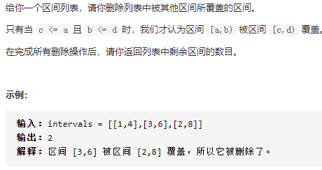
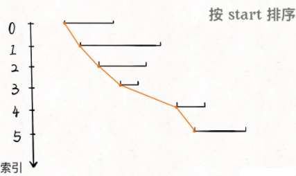
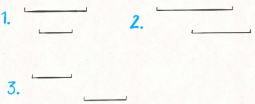
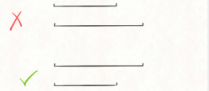
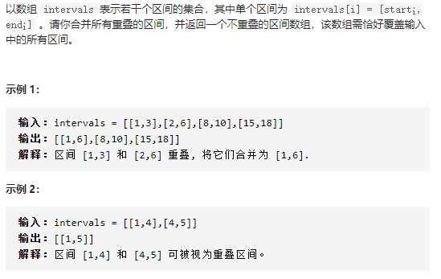
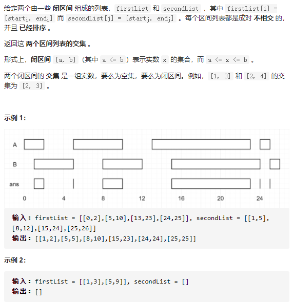

读完本文，你不仅学会了算法套路，还可以顺便去 LeetCode 上拿下如下题目：

[1288.删除被覆盖区间（中等）](https://leetcode-cn.com/problems/remove-covered-intervals)

[56.区间合并（中等）](https://leetcode-cn.com/problems/merge-intervals)

[986.区间列表的交集（中等）](https://leetcode-cn.com/problems/interval-list-intersections)

---

经常有读者问区间相关的问题，今天写一篇文章，秒杀三道区间相关的问题。

所谓区间问题，就是线段问题，让你合并所有线段、找出线段的交集等等。主要有两个技巧：

**1、排序** 。常见的排序方法就是按照区间起点排序，或者先按照起点升序排序，若起点相同，则按照终点降序排序。当然，如果你非要按照终点排序，无非对称操作，本质都是一样的。

**2、画图** 。就是说不要偷懒，勤动手，两个区间的相对位置到底有几种可能，不同的相对位置我们的代码应该怎么去处理。

废话不多说，下面我们来做题。

## 区间覆盖问题

这是力扣第 1288 题，看下题目：



题目问我们，去除被覆盖区间之后，还剩下多少区间，**那么我们可以先算一算，被覆盖区间有多少个，然后和总数相减就是剩余区间数** 。

对于这种区间问题，如果没啥头绪，首先排个序看看，比如我们按照区间的起点进行升序排序：



排序之后，两个相邻区间可能有如下三种相对位置：



对于这三种情况，我们应该这样处理：

对于情况一，找到了覆盖区间。

对于情况二，两个区间可以合并，成一个大区间。

对于情况三，两个区间完全不相交。

依据几种情况，我们可以写出如下代码：

```
class Solution {
    public int removeCoveredIntervals(int[][] intervals) {
        // 按照起点升序排列，起点相同时降序排列
        Arrays.sort(intervals, (a,b) -> {
            if (a[0] == b[0]) return b[1] - a[1];
            else return a[0] - b[0];
        });
        // 记录合并区间的起点和终点
        int left = intervals[0][0], right = intervals[0][1], res = 0;
        for(int i = 1; i < intervals.length; i++){
            // 情况一，找到覆盖区间
            if(left <= intervals[i][0] && right >= intervals[i][1]) res++;
            // 情况二，找到相交区间，合并
            else if(right >= intervals[i][0] && right <= intervals[i][1]) right = intervals[i][1];
            // 情况三，完全不相交，更新起点和终点
            else {
                left = intervals[i][0];
                right = intervals[i][1];
            }
        }
        return intervals.length - res;
    }
}
```

以上就是本题的解法代码，起点升序排列，终点降序排列的目的是防止如下情况：



对于这两个起点相同的区间，我们需要保证长的那个区间在上面（按照终点降序），这样才会被判定为覆盖，否则会被错误地判定为相交，少算一个覆盖区间。

## 区间合并问题



思路与区间覆盖类似，只是在每种情况处理稍有不同。

```java
class Solution {
    public int[][] merge(int[][] intervals) {
        //先按起点升序，七点相同则按终点降序
        Arrays.sort(intervals, (x,y) -> {
            if(x[0] == y[0]) return y[1] - x[1];
            else return x[0] - y[0];
        });

        int left = intervals[0][0], right = intervals[0][1];
        int index = 0;
        for(int i = 1; i < intervals.length; i++) {
            if(left <= intervals[i][0] && right >= intervals[i][1]) continue;
            else if (right >= intervals[i][0] && right <= intervals[i][1]) right = intervals[i][1];
            else {
                intervals[index][0] = left;
                intervals[index][1] = right;
                left = intervals[i][0];
                right = intervals[i][1];
                index++;
            }
        }
        intervals[index][0] = left;
        intervals[index][1] = right;
        return Arrays.copyOfRange(intervals,0,index+1);
    }
}
```

## 区间交集问题



```java
class Solution {
    public int[][] intervalIntersection(int[][] firstList, int[][] secondList) {
        int i = 0, j = 0;
        int left, right;
        int[][] res = new int[firstList.length+secondList.length][2];
        int index = 0;
        while(i < firstList.length && j < secondList.length) {
            left = Math.max(firstList[i][0],secondList[j][0]);
            right = Math.min(firstList[i][1], secondList[j][1]);
            if(left <= right) {
                res[index][0] = left;
                res[index][1] = right;
                index++;
            }
            if(firstList[i][1] <secondList[j][1]) i++;
            else j++;
        }
        return Arrays.copyOfRange(res,0,index);
    }
}
```