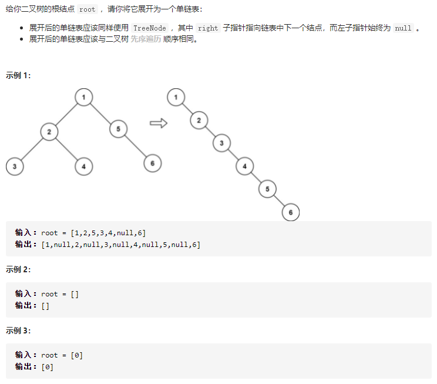
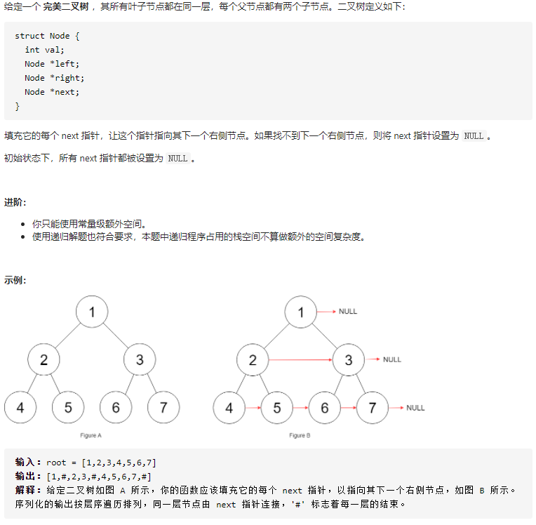
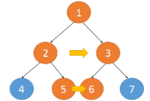

树相关算法的思路：**把题目的要求细化，搞清楚根节点应该做什么，然后剩下的事情抛给前/中/后序的遍历框架就行了** ，我们千万不要跳进递归的细节里，你的脑袋才能压几个栈呀。

快排可以看作二叉树的前序遍历，归并可以看作二叉树的后序遍历。

## 226.翻转二叉树(easy)

将每个节点的左右子节点进行交换即可，前序遍历。

```java
class Solution {
    public TreeNode invertTree(TreeNode root) {
        //递归函数的终止条件，节点为空时返回
        if(root==null) {
            return null;
        }
        //下面三句是将当前节点的左右子树交换
        TreeNode tmp = root.right;
        root.right = root.left;
        root.left = tmp;
        //递归交换当前节点的 左子树
        invertTree(root.left);
        //递归交换当前节点的 右子树
        invertTree(root.right);
        //函数返回时就表示当前这个节点，以及它的左右子树
        //都已经交换完了
        return root;
    }
}
```

## 114.二叉树展开为链表(medium)



方法一：先序遍历+递归

```java
class Solution {
    TreeNode p = new TreeNode(-1);
    public void flatten(TreeNode root) {
        preOrder(root);
    }

    public void preOrder(TreeNode root) {
        if(root != null) {
            p.right = root;
            TreeNode left = root.left;
            TreeNode right = root.right;
            p = p.right;
            //断开root与左右子节点的连接
            p.left = null;
            p.right = null;
            preOrder(left);
            preOrder(right);
        }
    }
}
```

方法二：先序遍历整体思想

1. 将左子树插入到右子树的地方
2. 将原来的右子树接到左子树的最右边节点
3. 考虑新的右子树的根节点，一直重复上边的过程，直到新的右子树为 null

```java
/**************************************************************************
    1          1                 1          1                1
   / \          \                 \          \                \
  2   5    ==>   2    5    ==>     2    ==>   2   4     ==>    2  
 / \   \        / \    \          / \          \   \            \
3   4   6      3   4    6        3   4          3   5            3
                                      \              \            \
                                       5              6            4
                                        \                           \
                                         6                           5
                                                                      \
                                                                       6
***************************************************************************/
public void flatten(TreeNode root) {
    while (root != null) { 
        //左子树为 null，直接考虑下一个节点
        if (root.left != null) {
            // 找左子树最右边的节点
            TreeNode pre = root.left;
            while (pre.right != null) {
                pre = pre.right;
            } 
            //将原来的右子树接到左子树的最右边节点
            pre.right = root.right;
            // 将左子树插入到右子树的地方
            root.right = root.left;
            root.left = null;
        }
        root = root.right; //考虑下一个节点
    }
}
```

方法三：后序遍历+递归

先将左子树和右子树分别拉平，再将右子树接到左子树的下面，最后将整个左子树作为当前节点的右子树。

```java
class Solution {
    public void flatten(TreeNode root) {
        if(root == null) return;
        flatten(root.left);
        flatten(root.right);

        if(root.left != null){  //若左子树为空，后续不用操作了
            TreeNode pre = root.left;
            while(pre.right != null) {
                pre = pre.right;
            }
            pre.right = root.right;
            root.right = root.left;
            root.left = null;
        }
    }
}
```

## 116.填充每个节点的下一个右侧节点指针（medium)



1.层序遍历

```java
//时间复杂度 O(N)
//空间复杂度 O(N)
class Solution {
    public Node connect(Node root) {
        if(root == null) return null;
        LinkedList<Node> queue = new LinkedList<>();
        queue.add(root);
        Node pre,cur;
        int size = 0;
        while(!queue.isEmpty()) {
            size = queue.size();
            pre = queue.removeFirst();
            if(pre.left != null) queue.add(pre.left);
            if(pre.right != null) queue.add(pre.right);
            for(int i = 1; i < size; i++) {
                cur = queue.removeFirst();
                if(cur.left != null) queue.add(cur.left);
                if(cur.right != null) queue.add(cur.right);
                pre.next = cur;
                pre = cur;
            }
        }
        return root;
    }
}
```

2.层序遍历改进版

从上往下：第N层为第N+1层的相邻节点建立连接，则遍历第N层时，先判断第N+1层是否为空，可以通过记录每层的首节点`first`，终止条件：`first.left=null;`

从左往右：终止条件是`cur=null;`

下层相邻结点有两种情况，分别处理方式如下：

- 是当前节点的左右子节点：`cur.left.next = cur.right;`
- 当前节点的右节点和下一节点的左节点：`cur.right.next = cur.next.left;`需要先判断`next`是否存在

```java
//时间复杂度 O(N)
//空间复杂度 O(1)
class Solution {
    public Node connect(Node root) {
        if(root == null) {
            return root;
        }
        Node first = root;
        while(first.left != null) {  //top to bot
            Node temp = first;
            while(temp!=null) {  //left to right
                temp.left.next = temp.right;
                if(temp.next != null){  // has next or not
                    temp.right.next = temp.next.left;
                }
                temp = temp.next;
            }
            first = first.left;
        }
        return root;
    }
}
```

3.递归

上面两种方式是属于横向的视角，而递归则像是一个深度的视角。
以从上往下的方向看，1，2，3，5，6这几个节点在位置上都是紧挨着的，同时这几个节点都是左右串联的。



我们以当前节点`root`为起始，左右节点不断的深入下面，`left`节点不断往右走，`right`节点不断往左走，当这两个节点走到底后，整个纵深这段就完成了串联。
递归函数实现如下：

1. 终止条件：当前节点为空时
2. 函数内：以当前节点为起始，完成从上往下的纵深串联，再递归的调用当前节点`left`和`right`


```java
//时间复杂度 O(N)
//空间复杂度 O(h)  h为树高
class Solution {
    public Node connect(Node root) {
        if ( root == null) {
            return null;
        }
        Node left = root.left;
        Node right = root.right;
        while(left != null){
            left.next = right;
            left = left.right;
            right = right.left;
        }
        connect(root.left);
        connect(root.right);
        return root;
    }
}
```