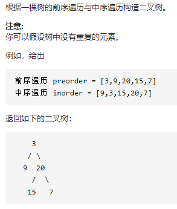

## 654.最大二叉树(medium)

```plaintext
给定一个不含重复元素的整数数组 nums 。一个以此数组直接递归构建的 最大二叉树 定义如下：
    1.二叉树的根是数组 nums 中的最大元素。
    2.左子树是通过数组中 最大值左边部分 递归构造出的最大二叉树。
    3.右子树是通过数组中 最大值右边部分 递归构造出的最大二叉树。
返回有给定数组 nums 构建的 最大二叉树 。

示例1：
       6
     /   \
    3     5
    \     /
     2   0
      \
       1
输入：nums = [3,2,1,6,0,5]
输出：[6,3,5,null,2,0,null,null,1]
解释：递归调用如下所示：
- [3,2,1,6,0,5] 中的最大值是 6 ，左边部分是 [3,2,1] ，右边部分是 [0,5] 。
    - [3,2,1] 中的最大值是 3 ，左边部分是 [] ，右边部分是 [2,1] 。
        - 空数组，无子节点。
        - [2,1] 中的最大值是 2 ，左边部分是 [] ，右边部分是 [1] 。
            - 空数组，无子节点。
            - 只有一个元素，所以子节点是一个值为 1 的节点。
    - [0,5] 中的最大值是 5 ，左边部分是 [0] ，右边部分是 [] 。
        - 只有一个元素，所以子节点是一个值为 0 的节点。
        - 空数组，无子节点。

示例2：
    3
     \
      2
       \
        1
输入：nums = [3,2,1]
输出：[3,null,2,null,1]
```

```java
/**
 * Definition for a binary tree node.
 * public class TreeNode {
 *     int val;
 *     TreeNode left;
 *     TreeNode right;
 *     TreeNode() {}
 *     TreeNode(int val) { this.val = val; }
 *     TreeNode(int val, TreeNode left, TreeNode right) {
 *         this.val = val;
 *         this.left = left;
 *         this.right = right;
 *     }
 * }
 */
class Solution {
    public TreeNode constructMaximumBinaryTree(int[] nums) {
        return buildTree(nums,0,nums.length-1);
    }

    public TreeNode buildTree(int[] nums, int left, int right){
        //base case
        if(left > right) return null;  

        //get index of the maxNum
        int index = left;
        for(int i = left; i<=right; i++) {
            if(nums[i] > nums[index]) index = i;
        }
      
        //build node for root
        TreeNode root = new TreeNode(-1);
        root.val = nums[index];
        root.left = buildTree(nums, left, index-1);
        root.right = buildTree(nums, index+1, right);
        return root;
    }
}
```

## 105.从前序与中序遍历序列构造二叉树(medium)



```java
/**
 * Definition for a binary tree node.
 * public class TreeNode {
 *     int val;
 *     TreeNode left;
 *     TreeNode right;
 *     TreeNode() {}
 *     TreeNode(int val) { this.val = val; }
 *     TreeNode(int val, TreeNode left, TreeNode right) {
 *         this.val = val;
 *         this.left = left;
 *         this.right = right;
 *     }
 * }
 */
class Solution {
    HashMap<Integer, Integer> map = new HashMap<>();  //inorder: element -> index
    public TreeNode buildTree(int[] preorder, int[] inorder) {
        if(inorder == null || inorder.length == 0) return null;
        for(int i = 0; i < inorder.length; i++) {
            map.put(inorder[i],i);
        }
        return build(preorder,0,0,inorder.length-1);
    }

    public TreeNode build(int[] preorder, int pLeft, int iLeft, int iRight){
        if(iLeft > iRight) return null;
        int val = preorder[pLeft];
        TreeNode root = new TreeNode(val);
        int posOfInorder = map.get(val);
        root.left = build(preorder, pLeft+1, iLeft, posOfInorder-1);
        root.right = build(preorder, pLeft+(posOfInorder-iLeft)+1, posOfInorder+1, iRight);
        return root;
    }
}
```

## 106.从中序与后续遍历序列构造二叉树(medium)

与105思想一致。

```java
class Solution {
    HashMap<Integer, Integer> idxOfInOrder = new HashMap<>();
    public TreeNode buildTree(int[] inorder, int[] postorder) {
        if(inorder == null || inorder.length == 0) return null;
        for(int i = 0; i<inorder.length; i++) {
            idxOfInOrder.put(inorder[i], i);
        }
        return build(postorder, postorder.length-1, 0, inorder.length -1);
    }

    public TreeNode build(int[] postorder, int pRight, int iLeft, int iRight) {
        if(iLeft > iRight) return null;
        int val = postorder[pRight];
        int posOfInorder = idxOfInOrder.get(val);

        TreeNode root = new TreeNode(val);
        root.left = build(postorder,pRight-(iRight-posOfInorder)-1, iLeft,posOfInorder-1);
        root.right = build(postorder, pRight-1, posOfInorder+1, iRight);
        return root;
    }
}
```