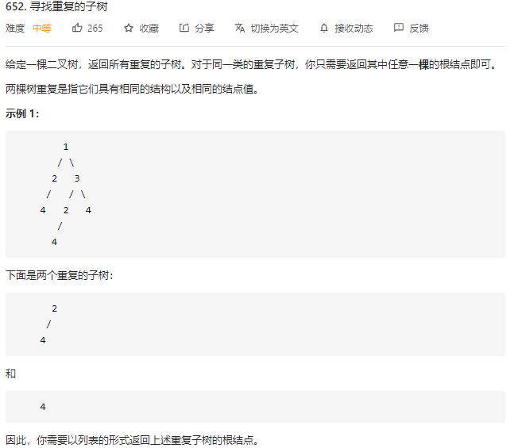

## 652.寻找重复子树(medium)



```plaintext
/**
 * Definition for a binary tree node.
 * public class TreeNode {
 *     int val;
 *     TreeNode left;
 *     TreeNode right;
 *     TreeNode() {}
 *     TreeNode(int val) { this.val = val; }
 *     TreeNode(int val, TreeNode left, TreeNode right) {
 *         this.val = val;
 *         this.left = left;
 *         this.right = right;
 *     }
 * }
 */
 //主要思想是将二叉树序列化，记录每个串的个数，个数超过2的加入到结果集中，只在刚好为2时加入
 //另外注意序列化时需要加逗号区分类似11,1和1,11的情况
 //还需注意不能用中序遍历序列号，可能导致的错误：以下两棵树中序遍历结果相同，都为#0#0#
 //    0    0
 //   /      \
 //  0        0
class Solution {
    HashMap<String, Integer> countMap = new HashMap<>();
    List<TreeNode> res = new ArrayList<>();
    public List<TreeNode> findDuplicateSubtrees(TreeNode root) {
        collect(root);
        return res;
    }

    public String collect(TreeNode root) {
        if(root == null) return "#";
        String s = root.val + "," + collect(root.left) + "," + collect(root.right);
        countMap.put(s, countMap.getOrDefault(s, 0)+1);
        if(countMap.get(s) == 2) res.add(root);
        return s;
    }
}
```

> 还可以用唯一标识符进行优化，最优解见leetcode。
>