# 10.1 斐波那契数列

## 题目描述

写一个函数，输入 n ，求斐波那契（Fibonacci）数列的第 n 项。斐波那契数列的定义如下：

```
F(0) = 0,   F(1) = 1
F(N) = F(N - 1) + F(N - 2), 其中 N > 1.
```

斐波那契数列由 0 和 1 开始，之后的斐波那契数就是由之前的两数相加而得出。

答案需要取模 1e9+7（1000000007），如计算初始结果为：1000000008，请返回 1。

示例 1：

```
输入：n = 2
输出：1
```

示例 2：

```
输入：n = 5
输出：5
```

## 解题思路

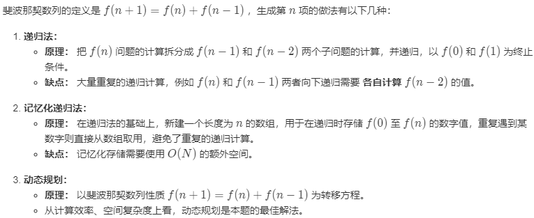

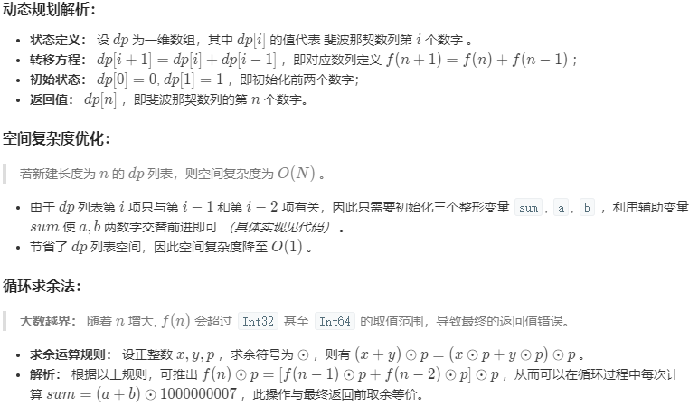

复杂度分析：
时间复杂度 O(N)： 计算 f(n)需循环 n 次，每轮循环内计算操作使用 O(1)。
空间复杂度 O(1)： 几个标志变量使用常数大小的额外空间。

```java
class Solution {
    public int fib(int n) {
        int a = 0, b = 1, sum;
        for(int i = 0; i < n; i++){
            sum = (a + b) % 1000000007;
            a = b;
            b = sum;
        }
        return a;
    }
}
```

# 10.3 跳台阶Δ

## 题目描述

一只青蛙一次可以跳上1级台阶，也可以跳上2级台阶。求该青蛙跳上一个 n 级的台阶总共有多少种跳法。

答案需要取模 1e9+7（1000000007），如计算初始结果为：1000000008，请返回 1。

示例 1：

```
输入：n = 2
输出：2
```

示例 2：

```
输入：n = 7
输出：21
```

## 解题思路

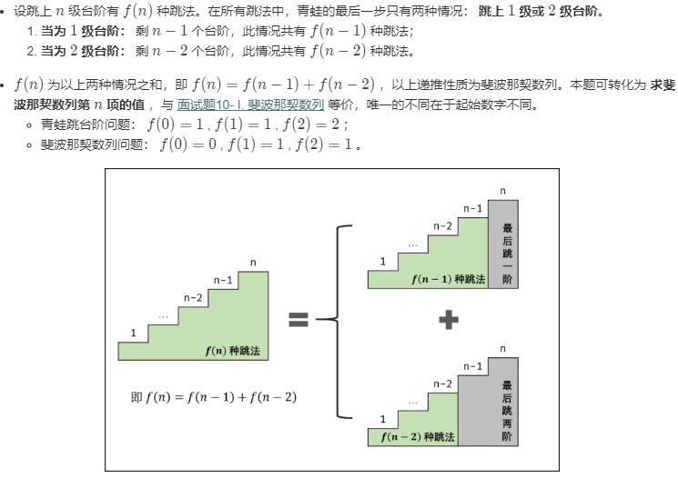

```java
class Solution {
    public int numWays(int n) {
        int a = 1, b = 1, sum;
        for(int i = 0; i < n; i++){
            sum = (a + b) % 1000000007;
            a = b;
            b = sum;
        }
        return a;
    }
}
```

# 10.4 变态跳台阶

## 题目描述

一只青蛙一次可以跳上 1 级台阶，也可以跳上 2 级... 它也可以跳上 n 级。求该青蛙跳上一个 n 级的台阶总共有多少种跳法。

## 解题思路

### 动态规划

```java
public int JumpFloorII(int target) {
    int[] dp = new int[target];
    Arrays.fill(dp, 1);
    for (int i = 1; i < target; i++)
        for (int j = 0; j < i; j++)
            dp[i] += dp[j];
    return dp[target - 1];
}
```

### 数学推导

跳上 n-1 级台阶，可以从 n-2 级跳 1 级上去，也可以从 n-3 级跳 2 级上去...，那么

```
f(n-1) = f(n-2) + f(n-3) + ... + f(0)
```

同样，跳上 n 级台阶，可以从 n-1 级跳 1 级上去，也可以从 n-2 级跳 2 级上去... ，那么

```
f(n) = f(n-1) + f(n-2) + ... + f(0)
```

综上可得

```
f(n) - f(n-1) = f(n-1)
```

即

```
f(n) = 2*f(n-1)
```

所以 f(n) 是一个等比数列

```source-java
public int JumpFloorII(int target) {
    return (int) Math.pow(2, target - 1);
}
```

# 11. 旋转数组的最小数字Δ

## 题目描述

把一个数组最开始的若干个元素搬到数组的末尾，我们称之为数组的旋转。输入一个递增排序的数组的一个旋转，输出旋转数组的最小元素。例如，数组 [3,4,5,1,2] 为 [1,2,3,4,5] 的一个旋转，该数组的最小值为1。

示例 1：

```
输入：[3,4,5,1,2]
输出：1
```

示例 2：

```
输入：[2,2,2,0,1]
输出：0
```

## 解题思路

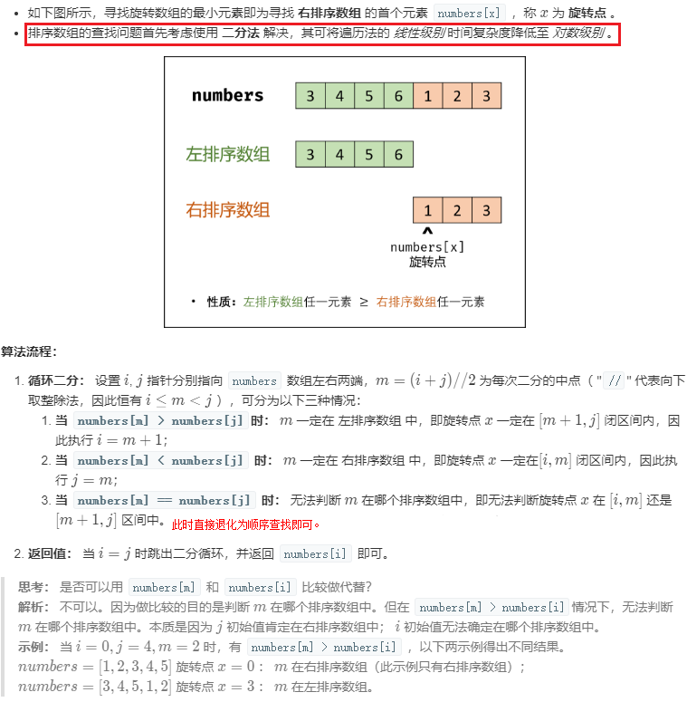

复杂度分析：
时间复杂度 $O(log_2 N)$： 在特例情况下（例如 [1, 1, 1, 1]），会退化到 $O(N)$。
空间复杂度 $O(1)$： i , j , m 指针使用常数大小的额外空间。

```java
class Solution {
    public int minArray(int[] numbers) {
        int i = 0, j = numbers.length - 1;
        while (i < j) {
            int m = (i + j) / 2;
            if (numbers[m] > numbers[j]) i = m + 1;
            else if (numbers[m] < numbers[j]) j = m;
            else return getMin(numbers, i, j);
        }
        return numbers[i];
    }
    private int getMin(int[] numbers, int left, int right){
        for( int i = left+1; i <= right; i++){
            if(numbers[i] > numbers[i-1]) numbers[i] = numbers[i-1];
        }
        return numbers[right];
    }
}
```

# 12. 矩阵中的路径ΔΔ

## 题目描述

请设计一个函数，用来判断在一个矩阵中是否存在一条包含某字符串所有字符的路径。路径可以从矩阵中的任意一格开始，每一步可以在矩阵中向左、右、上、下移动一格。如果一条路径经过了矩阵的某一格，那么该路径不能再次进入该格子。例如，在下面的3×4的矩阵中包含一条字符串“bfce”的路径（路径中的字母用加粗标出）。

[["a","**b**","c","e"],
["s","**f**","**c**","s"],
["a","d","**e**","e"]]

但矩阵中不包含字符串“abfb”的路径，因为字符串的第一个字符b占据了矩阵中的第一行第二个格子之后，路径不能再次进入这个格子。

示例 1：

```
输入：board = [["A","B","C","E"],["S","F","C","S"],["A","D","E","E"]], word = "ABCCED"
输出：true
```

示例 2：

```
输入：board = [["a","b"],["c","d"]], word = "abcd"
输出：false
```

## 解题思路

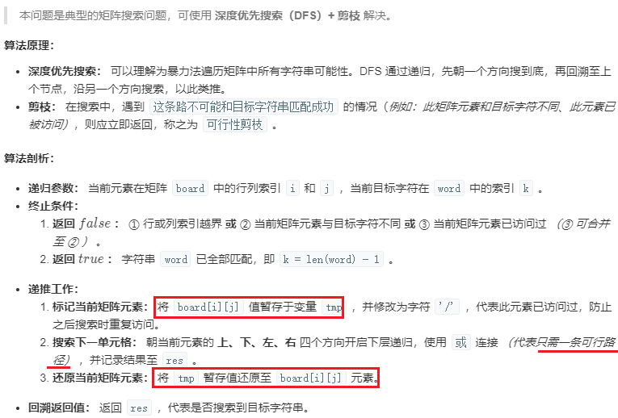


```java
class Solution {
    public boolean exist(char[][] board, String word) {
        char[] words = word.toCharArray();
        for(int i = 0; i < board.length; i++){
            for(int j = 0; j < board[0].length; j++){
                if(dfs(board, words, i, j, 0) == true) return true;
            }
        }
        return false;
    }

    private boolean dfs(char[][] board, char[] words, int i, int j, int index){
        if(i < 0 || i >= board.length || j < 0 || j >= board[0].length || board[i][j] != words[index]) return false;
        if(index == words.length - 1) return true;
        char tmp = board[i][j];
        board[i][j] = '/';
        boolean res = dfs(board, words, i+1, j, index+1) || dfs(board, words, i-1, j, index+1) ||
                        dfs(board, words, i, j-1, index+1) || dfs(board, words, i, j+1, index+1);
        board[i][j] = tmp;
        return res;
    }
}
//点评：精髓在于每深入一层，将当前元素原值暂存到tmp，然后修改为'/'，表示已经访问过，然后深层遍历完成后，又逐层还原被修改的元素。 这样省区了单独创建一个visited[][]数组的空间，且如果上下左右四个分支的某个分支返回false时，每次能将数组还原到正确的状态，不影响其他分支的判断。
```

# 13. 机器人的运动范围Δ

## 题目描述

地上有一个m行n列的方格，从坐标 [0,0] 到坐标 [m-1,n-1] 。一个机器人从坐标 [0, 0] 的格子开始移动，它每次可以向左、右、上、下移动一格（不能移动到方格外），也不能进入行坐标和列坐标的数位之和大于k的格子。例如，当k为18时，机器人能够进入方格 [35, 37] ，因为3+5+3+7=18。但它不能进入方格 [35, 38]，因为3+5+3+8=19。请问该机器人能够到达多少个格子？

示例1：

```
输入：m = 2, n = 3, k = 1
输出：3
```

示例2：

```
输入：m = 3, n = 1, k = 0
输出：1
```

## 解题思路

此题与面试题12.矩阵中的路径类似，主要考察回溯思想。可以**通过DFS或BFS解决**，由于机器人每次只能移动一格，因此**实际是求从(0,0)开始的连通图**。由于从左上角开始遍历，容易证明**只需要每个格子向右或向下移动**，总是可以遍历完整个矩阵。

关于此题更深的讨论可见leetcode Krehets的题解，但不看不影响做题。

DFS：(自己实现)

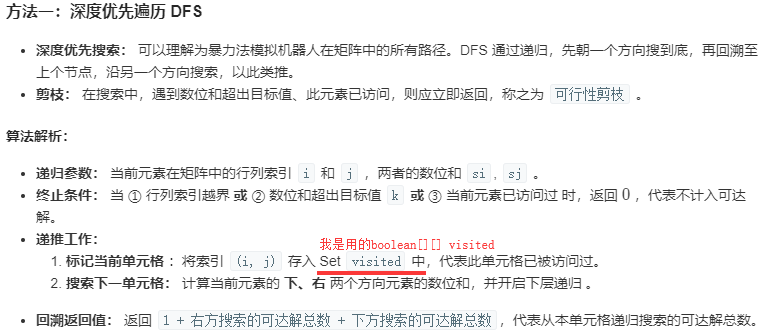

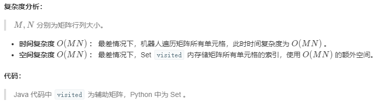

```java
class Solution {
    boolean[][] visited;
    public int movingCount(int m, int n, int k) {
        visited = new boolean[m][n];
        return dfs(0,0,k);
    }
    private int dfs(int m, int n, int k){
        if(m >= visited.length || n >= visited[0].length) return 0;
        if(m%10 + m /10 + n %10 + n/10 > k || visited[m][n]) return 0;
        visited[m][n] = true;
        return 1 + dfs(m+1,n,k) + dfs(m,n+1,k);
    }
}
```

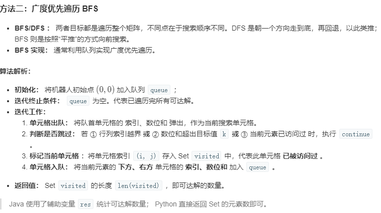

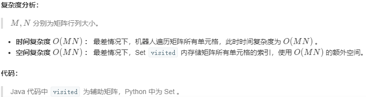

```java
class Solution {
    public int movingCount(int m, int n, int k) {
        boolean[][] visited = new boolean[m][n];
        int res = 0;
        Queue<int[]> queue= new LinkedList<int[]>();
        queue.add(new int[] { 0, 0, 0, 0 });
        while(queue.size() > 0) {
            int[] x = queue.poll();
            int i = x[0], j = x[1], si = x[2], sj = x[3];
            if(i >= m || j >= n || k < si + sj || visited[i][j]) continue;
            visited[i][j] = true;
            res ++;
            queue.add(new int[] { i + 1, j, (i + 1) % 10 != 0 ? si + 1 : si - 8, sj });
            queue.add(new int[] { i, j + 1, si, (j + 1) % 10 != 0 ? sj + 1 : sj - 8 });
        }
        return res;
    }
}
```

# 14. 剪绳子ΔΔ

[Leetcode](https://leetcode.com/problems/integer-break/description/)

## 题目描述

给你一根长度为 n 的绳子，请把绳子剪成整数长度的 m 段（m、n都是整数，n>1并且m>1），每段绳子的长度记为 `k[0],k[1]...k[m-1]` 。请问 `k[0]*k[1]*...*k[m-1]`可能的最大乘积是多少？例如，当绳子的长度是8时，我们把它剪成长度分别为2、3、3的三段，此时得到的最大乘积是18。

示例 1：

```
输入: 2
输出: 1
解释: 2 = 1 + 1, 1 × 1 = 1
```

示例 2:

```
输入: 10
输出: 36
解释: 10 = 3 + 3 + 4, 3 × 3 × 4 = 36
```

## 解题思路

### 贪心

尽可能多剪长度为 3 的绳子，并且不允许有长度为 1 的绳子出现。如果出现了，就从已经切好长度为 3 的绳子中拿出一段与长度为 1 的绳子重新组合，把它们切成两段长度为 2 的绳子。

证明：当 n >= 5 时，3(n - 3) - n = 2n - 9 > 0，且 2(n - 2) - n = n - 4 > 0。因此在 n >= 5 的情况下，将绳子剪成一段为 2 或者 3，得到的乘积会更大。又因为 3(n - 3) - 2(n - 2) = n - 5 >= 0，所以剪成一段长度为 3 比长度为 2 得到的乘积更大。

详细的数学推导：

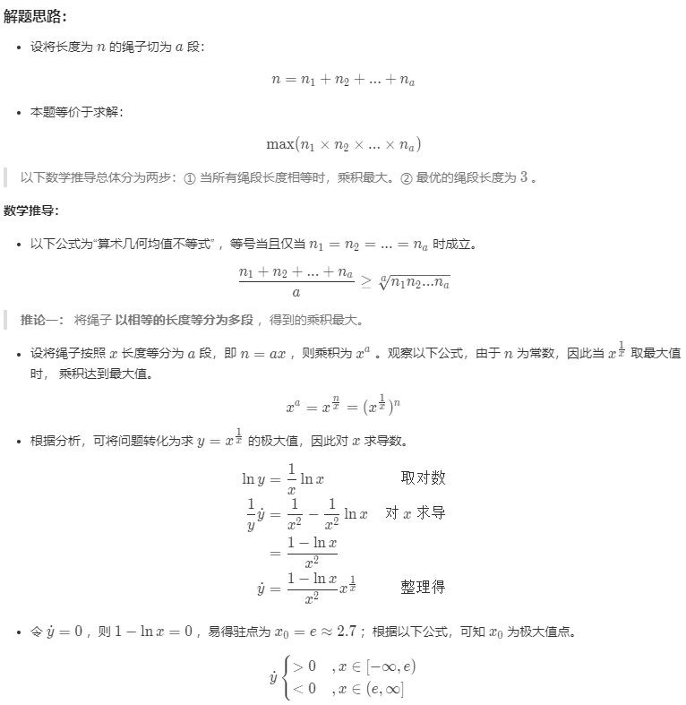

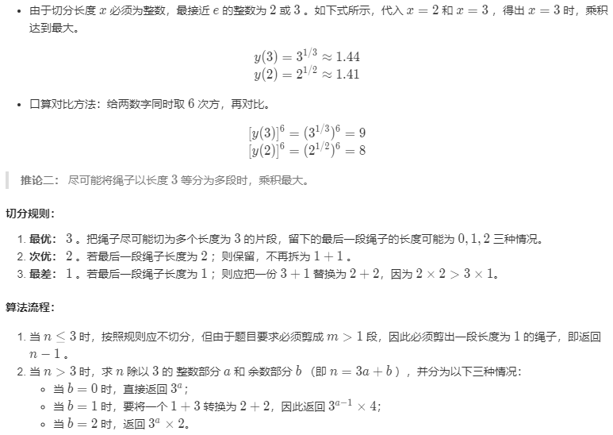

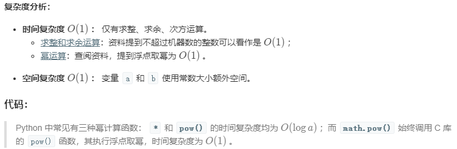

```java
class Solution{
    public int cuttingRope(int n){
        if(n<=3) return n-1;
        int a = n / 3, b = n % 3;  //b可能为0,1,2
        if(b==0) return (int)Math.pow(3,a);
        if(b==1) return (int)Math.pow(3, a-1) * 4;
        return (int)Math.pow(3,a)*2;
    }
}
```

### 动态规划

由上面的分析，当n ≥ 4时，最后一刀只会是3或者2(b=1时将3+1改为2+2)。因此只需求构建`dp[n+1]`数组，并使`dp[i] = max(2*dp[i-2], 3*dp[i-3])`。

```java
class Solution{
    public int cuttingRope(int n){
        if(n<=3) return n-1;
        int[] dp = new int[n+1];
        dp[2] = 2; dp[3] = 3;
        for(int i = 4; i <= n; i++){
            dp[i] = 2* dp[i-2] > 3*dp[i-3] ? 2*dp[i-2] : 3*dp[i-3];
        }
        return dp[n];
    }
}
```

# 15. 二进制中 1 的个数

## 题目描述

请实现一个函数，输入一个整数，输出该数二进制表示中 1 的个数。例如，把 9 表示成二进制是 1001，有 2 位是 1。因此，如果输入 9，则该函数输出 2。

示例 1：

```
输入：11
对应二进制: 00000000000000000000000000001011
输出：3
解释：输入的二进制串 00000000000000000000000000001011 中，共有三位为 '1'。
```

示例 2：

```
输入：-3
对应二进制：11111111111111111111111111111101
输出：31
解释：输入的二进制串 11111111111111111111111111111101 中，共有 31 位为 '1'。
```

### 方法一：逐位判断

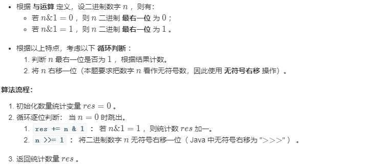

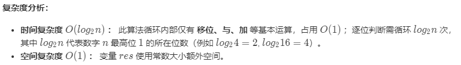

```java
public class Solution {
    // you need to treat n as an unsigned value
    public int hammingWeight(int n) {
        int count = 0;
        while(n != 0){  //由于n可能是负数，不能用n>0判断
            count += n & 1;
            n >>>= 1;  //无符号右移用>>>
        }
        return count;
    }
}
```

### n&(n-1)

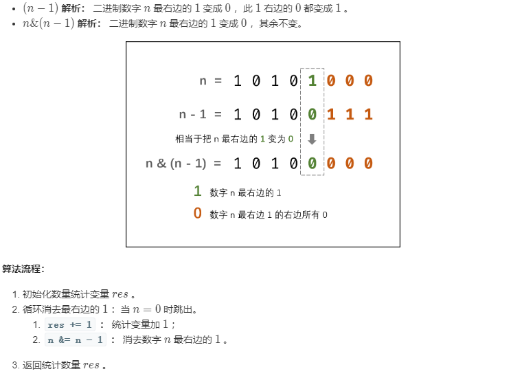

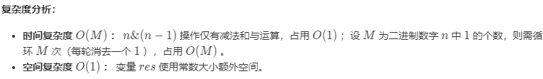

```java
public class Solution {
    // you need to treat n as an unsigned value
    public int hammingWeight(int n) {
        int count = 0;
        while(n != 0){  //由于n可能是负数，不能用n>0判断
            count ++;
            n = n&(n-1);
        }
        return count;
    }
}
```

### Integer.bitCount()

```java
public class Solution {
    // you need to treat n as an unsigned value
    public int hammingWeight(int n) {
        return Integer.bitCount(n);
    }
}
```

# 16. 数值的整数次方Δ

## 题目描述

实现函数double Power(double base, int exponent)，求base的exponent次方。不得使用库函数，同时不需要考虑大数问题。

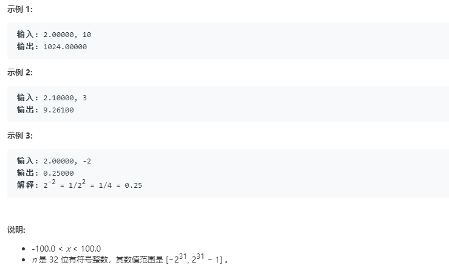

## 解题思路

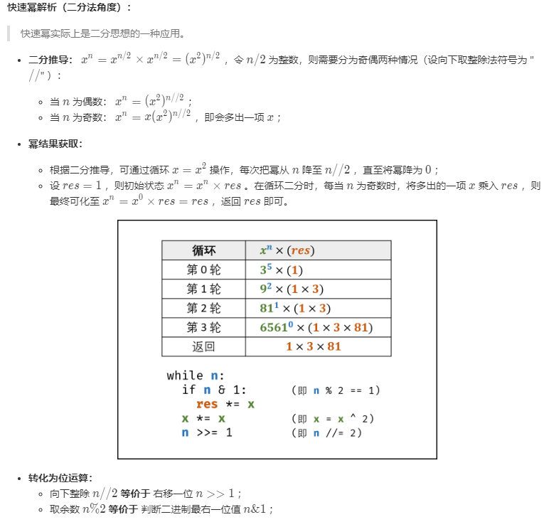

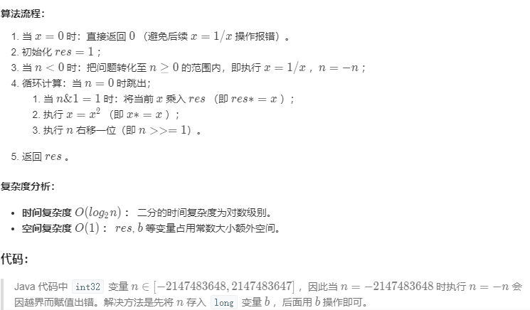

```java
class Solution {
    public double myPow(double x, int n) {
        if(x==0)return 0;
        long b = n;  //将n转存到long类型中，是由于-2147483648的相反数2147483648在int32中溢出为-1.
        if(b < 0){
            x = 1/x;
            b = -b;
        }
        double res = 1.0;
        while(b > 0){
            if((b & 1) == 1) res *= x;
            x = x*x;
            b >>= 1;
        }
        return res;
    }
}
```

# 17. 打印从 1 到最大的 n 位数

## 题目描述

输入数字 n，按顺序打印出从 1 到最大的 n 位十进制数。比如输入 3，则打印出 1、2、3 一直到最大的 3 位数即 999。

## 解题思路

由于 n 可能会非常大，因此不能直接用 int 表示数字，而是用 char 数组进行存储。

使用回溯法得到所有的数。

```java
public void print1ToMaxOfNDigits(int n) {
    if (n <= 0)
        return;
    char[] number = new char[n];
    print1ToMaxOfNDigits(number, 0);
}

private void print1ToMaxOfNDigits(char[] number, int digit) {
    if (digit == number.length) {
        printNumber(number);
        return;
    }
    for (int i = 0; i < 10; i++) {
        number[digit] = (char) (i + '0');
        print1ToMaxOfNDigits(number, digit + 1);
    }
}

private void printNumber(char[] number) {
    int index = 0;
    while (index < number.length && number[index] == '0')
        index++;
    while (index < number.length)
        System.out.print(number[index++]);
    System.out.println();
}
```

# 18.1 在 O(1) 时间内删除链表节点

## 解题思路

① 如果该节点不是尾节点，那么可以直接将下一个节点的值赋给该节点，然后令该节点指向下下个节点，再删除下一个节点，时间复杂度为 O(1)。


② 否则，就需要先遍历链表，找到节点的前一个节点，然后让前一个节点指向 null，时间复杂度为 O(N)。


综上，如果进行 N 次操作，那么大约需要操作节点的次数为 N-1+N=2N-1，其中 N-1 表示 N-1 个不是尾节点的每个节点以 O(1) 的时间复杂度操作节点的总次数，N 表示 1 个尾节点以 O(N) 的时间复杂度操作节点的总次数。(2N-1)/N \~ 2，因此该算法的平均时间复杂度为 O(1)。

```java
public ListNode deleteNode(ListNode head, ListNode tobeDelete) {
    if (head == null || tobeDelete == null)
        return null;
    if (tobeDelete.next != null) {
        // 要删除的节点不是尾节点
        ListNode next = tobeDelete.next;
        tobeDelete.val = next.val;
        tobeDelete.next = next.next;
    } else {
        if (head == tobeDelete)
             // 只有一个节点
            head = null;
        else {
            ListNode cur = head;
            while (cur.next != tobeDelete)
                cur = cur.next;
            cur.next = null;
        }
    }
    return head;
}
```

# 18.2 删除链表中重复的结点

[NowCoder](https://www.nowcoder.com/practice/fc533c45b73a41b0b44ccba763f866ef?tpId=13&tqId=11209&tPage=1&rp=1&ru=/ta/coding-interviews&qru=/ta/coding-interviews/question-ranking&from=cyc_github)

## 题目描述


## 解题描述

```java
public ListNode deleteDuplication(ListNode pHead) {
    if (pHead == null || pHead.next == null)
        return pHead;
    ListNode next = pHead.next;
    if (pHead.val == next.val) {
        while (next != null && pHead.val == next.val)
            next = next.next;
        return deleteDuplication(next);
    } else {
        pHead.next = deleteDuplication(pHead.next);
        return pHead;
    }
}
```

# 19. 正则表达式匹配

[NowCoder](https://www.nowcoder.com/practice/45327ae22b7b413ea21df13ee7d6429c?tpId=13&tqId=11205&tPage=1&rp=1&ru=/ta/coding-interviews&qru=/ta/coding-interviews/question-ranking&from=cyc_github)

## 题目描述

请实现一个函数用来匹配包括 '.' 和 '\*' 的正则表达式。模式中的字符 '.' 表示任意一个字符，而 '\*' 表示它前面的字符可以出现任意次（包含 0 次）。

在本题中，匹配是指字符串的所有字符匹配整个模式。例如，字符串 "aaa" 与模式 "a.a" 和 "ab\*ac\*a" 匹配，但是与 "aa.a" 和 "ab\*a" 均不匹配。

## 解题思路

应该注意到，'.' 是用来当做一个任意字符，而 '\*' 是用来重复前面的字符。这两个的作用不同，不能把 '.' 的作用和 '\*' 进行类比，从而把它当成重复前面字符一次。

```java
public boolean match(char[] str, char[] pattern) {

    int m = str.length, n = pattern.length;
    boolean[][] dp = new boolean[m + 1][n + 1];

    dp[0][0] = true;
    for (int i = 1; i <= n; i++)
        if (pattern[i - 1] == '*')
            dp[0][i] = dp[0][i - 2];

    for (int i = 1; i <= m; i++)
        for (int j = 1; j <= n; j++)
            if (str[i - 1] == pattern[j - 1] || pattern[j - 1] == '.')
                dp[i][j] = dp[i - 1][j - 1];
            else if (pattern[j - 1] == '*')
                if (pattern[j - 2] == str[i - 1] || pattern[j - 2] == '.') {
                    dp[i][j] |= dp[i][j - 1]; // a* counts as single a
                    dp[i][j] |= dp[i - 1][j]; // a* counts as multiple a
                    dp[i][j] |= dp[i][j - 2]; // a* counts as empty
                } else
                    dp[i][j] = dp[i][j - 2];   // a* only counts as empty

    return dp[m][n];
}
```