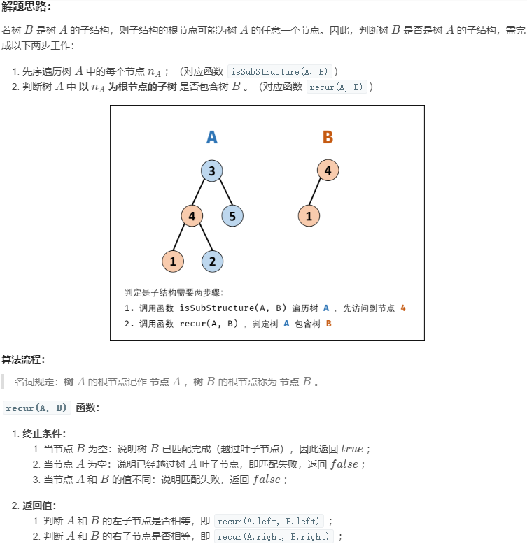
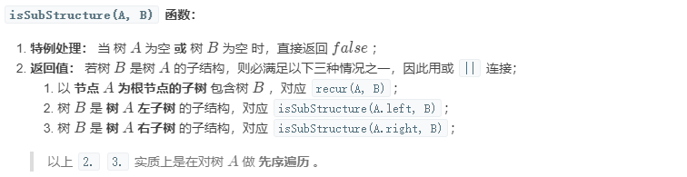
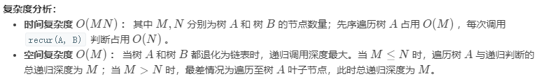
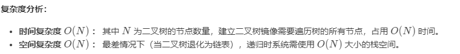

<!-- GFM-TOC -->

# 20. 表示数值的字符串

[NowCoder](https://www.nowcoder.com/practice/6f8c901d091949a5837e24bb82a731f2?tpId=13&tqId=11206&tPage=1&rp=1&ru=/ta/coding-interviews&qru=/ta/coding-interviews/question-ranking&from=cyc_github)

## 题目描述

```
true

"+100"
"5e2"
"-123"
"3.1416"
"-1E-16"
```

```
false

"12e"
"1a3.14"
"1.2.3"
"+-5"
"12e+4.3"
```

## 解题思路

使用正则表达式进行匹配。

```html
[]  ： 字符集合
()  ： 分组
?   ： 重复 0 ~ 1 次
+   ： 重复 1 ~ n 次
*   ： 重复 0 ~ n 次
.   ： 任意字符
\\. ： 转义后的 .
\\d ： 数字
```

```java
public boolean isNumeric(char[] str) {
    if (str == null || str.length == 0)
        return false;
    return new String(str).matches("[+-]?\\d*(\\.\\d+)?([eE][+-]?\\d+)?");
}
```

# 21. 调整数组顺序使奇数位于偶数前面

[NowCoder](https://www.nowcoder.com/practice/beb5aa231adc45b2a5dcc5b62c93f593?tpId=13&tqId=11166&tPage=1&rp=1&ru=/ta/coding-interviews&qru=/ta/coding-interviews/question-ranking&from=cyc_github)

## 题目描述

需要保证奇数和奇数，偶数和偶数之间的相对位置不变，这和书本不太一样。


## 解题思路

方法一：创建一个新数组，时间复杂度 O(N)，空间复杂度 O(N)。

```java
public void reOrderArray(int[] nums) {
    // 奇数个数
    int oddCnt = 0;
    for (int x : nums)
        if (!isEven(x))
            oddCnt++;
    int[] copy = nums.clone();
    int i = 0, j = oddCnt;
    for (int num : copy) {
        if (num % 2 == 1)
            nums[i++] = num;
        else
            nums[j++] = num;
    }
}

private boolean isEven(int x) {
    return x % 2 == 0;
}
```

方法二：使用冒泡思想，每次都当前偶数上浮到当前最右边。时间复杂度 O(N<sup>2</sup>)，空间复杂度 O(1)，时间换空间。

```java
public void reOrderArray(int[] nums) {
    int N = nums.length;
    for (int i = N - 1; i > 0; i--) {
        for (int j = 0; j < i; j++) {
            if (isEven(nums[j]) && !isEven(nums[j + 1])) {
                swap(nums, j, j + 1);
            }
        }
    }
}

private boolean isEven(int x) {
    return x % 2 == 0;
}

private void swap(int[] nums, int i, int j) {
    int t = nums[i];
    nums[i] = nums[j];
    nums[j] = t;
}
```

# 22. 链表中倒数第 K 个结点

[NowCoder](https://www.nowcoder.com/practice/529d3ae5a407492994ad2a246518148a?tpId=13&tqId=11167&tPage=1&rp=1&ru=/ta/coding-interviews&qru=/ta/coding-interviews/question-ranking&from=cyc_github)

## 解题思路

设链表的长度为 N。设置两个指针 P1 和 P2，先让 P1 移动 K 个节点，则还有 N - K 个节点可以移动。此时让 P1 和 P2 同时移动，可以知道当 P1 移动到链表结尾时，P2 移动到第 N - K 个节点处，该位置就是倒数第 K 个节点。


```java
public ListNode FindKthToTail(ListNode head, int k) {
    if (head == null)
        return null;
    ListNode P1 = head;
    while (P1 != null && k-- > 0)
        P1 = P1.next;
    if (k > 0)
        return null;
    ListNode P2 = head;
    while (P1 != null) {
        P1 = P1.next;
        P2 = P2.next;
    }
    return P2;
}
```

# 23. 链表中环的入口结点

[NowCoder](https://www.nowcoder.com/practice/253d2c59ec3e4bc68da16833f79a38e4?tpId=13&tqId=11208&tPage=1&rp=1&ru=/ta/coding-interviews&qru=/ta/coding-interviews/question-ranking&from=cyc_github)

## 题目描述

一个链表中包含环，请找出该链表的环的入口结点。要求不能使用额外的空间。

## 解题思路

使用双指针，一个指针 fast 每次移动两个节点，一个指针 slow 每次移动一个节点。因为存在环，所以两个指针必定相遇在环中的某个节点上。假设相遇点在下图的 z1 位置，此时 fast 移动的节点数为 x+2y+z，slow 为 x+y，由于 fast 速度比 slow 快一倍，因此 x+2y+z=2(x+y)，得到 x=z。

在相遇点，slow 要到环的入口点还需要移动 z 个节点，如果让 fast 重新从头开始移动，并且速度变为每次移动一个节点，那么它到环入口点还需要移动 x 个节点。在上面已经推导出 x=z，因此 fast 和 slow 将在环入口点相遇。


```java
public ListNode EntryNodeOfLoop(ListNode pHead) {
    if (pHead == null || pHead.next == null)
        return null;
    ListNode slow = pHead, fast = pHead;
    do {
        fast = fast.next.next;
        slow = slow.next;
    } while (slow != fast);
    fast = pHead;
    while (slow != fast) {
        slow = slow.next;
        fast = fast.next;
    }
    return slow;
}
```

# 24. 反转链表

[NowCoder](https://www.nowcoder.com/practice/75e878df47f24fdc9dc3e400ec6058ca?tpId=13&tqId=11168&tPage=1&rp=1&ru=/ta/coding-interviews&qru=/ta/coding-interviews/question-ranking&from=cyc_github)

## 解题思路

### 递归

```java
public ListNode ReverseList(ListNode head) {
    if (head == null || head.next == null)
        return head;
    ListNode next = head.next;
    head.next = null;
    ListNode newHead = ReverseList(next);
    next.next = head;
    return newHead;
}
```

### 迭代

使用头插法。

```java
public ListNode ReverseList(ListNode head) {
    ListNode newList = new ListNode(-1);
    while (head != null) {
        ListNode next = head.next;
        head.next = newList.next;
        newList.next = head;
        head = next;
    }
    return newList.next;
}
```

# 25. 合并两个排序的链表

[NowCoder](https://www.nowcoder.com/practice/d8b6b4358f774294a89de2a6ac4d9337?tpId=13&tqId=11169&tPage=1&rp=1&ru=/ta/coding-interviews&qru=/ta/coding-interviews/question-ranking&from=cyc_github)

## 题目描述


## 解题思路

### 递归

```java
public ListNode Merge(ListNode list1, ListNode list2) {
    if (list1 == null)
        return list2;
    if (list2 == null)
        return list1;
    if (list1.val <= list2.val) {
        list1.next = Merge(list1.next, list2);
        return list1;
    } else {
        list2.next = Merge(list1, list2.next);
        return list2;
    }
}
```

### 迭代

```java
public ListNode Merge(ListNode list1, ListNode list2) {
    ListNode head = new ListNode(-1);
    ListNode cur = head;
    while (list1 != null && list2 != null) {
        if (list1.val <= list2.val) {
            cur.next = list1;
            list1 = list1.next;
        } else {
            cur.next = list2;
            list2 = list2.next;
        }
        cur = cur.next;
    }
    if (list1 != null)
        cur.next = list1;
    if (list2 != null)
        cur.next = list2;
    return head.next;
}
```

# 26. 树的子结构▲▲

## 题目描述

输入两棵二叉树A和B，判断B是不是A的子结构。(约定空树不是任意一个树的子结构)

B是A的子结构， 即 A中有出现和B相同的结构和节点值。

例如:
给定的树 A:

```
 3
/ \
4  5
  / \
 1   2
```

给定的树 B：

```
  4 
 /
1
```

返回 true，因为 B 与 A 的一个子树拥有相同的结构和节点值。

示例 1：

```
输入：A = [1,2,3], B = [3,1]
输出：false
```

示例 2：

```
输入：A = [3,4,5,1,2], B = [4,1]
输出：true
```

限制：0 <= 节点个数 <= 10000

## 解题思路







```java
class Solution {
    public boolean isSubStructure(TreeNode A, TreeNode B) {
        if(A == null || B == null) return false;
        return recur(A, B) || isSubStructure(A.left, B) || isSubStructure(A.right, B);
    }
    private boolean recur(TreeNode A, TreeNode B){
        if(B == null) return true;
        if(A == null || A.val != B.val) return false;
        return recur(A.left, B.left) && recur(A.right, B.right);//此时A.val == B.val, 继续递归判断左右子树是否对应相等
    }
}
```

# 27. 二叉树的镜像

## 题目描述

请完成一个函数，输入一个二叉树，该函数输出它的镜像。

例如输入：

```
 	 4
    /  \
   2    7
  / \  / \
 1   3 6  9
```

镜像输出：

```
     4
   /   \
  7     2
 / \   / \
9   6 3   1 
```

示例 1：

```
输入：root = [4,2,7,1,3,6,9]
输出：[4,7,2,9,6,3,1]
```

限制：

0 <= 节点个数 <= 1000

## 解题思路



```java
class Solution {
    public TreeNode mirrorTree(TreeNode root) {
        if(root == null) return null;
        TreeNode tmp = root.left;
        root.left = mirrorTree(root.right);
        root.right = mirrorTree(tmp);
        return root;
    }
}
```

# 28 对称的二叉树

[NowCoder](https://www.nowcoder.com/practice/ff05d44dfdb04e1d83bdbdab320efbcb?tpId=13&tqId=11211&tPage=1&rp=1&ru=/ta/coding-interviews&qru=/ta/coding-interviews/question-ranking&from=cyc_github)

## 题目描述


## 解题思路

```java
boolean isSymmetrical(TreeNode pRoot) {
    if (pRoot == null)
        return true;
    return isSymmetrical(pRoot.left, pRoot.right);
}

boolean isSymmetrical(TreeNode t1, TreeNode t2) {
    if (t1 == null && t2 == null)
        return true;
    if (t1 == null || t2 == null)
        return false;
    if (t1.val != t2.val)
        return false;
    return isSymmetrical(t1.left, t2.right) && isSymmetrical(t1.right, t2.left);
}
```

# 29. 顺时针打印矩阵

[NowCoder](https://www.nowcoder.com/practice/9b4c81a02cd34f76be2659fa0d54342a?tpId=13&tqId=11172&tPage=1&rp=1&ru=/ta/coding-interviews&qru=/ta/coding-interviews/question-ranking&from=cyc_github)

## 题目描述

下图的矩阵顺时针打印结果为：1, 2, 3, 4, 8, 12, 16, 15, 14, 13, 9, 5, 6, 7, 11, 10


## 解题思路

```java
public ArrayList<Integer> printMatrix(int[][] matrix) {
    ArrayList<Integer> ret = new ArrayList<>();
    int r1 = 0, r2 = matrix.length - 1, c1 = 0, c2 = matrix[0].length - 1;
    while (r1 <= r2 && c1 <= c2) {
        for (int i = c1; i <= c2; i++)
            ret.add(matrix[r1][i]);
        for (int i = r1 + 1; i <= r2; i++)
            ret.add(matrix[i][c2]);
        if (r1 != r2)
            for (int i = c2 - 1; i >= c1; i--)
                ret.add(matrix[r2][i]);
        if (c1 != c2)
            for (int i = r2 - 1; i > r1; i--)
                ret.add(matrix[i][c1]);
        r1++; r2--; c1++; c2--;
    }
    return ret;
}
```

