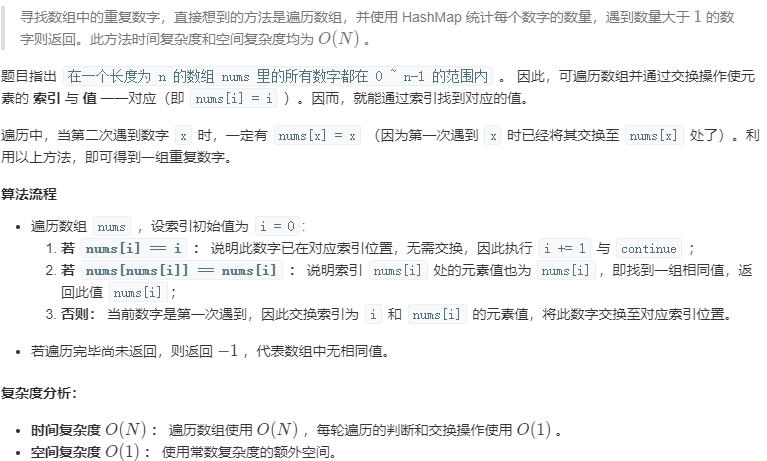
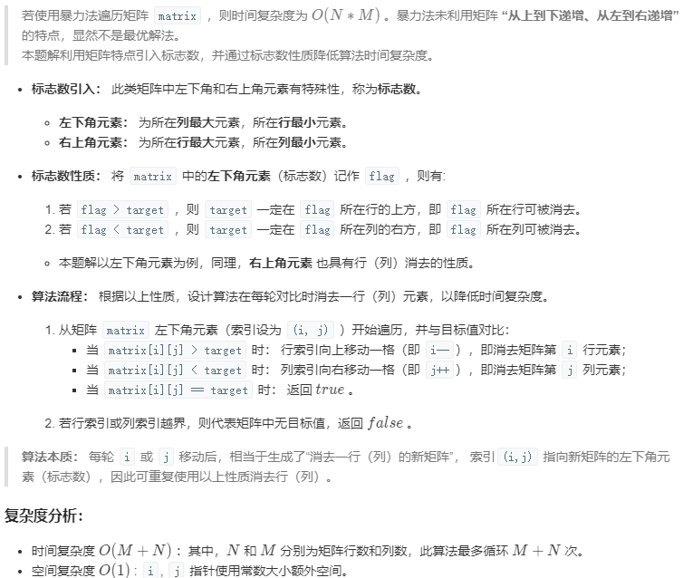
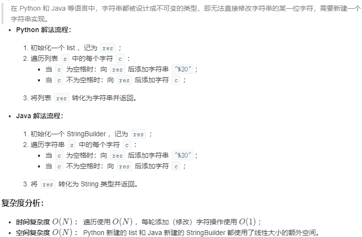
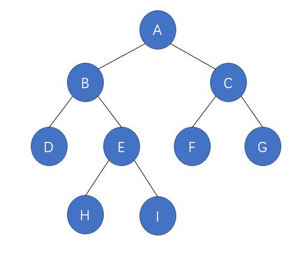
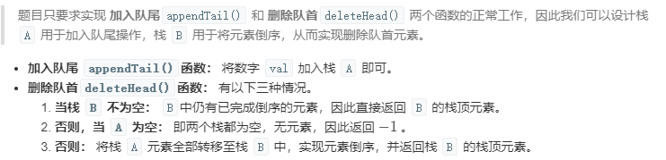

# 3. 数组中重复的数字

## 题目描述

在一个长度为 n 的数组 nums 里的所有数字都在 0～n-1 的范围内。数组中某些数字是重复的，但不知道有几个数字重复了，也不知道每个数字重复了几次。请找出数组中任意一个重复的数字。

**示例 1：**

```
输入：[2, 3, 1, 0, 2, 5, 3]
输出：2 或 3 
```

**限制：**

```
2 <= n <= 100000
```

Related Topics

- 数组
- 哈希表

## 解题思路



```java
class Solution {
    public int findRepeatNumber(int[] nums) {
        if(nums == null) return -1;
        int i = 0;
        while(i < nums.length) {
            if(nums[i] == i) {
                i++;
                continue;
            }
            else if(nums[nums[i]] == nums[i]) return nums[i];
            else{
                int tmp = nums[i];
            	nums[i] = nums[tmp];
            	nums[tmp] = tmp;
            }
        }
        return -1;
    }
}
```

# 4. 二维数组中的查找Δ

## 题目描述

给定一个二维数组，其每一行从左到右递增排序，从上到下也是递增排序。给定一个数，判断这个数是否在该二维数组中。

```html
Consider the following matrix:
[
  [1,   4,  7, 11, 15],
  [2,   5,  8, 12, 19],
  [3,   6,  9, 16, 22],
  [10, 13, 14, 17, 24],
  [18, 21, 23, 26, 30]
]

Given target = 5, return true.
Given target = 20, return false.
```

## 解题思路



```java
class Solution {
    public boolean findNumberIn2DArray(int[][] matrix, int target) {
        if (matrix == null || matrix.length == 0 || matrix[0].length == 0) {
            return false;
        }
        int i = matrix.length - 1, j = 0;
        while(i >= 0 && j < matrix[0].length)
        {
            if(matrix[i][j] > target) i--;
            else if(matrix[i][j] < target) j++;
            else return true;
        }
        return false;
    }
}
```

# 5. 替换空格

## 题目描述

将一个字符串中的空格替换成 "%20"。

```text
Input:
"A B"

Output:
"A%20B"
```

## 解题思路



```java
class Solution {
    public String replaceSpace(String s) {
        StringBuilder res = new StringBuilder();
        for(char c : s.toCharArray())
        {
            if(c == ' ') res.append("%20");
            else res.append(c);
        }
        return res.toString();
    }
}
```

```java
//书中解法 速度最快
class Solution {
    public String replaceSpace(String s) {
        int p1 = s.length();
        int p2 = p1;
        for(char c: s.toCharArray()){
            if (c == ' ') p2 += 2;
        }
        char[] res = new char[p2];  //p1,p2指向原串和新串长度
        while(p1>0){
            p1--;
            if(s.charAt(p1) == ' '){
                p2 -= 3;
                res[p2] = '%';
                res[p2+1] = '2';
                res[p2+2] = '0';
            }else res[--p2] = s.charAt(p1);
        }
        return new String(res);
    }
}
```

机灵鬼解法：

```java
class Solution {
    public String replaceSpace(String s) {
        return s.replace(" ", "%20");
    }
}
```

有两个排序的数组A1和A2,内存在A1的末尾有足够多的空余空间容纳A2。请实现一个函数， 把A2中的所有数字插入A1中， 并且所有的数字是排序的。

和前面的例题一样， 很多人首先想到的办法是在A1中从头到尾复制数字， 但这样就会出现多次复制一个数字的情况。 更好的办法是从尾到头比较A1和A2中的数字， 并把较大的数字复制到A1中的合适位置。

举一反三：在合并两个数组（包括字符串） 时， 如果从前往后复制每个数字（或字符） 则需要重复移动数字（或字符） 多次， 那么我们可以考虑从后往前复制， 这样就能减少移动的次数， 从而提高效率 。

# 6. 从尾到头打印链表

[NowCoder](https://www.nowcoder.com/practice/d0267f7f55b3412ba93bd35cfa8e8035?tpId=13&tqId=11156&tPage=1&rp=1&ru=/ta/coding-interviews&qru=/ta/coding-interviews/question-ranking&from=cyc_github)

## 题目描述

输入一个链表的头节点，从尾到头反过来返回每个节点的值（用数组返回）。

示例 1：

输入：head = [1,3,2]
输出：[2,3,1]

限制：0 <= 链表长度 <= 10000

## 解题思路

```java
/**
 * Definition for singly-linked list.
 * public class ListNode {
 *     int val;
 *     ListNode next;
 *     ListNode(int x) { val = x; }
 * }
 */
```

### 遍历两次

```java
class Solution {
    public int[] reversePrint(ListNode head) {
        int cnt=0;
        ListNode p = head;
        while(p!=null){
            cnt++;
            p = p.next;
        }
        int[] res= new int[cnt];
        p = head;
        while(cnt > 0){
            res[--cnt] = p.val;
            p = p.next;
        }
        return res;
    }
}
```

### 使用递归

```java

class Solution {
    LinkedList<Integer> arr = new LinkedList<>();
    public int[] reversePrint(ListNode head) {
        recur(head);
        int[] res = new int[arr.size()];
        for(int i = 0; i < arr.size(); i++){
            res[i] = arr.get(i);
        }
        return res;
    }

    private void recur(ListNode head){
        if(head != null) {
            recur(head.next);
            arr.addLast(head.val);
        }
    }
}
```

### 使用头插法

```java
class Solution {
    public int[] reversePrint(ListNode head) {
        ListNode h = new ListNode(-1);
        ListNode p = head;
        ListNode r = null;
        int cnt = 0;
        while(p!=null){
            cnt++;
            r = p;
            p = p.next;
            r.next = h.next;
            h.next = r;
        }
        int[] res= new int[cnt];
        p = h.next;cnt=0;
        while(p!=null){
            res[cnt++] = p.val;
            p = p.next;
        }
        return res;
    }
}
```

### 使用栈

栈具有后进先出的特点，在遍历链表时将值按顺序放入栈中，最后出栈的顺序即为逆序。

```java
public ArrayList<Integer> printListFromTailToHead(ListNode listNode) {
    Stack<Integer> stack = new Stack<>();
    while (listNode != null) {
        stack.add(listNode.val);
        listNode = listNode.next;
    }
    ArrayList<Integer> ret = new ArrayList<>();
    while (!stack.isEmpty())
        ret.add(stack.pop());
    return ret;
}
```

# 7. 重建二叉树Δ

## 题目描述

输入某二叉树的前序遍历和中序遍历的结果，请重建该二叉树。假设输入的前序遍历和中序遍历的结果中都不含重复的数字。

例如，给出

```
前序遍历 preorder = [3,9,20,15,7]
中序遍历 inorder = [9,3,15,20,7]
```

返回如下的二叉树：

```
    3
   / \
  9  20
    /  \
   15   7
```

## 解题思路

我的解法：时间复杂度为$O(N^2)$，可使用HashMap改进为$O(N)$。

```java
/**
 * Definition for a binary tree node.
 * public class TreeNode {
 *     int val;
 *     TreeNode left;
 *     TreeNode right;
 *     TreeNode(int x) { val = x; }
 * }
 */
```

```java
class Solution {
    public TreeNode buildTree(int[] preorder, int[] inorder) {
        int low = 0;
        int high = preorder.length - 1;
        return rebuild(preorder, inorder, low, high, low, high);
    }

    private TreeNode rebuild(int[] preorder, int[] inorder, int pleft, int pright, int ileft, int iright){
        if(pright < pleft) return null;
        TreeNode root = new TreeNode(preorder[pleft]);
        int posOfINRoot = ileft;
        for ( int i = ileft; i <= iright; i++) if (inorder[i] == preorder[pleft]) posOfINRoot = i;
        int leftLength = posOfINRoot - ileft;
        root.left = rebuild(preorder, inorder, pleft+1, pleft+leftLength,ileft,posOfINRoot-1);
        root.right = rebuild(preorder,inorder, pleft+leftLength+1, pright, posOfINRoot+1,iright);
        return root;
    }
}
```

改进解法：

```java
class Solution {
    int[] pre;
    HashMap<Integer,Integer> in = new HashMap<>();
    public TreeNode buildTree(int[] preorder, int[] inorder) {
        if (preorder == null || preorder.length == 0) return null;
        pre = preorder;
        for(int i  = 0; i < inorder.length; i++) in.put(inorder[i],i);
        return rebuild(0, 0, inorder.length - 1);
    }

    private TreeNode rebuild(int preRoot, int inLeft, int inRight){
        if(inRight < inLeft) return null;  //边界退出条件：空结点
        TreeNode root = new TreeNode(pre[preRoot]);
        int indexOfINRoot = in.get(pre[preRoot]);  //获取前序遍历根结点在中序序列中的索引
        root.left = rebuild(preRoot+1,inLeft,indexOfINRoot-1);
        root.right = rebuild(preRoot+indexOfINRoot - inLeft + 1, indexOfINRoot+1,inRight);
        return root;
    }
}
```

# 8. 二叉树的下一个结点Δ

## 题目描述

给定一个二叉树和其中的一个结点，请找出中序遍历顺序的下一个结点并且返回。注意，树中的结点不仅包含左右子结点，同时包含指向父结点的指针。

```java
public class TreeLinkNode {

    int val;
    TreeLinkNode left = null;
    TreeLinkNode right = null;
    TreeLinkNode next = null;

    TreeLinkNode(int val) {
        this.val = val;
    }
}
```

## 解题思路

以该二叉树为例，中序遍历为：{D,B,H,E,I,A,F,C,G}



① 右子树非空，则下一个结点必为右子树最左边的结点

② 右子树为空，一直沿着父结点追溯，直到找到某个结点是其父结点的左子树，找不到，说明当前结点为中序遍历最后一个元素，返回null。例如 I，下一结点是 A；例如 G，并没有符合情况的结点，所以 G 没有下一结点

```java
public class Solution {
    public TreeLinkNode GetNext(TreeLinkNode pNode)
    {
        if(pNode == null) return null;  
        if(pNode.right!=null){  //右子树非空，则下一个结点必为右子树最左边的结点
            TreeLinkNode p = pNode.right;
            while(p.left!=null)p = p.left;
            return p;
        }
        else{  //右子树为空，一直沿着父结点追溯，直到找到某个结点是其父结点的左子树，找不到，说明当前结点为中序遍历最后一个元素，返回null
            while(pNode.next !=null && pNode.next.right == pNode){
                pNode = pNode.next;
            }
            return pNode.next;
        }
    }
}
```

# 9. 用两个栈实现队列Δ

## 题目描述

用两个栈来实现一个队列，完成队列的 Push 和 Pop 操作。

## 解题思路

两个栈模拟队列为经典题，一个栈模拟入队，另一个栈模拟出队。



```java
class CQueue {
    LinkedList<Integer> A, B;
    public CQueue() {
        A = new LinkedList<Integer>();
        B = new LinkedList<Integer>();
    }
    public void appendTail(int value) {
        A.addLast(value);
    }
    public int deleteHead() {
        if(!B.isEmpty()) return B.removeLast();
        if(A.isEmpty()) return -1;
        while(!A.isEmpty())
            B.addLast(A.removeLast());
        return B.removeLast();
    }
}
```