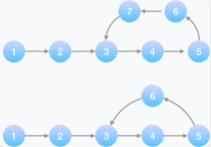

```java
//二分查找
public class BinarySearch {
    public static void main(String[] args) {
        int[] arr = {1, 3, 5, 7, 9};
        System.out.println(binarySearch(arr, 11));
    }

    public static int binarySearch(int[] arr, int key) {
        int left = 0; int right = arr.length-1;int mid;
        while(left <= right){
            mid = left + (right - left)/2;
            if(arr[mid] == key) return mid;
            else if (arr[mid] < key) left = mid+1;
            else right = mid-1;
        }
        return -1;
    }
}
```

```java
//归并排序
import java.util.Arrays;

/**
 * @Author Kevin Yan
 * @Date 2020-08-13 10:05
 */
public class MergeSort {
    public static void main(String[] args) {
        int[] arr = {1, 0, 3, 2, 4, 7, 5};
        new MergeSort().mergeSort(arr);
        System.out.println(Arrays.toString(arr));
    }

//    public void mergeSort(int[] arr){
//        if(arr == null || arr.length <= 1) return;
//        int[] res = new int[arr.length];
//        merge(arr,res, 0, arr.length - 1);
//    }
//
//    private void merge(int[] arr, int[] res, int left, int right){
//        if(left >= right) return;//base case
//        int mid = left + (right - left)/2; //(left + right)/2 may overflow when numbers are big
//        merge(arr,res,left,mid); //不能是left,mid-1 和mid,right,如arr(0,1)导致死循环
//        merge(arr,res,mid+1,right);
//        int i = left,j = mid+1,k = left;
//        System.arraycopy(arr,left,res,left,right-left+1);
//        while(i<=mid&&j<=right){
//            if(res[i]<=res[j])arr[k++] = res[i++];
//            else arr[k++] = res[j++];
//        }
//        while(i<=mid)arr[k++] = res[i++]; //若左边还有元素，则继续加入
//        //若右边还有元素，但已经归位了，不需要额外操作
//    }
}
```

```
//单例类

//public class Singleton {
//    private static final Singleton instance = new Singleton();
//    private Singleton(){}
//
//    public static Singleton getInstance(){
//        return instance;
//    }
//}


//public class Singleton{
//    private static Singleton instance;
//
//    private Singleton(){}
//
//    public static Singleton getInstance(){
//        if(instance == null) instance = new Singleton();
//        return instance;
//    }
//}


//public class Singleton{
//    private static Singleton instance;
//
//    private Singleton(){}
//
//    public static synchronized Singleton getInstance(){
//        if(instance == null){
//            instance = new Singleton();
//        }
//        return instance;
//    }
//}

//public class Singleton{
//    private static Singleton instance;
//
//    private Singleton(){}
//
//    public static Singleton getInstance(){
//        if(instance == null){
//            synchronized (Singleton.class){
//                if(instance == null){
//                    instance = new Singleton();
//                }
//            }
//        }
//        return instance;
//    }
//}

public class Singleton {

    public static void main(String[] args) {
        new Thread(() -> {
            try {
                Thread.sleep(200);
            } catch (InterruptedException e) {
                e.printStackTrace();
            }
            System.out.println(Singleton.getInstance());
        }).start();

        new Thread(() -> {
            try {
                Thread.sleep(200);
            } catch (InterruptedException e) {
                e.printStackTrace();
            }
            System.out.println(Singleton.getInstance());
        }).start();

        new Thread(() -> {
            try {
                Thread.sleep(200);
            } catch (InterruptedException e) {
                e.printStackTrace();
            }
            System.out.println(Singleton.getInstance());
        }).start();

    }


//    private static final Singleton instance = new Singleton();
//    private Singleton(){}
//
//    public static Singleton getInstance(){
//        return instance;
//    }

//    private static Singleton instance;
//    private Singleton(){}
//
//    private  static Singleton getInstance(){
//        if(instance == null){
//            synchronized (Singleton.class){
//                if(instance == null){
//                    instance = new Singleton();
//                }
//            }
//        }
//        return instance;
//    }

//    private Singleton(){}
//
//    private static class SingletonHolder{
//        private static final Singleton INSTANCE = new Singleton();
//    }
//
//    public static Singleton getInstance(){
//        return SingletonHolder.INSTANCE;
//    }

    private Singleton(){}

    private static class SingletonHolder{
        private static final Singleton instance = new Singleton();
    }

    public static Singleton getInstance(){
        return SingletonHolder.instance;
    }
}
```

```
//合并升序链表
public class Merge {
    public static void main(String[] args) {
        Merge merge = new Merge();
        Node A = new Node(null, 1);
        A.next = new Node(null, 3);
        A.next.next = new Node(null, 5);
        Node B = new Node(null, 2);
        B.next = new Node(null, 4);
        Node c = merge.merge(A, B);
        while (c != null) {
            System.out.println(c.val);
            c = c.next;
        }
    }

    static class Node{
        int val;
        Node next;
        public Node(Node next,int val){
            this.val = val;
            this.next = next;
        }
    }

    public Node merge(Node A, Node B){
        Node C = new Node(null,-1);
        Node p = C;
        while(A!= null && B != null){
            if(A.val < B.val){
                p.next = A;
                A = A.next;
            }else{
                p.next = B;
                B = B.next;
            }
            p = p.next;
        }

        if(A != null) p.next = A;
        if(B != null) p.next = B;
        return C.next;
    }
}
```

```java
//堆排序
//大根堆下沉 从第一个非叶节点开始，直到根，每次与左右子树的较大者比较
import java.util.Arrays;

public class HeapSort {
    public static void main(String[] args) {
        int[] arr = {53, 17, 78, 9, 45, 65, 87, 32};
        new HeapSort().sort设计模式知道哪些？(arr);
        System.out.println(Arrays.toString(arr));
    }

    public void sort(int[] arr){
        if(arr == null || arr.length <= 1) return;
        int len = arr.length -1;
        for(int i = (len -1)/2; i>=0; i--){
            sink(arr,i,len);
        }

        while(len > 0){
            swap(arr,0,len--);
            sink(arr,0,len);
        }
    }

    private void sink(int[] arr, int k, int len){
        while(k*2 +1 <= len){
            int j = k * 2 +1;
            if(j < len && arr[j] < arr[j+1])j++;
            if(arr[k] >= arr[j]) return;
            swap(arr, k, j);
            k = j;
        }
    }

    private void swap(int[] arr, int i, int j){
        int temp = arr[i];
        arr[i] = arr[j];
        arr[j] = temp;
    }
}
```

```
//快排
import java.util.Arrays;

public class QuickSort {

    public static void main(String[] args){
        int[] arr = {1,3,2,8,6,4,7,5};
        new QuickSort().quickSort(arr,0,arr.length-1);
        System.out.println(Arrays.toString(arr));
    }

    public void quickSort(int[] arr, int low, int high){
        if(low < high){
            int p = partition(arr, low, high);
            quickSort(arr, low, p-1);
            quickSort(arr, p+1, high);
        }
    }

    private int partition(int[] arr, int low, int high){
        int temp = arr[low];
        while(low < high){
            while(low < high && arr[high] >= temp) high--;
            arr[low] = arr[high];
            while(low < high && arr[low] <= temp) low++;
            arr[high] = arr[low];
        }
        arr[low] = temp;
        return low;
    }
}
```

如何判断链表有环：



解题思路：

方法一：set 集合大小变化
利用集合的性质，去重
若有环，就会重复插入相同的节点，那么 set 大小不会发生变化
若 set 大小没有发生变化，那么说明存在环

```java
public class Solution {
    public bool hasCycle(ListNode head) {
        set<ListNode> set;
        ListNode q=head;
        int count=0;//记录set的大小
        while(q != null)
        {
            set.insert(q);
            if(count==set.size())
                return true;
            q=q->next;
            count=set.size();
        }
        return false;
    }
}
```

复杂度分析：
时间复杂度：O(n)
空间复杂度：O(n)

方法二：快慢指针
初始化 slow = head->next，每次走一步
初始化 fast =head->next->next，每次走两步，每走一步判断一次
存在环 fast 和 slow 会相遇

```java
class Solution {
public:
    bool hasCycle(ListNode *head) {
        if(head==NULL||head->next==NULL)
            return false;
        ListNode *fast=head->next->next;
        ListNode *slow=head->next;
        while(fast)
        {
            slow=slow->next;
            for(int i=0;i<2;i++)
            {
                if(fast->next==NULL)
                    return false;
                fast=fast->next;
                if(fast==slow)
                    return true;
            }
        }
        return false;
    }
};
```

复杂度分析：
时间复杂度：O(n)。除了两个指针以外，没有使用任何额外存储空间，所以空间复杂度是 O(1)。

扩展问题：

如果单向链表中存在环的情况，环长是多少？

**思路**：当两个指针首次相遇，证明链表有环的时候，让两个指针从相遇点继续循环前进，并统计前进的循环次数，直到两个指针第2次相遇。此时，统计出来的前进次数就是环长。因为指针p1每次走1步，指针p2每次走2步，两者的速度差是1步。当两个指针再次相遇时，p2比p1多走了整整1圈。因此，环长 = 每一次速度差 × 前进次数 = 前进次数。

```java
public static int cycleLenth(Node head) {
    Node p1 = head;
    Node p2 = head;
    int count = 0;
    int length = 0;

    while (count < 2 && p2 != null && p2.next != null) {
        if(count > 0) {
            length++;
        }
        p1 = p1.next;
        p2 = p2.next.next;
        if (p1 == p2) {
            count++;
        }
    }
    return length;
}
```

1.判断质数

```
public static boolean isPrime(int n){
    //n<=3时，质数有2和3
    if (n <= 3) {
        return n > 1;
    }
    //当n>3时，质数无法被比它小的数整除
    for(int i = 2; i*i <= n; i++){
        if (n % i == 0) {
            return false;
        }
    }
    return true;
}
```

2.判断闰年

```
return (year%4==0 && year%100!=0) || (year%400==0);
```

3.输入年月日判断是这一年的第几天，两个日期之间差多少天

4.括号匹配

```
public class BracketMatch {
    public static void main(String[] args) {
        String s = "{[(5*8)+(3+2)*2]}*{[(7+4)+(6-2)/2]}";
        System.out.println(isMatch(s));
    }

    public static boolean isMatch(String str) {
        Map<Character, Character> map = new HashMap<>();
        map.put(')', '(');
        map.put('}', '{');
        map.put(']', '[');

        LinkedList<Character> stack = new LinkedList<>();
        for (int i = 0; i < str.length(); i++) {
            char c = s.charAt(i);
            if (map.containsValue(c)) {//若为左括号，入栈
                stack.push(c);
            }else if (map.containsKey(c)) {
                //若为右括号，栈必须非空且栈顶为对应的左括号，此时出栈；否则不匹配
                if (!stack.isEmpty() && stack.peek() == map.get(c)) stack.pop();
                else return false;
            }
        }
        //判断栈是否为空
        return stack.isEmpty();
    }
}
```

### 浮点数的四舍五入

将浮点数加上0.5，再强制类型转换，如：

```
double d = 2.6;
int n = (int)(d + 0.5);
```

### 对++和--的深层次理解

1.第一层次：i先计算后赋值，i先赋值后计算

```
public class Hello {
    public static void main(String[] args) {
        int i = 0;
        i = i++;
        System.out.println(i);
    }
}
//问题：int i = 0; i = i++; System.out.print(i)结果是多少？
//如果按照先赋值后计算理解，右边的i赋值给左边的i，右边的i再自加1,答案应该是1,但实际是0
```

2.第二层次：反编译上述过程的.class文件

```
public class Hello {
    public Hello() {
    }

    public static void main(String[] args) {
        int i = 0;
        byte var10000 = i;
        int var2 = i + 1;
        i = var10000;
        System.out.println(i);
    }
}
```

可以看到有一个中间变量var10000中转了i的初始值，然后计算i + 1并赋值给var2，再将中间变量var10000赋值给左边的i。即右边所有计算都进行完成，才进行等号的赋值运算。并不是简单的"先赋值，后计算。"

3.第三层次：查看字节码

```
L0
LINENUMBER 4 L0
ICONST_0 //1.内存中有一个int常量0
ISTORE 1 //2.将内存中的值(0)存入槽1(null -> 0)
L1
LINENUMBER 5 L1
ILOAD 1  //3.从槽1加载值到内存(0 -> 0)
IINC 1 1 //4.槽1值增加1(0 -> 1)
ISTORE 1 //5.将内存中的值(0)存入槽1(1 -> 0)
L2
LINENUMBER 6 L2
GETSTATIC java/lang/System.out : Ljava/io/PrintStream;
ILOAD 1 //6.从槽1加载值到内存(0 -> 0)
INVOKEVIRTUAL java/io/PrintStream.println (I)V
L3
LINENUMBER 7 L3
RETURN //7.结束运行，返回
L4
LOCALVARIABLE args [Ljava/lang/String; L0 L4 0 //String[] args 关联槽0，生命周期L0 -> L4
LOCALVARIABLE i I L1 L4 1  //int i 关联槽1，生命周期L1 -> L4
MAXSTACK = 2
MAXLOCALS = 2
```

从字节码看，内存可看作中间变量，main方法中另有两个变量：args和i。

重点看生命周期L1，即`i = i++;`语句执行过程：先将i值载入内存，然后 i 自增1(但i自增后的值并没有载入内存)，接着又将内存中的值存到i中，即 i 最终值为0。

从第二层次和第三层次可以看出：赋值语句都是先将右边所有操作执行完，再进行赋值操作。

### 位运算妙用

n%2==1用n&1代替，效率更高

n/2用n>>1代替；n*2用n<<1代替

### 产生随机数

Math.random() 返回0.0~1.0的浮点数，伪随机数

Random random = new Random();

int randomNum = random.nextInt(n);  伪随机返回[0,n)之间的整数。