当业务发展到一定规模，实时数据仓库是一个必要的基础服务。从数据驱动方面考虑，多维实时数据分析系统的重要性也不言而喻。但是当数据量巨大的情况下，拿腾讯看点来说，一天上报的数据量达到万亿级的规模，要实现极低延迟的实时计算和亚秒级的多维实时查询是有技术挑战的。

本文将介绍信息流场景下，腾讯看点的实时数据仓库和多维实时数据分析系统的技术架构。

**1、可解决的痛点**

可以先看一下，多维实时数据分析系统可以解决哪些痛点。比如：

* 推荐同学 10 分钟前上了一个推荐策略，想知道在不同人群的推荐效果怎么样？ 
* 运营同学想知道，在广东省的用户中，最火的广东地域内容是哪些，方便做地域 Push。 
* 审核同学想知道，过去 5 分钟，游戏类被举报最多的内容和账号是哪些？ 
* 老板可能想了解，过去 10 分钟有多少用户在看点消费了内容，对消费人群有一个宏观了解。 

**2、调研**

在进行开发之前，我们做了这些调研。

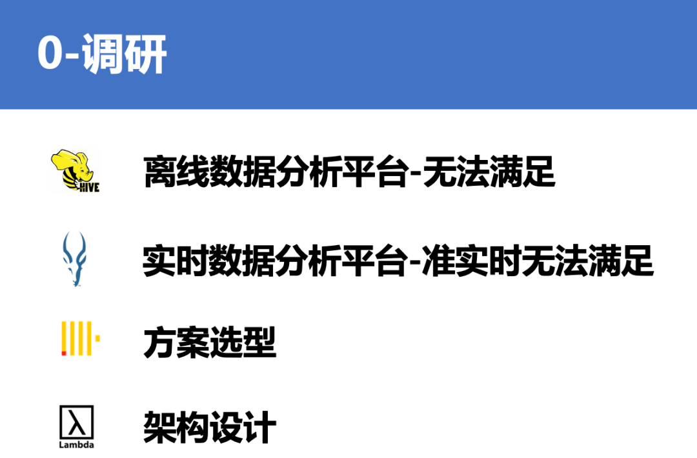

1. 离线数据分析平台能否满足这些需求，结论是不能满足。离线数据分析平台不行的原因如下。
   1.     1. C 侧数据上报过来，需要经过 Spark 的多层离线计算，最终结果出库到 MySQL 或者 ES 提供给离线分析平台查询。这个过程的延时最少 3-6 个小时，目前比较常见的都是提供隔天的查询，所以很多实时性要求高的业务场景都是不能满足的。另一个问题是，腾讯看点的数据量太大，带来的不稳定性也比较大，经常会有预料不到的延迟。所以，离线分析平台是无法满足很多需求的。 
   2.     2. 另一个问题是，腾讯看点的数据量太大，带来的不稳定性也比较大，经常会有预料不到的延迟。所以，离线分析平台是无法满足很多需求的。 
2. 实时数据分析平台的话，事业群内部提供了准实时数据查询的功能，底层技术用的是 Kudu+Impala，Impala 虽然是 MPP 架构的大数据计算引擎，并且访问以列式存储数据的 Kudu。但是对于实时数据分析场景来说，查询响应的速度和数据的延迟都还是比较高，查询一次实时 DAU，返回结果耗时至少几分钟，无法提供良好的交互式用户体验。所以（Kudu+Impala）这种通用大数据处理框架的速度优势更多的是相比（Spark+Hdfs）这种离线分析框架来说的，对于我们这个实时性要求更高的场景，是无法满足的。

**3、项目背景**

经过刚才的介绍，再来看下我们这个项目的背景。

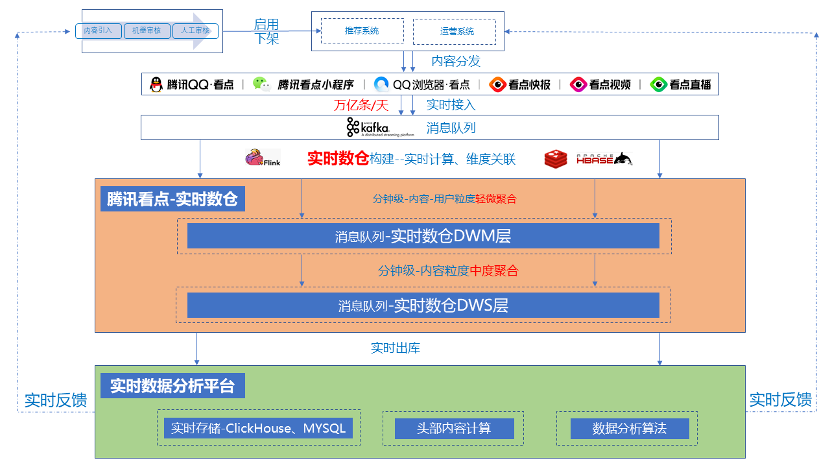

作者发文的内容被内容中心引入，经过内容审核链路，启用或者下架。启用的内容给到推荐系统和运营系统，然后推荐系统和运营系统将内容进行 C 侧分发。内容分发给 C 侧用户之后，用户会产生各种行为，曝光、点击、举报等，通过埋点上报实时接入到消息队列中。

接下来我们做了两部分工作，就是图中有颜色的这两部分。

* 第一部分构建了一个腾讯看点的实时数据仓库。 
* 第二部分就是基于 OLAP 存储引擎，开发了多维实时数据分析系统。 

我们为什么要构建实时数仓，因为原始的上报数据量非常大，一天上报峰值就有上万亿条。而且上报格式混乱。缺乏内容维度信息、用户画像信息，下游没办法直接使用。而我们提供的实时数仓，是根据腾讯看点信息流的业务场景，进行了内容维度的关联，用户画像的关联，各种粒度的聚合，下游可以非常方便的使用实时数据。

**4、方案选型**

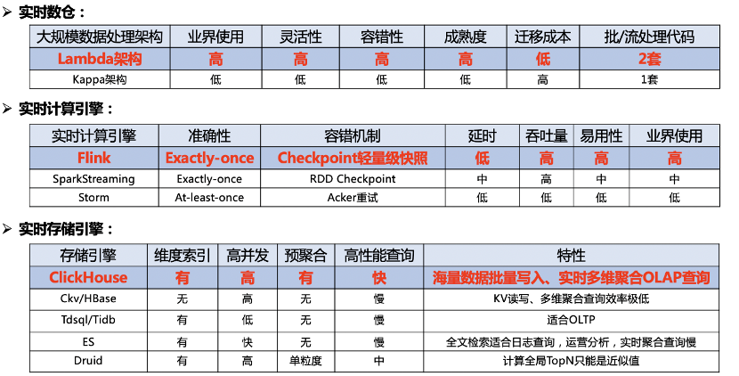

那就看下我们多维实时数据分析系统的方案选型，选型我们对比了行业内的领先方案，选择了最符合我们业务场景的方案。

* 第一块是实时数仓的选型，我们选择的是业界比较成熟的 Lambda 架构，他的优点是灵活性高、容错性高、成熟度高和迁移成本低；缺点是实时、离线数据用两套代码，可能会存在一个口径修改了，另一个没改的问题，我们每天都有做数据对账的工作，如果有异常会进行告警。（**现在有流批一体化，一套代码的方案吗？）**
* 第二块是实时计算引擎选型，因为 Flink 设计之初就是为了流处理，SparkStreaming 严格来说还是微批处理，Strom 用的已经不多了。再看 Flink 具有 Exactly-once 的准确性、轻量级 Checkpoint 容错机制、低延时高吞吐和易用性高的特点，我们选择了 Flink 作为实时计算引擎。 
* 第三块是实时存储引擎，我们的要求就是需要有维度索引、支持高并发、预聚合、高性能实时多维 OLAP 查询。可以看到，Hbase、Tdsql 和 ES 都不能满足要求，Druid 有一个缺陷，它是按照时序划分 Segment，无法将同一个内容，存放在同一个 Segment上，计算全局 TopN 只能是近似值，所以我们选择了最近两年大火的 MPP 数据库引擎 ClickHouse。 

**5、设计目标与设计难点**

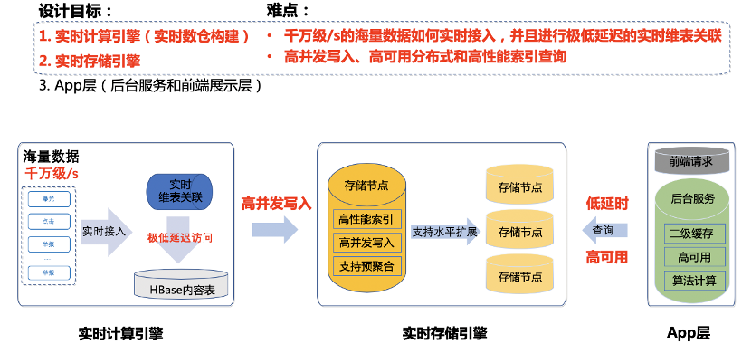

我们多维实时数据分析系统分为三大模块

1. 实时计算引擎 
2. 实时存储引擎 
3. App层 

难点主要在前两个模块：实时计算引擎和实时存储引擎。

1. 千万级/s 的海量数据如何实时接入，并且进行极低延迟维表关联。 
2. 实时存储引擎如何支持高并发写入、高可用分布式和高性能索引查询，是比较难的。 

这几个模块的具体实现，看一下我们系统的架构设计。

**6、架构设计**

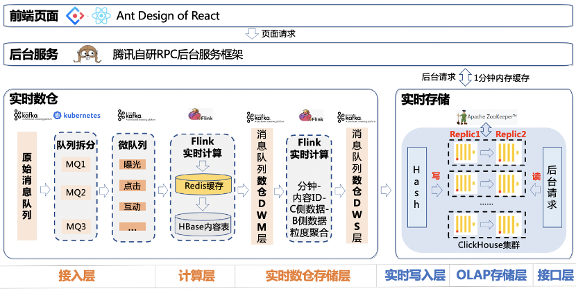

前端采用的是开源组件 Ant Design，利用了 Nginx 服务器，部署静态页面，并反向代理了浏览器的请求到后台服务器上。

后台服务是基于腾讯自研的 RPC 后台服务框架写的，并且会进行一些二级缓存。

实时数仓部分，分为了**数据** **接入层、实时计算层和实时数仓存储层** 。

* 接入层主要是从千万级/s 的原始消息队列中，拆分出不同行为数据的微队列，拿看点的视频来说，拆分过后，数据就只有百万级/s 了； 
* 实时计算层主要负责，多行行为流水数据进行行转列，实时关联用户画像数据和内容维度数据； 
* 实时数仓存储层主要是设计出符合看点业务的，下游好用的实时消息队列。我们暂时提供了两个消息队列，作为实时数仓的两层。一层 DWM 层是内容 ID-用户ID 粒度聚合的，就是一条数据包含内容 ID-用户ID 还有 B 侧内容数据、C 侧用户数据和用户画像数据；另一层是 DWS 层，是内容ID粒度聚合的，一条数据包含内容 ID，B 侧数据和 C 侧数据。可以看到内容 ID-用户ID 粒度的消息队列流量进一步减小到十万级/s，内容 ID 粒度的更是万级/s，并且格式更加清晰，维度信息更加丰富。 

实时存储部分分为实时写入层、OLAP 存储层和后台接口层。

* 实时写入层主要是负责 Hash 路由将数据写入； 
* OLAP 存储层利用 MPP 存储引擎，设计符合业务的索引和物化视图，高效存储海量数据； 
* 后台接口层提供高效的多维实时查询接口。 

**7、实时计算**

这个系统最复杂的两块，实时计算和实时存储。

先介绍实时计算部分：分为**实时关联**和 **实时数仓** 。

**7.1 实时高性能维表关联**

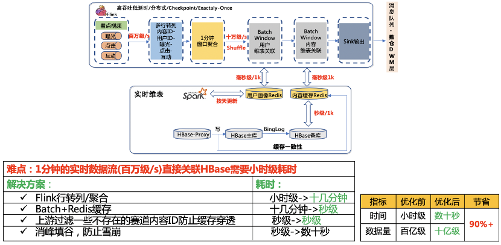

实时维表关联这一块难度在于。百万级/s的实时数据流，如果直接去关联 HBase，1 分钟的数据，关联完 HBase 耗时是小时级的，会导致数据延迟严重。

我们提出了几个解决方案：

* 第一个是，在 Flink 实时计算环节，先按照 1 分钟进行了窗口聚合，将窗口内多行行为数据转一行多列的数据格式，经过这一步操作，原本小时级的关联耗时下降到了十几分钟，但是还是不够的。 
* 第二个是，在访问 HBase 内容之前设置一层 Redis 缓存，因为 1000 条数据访问 HBase 是秒级的，而访问 Redis 是毫秒级的，访问 Redis 的速度基本是访问 HBase 的 1000 倍。为了防止过期的数据浪费缓存，缓存过期时间设置成 24 小时，同时通过监听写 HBase Proxy 的写流水来保证缓存的一致性。这样将访问时间从十几分钟变成了秒级。
* 第三个是，上报过程中会上报不少非常规内容 ID，这些内容 ID 在内容 HBase中是不存储的，会造成缓存穿透的问题。所以在实时计算的时候，我们直接过滤掉这些内容 ID，防止缓存穿透，又减少一些时间。 
* 第四个是，因为设置了定时缓存，会引入一个缓存雪崩的问题。为了防止雪崩，我们在实时计算中，进行了削峰填谷的操作，可以通过错开设置缓存的时间解决。

可以看到，优化前后，数据量从百亿级减少到了十亿级，耗时从小时级减少到了数十秒，减少 99%。

**7.2 下游提供服务**

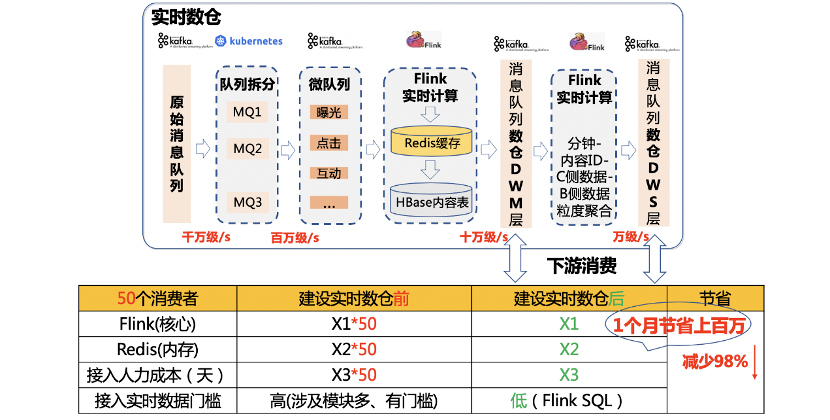

实时数仓的难度在于：它处于比较新的领域，并且各个公司各个业务差距比较大，怎么能设计出方便，好用，符合看点业务场景的实时数仓是有难度的。

先看一下实时数仓做了什么，实时数仓对外就是几个消息队列，不同的消息队列里面存放的就是不同聚合粒度的实时数据，包括内容 ID、用户ID、C 侧行为数据、B 侧内容维度数据和用户画像数据等。

我们是怎么搭建实时数仓的，就是上面介绍的实时计算引擎的输出，放到消息队列中保存，可以提供给下游多用户复用。

我们可以看下，在我们建设实时数据仓库前后，开发一个实时应用的区别。没有数仓的时候，我们需要消费千万级/s 的原始队列，进行复杂的数据清洗，然后再进行用户画像关联、内容维度关联，才能拿到符合要求格式的实时数据，开发和扩展的成本都会比较高，如果想开发一个新的应用，又要走一遍这个流程。有了数仓之后，如果想开发内容 ID 粒度的实时应用，就直接申请 TPS 万级/s 的 DWS 层的消息队列。开发成本变低很多，资源消耗小很多，可扩展性也强很多。

看个实际例子，开发我们系统的实时数据大屏，原本需要进行如上所有操作，才能拿到数据。现在只需要消费 DWS 层消息队列，写一条 Flink SQL 即可，仅消耗 2 个 CPU 核心，1G 内存。

可以看到，以 50 个消费者为例，建立实时数仓前后，下游开发一个实时应用，可以减少 98%的资源消耗。包括计算资源，存储资源，人力成本和开发人员学习接入成本等等。并且消费者越多，节省越多。就拿 Redis 存储这一部分来说，一个月就能省下上百万人民币。

**8、实时存储**

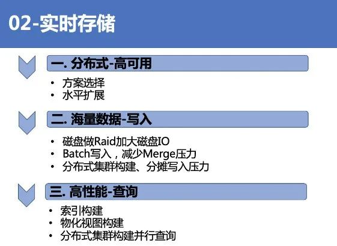

介绍完实时计算，再来介绍实时存储。

这块分为三个部分来介绍

* 第一是 分布式-高可用 
* 第二是 海量数据-写入 
* 第三是 高性能-查询 

**8.1 分布式-高可用**

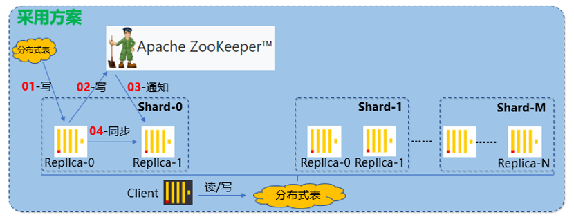

我们这里听取的是 Clickhouse 官方的建议，借助 ZK 实现高可用的方案。数据写入一个分片，仅写入一个副本，然后再写 ZK，通过 ZK 告诉同一个分片的其他副本，其他副本再过来拉取数据，保证数据一致性。

底层原理：

借助ReplicatedMergeTree实现，ReplicatedMergeTree的核心代码中有大量和ZK交互的逻辑，实现了同一个分片内多副本的协同，其中就包括了主副本的选举，写入任务队列的变更和副本队列的变化等。

外部数据写入Clickhouse的一个分片，会先写入一个副本的内存中，然后按指定的条件排好序，然后写入磁盘的临时目录，写入历史目录完成后重命名为最终目录的名字，再与ZK进行一系列的交互，可以实现数据的复制，要了解这一部分，需要了解RMT表引擎在ZK内的节点结构。

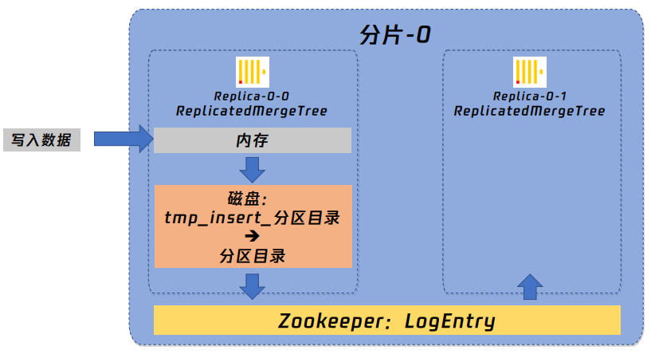

RMT表是通过监听了ZK上的各个节点来实现副本之间的协同的，简单介绍ZK的部分节点的作用：

元数据相关：

1、/metadata节点，保存元数据信息，包括主键、分区键等

2、/columns节点，保存字段信息，包括列名和数据类型

3、/replicas节点，保存副本相关信息

校验相关：

4、/leader_election节点，⽤于主备选举

5、/blocks节点，防⽌数据块重复，以及数据同步

执⾏相关：

6、/log节点，记录了副本协同需要执⾏的Log记录，包含任务执⾏源信息7、/queue节点，包含具体执⾏的操作任务

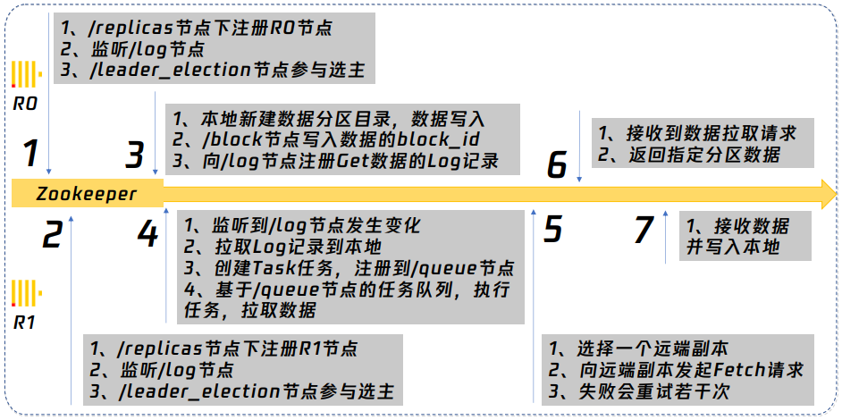

采用公平选举，R0为主，R1为从。

这里没有选用消息队列进行数据同步，是因为 ZK 更加轻量级。而且写的时候，任意写一个副本，其它副本都能够通过 ZK 获得一致的数据。而且就算其它节点第一次来获取数据失败了，后面只要发现它跟 ZK 上记录的数据不一致，就会再次尝试获取数据，保证一致性。

**8.2 海量数据-写入**

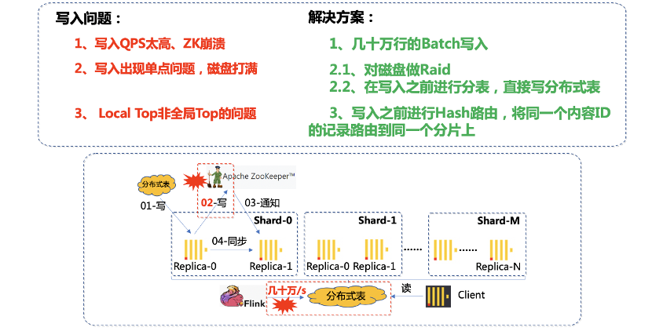

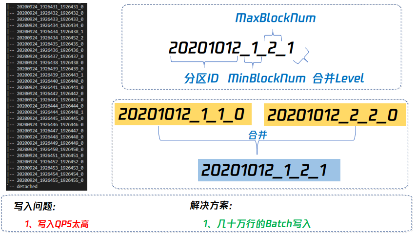

数据写入遇到的第一个问题是，海量数据直接写入 Clickhouse 的话，会导致 ZK 的 QPS 太高，解决方案是改用 Batch 方式写入。Batch 设置多大呢，Batch 太小的话缓解不了 ZK 的压力，Batch 也不能太大，不然上游内存压力太大，通过实验，最终我们选用了大小几十万的 Batch。

此处有优化空间：ZK无法线性扩展，业内有些团队不将log和datapart相关的信息写入ZK，可以减少ZK的压力，涉及到的问题是需要对源代码进行修改。对于一般的业务团队，实现的成本太高。

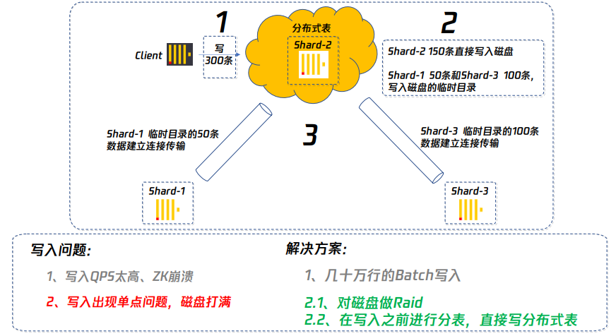

第二个问题是，随着数据量的增长，单 QQ 看点的视频内容每天可能写入百亿级的数据，默认方案是写一张分布式表，这就会造成单台机器出现磁盘的瓶颈，尤其是 Clickhouse 底层运用的是 Mergetree，原理类似于 HBase、RocketsDB 的底层 LSM-Tree。在合并的过程中会存在写放大的问题，加重磁盘压力。峰值每分钟几千万条数据，写完耗时几十秒，如果正在做 Merge，就会阻塞写入请求，查询也会非常慢。我们做的两个优化方案：一是对磁盘做 Raid，提升磁盘的 IO；二是在写入之前进行分表，直接分开写入到不同的分片上，磁盘压力直接变为 1/N。

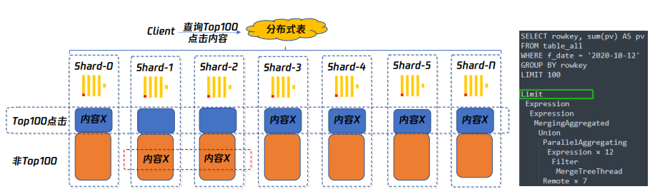

第三个问题是，虽然我们写入按照分片进行了划分，但是这里引入了一个分布式系统常见的问题，就是局部的 Top 并非全局 Top 的问题。

比如同一个内容 ID 的数据落在了不同的分片上，计算全局 Top100 阅读的内容 ID，有一个内容 ID 在分片 1 上是 Top100，但是在其它分片上不是 Top100，导致汇总的时候，会丢失一部分数据，影响最终结果。我们做的优化是在写入之前加上一层路由，将同一个内容 ID 的记录，全部路由到同一个分片上，解决了该问题。据说新版是不会出现这个问题了，新版对于有groupby和limit的语句，只将groupby下方到了分布式节点执行，然后所有节点的结果全部返回到分布式表，再进行一个全局的groupby，再进行limit，虽然解决了全局topN的问题，但是代价有点大，牺牲的执行性能挺大，还容易导致所有数据汇集到一个节点导致内存溢出，甚至Clickhouse因占用内存过多被kill掉。

介绍完写入，下一步介绍 Clickhouse 的高性能存储和查询。

**8.3 高性能-存储-查询**

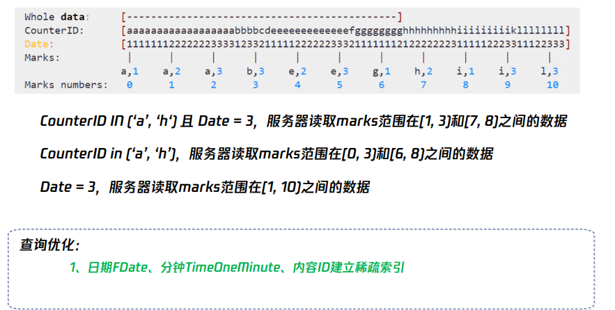

Clickhouse 高性能查询的一个关键点是稀疏索引。稀疏索引这个设计就很有讲究，设计得好可以加速查询，设计不好反而会影响查询效率。我根据我们的业务场景，因为我们的查询大部分都是时间和内容 ID 相关的，比如说，某个内容，过去 N 分钟在各个人群表现如何？我按照日期，分钟粒度时间和内容 ID 建立了稀疏索引。针对某个内容的查询，建立稀疏索引之后，可以减少 99%的文件扫描。

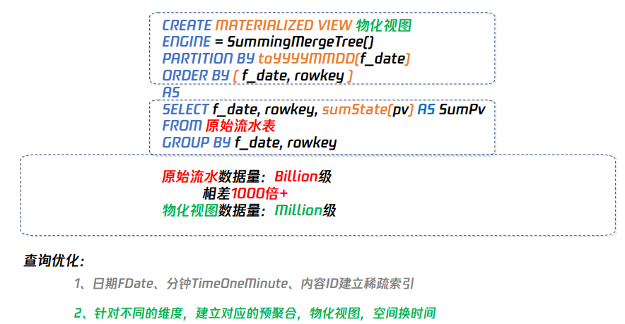

还有一个问题就是，我们现在数据量太大，维度太多。拿 QQ 看点的视频内容来说，一天流水有上百亿条，有些维度有几百个类别。如果一次性把所有维度进行预聚合，数据量会指数膨胀，查询反而变慢，并且会占用大量内存空间。我们的优化，针对不同的维度， **建立对应的预聚合物化视图，用空间换时间** ，这样可以缩短查询的时间。

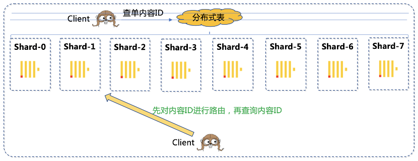

分布式表查询还会有一个问题，查询单个内容 ID 的信息，分布式表会将查询下发到所有的分片上，然后再返回查询结果进行汇总。实际上，因为做过路由，一个内容 ID 只存在于一个分片上，剩下的分片都在空跑。针对这类查询，我们的优化是后台按照同样的规则先进行路由，直接查询目标分片，这样减少了 N-1/N 的负载，可以大量缩短查询时间。而且由于我们是提供的 OLAP 查询，数据满足最终一致性即可，通过主从副本读写分离，可以进一步提升性能。

我们在后台还做了一个 1 分钟的数据缓存，针对相同条件查询，后台就直接返回了。

**8.4 扩容**

这里再介绍一下我们的扩容的方案，调研了业内的一些常见方案。

比如 HBase，原始数据都存放在 HDFS 上，扩容只是 Region Server 扩容，不涉及原始数据的迁移。但是 Clickhouse 的每个分片数据都是在本地，是一个比较底层存储引擎，不能像 HBase 那样方便扩容。

Redis 是哈希槽这种类似一致性哈希的方式，是比较经典分布式缓存的方案。Redis slot 在 Rehash 的过程中虽然存在短暂的 ask 读不可用，但是总体来说迁移是比较方便的，从原 h[0]迁移到 h[1]，最后再删除 h[0]。但是 Clickhouse 大部分都是 OLAP 批量查询，不是点查，而且由于列式存储，不支持删除的特性，一致性哈希的方案不是很适合。

目前扩容的方案是，另外消费一份数据，写入新 Clickhouse 集群，两个集群一起跑一段时间，因为实时数据就保存 3 天，等 3 天之后，后台服务直接访问新集群。

ClickHouse⾼性能原因：

1、多核CPU并⾏计算

2、SIMD并⾏计算加速

3、分布式⽔平扩展集群

4、稀疏索引、列式存储、数据压缩

5、聚合分析优化（Groupby）

**9、成果**

腾讯看点实时数据仓库：DWM 层和 DWS 层，数据延迟 1 分钟。

远见多维实时数据分析系统：亚秒级响应多维条件查询请求，在未命中缓存情况下，过去 30 分钟的查询，99%的请求耗时在 1 秒内；过去 24 小时的查询，90%的请求耗时在 5 秒内，99%的请求耗时在 10 秒内。